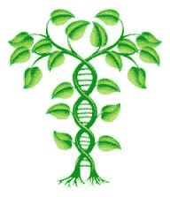
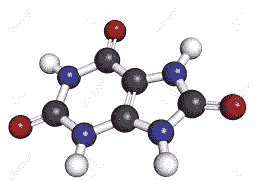

# 模仿世界如何创造…创造与世界的最佳互动。

> 原文：<https://towardsdatascience.com/emulate-how-the-world-creates-to-create-the-best-interaction-with-the-world-8f63aa464873?source=collection_archive---------8----------------------->

# 如果与世界互动的最佳方式是用世界创造计算结构的方式来创造计算结构，那会怎样？

典型的人工智能和机器学习专注于有效地搜索最具预测性的“计算结构”。但是在现实世界中，我们又有多少次想要重新发明轮子呢？我们希望多长时间重复一次寻找解决方案的过程？不经常。也许包括标准化和重用的机制比快速创建预测结构更重要？

在现实世界中，创建一次并积极复制比一次又一次地创建要高效得多。然而，人工智能的叙事侧重于搜索最佳解决方案，有效地创建新的分层计算结构，而没有说太多关于标准化或重用已创建的计算结构。

Natural Creates” Structure” Efficiently Via Reuse and Reproduction

当我们积极地标准化和复制我们发现的东西时，我们与世界的互动会更有效率。同样的机制对于任何想要与世界有效互动的事物来说不也是至关重要的吗？当涉及到在现实世界中创作和与现实世界互动时，标准化、复制和重用等概念是否比最初的搜索和发现更重要？如果是这样的话，人工智能的叙述就缺少了一些重要的章节。模块化、标准化和重用难道不应该是人工智能解决方案领域的关键部分吗？

现实世界能否填补 [Pedro Domingos](https://medium.com/u/60fd907d8004?source=post_page-----8f63aa464873--------------------------------) 描述的[主算法](https://en.wikipedia.org/wiki/The_Master_Algorithm)中缺失的部分？也许吧。

# “计算结构”是什么意思？

[结构是复杂事物的各部分或要素之间的排列和关系。](https://www.google.com/search?q=structure&oq=structure&aqs=chrome..69i57j0l5.1488j0j8&sourceid=chrome&ie=UTF-8)

“计算结构”是一个结构化的实体，可以改变它所在的世界或环境。换句话说，这是一个与世界的某个部分进行交互、观察和修改的构件。

计算结构可以连接、分层和聚合，以创建能够以不同方式改变世界的更大的计算结构。

# 世界如何创造计算结构，然后作用于世界？

让我们来看一些不同规模层次的世界计算或转换结构创造的例子。下面我举几个例子。

**举例领域:**社交→生物→化学→物理

# 社会的

## **制造业**

让我们以汽车、螺母和螺栓为例。

汽车是人类用来作用于世界的工具。汽车本身作用于世界，改变你的位置。工厂根据原料生产汽车。等等。换句话说，汽车只是计算结构链或层次结构中一个计算结构的例子…这些结构有助于改变世界。

汽车是如何创造出来的？汽车是由发动机、车轮、螺母和螺栓等零件组装而成的。工厂本身是一个计算或转换结构，通过聚集零件(也称为子结构)来制造汽车。像螺母和螺栓这样的材料随着能量和时间进来，汽车出来了。

螺母和螺栓是怎么来的？早在汽车发明之前，螺母和螺栓就被发明了。早期，在汽车被标准化和大规模生产之前，螺母和螺栓仅仅是因为它们在如此多不同的机器上运行良好。在制造第一辆汽车时，不需要制造螺母和螺栓。螺母和螺栓已经存在，是制造第一辆汽车时使用的逻辑和事实上的子结构。

**那么有哪些可能适用于人工智能的重要概念呢？**

1.  机器(像汽车、螺母和螺栓)是计算结构的形式，以有用的方式改变世界的一部分。
2.  机器(和计算结构)是由**子结构**(例如。汽车使用螺母和螺栓。)
3.  标准化和大规模生产**都使得子结构对于快速创建和大规模生产新结构很有价值。**

# 生物的

人类、其他动物、植物甚至细菌都是不断改造世界的结构。

如果没有一个元结构积极地管理和产生它们的存在，这些生物行为者是如何在世界上出现和繁殖的？

## 双重协同机制(双重计算结构)

每一个行动者，换句话说，每一个人、植物、动物或其他生命形式，都在进化，以实现两个主要目标的方式改造世界。

1.  **演员成功**:让演员活着，在世界上茁壮成长。
2.  **物种成功**:通过繁殖和优化未来的行动者，在世界上所有可能的地方茁壮成长，从而发展和维持物种。

本质上，有两种相互作用的机制(或计算结构)同时共存。这就是“演员成功”和“物种成功”机制。

此外，“物种成功”机制是超结构，而个体行动者是在时间和空间上实现“物种成功”目标的亚结构。人、植物等。作为个体行动者对“物种成功”做出贡献，但只是随着时间的推移对许多个体行动者起作用的更大机制的一个子部分。

“行动者成功”机制在行动者内部运作，以维持其存在。人类做出选择并采取行动来维持和改善自身的生存并帮助他人。“演员成功”机制通过“物种成功”机制(繁殖、遗传、自然选择等)随着时间的推移得以维持和改进。

重要的是演员(例如人、花、草叶)在他们的一生中负责维护他们自己，他们的实例。演员之间可以有一些合作(抚养孩子等。)但个人主要负责以保持世界活力的方式改造世界。

要点:您可以为一个参与者分配多个共生目标，这些目标在同一个参与者中同时执行。例如个人和物种的成功。我们能否将多个共生目标分配给一个代表计算结构的人工角色，以控制计算结构的增殖和适应？

## 世界的增长和效率

是什么限制了一个物种的生长？世界上个体演员的成功。以富有成效的方式改造他们所在区域的行动者(人、植物等)茁壮成长，并产生占据世界新区域的新行动者。物种呈指数增长，直到达到极限，世界上不再有更多的参与者。

以一种草为例。这种草在土壤、光照、温度和湿度好的地方生长茂盛。种子产生并被风传播到新的地区。在新草成功的地方，草的数量将继续增长和扩大。在有阴影、土壤不好或草的密度太高的地方，新草不会成功。

**那么有哪些可能适用于人工智能的重要概念呢？**

1.  生物学展示了一种**健壮的机制，用于建立和维护一组成功地改变世界局部的行动者(计算结构)**。潜在地，个人的人工计算结构可以通过类似的机制来建立和维护。
2.  生物机制使演员的影响最大化，但**不需要中央控制机制来编排和驱动**演员的产生或优化。在大型复杂的人工计算结构中，从中央控制机制解耦通常可能是关键的。
3.  生物机制将世界视为一个搜索空间，并且**搜索新的领域，在该领域中，行动者可以有效地改变世界**。潜在的相同机制可以推动对人工计算结构有用的新领域的研究。
4.  生物机制**使用遗传学、自然选择等，随着时间的推移，优化演员以最佳匹配世界**。类似的需求存在于不断改进和匹配人工计算结构，以适应世界的部分或它们在其中起作用的更大的计算结构。
5.  生物行动者需要以富有成效的方式改造世界，以获得生存和繁荣所需的资源。**我们可以定义一个人工计算参与者必须做什么才能获得生存的资源。**

## 化学的

*   基于兴趣去做。

## 身体的

*   基于兴趣去做。

# 我们如何实现和测试它呢？

*   基于兴趣去做。

# 笔记

*关于标准化对提高一群演员的表演和效用的重要性的想法，直接来自于詹姆斯·贝森(James Bessen)与鲁斯·罗伯茨(Russ Roberts)**和詹姆斯·贝森(James Bessen)的一个经济谈话播客***。在文字记录中搜索“标准化”来聚焦相关的讨论。**

**观察:螺母和螺栓的价值在于它们将结构锁定在一起，在使用时基本上防止了某些变形。锁定它的自我似乎是一个基本概念。在以后的文章中会有更多的介绍。**