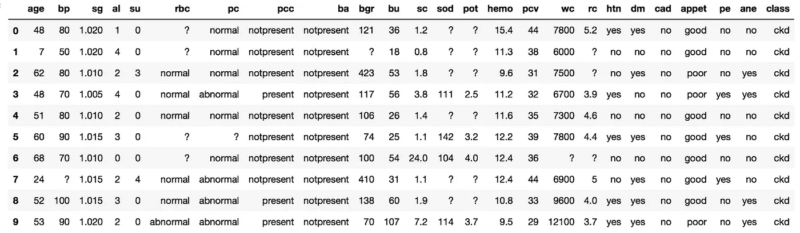
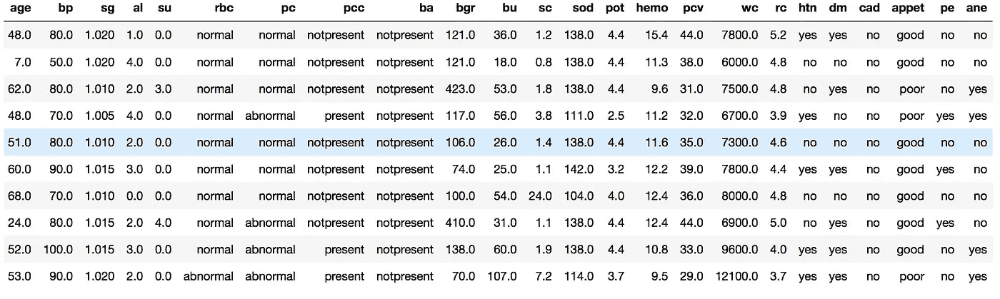
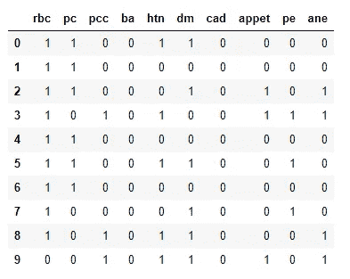
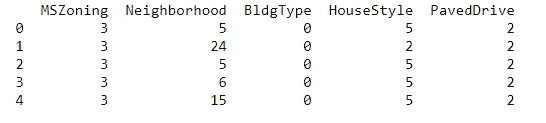
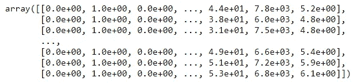
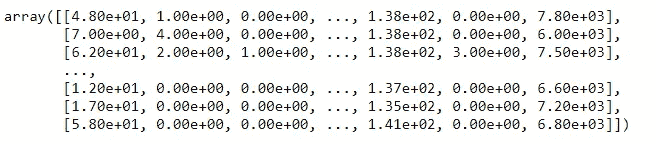
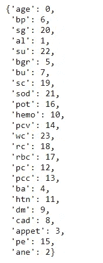
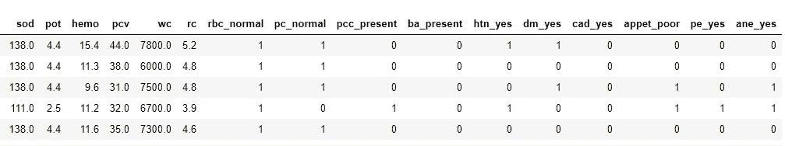

# 编码分类特征

> 原文：<https://towardsdatascience.com/encoding-categorical-features-21a2651a065c?source=collection_archive---------1----------------------->


# 介绍

在机器学习项目中，一个重要的部分是特征工程。在数据集中看到分类特征是非常常见的。然而，我们的机器学习算法只能读取数值。将分类特征编码成数值是非常重要的。

在这里，我们将介绍分类特征的三种不同编码方式:

1.标签编码器和 OneHotEncoder

2.字典矢量器

3.熊猫有假人

为了您的方便，完整的代码可以在我的 [github](https://github.com/liuy14/Kidney_Disease_Detection) 中找到。

# 数据集

我们在这里使用的数据集来自 [UCI 机器学习资源库](https://archive.ics.uci.edu/ml/datasets/chronic_kidney_disease)。它用于以各种血液指标为特征，预测患者是否有肾脏疾病。我们用熊猫来读取数据。

```
# load data
df = pd.read_csv(‘datasets/chronic_kidney_disease.csv’, header=None, 
 names=[‘age’, ‘bp’, ‘sg’, ‘al’, ‘su’, ‘rbc’, ‘pc’, ‘pcc’, ‘ba’, ‘bgr’, ‘bu’, ‘sc’, ‘sod’, ‘pot’, 
 ‘hemo’, ‘pcv’, ‘wc’, ‘rc’, ‘htn’, ‘dm’, ‘cad’, ‘appet’, ‘pe’, ‘ane’, ‘class’])# head of df
df.head(10)
```



从表中可以看出，我们有几个分类特征，如“rbc”(红细胞)、“pc”(脓细胞)、“pcc”(脓细胞团块)等。很明显，数据集包含缺失的值，但是因为这超出了本博客的主题范围，所以我们在这里不讨论如何进行。但是填充缺失的值是必要的，并且应该在编码分类特征之前完成。您可以参考我的 [github](https://github.com/liuy14/Kidney_Disease_Detection) 了解如何填写缺失值。准备好分类编码的完整数据集如下所示。



# 标签编码器& OneHotEncoder

labelEncoder 和 OneHotEncoder 只对分类特征有效。我们首先需要使用布尔掩码提取类别特征。

```
# Categorical boolean mask
categorical_feature_mask = X.dtypes==object# filter categorical columns using mask and turn it into a list
categorical_cols = X.columns[categorical_feature_mask].tolist()
```

LabelEncoder 将指定特征下的每个类转换成一个数值。让我们一步一步来看看怎么做。

实例化标签编码器对象:

```
# import labelencoder
from sklearn.preprocessing import LabelEncoder# instantiate labelencoder object
le = LabelEncoder()
```

对每个分类列应用标签编码器:

```
# apply le on categorical feature columns
X[categorical_cols] = X[categorical_cols].apply(lambda col: le.fit_transform(col))X[categorical_cols].head(10)
```

请注意，标签编码器的输出仍然是一个数据帧。结果如下所示:



正如我们所看到的，所有的分类特征列都是二进制类。但是如果分类特征是多类的，标签编码器将为不同的类返回不同的值。参见下面的示例，“邻域”功能有多达 24 个类。



在这种情况下，只使用标签编码器不是一个好的选择，因为它为不同的类带来了自然的顺序。例如，在“邻域”功能下，a 类的值为 5，而 b 类的值为 24，那么 b 类的值是否比 a 类大？答案显然是否定的。因此，允许模型学习，这种结果将导致较差的性能。因此，对于包含多类特征的数据帧，需要 OneHotEncoder 的进一步处理。让我们看看做这件事的步骤。

实例化 OneHotEncoder 对象:

```
# import OneHotEncoder
from sklearn.preprocessing import OneHotEncoder# instantiate OneHotEncoder
ohe = OneHotEncoder(categorical_features = categorical_feature_mask, sparse=False ) 
# categorical_features = boolean mask for categorical columns
# sparse = False output an array not sparse matrix
```

我们需要使用 OneHotEncoder 中的掩码来指定分类特征。`sparse=False`参数输出一个非稀疏矩阵。

对数据帧应用 OneHotEncoder:

```
# apply OneHotEncoder on categorical feature columns
X_ohe = ohe.fit_transform(X) # It returns an numpy array
```

请注意，输出是 numpy 数组，而不是 dataframe。对于分类特征下的每个类，都会为其创建一个新列。例如，为十个二元类分类特征创建了 20 列。



# 字典矢量器

正如我们所见，LabelEncoder 和 OneHotEncoder 通常需要作为两步程序一起使用。更方便的方法是使用字典矢量器，它可以同时完成这两个步骤。

首先，我们需要将数据帧转换成字典。这可以通过熊猫`[to_dict](https://pandas.pydata.org/pandas-docs/stable/generated/pandas.DataFrame.to_dict.html)`的方法来实现。

```
# turn X into dict
X_dict = X.to_dict(orient='records') # turn each row as key-value pairs# show X_dict
X_dict
```

需要`orient='records'`将数据帧转换成`{column:value}`格式。结果是一个字典列表，其中每个字典代表一个样本。注意，在这种情况下，我们不需要提取分类特征，我们可以将整个数据帧转换成字典。这是与 LabelEncoder 和 OneHotEncoder 相比的一个优势。


现在我们实例化一个字典矢量器:

```
# DictVectorizer
from sklearn.feature_extraction import DictVectorizer# instantiate a Dictvectorizer object for X
dv_X = DictVectorizer(sparse=False) 
# sparse = False makes the output is not a sparse matrix
```

`sparse=False`使输出成为非稀疏矩阵。

字典矢量器对转换后的字典进行拟合和转换:

```
# apply dv_X on X_dict
X_encoded = dv_X.fit_transform(X_dict)# show X_encoded
X_encoded
```

结果是一个 numpy 数组:



每行代表一个样本，每列代表一个特征。如果我们想知道每一列的特性，我们可以检查这个字典矢量器的词汇表:

```
# vocabulary
vocab = dv_X.vocabulary_# show vocab
vocab
```



# 拿假人

Pandas get_dummies 方法是一个非常直接的一步程序，用于获取分类特征的虚拟变量。其优势在于，您可以直接将其应用于数据帧，其中的算法将识别分类特征并对其执行获取虚拟对象操作。下面是如何做到这一点:

```
# Get dummies
X = pd.get_dummies(X, prefix_sep='_', drop_first=True)# X head
X.head()
```

`prefix_sep='_'`使得每个类都有一个唯一的名字，用分隔符隔开。`drop_first=True`从生成的虚拟特征中删除一列。目的是避免多重共线性。结果如下:



# 结论

LabelEncoder 和 OneHotEncoder 通常需要作为两步方法一起使用来对分类特征进行编码。LabelEncoder 输出 dataframe 类型，而 OneHotEncoder 输出 numpy 数组。OneHotEncoder 可以选择输出稀疏矩阵。DictVectorizer 是一种编码和支持稀疏矩阵输出的一步方法。熊猫得到假人的方法是迄今为止编码分类特征最直接和最简单的方法。输出将保持数据帧类型。

在我看来，第一选择是熊猫拿假人。但是如果分类特征的数量很大，DictVectorizer 将是一个很好的选择，因为它支持稀疏矩阵输出。