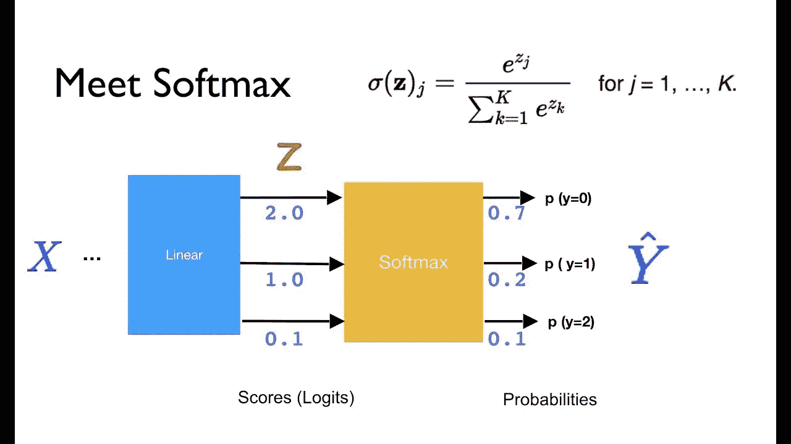
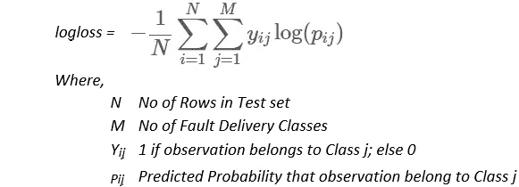

# 神经网络的编码概念、类别和分类

> 原文：<https://towardsdatascience.com/encoding-concepts-categories-and-classes-for-neural-networks-f1c78b6fbdca?source=collection_archive---------13----------------------->

在[之前的一篇文章](https://medium.com/datathings/neural-networks-and-backpropagation-explained-in-a-simple-way-f540a3611f5e)中，我们解释了神经网络如何从几个特征中预测一个连续值(比如房价)。我们得到的一个问题是神经网络如何对概念、类别或类进行编码。**例如，无论下面的图片是否包含一只猫，神经网络如何将大量像素转换为真/假答案？**

首先，这里有一些观察结果:

*   二元分类问题是一个有“是/否”答案的问题。一些例子包括:这张图片包含一只猫吗？这是垃圾邮件吗？这个应用程序是病毒吗？这是个问题吗？
*   多分类问题是有几个类别作为答案的问题，比如:这是什么类型的车辆(轿车/公共汽车/卡车/摩托车)？
*   任何多分类问题都可以转化为一系列二元分类问题。(比如:这是车吗，是还是不是？这是一辆公共汽车，是还是不是？等等)

> 神经网络中分类的核心思想是将概念、类别和类转换成属于这些概念、类别或类的概率。

这意味着猫是 100%的猫。一只狗是 100%的狗。一辆车是 100%的车，等等。每个独立的概念本身就是概念空间中的一个维度。例如，我们可以说:

*   一只猫是:100%的“猫”，0%的“狗”，0%的“公交车”，0%的“汽车”。[1;0;0;0]
*   一辆车是:0%“猫”，0%“狗”，0%“公交车”，100%“车”。[0;0;0;1 ]
*   一个是就是 100%的“是”，0%的“否”->【1；0]

类别的矢量化表示在表示该类别的维度中为 1，在其余维度中为 0。这种模式被称为 1-hot 编码。

在 mid 中有了这个想法，我们现在有了一种新的方法来将类别编码成经典的多维向量。然而，这些向量具有一些特殊性质，因为它们需要表示属于这些类别的概率或置信水平:

*   向量长度定义了神经网络可以支持的类别数。
*   每个维度应该限制在 0 和 1 之间。
*   向量的和应该总是 1。
*   所选类别是具有最高值/置信度(arg max)的类别。

因此，例如，如果我们得到[猫，狗，公共汽车，汽车]的输出[0.6，0.1，0.2，0.1]，我们可以说神经网络以 60%的置信度将这张图像分类为猫。

**Softmax 图层**

在为分类问题设计神经网络时，为了保持最后一层概率向量的性质，有一个特殊的激活叫做“softmax”。

Softmax converts any vector into probabilities vector (that sums to 1).

softmax 所做的是，它取任意一个数字向量，对所有内容进行指数运算，然后将每个元素除以指数的和。

[2 ;1;0.1] ->指数[7.3；2.7;1.1] ->和为 11.1 ->最终向量为[0.66；0.24;0.1](这是一个概率向量)。

我们可以很容易地验证以下属性:

*   每个分量都在 0 和 1 之间，因为指数不能为负，除以和不能超过 1。
*   输出的总和总是等于 1。
*   顺序维持:初始分数越高，概率越大。
*   重要的是彼此的相对分数。例如，如果我们有这两个向量:[10；10;10]或[200；200;200]，它们都将转换为相同的[1/3；1/3;1/3]概率。

最后一步是提供触发学习反向传播的损失函数。由于输出是 1-hot 编码矢量，如前所述，最合适的损失函数是对数损失函数:

The log-loss function definition

它来源于[信息论](https://en.wikipedia.org/wiki/Information_theory)和[香农熵](https://en.wikipedia.org/wiki/Entropy_%28information_theory%29)。由于实际输出 **y** 不是 0 就是 1，这种损失正在累积 NN 对已知类别的信心不足。

*   如果 NN 非常有信心->正确类的概率会接近 1-> log 会接近 0 ->无损失->无反向传播->无学习！
*   如果 NN 不是很有信心->类的概率将接近 0.5(完全犹豫)->对数损失将在其最大值->大损失->使用反向传播学习的大机会。

计算指数和对数的计算开销很大。正如我们在前两部分中所看到的，softmax 层将 logit 得分提升到指数级，以获得概率向量，然后损失函数对损失进行对数运算，以计算损失的熵。

如果我们将这两个阶段结合在一层中，对数和指数会相互抵消，我们可以用更少的计算资源获得相同的最终结果。这就是为什么在许多神经网络框架和库中有一个“softmax-log-loss”函数，这比将这两个函数分开要好得多。

*原载于 2018 年 7 月 30 日*[*medium.com*](https://medium.com/datathings/encoding-concepts-categories-and-classes-for-neural-networks-4a673346dc15)*。*