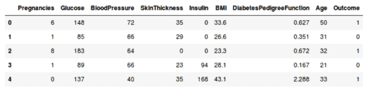
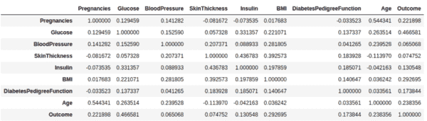
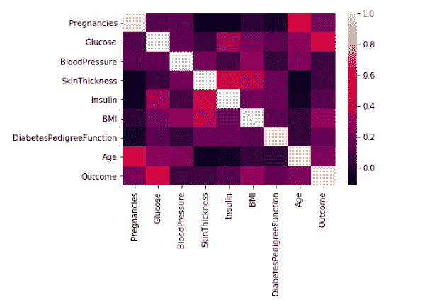
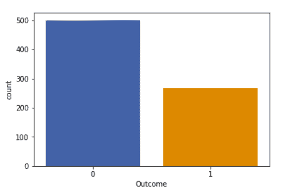
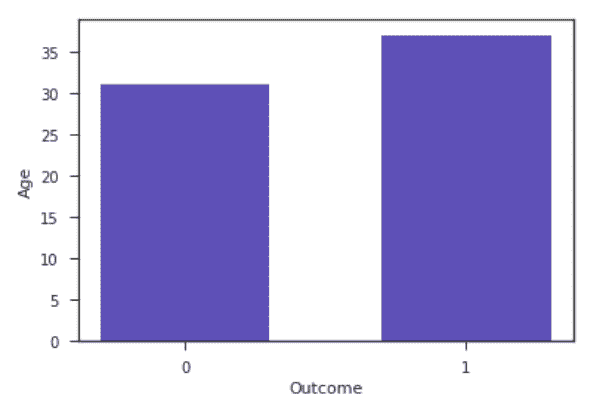
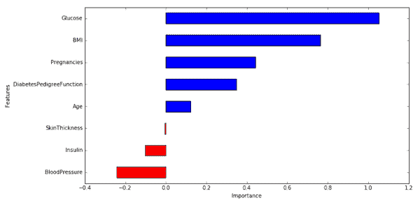
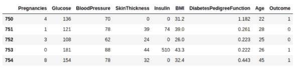

# 端到端数据科学示例:用逻辑回归预测糖尿病

> 原文：<https://towardsdatascience.com/end-to-end-data-science-example-predicting-diabetes-with-logistic-regression-db9bc88b4d16?source=collection_archive---------0----------------------->

顾名思义，本教程是使用数据科学解决现实世界问题的端到端示例。我们将使用机器学习来预测一个人是否患有糖尿病，基于患者的信息，如血压、身体质量指数(身体质量指数)、年龄等。本教程介绍了数据科学工作流程的各个阶段。具体来说，本教程包含以下几个部分

*   概观
*   数据描述
*   数据探索
*   数据准备
*   训练和评估机器学习模型
*   解读 ML 模型
*   保存模型
*   用模型做预测
*   后续步骤


# 概观

数据由“国家糖尿病、消化和肾脏疾病研究所”收集并提供，作为皮马印第安人糖尿病数据库的一部分。从一个较大的数据库中选择这些实例有几个限制。特别是，这里的所有患者都属于皮马印第安人(美洲土著人的一个亚群)，并且都是 21 岁以上的女性。

我们将使用 Python 和一些流行的数据科学相关包。首先，我们将导入`pandas`从一个 CSV 文件中读取我们的数据，并操纵它以供进一步使用。我们还将使用`numpy`将数据转换成适合我们的分类模型的格式。我们将使用`seaborn`和`matplotlib`进行可视化。然后我们将从`sklearn`引入逻辑回归算法。这个算法将帮助我们建立分类模型。最后，我们将使用`sklearn`中可用的`joblib`来保存我们的模型以备将来使用。

```
import pandas as pd
import numpy as np
import seaborn as sns
import matplotlib.pyplot as plt
% matplotlib inlinefrom sklearn.linear_model import LogisticRegression
from sklearn.externals import joblib
```

# 数据描述

我们将数据保存在名为`diabetes.csv`的 CSV 文件中。我们首先将数据集读入名为`diabetesDF`的 pandas 数据帧，然后使用`head()`函数显示数据集中的前五条记录。

```
diabetesDF = pd.read_csv('diabetes.csv')
print(diabetesDF.head())
```



First 5 records in the Pima Indians Diabetes Database

以下特征有助于我们预测一个人是否患有糖尿病:

*   **怀孕次数:**怀孕次数
*   **葡萄糖:**口服葡萄糖耐量试验中超过 2 小时的血浆葡萄糖浓度
*   **血压:**舒张压(毫米汞柱)
*   **皮厚:**三头肌皮褶厚度(mm)
*   **胰岛素:** 2 小时血清胰岛素(μU/ml)
*   **身体质量指数:**身体质量指数(体重公斤/(身高米)2)
*   **糖尿病谱系功能:**糖尿病谱系功能(根据家族史对糖尿病可能性评分的功能)
*   **年龄:**年龄(岁)
*   **结果:**类别变量(0 表示非糖尿病，1 表示糖尿病)

让我们也确保我们的数据是干净的(没有空值，等等)。

```
diabetesDF.info() # output shown below<class 'pandas.core.frame.DataFrame'>
RangeIndex: 768 entries, 0 to 767
Data columns (total 9 columns):
Pregnancies                 768 non-null int64
Glucose                     768 non-null int64
BloodPressure               768 non-null int64
SkinThickness               768 non-null int64
Insulin                     768 non-null int64
BMI                         768 non-null float64
DiabetesPedigreeFunction    768 non-null float64
Age                         768 non-null int64
Outcome                     768 non-null int64
dtypes: float64(2), int64(7)
memory usage: 54.1 KB
```

请注意，在上图的样本中，数据确实有一些缺失值(参见胰岛素= 0)。理想情况下，我们可以将这些 0 值替换为该特性的平均值，但现在我们将跳过这一步。

# 数据探索

现在让我们研究一下我们的数据集，感受一下它的样子，并获得一些关于它的见解。

让我们从寻找每一对特征(和结果变量)的相关性开始，并使用热图可视化相关性。

```
corr = diabetesDF.corr()
print(corr)
sns.heatmap(corr, 
         xticklabels=corr.columns, 
         yticklabels=corr.columns)
```



Output of feature (and outcome) correlations



Heatmap of feature (and outcome) correlations

在上面的热图中，颜色越亮表示相关性越强。从表格和热图中我们可以看出，血糖水平、年龄、身体质量指数和怀孕次数都与结果变量有显著相关性。还要注意特征对之间的相关性，比如年龄和怀孕，或者胰岛素和皮肤厚度。

让我们看看数据集中有多少人是糖尿病患者，有多少人不是。下面是相同的柱状图:



Barplot visualization of number of non-diabetic (0) and diabetic (1) people in the dataset

可视化单个变量和结果之间的关系也是有帮助的。下面，我们将看到年龄和结果之间的关系。您可以类似地可视化其他特征。该图是每个输出类的平均年龄图。我们可以看到，糖尿病患者的平均年龄更高。



Average age of non-diabetic and diabetic people in the dataset

顺便提一句，这个教程摘自 [Commonlounge](https://www.commonlounge.com/) 上的[数据科学课程](https://www.commonlounge.com/discussion/367fb21455e04c7c896e9cac25b11b47)。该课程包括许多实践作业和项目。另外，80%的课程内容都是免费的！如果你对学习数据科学感兴趣，绝对推荐去看看。

# 数据集准备(拆分和归一化)

当使用机器学习算法时，我们应该总是将数据分成训练集和测试集。(如果我们运行的实验数量很大，那么我们应该将数据分成 3 部分，即训练集、开发集和测试集)。在我们的例子中，我们还将分离出一些数据用于人工交叉检查。

数据集包括总共 767 名患者的记录。为了训练我们的模型，我们将使用 650 条记录。我们将使用 100 条记录进行测试，最后 17 条记录用于交叉检查我们的模型。

```
dfTrain = diabetesDF[:650]
dfTest = diabetesDF[650:750]
dfCheck = diabetesDF[750:]
```

接下来，我们分离标签和特征(对于训练和测试数据集)。除此之外，我们还会将它们转换为 NumPy 数组，因为我们的机器学习算法处理 NumPy 数组格式的数据。

```
trainLabel = np.asarray(dfTrain['Outcome'])
trainData = np.asarray(dfTrain.drop('Outcome',1))
testLabel = np.asarray(dfTest['Outcome'])
testData = np.asarray(dfTest.drop('Outcome',1))
```

作为使用机器学习之前的最后一步，我们将标准化我们的输入。机器学习模型通常从输入标准化中受益匪浅。这也使我们在以后查看模型权重时，更容易理解每个特性的重要性。我们将对数据进行标准化，使每个变量的平均值为 0，标准差为 1。

```
means = np.mean(trainData, axis=0)
stds = np.std(trainData, axis=0)trainData = (trainData - means)/stds
testData = (testData - means)/stds# np.mean(trainData, axis=0) => check that new means equal 0
# np.std(trainData, axis=0) => check that new stds equal 1
```

# 训练和评估机器学习模型

我们现在可以训练我们的分类模型。我们将使用一个叫做*逻辑回归*的机器简单学习模型。因为模型在 sklearn 中很容易获得，所以训练过程非常容易，我们可以用几行代码就可以完成。首先，我们创建一个名为 diabetesCheck 的实例，然后使用 fit 函数来训练模型。

```
diabetesCheck = LogisticRegression()
diabetesCheck.fit(trainData, trainLabel)
```

接下来，我们将使用我们的测试数据来找出模型的准确性。

```
accuracy = diabetesCheck.score(testData, testLabel)
print("accuracy = ", accuracy * 100, "%")
```

打印语句将打印`accuracy = 78.0 %`。

# 解读 ML 模型

为了更好地理解逻辑回归模型内部的情况，我们可以直观地看到我们的模型如何使用不同的特性，以及哪些特性具有更大的影响。

```
coeff = list(diabetesCheck.coef_[0])
labels = list(trainData.columns)
features = pd.DataFrame()
features['Features'] = labels
features['importance'] = coeff
features.sort_values(by=['importance'], ascending=True, inplace=True)
features['positive'] = features['importance'] > 0
features.set_index('Features', inplace=True)
features.importance.plot(kind='barh', figsize=(11, 6),color = features.positive.map({True: 'blue', False: 'red'}))
plt.xlabel('Importance')
```



Visualization of the weights in the Logistic Regression model corresponding to each of the feature variables

从上图，我们可以得出以下结论。

1.  血糖水平、身体质量指数、妊娠和糖尿病家系功能对模型有显著影响，尤其是血糖水平和身体质量指数。很高兴看到我们的机器学习模型与我们一生中从医生那里听到的相匹配！
2.  血压对预测有负面影响，即较高的血压与没有糖尿病的人相关。(另外，注意血压作为一个特征比年龄更重要，因为血压的*值*更高)。
3.  虽然年龄比身体质量指数与产出变量更相关(正如我们在数据探索中看到的)，但该模型更依赖于身体质量指数。发生这种情况有几个原因，包括这样一个事实，即年龄捕捉到的相关性也被一些其他变量捕捉到，而身体质量指数捕捉到的信息没有被其他变量捕捉到。

注意，上面的解释要求我们的输入数据是标准化的。没有这一点，我们就不能说*的重要性*与*的权重*成正比。

# 保存模型

现在，我们将使用`joblib`保存训练好的模型以备将来使用。

```
joblib.dump([diabetesCheck, means, stds], 'diabeteseModel.pkl')
```

为了检查我们是否正确地保存了模型，我们将使用我们的测试数据来检查我们保存的模型的准确性(如果我们正确地保存了它，我们应该观察不到准确性的变化)。

```
diabetesLoadedModel, means, stds = joblib.load('diabeteseModel.pkl')
accuracyModel = diabetesLoadedModel.score(testData, testLabel)
print("accuracy = ",accuracyModel * 100,"%")
```

# 用模型做预测

我们现在将使用未使用的数据来看看如何进行预测。我们在 dfCheck 中有未使用的数据。

```
print(dfCheck.head())
```



我们现在将使用第一个记录来进行预测。

```
sampleData = dfCheck[:1]# prepare sample
sampleDataFeatures = np.asarray(sampleData.drop('Outcome',1))
sampleDataFeatures = (sampleDataFeatures - means)/stds# predict
predictionProbability = diabetesLoadedModel.predict_proba(sampleDataFeatures)
prediction = diabetesLoadedModel.predict(sampleDataFeatures)
print('Probability:', predictionProbability)
print('prediction:', prediction)
```

从上面的代码我们得到:

```
Probability: [[ 0.4385153,  0.5614847]]
prediction: [1]
```

数组**的第一个元素预测概率** 0.438 是类为 **0** 的概率，第二个元素 0.561 是类为 **1** 的概率。概率总和为 1。正如我们可以看到的， **1** 是更可能的类别，我们得到**【1】**作为我们的预测，这意味着模型预测此人患有糖尿病。

# 后续步骤

有很多方法可以改进上述模型。这里有一些想法。

1.  输入特征分块应该有所帮助，即创建特定范围内的血压、特定范围内的葡萄糖水平等的新变量。
2.  您还可以通过用平均值替换 0 值来改进数据清理。
3.  阅读一些关于医生诊断糖尿病患者最依赖的指标，并相应地创建新的功能。

看看你能否达到 85-90%的准确率。本教程可以用 jupyter 笔记本入门: [pima_indians.ipynb](https://www.dropbox.com/s/fk0rovvvy6tv7tr/DiabeteseModel.ipynb?dl=1) 。

*由 Keshav Dhandhania 和 Bishal Lakha 合著。*

*最初作为* [*的教程发表于 www.commonlounge.com*](https://www.commonlounge.com/discussion/d6b0c91db14245b8998afd2a5c0f5b83)*作为* [*数据科学课程*](https://www.commonlounge.com/discussion/367fb21455e04c7c896e9cac25b11b47) *的一部分。*