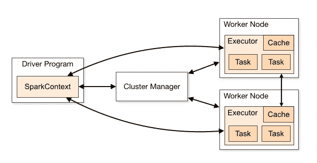
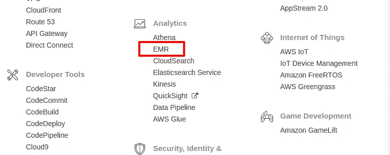
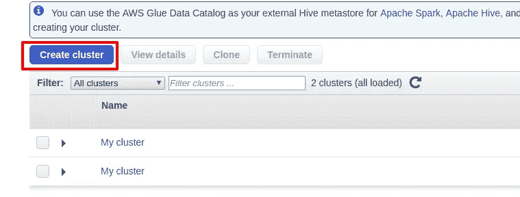
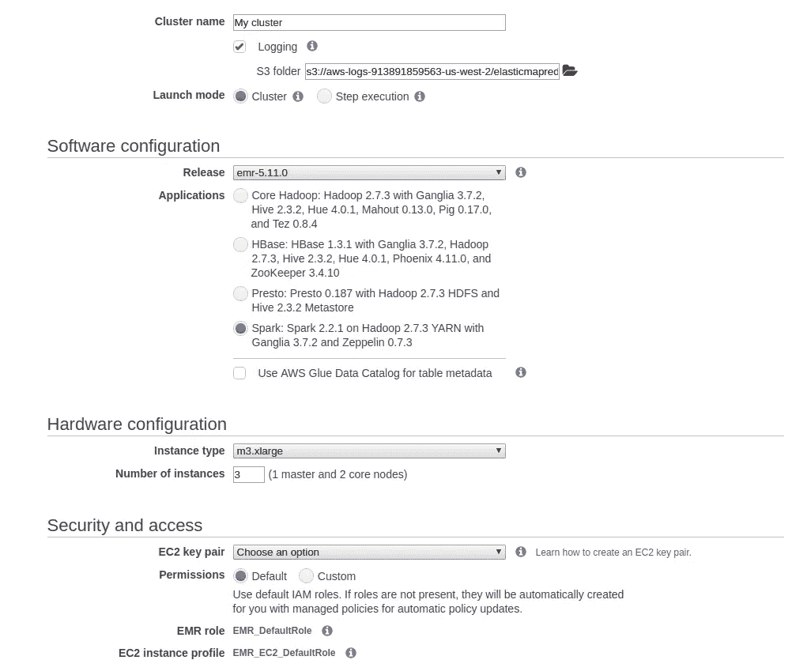
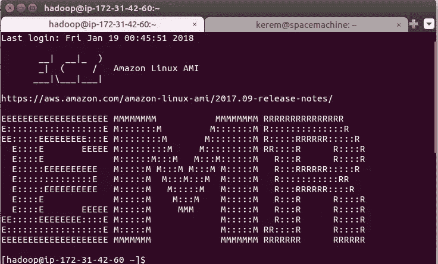

# 使用 AWS EMR、Apache Spark (Pyspark)和 MongoDB Tutorial(包含百万首歌曲数据)的端到端分布式 ML

> 原文：<https://towardsdatascience.com/end-to-end-distributed-ml-using-aws-emr-apache-spark-pyspark-and-mongodb-tutorial-with-4d1077f68381?source=collection_archive---------2----------------------->


在这篇文章中，我将提到如何使用 Python Spark API pyspark 以分布式方式运行 ML 算法。我们还将了解如何设置 AWS EMR 实例以在云上运行我们的应用程序，如何设置 MongoDB 服务器作为 NoSQL 数据库以存储非结构化数据(如 JSON、XML ),以及如何通过使用 pyspark 功能快速进行数据处理/分析。

**要求:**

*   AWS 帐户(或者您可以在本地运行)
*   Python 2.7(用于运行将要提供的脚本)

# **1。设置 EMR 实例**

什么是亚马逊 EMR？(网址:【https://aws.amazon.com/emr/ )

> Amazon EMR 提供了一个托管的 Hadoop 框架，可以轻松、快速且经济高效地跨可动态扩展的 Amazon EC2 实例处理大量数据。还可以在亚马逊 EMR 中运行其他流行的分布式框架如 [Apache Spark](https://aws.amazon.com/emr/details/spark/) 、 [HBase](https://aws.amazon.com/emr/details/hbase/) 、 [Presto、](https://aws.amazon.com/emr/details/presto/)和 [Flink](https://aws.amazon.com/blogs/big-data/use-apache-flink-on-amazon-emr/) ，与亚马逊 S3、亚马逊 DynamoDB 等其他 AWS 数据仓库中的数据进行交互。

尽管这一步是可选的，以便运行脚本并自上而下地了解正在发生的事情，但我们可能需要分布式计算的主要原因通常是我们的本地机器规格无法进行我们想要的处理、分析或建模。

我们还可以启动多个 EC2 实例并配置主节点和工作节点，但所有这些步骤实际上都由 EMR 负责。简而言之，EMR 将允许我们在主实例上运行我们想要运行的作业后，自动分发这些作业。否则，我们应该在所有节点上配置和安装 Spark。

下面你可以看到 Spark 框架是如何分配工作的。驱动程序运行主进程，将其转换为任务，并为执行者安排任务。然后工人(执行者)运行这些任务。



Driver and Executor Architecture in Spark

为了启动我们的第一个电子病历实例，我们需要登录到 aws.amazon.com，然后控制台会出现。



select “EMR” here



click “Create Cluster”



Here we should select “Spark” under Applications and define how many instances we want for our application. For example 1 for master and 2 for core nodes (executors which will run tasks). So here we will be distributing the job into 2 worker nodes.

您还应该给出一个密钥对，以便以后 ssh 进入节点并运行您的应用程序。一旦你点击创建你的集群，它将开始引导，一旦一切准备就绪，主和核心将等待。关于电子病历的一个关键点是，一旦开始就无法停止。这意味着您不能像常规 EC2 实例一样停止和启动 EMR 实例。因此，运行所有应用程序，然后终止 EMR 是一个好的做法。如果你试图在工作没有完成的情况下停止，你将需要重新开始。数据处理或分析工作的另一个常见做法是使用亚马逊 S3。EMR、S3、Spark 在一起相处得很好。您可以将数据存储在 S3，然后读取和处理数据，而无需实际存储在您的节点中，通过 spark 处理后，您可以将数据写回 S3 并终止 EMR。

EMR 实例准备就绪后，您可以使用您的 pem 密钥和主服务器的公共 DNS 进入您的终端并进行 ssh。

```
$ ssh -i .ssh/mykey.pem hadoop@ec2–xx–xxx–xxx-xx.us-west-2.compute.amazonaws.com
```



EMR terminal

# 2.获取数据

在本教程中，我将使用百万首歌曲数据集的子集，但是任何超过几个 GB 的数据集都会支持我们的观点。下面是多种方式获取数据的链接:[https://lab Rosa . ee . Columbia . edu/million song/pages/getting-dataset](https://labrosa.ee.columbia.edu/millionsong/pages/getting-dataset)。尽管他们在 EC2 映像中提供了这个数据集，但为了完整起见，我们将假设这是我们自己的数据，我们试图将其导入 AWS。我们将在这里探索的数据称为 MillionSongSubset，它随机选择了百万首歌曲的子集，即 10，000 首歌曲的集合。你可以参考“百万歌曲子集”的链接，并从那里下载 tar.gz 的文件。您可以将数据下载到您的本地，然后再下载到主节点和工作节点的 scp，但这将花费 scp 很长时间。所以我在这里推荐使用一个通过 Chrome 的 curlwget 扩展，将 tar.gz 文件直接下载到主节点和工作节点。我在 Chrome 上使用的扩展叫做 CurlWget。尝试在你的节点中存储数据/mnt/

下载完数据后，您会看到有两个主文件夹 data/A/和 data/B/这些文件夹有子目录，最终在每个. h5 层次数据文件下有单首歌曲数据，关于数据的更多信息在获取数据集 url 中提供。

# 3.用派斯帕克把 H5 变成 RDD

到目前为止，我们已经启动了我们的 EMR 实例，并将数据放入所有节点的相同路径中，现在我们将数据转换为 Spark RDD，以便使用 pyspark 及其分布式计算功能。RDD(弹性分布式数据集)是 spark 表示数据并将其存储在分区中的方式。数据可以来自文本、csv、json 格式或数据库。

我找不到将 H5 文件转换成 RDD 的直接方法，但这个链接[https://www . hdf group . org/2015/03/from-HD F5-datasets-to-Apache-spark-rdds/](https://www.hdfgroup.org/2015/03/from-hdf5-datasets-to-apache-spark-rdds/.)启发我编写自己的脚本，使用 pyspark 并行进行这种转换。基本思想是在一个 python 列表中收集所有 h5 文件，并根据这个列表创建一个 RDD。然后，我们可以很容易地做我们想要的转换使用地图功能在这个 RDD。

```
# 8 is number of partitions to distribute the data
# For local applications it will be distributed to 8 threadsfile_paths = sc.parallelize(h5_file_paths, 8)# Read and convert to python dict in parallelsongs_rdd = file_paths.map(lambda x: h5todict(x))
songs = songs_rdd.collect()
```

在这里，我们也收集歌曲作为 python 列表，以便创建我们的 MongoDB 数据库，因为教程的一部分也要显示 MongoDB，但我们可能只坚持使用包含 python 字典的 RDD(在这种情况下，每个元素都是一个 python 字典，它在层次关系中有一个歌曲数据)。拥有 RDD 就足以通过 pyspark 继续处理、分析和建模。

**边注**:这里提供了转换的完整脚本:[https://github . com/KeremTurgutlu/distcomputing/blob/master/million songs-Project/H5 to mongo . py](https://github.com/KeremTurgutlu/distcomputing/blob/master/MillionSongs-Project/h5toMongo.py)。所有节点都应该安装了所需的 python 包，比如 h5py、json、numpy…

为此，您需要 ssh 到您的工作节点和主节点。要 ssh 到 worker 节点，您应该在 master 中拥有您的 pem 密钥，并通过 master 终端使用该密钥进行 ssh。之后，您需要做的就是 pip 安装尚未提供的所需软件包。

# 4.设置 MongoDB

在这一步中，我们将在主节点中安装和设置 mongodb。可以按照这里的步骤[https://docs . MongoDB . com/manual/tutorial/install-MongoDB-on-red-hat/](https://docs.mongodb.com/manual/tutorial/install-mongodb-on-red-hat/)进行安装。安装后，您应该创建一个目录，用于存储您创建的数据库。同样，在/mnt 下将它们创建为/mnt/mongo/db 更有利于磁盘的使用。您还需要通过运行以下命令来设置对此目录的权限:

```
$ sudo chown -R `id -un` /mnt/mongo/db/
```

运行此步骤后:

```
$ mongod --dbpath /mnt/mongo/db
```

现在 MongoDB 服务器应该在监听连接。在一个单独的终端上，您可以运行 **mongo** 并启动 mongo shell。在 mongo shell 中，您可以使用 **show dbs 查看当前数据库。**

现在，与 MongoDB 建立有效连接。接下来，我们需要在所有节点上安装 pymongo 包，它是 MongoDB 的 python API。之后，我们可以在我们的主机上运行通过 github repo 提供的脚本。为了运行该脚本，我们还应该在同一路径中有[https://github . com/KeremTurgutlu/dist computing/blob/master/million songs-Project/user _ definition . py](https://github.com/KeremTurgutlu/distcomputing/blob/master/MillionSongs-Project/user_definition.py)。在用户定义中，我们定义了执行器驱动内存、最大结果和开销内存，以便在运行应用程序时不会遇到内存问题。

这个脚本将读取 h5 文件，并在默认情况下在名为“MillionSongs”的数据库下创建一个名为“songs”的 mongoDB 集合(当然，您可以在 user_definition.py 中为数据库和集合指定其他名称)。你可能认为数据库是一个普通的 SQL 数据库，集合是一个 SQL 表，文档(单曲的 dict)是表中的一行。

# 5.分布式分析和 ML

此时，我们有一个名为“MillionSongs”的 MongoDB 数据库，并位于一个名为“Songs”的集合下(或者您指定的数据库和集合)。对于您自己的数据，为了有一个数据库和集合，例如来自位于您当前目录下的 json 文件，您可以从另一个终端运行这个命令，而 mongod 在另一个终端上运行:

```
$ mongoimport --db dbName --collection collectionName --file fileName.json
```

使用 mongodb，可以像在 SQL 中一样通过查询数据来非常容易地过滤、选择、聚集和执行许多其他操作。在我们的歌曲集合中，每首歌曲都被表示为一个文档(一个 python 字典),这是由于我们通过 h5tomongo.py 脚本创建和插入它们的方式。

我们的第一个任务是预测某首歌是在哪一个年代发行的。有关数据字段的更多详细说明，您可能会发现此链接很有帮助:[https://lab Rosa . ee . Columbia . edu/million song/pages/field-list](https://labrosa.ee.columbia.edu/millionsong/pages/field-list)。这项任务在 Kaggle 和 UCI 网站上都有推广。我们将使用 segments_timbre 来完成我们的任务，segments _ timbre 是一种类似 MFCC 主成分分析的 2d 特征，涉及歌曲的纹理、歌曲的能量、歌曲的可跳性和歌曲的年份。


2d features for 12 segments

**首先，让我们从 mongodb 中收集我们想要的数据:**

我们通过定义具有分层字段名的字典来定义我们想要返回的字段(例如在我们的文档中 year 具有 analysis -> songs -> year 层次结构)，1 表示我们想要返回的字段，0 表示我们不想要的字段。默认情况下，还会返回文档的 _id，这就是我们明确取消选择的原因。您可以看到，我们在 find 函数中定义了一个过滤器，其中创建了 train_year_data 和 test_year_data。测试数据将是缺少年份字段的数据(在原始数据中被估算为 0)。我们的任务可能是用训练数据建立一个好的预测模型，以便进一步估算这个测试集中缺失的年份。

```
from pymongo import MongoClientclient = MongoClient()
db = client[dbname]
collection = db[collection_name]fields = {'musicbrainz.songs.year':1,                    'analysis.segments_timbre':1,                    'analysis.songs.energy':1,                    'analysis.songs.danceability':1,                    'metadata.songs.title':1,                    'metadata.songs.artist_name': 1,
'_id':0}train_year_data = collection.find({'musicbrainz.songs.year':{'$gte':1920}}, fields)
test_year_data = collection.find({'musicbrainz.songs.year':{'$eq':0}}, fields)
```

**其次，让我们创建 rdd 和数据帧:**

Spark SQL 支持我们将用于输入机器学习算法的数据帧，它也非常方便地支持 pandas 数据帧。从 MongoDB collection 过渡到 Spark RDD 非常简单:

```
# create train and test rdds
train_year_rdd = sc.parallelize(list(train_year_data))
test_year_rdd = sc.parallelize(list(test_year_data))
```

我们将通过取所有段的协方差和每个段的平均值，从 timbre _ segments 中创建一个 1d 特征向量。总计 12 个分段的 90 个特征。我们将通过 map 应用两个自定义函数，以获得创建 Spark SQL 数据框架所需的特性。因为 train_year_rdd 和 test_year_rdd 仍然是层次化的 python dict 格式，我们不能用它来创建数据帧以输入到 ML 算法中。你可以在这里找到这些步骤的源代码:[https://github . com/KeremTurgutlu/distcomputing/blob/master/million songs-Project/predict _ year . py](https://github.com/KeremTurgutlu/distcomputing/blob/master/MillionSongs-Project/predict_year.py)

```
# create train and test dataframestrain_full_df = train_year_rdd.map(lambda d: getYearFeatures(d)).\
                               map(lambda d: getDFeatures(d)).toDF()test_df = test_year_rdd.map(lambda d: getYearFeatures(d)).\
                        map(lambda d: getDFeatures(d, True)).toDF()
```

创建培训和验证集:

```
# split to train and validation dataframes
train_df, val_df = train_full_df.randomSplit([0.7, 0.3])
```

创建矢量汇编程序:

Vector assembler 获取所需列名的列表，这些列名将被输入 ML 算法，组合它们并为优化的 spark ML 做好准备。

```
# define vector assembler and transform dataframes into correct format
# cache train and validation dataframes for fast iterationsva = VectorAssembler(inputCols=x_cols, outputCol='features')
train_va=va.transform(train_df).select('features','decade').cache()
val_va=va.transform(val_df).select('features', 'decade').cache()
test_va=va.transform(test_df).select('features', 'decade').cache()
```

Pyspark ML 包提供了多种型号、变压器和许多选项。查阅文档就好:[http://spark . Apache . org/docs/2 . 2 . 0/API/python/py spark . ml . html](http://spark.apache.org/docs/2.2.0/api/python/pyspark.ml.html)个人应用。几乎所有的分布式 ML 算法都是通过这个 API 提供的，而不是深度学习。对于深度学习，你可以检查 H20.ai 的苏打水:[https://www.h2o.ai/sparkling-water/](https://www.h2o.ai/sparkling-water/)或者简单地使用现代的 GPU，甚至使用 Pytorch 的 nn.DataParallel 进行多次处理

既然我们有了向量组装器，现在我们可以进行实际的分布式训练。我将展示运行逻辑回归模型的代码，但是 repo 中提供的脚本同时运行逻辑回归和随机森林。

```
# define model and fit lr = LogisticRegression(featuresCol='features', labelCol='decade',regParam=0.01, maxIter=1000, fitIntercept=True)
lr_model = lr.fit(train_va)
```

或者我们可以简单地进行交叉验证的网格搜索

```
# create cross validation
cv = CrossValidator().setEstimator(lr).setEvaluator(evaluator).setNumFolds(5)
#ParamGridBuilder() – combinations of parameters and their values.
paramGrid = ParamGridBuilder().addGrid(lr.maxIter, [1000]).addGrid(lr.regParam, [0.0001, 0.001, 0.005, 0.01, 0.05, 0.1, 0.5]).build()
#setEstimatorParamMaps() takes ParamGridBuilder().
cv.setEstimatorParamMaps(paramGrid)
cvmodel = cv.fit(train_va)
```

由于准确性不够好，我们通过使用多级 F1 分数来评估模型。

**运行提供的脚本:**

为了通过终端运行 spark 作业，您需要使用 spark-submit 命令。在将您想要的脚本克隆或获取到一个文件夹中，并在 h5toMongo.py 中定义了正确的 file _ roots 以及在 user_definition 中定义了所需的内存分配之后，您可以运行:

```
$ spark-submit h5toMongo.py
```

和

```
$ spark-submit predict_year.py
```

我希望这个简短的教程对你有所帮助，有很多内容需要你通过文档和经验来学习。因此，如果您有任何建议、推荐或问题，请告诉我。

感谢阅读！