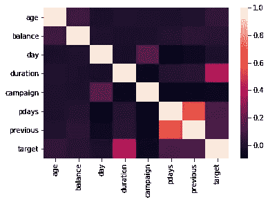
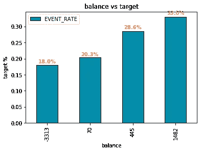
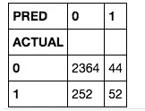
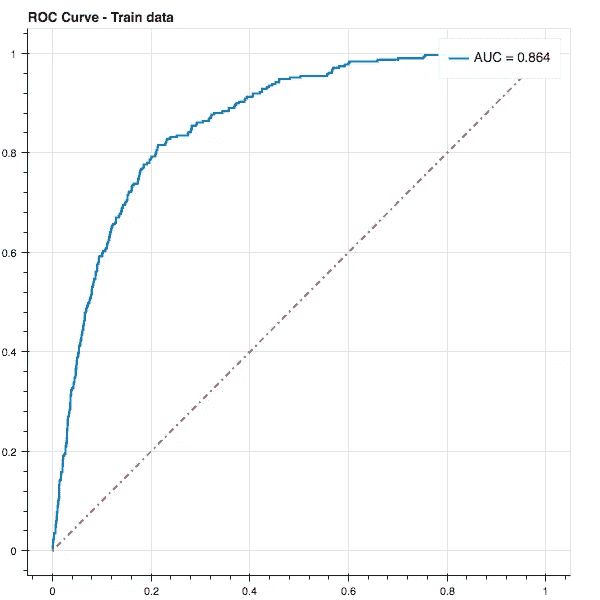
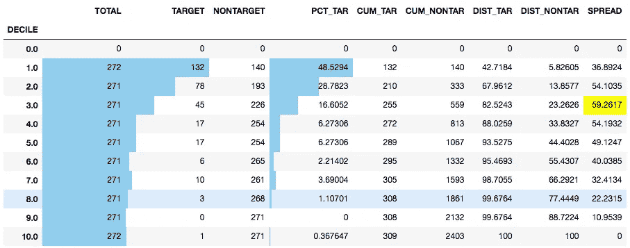
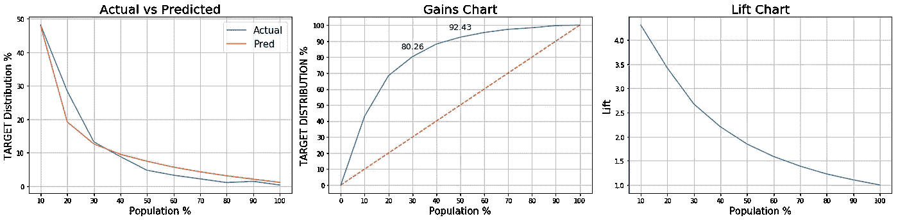

# 端到端—使用 Python 框架的预测模型

> 原文：<https://towardsdatascience.com/end-to-end-python-framework-for-predictive-modeling-b8052bb96a78?source=collection_archive---------0----------------------->


预测建模总是一项有趣的任务。花费的主要时间是了解企业需要什么，然后确定您的问题。下一步是根据需求定制解决方案。当我们解决许多问题时，我们明白可以用一个框架来建立我们的第一批模型。这个框架不仅给你更快的结果，它还帮助你根据结果计划下一步。

在本文中，我们将看到如何将基于 Python 的框架应用于各种预测建模任务。这将涵盖/触及 CRISP-DM 流程中的大部分领域。那么什么是 CRISP-DM 呢？

[](https://en.wikipedia.org/wiki/Cross-industry_standard_process_for_data_mining) [## 数据挖掘的跨行业标准流程-维基百科

### 数据挖掘的跨行业标准过程，称为 CRISP-DM，是一个数据挖掘过程模型，它描述了…

en.wikipedia.org](https://en.wikipedia.org/wiki/Cross-industry_standard_process_for_data_mining) 

下面是代码的链接。在本文中，为了简洁起见，我跳过了许多代码。阅读本文时，请遵循边上的 Github 代码。

[](https://github.com/Sundar0989/EndtoEnd---Predictive-modeling-using-Python) [## sundar 0989/EndtoEnd—-使用 Python 进行预测建模

### 通过在 GitHub 上创建帐户，为使用 Python 的端到端预测建模开发做出贡献。

github.com](https://github.com/Sundar0989/EndtoEnd---Predictive-modeling-using-Python) 

本文中讨论的框架分为 9 个不同的领域，我将它们与它们在 CRISP DM 过程中所处的位置联系起来。

> 加载数据集— *数据理解*

```
**import** **pandas** **as** **pd**

df = pd.read_excel("bank.xlsx")
```

> 数据转换— *数据准备*

现在，我们有了熊猫数据框架中的数据集。接下来，我们分别使用 df.info()和 df.head()查看变量描述和数据集内容。使用下面的代码将目标变量(' Yes'/'No ')转换为(1/0)。

```
df['target'] = df['y'].apply(**lambda** x: 1 **if** x == 'yes' **else** 0)
```

> 描述性统计— *数据理解*

探索性统计帮助建模者更好地理解数据。在这个框架中有一些这样的统计数据。首先，我们使用下面的代码检查数据集中每一列的缺失值。

```
df.isnull().mean().sort_values(ascending=**False**)*100
```

其次，我们使用下面的代码检查变量之间的相关性。

```
**import** **seaborn** **as** **sns**
**import** **matplotlib.pyplot** **as** **plt**
%matplotlib inline
corr = df.corr()
sns.heatmap(corr, 
        xticklabels=corr.columns,
        yticklabels=corr.columns)
```



最后，在框架中，我加入了一个宁滨算法，该算法自动将输入变量纳入数据集中，并创建一个二元图(输入与目标)。

```
bar_color = '#058caa'
num_color = '#ed8549'

final_iv,_ = data_vars(df1,df1['target'])
final_iv = final_iv[(final_iv.VAR_NAME != 'target')]
grouped = final_iv.groupby(['VAR_NAME'])
**for** key, group **in** grouped:
    ax = group.plot('MIN_VALUE','EVENT_RATE',kind='bar',color=bar_color,linewidth=1.0,edgecolor=['black'])
    ax.set_title(str(key) + " vs " + str('target'))
    ax.set_xlabel(key)
    ax.set_ylabel(str('target') + " %")
    rects = ax.patches
    **for** rect **in** rects:
        height = rect.get_height()
        ax.text(rect.get_x()+rect.get_width()/2., 1.01*height, str(round(height*100,1)) + '%', 
                ha='center', va='bottom', color=num_color, fontweight='bold')
```



The values in the bottom represent the start value of the bin.

> 变量选择— *数据准备*

请阅读我下面的文章，关于在这个框架中使用的变量选择过程。基于投票系统选择变量。我们使用不同的算法来选择特征，然后最后每个算法为他们选择的特征投票。最终投票数用于选择建模的最佳特征。

[](https://medium.com/@sundarstyles89/variable-selection-using-python-vote-based-approach-faa42da960f0) [## 使用 Python 的变量选择—基于投票的方法

### 变量选择是预测建模过程中的关键步骤之一。这是一门艺术。简单来说…

medium.com](https://medium.com/@sundarstyles89/variable-selection-using-python-vote-based-approach-faa42da960f0) 

> 模型— *建模*

到目前为止，80%的预测模型工作已经完成。为了完成剩下的 20%,我们将数据集分成训练/测试，并对数据尝试各种算法，然后选择最佳算法。

```
**from** **sklearn.cross_validation** **import** train_test_split

train, test = train_test_split(df1, test_size = 0.4)
train = train.reset_index(drop=**True**)
test = test.reset_index(drop=**True**)

features_train = train[list(vif['Features'])]
label_train = train['target']
features_test = test[list(vif['Features'])]
label_test = test['target']
```

我们在训练数据集上应用不同的算法，并在测试数据上评估性能，以确保模型是稳定的。该框架包括随机森林、逻辑回归、朴素贝叶斯、神经网络和梯度推进的代码。我们可以根据需要添加其他型号。下面提供了随机森林代码。

```
**from** **sklearn.ensemble** **import** RandomForestClassifier
clf = RandomForestClassifier()

clf.fit(features_train,label_train)

pred_train = clf.predict(features_train)
pred_test = clf.predict(features_test)

**from** **sklearn.metrics** **import** accuracy_score
accuracy_train = accuracy_score(pred_train,label_train)
accuracy_test = accuracy_score(pred_test,label_test)

**from** **sklearn** **import** metrics
fpr, tpr, _ = metrics.roc_curve(np.array(label_train), clf.predict_proba(features_train)[:,1])
auc_train = metrics.auc(fpr,tpr)

fpr, tpr, _ = metrics.roc_curve(np.array(label_test), clf.predict_proba(features_test)[:,1])
auc_test = metrics.auc(fpr,tpr)
```

> 超参数整定— *建模*

此外，还可以调整模型的超参数来提高性能。下面是一段代码。

```
**from** **sklearn.model_selection** **import** RandomizedSearchCV
**from** **sklearn.ensemble** **import** RandomForestClassifier

n_estimators = [int(x) **for** x **in** np.linspace(start = 10, stop = 500, num = 10)]
max_features = ['auto', 'sqrt']
max_depth = [int(x) **for** x **in** np.linspace(3, 10, num = 1)]
max_depth.append(**None**)
min_samples_split = [2, 5, 10]
min_samples_leaf = [1, 2, 4]
bootstrap = [**True**, **False**]

random_grid = {'n_estimators': n_estimators,
               'max_features': max_features,
               'max_depth': max_depth,
               'min_samples_split': min_samples_split,
               'min_samples_leaf': min_samples_leaf,
               'bootstrap': bootstrap}

rf = RandomForestClassifier()

rf_random = RandomizedSearchCV(estimator = rf, param_distributions = random_grid, n_iter = 10, cv = 2, verbose=2, random_state=42, n_jobs = -1)
rf_random.fit(features_train, label_train)
```

> 最终模型和模型性能— *评估*

目前，我们选择了能提供更高精度值的最终模型。然而，我们还没有完成。我们需要基于各种度量来评估模型性能。该框架包含计算实际与预测值交叉表、ROC 曲线、十分位数、KS 统计、提升图、实际与预测图、增益图的代码。我们将在下面逐一介绍。

1.  **交叉表**

```
pd.crosstab(label_train,pd.Series(pred_train),rownames=['ACTUAL'],colnames=['PRED'])
```



Crosstab of Actual vs Predicted values

**2。ROC/AUC 曲线或 c 统计**

```
from bokeh.charts import Histogram
from ipywidgets import interact
from bokeh.plotting import figure
from bokeh.io import push_notebook, show, output_notebook
output_notebook()from sklearn import metrics
preds = clf.predict_proba(features_train)[:,1]fpr, tpr, _ = metrics.roc_curve(np.array(label_train), preds)
auc = metrics.auc(fpr,tpr)p = figure(title="ROC Curve - Train data")
r = p.line(fpr,tpr,color='#0077bc',legend = 'AUC = '+ str(round(auc,3)), line_width=2)
s = p.line([0,1],[0,1], color= '#d15555',line_dash='dotdash',line_width=2)
show(p)
```



**3。十分位数图和 Kolmogorov Smirnov (KS)统计数据**

在后端执行一个宏来生成下图。黄色突出显示的数字是 KS 统计值。

```
deciling(scores_train,['DECILE'],'TARGET','NONTARGET')
```



**4。提升图、实际与预测图、收益图**

与十分位数图类似，宏用于生成下面的图。

```
gains(lift_train,['DECILE'],'TARGET','SCORE')
```



> 保存模型以备将来使用— *部署*

最后，我们开发了我们的模型并评估了所有不同的指标，现在我们准备在生产中部署模型。部署前的最后一步是保存我们的模型，这是使用下面的代码完成的。

```
**import** **pandas**
**from** **sklearn.externals** **import** joblib

filename = 'final_model.model'
i = [d,clf]
joblib.dump(i,filename)
```

这里，“clf”是模型分类器对象，“d”是标签编码器对象，用于将字符转换为数字变量。

> 评分新数据— *部署*

为了评分，我们需要将模型对象(clf)和标签编码器对象加载回 python 环境。

```
*# Use the code to load the model*
filename = 'final_model.model'

**from** **sklearn.externals** **import** joblib
d,clf=joblib.load(filename)
```

然后，我们加载新的数据集并传递给评分宏。

```
**def** score_new(features,clf):
    score = pd.DataFrame(clf.predict_proba(features)[:,1], columns = ['SCORE'])
    score['DECILE'] = pd.qcut(score['SCORE'].rank(method = 'first'),10,labels=range(10,0,-1))
    score['DECILE'] = score['DECILE'].astype(float)
    **return**(score)
```

我们用下面的代码调用这个宏

```
scores = score_new(new_score_data,clf)
```

就是这样。我们已经给新数据打分了。本文提供了技术代码的高级概述。如果您需要讨论任何特别的事情，或者您对任何模块有反馈，请留下评论或通过 [LinkedIn](http://www.linkedin.com/in/sundarkrishnan1) 联系我。

玩得开心！

我发布了一个 python 包，它将执行本文中提到的一些任务——WOE 和 IV，双变量图表，变量选择。如果你有兴趣使用软件包版本，请阅读下面的文章。

[](/introducing-xverse-a-python-package-for-feature-selection-and-transformation-17193cdcd067) [## Xverse 介绍！—用于要素选择和变换的 python 包

### Xverse 是 X Universe 的缩写，它是一个用于机器学习的 python 包，可以帮助数据科学家利用特性…

towardsdatascience.com](/introducing-xverse-a-python-package-for-feature-selection-and-transformation-17193cdcd067)