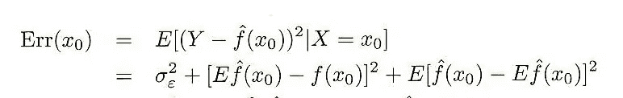
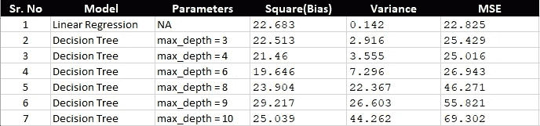

# 结束你对偏差和方差的偏见！！

> 原文：<https://towardsdatascience.com/end-your-bias-about-bias-and-variance-67b16f0eb1e6?source=collection_archive---------7----------------------->

> 所有的机器学习模型都不正确。句号！

但是偏差和方差的“正确”权衡是你的利益相关者可以接受的(*至少*)。有很多关于偏差和方差的[文章](https://machinelearningmastery.com/gentle-introduction-to-the-bias-variance-trade-off-in-machine-learning/)，它们很好地解释了这个概念。因此，我会节省一些空间和时间来再次深入研究这些概念。但是让我们先回顾一下定义。
**偏差** of 估计量是我们的估计量的预期或平均预测值与我们试图预测的正确值之间的差值。Sweet- >如果我一遍又一遍地更改训练数据集，我的 fit 不会剧烈移动。
苦- >它假定了过度简化的关系，而往往错过了真正的潜在关系。
**方差**是如果使用不同的训练数据，目标函数的估计将改变的量。甜蜜- >抓住了真实关系中的复杂性。Bitter - >不会对看不见的数据做出准确的预测。我们发现到处都写着这两者之间必须有所取舍。
本文的主要焦点是将不同算法的偏差和方差关系并列在一起。我将从对每一个问题的理论解释开始，然后通过分析一些数字来了解每一件事情的进展。
**线性回归**被理解为高偏差、低方差模型。这种说法部分正确。线性回归模型可以有高偏差-低方差，也可以有低偏差-高方差。这一切都归结于你在比较什么。
**基于树的模型:**尽管决策树模型是管理层最喜欢的时髦词，但它被诽谤为具有高方差和低偏差。这通常是正确的，因为树不会对目标函数做出假设，但是很容易“追逐”训练数据点。但是，当我说一棵树可以对相同的数据集有高偏差，而线性回归会有低偏差时，不要把这当成晴天霹雳！(我们将运行这些数字，看看这是如何发生的)。
为前面提到的震惊提供一个直接的答案——想想与线性模型相比，树模型太差，MSE 高，它抛出了偏差和方差的夸大值。每当我们拟合一个模型时，我们会查看一些误差度量，并不本质上将其分解为偏差和方差(通常情况下)。这是因为很难明确找到偏差和方差，因为它们是根据 ***统计期望*** 定义的。快速参考两者的数学表达式:

**Fig.2** **Formula for Error term decomposed as bias, variance and irreducible error**

中间项是平方(**偏差)**，最后一项是**方差**。你看到那个大的 ***E，*** 在计算这两个项时造成了障碍。这是因为要计算某项的期望值，需要有*真*总体的信息。我不能用*波士顿房价*数据集来做这个，因为我不知道 100%准确的潜在关系。因此，为了将我的预测误差分解为偏差和方差，我与*旧的 sweet 模拟*和*随机数据发生器握手。下面是我这样做的步骤。)自定义一个关系，即定义我们称之为*真实总体*的系数。
2。)用它创建一个目标变量，并给它添加一些噪声。
3。)模拟 *n* 个不同的此类数据集，并在其上拟合 *n* 个不同的线性以及决策树模型。预测*测试*观察的结果。
4。)利用步骤 1 中的信息计算偏差和方差。下面提到的脚本执行上述所有步骤。*

获得的结果总结如下:

**Fig 3: Calculation of Bias, Variance and MSE for different models**

你看 1 号模型是线性回归，恰好给出了最好的结果。然而，决策树通过模型编号 3 得到的最佳结果的特征是 *max_depth=4。*所以，我在这里的观点很清楚，与线性模型相比，我们的树模型偏差较低(*预期*)。与线性模型相比，我们也有偏差较高的模型(*惊喜*)。要注意的是，两个模型提供的最佳拟合确实遵循线性回归的高偏差-低方差和树的低偏差-高方差的一般惯例。我在这里的关键点是，一个人不应该有偏见，并持有关于这些算法的意见，这是上面反驳。基本事实:这是应该遵循的最佳匹配的权衡。选择一个特定的算法将*永远不会保证*两个讨论项的高/低值。
上面公布的代码是完全可复制的，人们可以尝试看看他们的“信念”是如何被其他算法揭穿的，如 KNN、逻辑回归、支持向量机在偏差-方差方面。需要记住的一点是，如果你碰巧在分类问题上尝试了这种方法，那么偏差和方差的公式将会改变，因为上面显示的公式对于最小二乘估计是有效的。如果 y'=y else 0，您可能会想到设计像 L(y '，y)= 1 这样得分度量。
*PS:
1。)这篇文章将展示如何在给定模型的情况下计算预测误差并将其分解为偏差和方差。
2。)这篇文章旨在揭穿关于不同 ML 算法的偏差-方差的典型惯例的神话。
3。)这篇文章不是要解释机器学习中偏差-方差权衡的本质。*