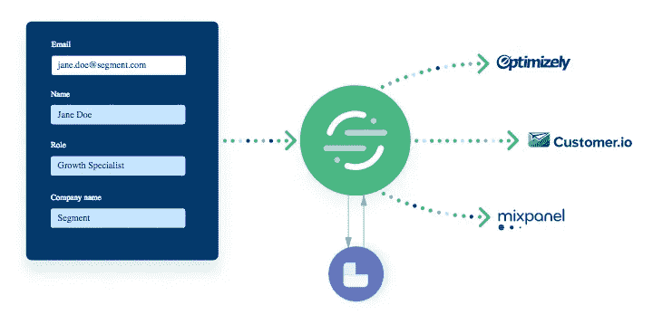
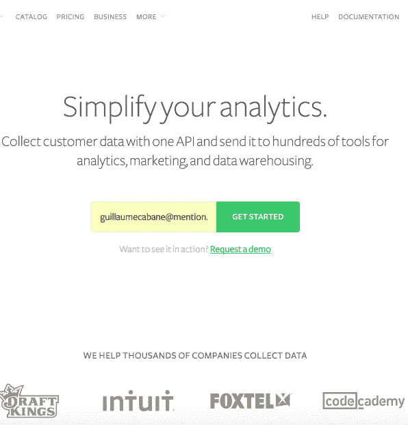
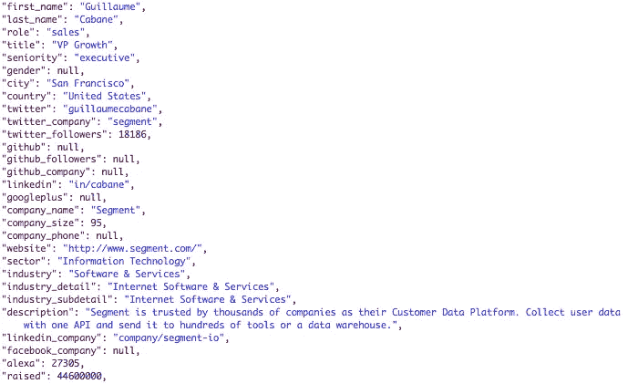

# 工程无摩擦注册体验

> 原文：<https://towardsdatascience.com/engineering-a-frictionless-signup-experience-2dee7e074839?source=collection_archive---------7----------------------->

*原载于* [*段的博客*](https://web.archive.org/web/20171110013520/https://segment.com/blog/frictionless-signup-forms-by-clearbit-segment/) *并转载于此。我现在是* [*荣誉*](https://www.joinhonor.com/) *的工程师。我们在招人！如果你有兴趣和我们一起工作，* [*在 Twitter 上 DM 我*](https://twitter.com/benhoffman_) *！*

像我们在 SaaS 领域的许多同行一样，Segment 的增长团队坚定不移地致力于提高我们销售团队的销售线索数量和质量。对我们来说，这意味着更多的公司完成我们的注册表格。但我们不仅仅希望有更多的公司签约，我们还希望我们的销售团队对我们的客户有更全面的了解。



为了提高转化率，缩短这些表格是有意义的。然而，这有丢失注册信息的风险，而这些信息在销售漏斗中至关重要。经过深思熟虑后，我们决定进行一项实验，我们称之为“无摩擦注册”。在这个实验中，我们使用 Segment 的数据丰富产品来预填充注册表单。

经过一个月的测试，结果出来了:在我们的主页上添加一个电子邮件捕获表单将转化率提高了 5.45%，在注册表单中预先填入 Clearbit 丰富的数据将转化率提高了 23.76%。

# 在不影响数据的情况下减少摩擦

无摩擦注册是使用公司数据(即公司名称、公司员工人数、公司资金总额等)预先填写注册表格或任何潜在客户生成表格的过程。当用户键入他们的电子邮件地址时，我们点击 Clearbit 的 Enrichment API，并使用返回的数据来完成表单的剩余部分。

正如您从下面的 GIF 中看到的，客户输入了他们的电子邮件地址，表单会自动预填充剩余的字段:



*Notice how with a simple email address, we can prefill the name, company size, and role form fields*

# 为什么效果这么好？

无摩擦注册和个人资料丰富为标准表单增加了四项主要改进:

**1。表单预填充:**我们正在减少用户在任何表单上遇到的麻烦。通过减少注册页面上的表单字段数量，我们使访问者更容易注册。

**2。丰富的用户资料:**当你点击 Clearbit 的 API，特别是通过[细分市场的丰富集成](https://segment.com/docs/destinations/clearbit-enrichment/)，你会获得数百个关于你注册的额外数据点。例如，以下是我们的内部增长专家 Guillaume Cabane 返回的数据:



Response object from Clearbit’s API

**3。数据验证:**冗长的注册表单通常会产生虚假数据，因为用户在必填字段中填入任何内容以通过注册过程。预填充、丰富的数据允许用户查看、更正和验证，而不是从头开始输入数据。除此之外，如果用户更改表单中的任何字段，您可以自动丢弃 Clearbit 数据(因为这将表明 Clearbit 数据无效)。这是巨大的，因为我们不再冒假阳性匹配的风险。

**4。动态内容:**因为我们将 Clearbit 数据传回客户端(即浏览器)，所以我们可以选择使用针对该用户的独特内容来定制入职流程。在上面的例子中，我们以引用我们一位亲爱的客户的话的形式展示社会证明。报价是特定于角色的，因此营销人员看到的是营销人员报价等等。

例如，这是我们默认的注册表单页面:


The box at the bottom is dynamic — it changes based on the info returned from the enrichment APIs

当我们根据 Clearbit 呼叫返回的数据对注册进行资格预审时，我们可以添加一个额外的表单字段，询问他们是否需要帮助:


The question at the bottom is dynamic — only highly qualified leads see this box

# 我们是如何做到的

为了帮助其他人达到同样的目标，我们开源了代码，并编写了这个如何在 Segment 使用它的分步指南。

在深入了解细节之前，这里有一个流程的高级概述:

1.  客户输入他们的电子邮件地址
2.  电子邮件地址随后被发送到 Clearbit 的 Enrichment API
3.  表单域预先填充了从 Clearbit 返回的信息
4.  通过细分市场识别和跟踪电话，丰富了客户档案，为您的销售和营销团队提供了更好的数据

如果以上听起来很新鲜或者很吓人，不要担心。我会带你走过每一步。

# 第一步:接受电子邮件地址

为了预填我们的表单，我们需要首先收集一个电子邮件地址。这就是 Clearbit 的 Enrichment API 所需要的，以便返回用户的特征，如名字、姓氏和公司角色。我们将电子邮件地址作为演示表单的第一个输入框，因为我们需要一些时间(几百毫秒)来点击 Clearbit 的 API 并预填充表单的其余部分。

因此，无摩擦注册的第一步是:你必须要求你的用户提供一个电子邮件地址，这样你就可以查询 Clearbit 的 API。

# 步骤 2:编写简单的 JavaScript 来监听电子邮件字段的变化

我们编写了几行 JavaScript 来监听电子邮件表单字段的变化，并捕捉用户的输入。这一步非常重要，因为当用户输入完他们的电子邮件地址时，我们需要立即点击 Clearbit 的 API。

在下面的代码中，我们获得了名为“email”的 HTML 元素，并向其中添加了一个“change”事件侦听器。这意味着无论何时用户离开电子邮件表单域，JavaScript 都会监听:

```
document.getElementById("email").addEventListener('change', () => {
  // keep reading for the code that belongs here
});
```

完成这些后，现在您就可以查询 Clearbit API 并开始填充表单的其余部分了。

# 步骤 3:查询 Clearbit API

一旦我们捕获了潜在客户的电子邮件地址，我们就可以使用它来查询 Clearbit API，以获取该电子邮件地址的相关信息。我们只需用该电子邮件地址向 Clearbit 的 Enrichment API 端点发出一个 HTTP 请求。响应可以包括个人和公司信息，我们可以使用这些信息来填充所有表单字段。下面是您的客户端 JavaScript 代码的样子:

```
const request = require('visionmedia/superagent');

document.getElementById("email").addEventListener('change', () => {
  // make a GET request to a clearbit route on your server
  request.get('/contact/clearbit') // send in user’s email as a query param
  .query({ email: event.target.value })
  .end((err, res) => { // simply return if there is an error
    if (err || !res.ok) return // capture the person & company object
    const {person, company} = res.body // more code below on how to parse the response
  });
});
```

就这么简单。前进！

这里最棘手的部分是您的 Clearbit 调用需要在服务器端进行，以避免暴露 API 键。您必须将响应数据传递给客户端 JavaScript。不过，不要担心:Clearbit 提供了一个节点、Ruby 和 Python 库来帮助您完成这项工作。在我们的实验中，我们使用了[节点库](https://web.archive.org/web/20171110013520/https://clearbit.com/docs?javascript#enrichment-api)。

下面是我们的节点服务器上的代码:

```
const clearbit = require('clearbit')('{clearbit_api_key}')// capture the email query parameter
const emailAddress = this.request.query.email;// hit clearbit enrichment API
clearbit.Enrichment.find({email: emailAddress, stream: true})
  .then(response => {
    return response
  })
  .catch(err => {
    console.error(err)
  });
```

Clearbit 响应对象将至少包含:

```
{
  "person": {
    "id": "a0dd5de3-b1ff-449d-85ab-4b2ffdfdca53",
    "name": {
      "fullName": "Alex Stein",
      "givenName": "Alex",
      "familyName": "Stein"
    },
    "email": "alex@example.com",
    "location": "San Francisco, CA, US",
    "employment": {
      "domain": "example.com",
      "name": "Example",
      "title": "Digital Brand and Content Lead",
      "role": "marketing",
      "seniority": "manager"
    },
  },
  "company": {
    "id": "3f5d6a4e-c284-4f78-bfdf-7669b45af907",
    "name": "Example",
    "legalName": "Example Technologies Inc.",
    "domain": "example.com",
    "domainAliases": ["example.org"],
  },
}
```

其实这只是很小比例的回应。通过这个电话，可以获得关于这个人及其公司的更多信息，例如社会概况和其他联系信息。结合上面的两个部分——点击 Clearbit 路径的客户端 JavaScript 和点击 Clearbit API 的服务器端 JavaScript——将使您完成 80%的任务。下一步是解析数据，以便预填充表单的其余部分。

# 步骤 4:自动更新表单

当 Clearbit API 返回时，您可以使用 person 和 company 对象来填充表单中的必填字段。用 JavaScript 做到这一点最简单的方法是使用与响应对象中的数据字段相对应的必需字段的元素 id:

```
document.getElementById("email").addEventListener('change', function() {
  request.get('/contact/clearbit')
  .query({ email: event.target.value })
  .end((err, res) => {
    if (err || !res.ok) return
    ... // set (prefill) the name form field
    document.getElementById("fullName").value = person.fullName // set (prefill) the company form field
    document.getElementById("company").value = company.name
  });
});
```

# 步骤 5:将丰富的用户数据发送到下游集成

这一部分非常重要，尤其是如果你有一个 SaaS 产品，如果你已经在使用 Segment，这一部分尤其重要。对于那些不熟悉的人来说，[细分市场的识别呼叫](https://web.archive.org/web/20171110013520/https://segment.com/docs/spec/identify/)有助于将用户特征与他们在你的应用中的行为联系起来。例如，每次用户完成一个动作(称为“跟踪事件”)，您可以自动将他们的个人资料附加到该事件。然后，这些数据会被发送到您在 Segment 上启用的任何其他工具，如电子邮件营销和分析。

通过将 Clearbit Enrichment 与您的细分市场账户集成，您的所有用户都将自动获得新数据。您所要做的就是在您的细分仪表板中打开 Clearbit 集成。它非常容易上手，你的营销和销售团队会喜欢你的！

# 高级:预测性销售线索评分

我们已经开始使用这些档案信息作为预测线索评分工具 Madkudu 的输入。这使用个人资料信息以及转化和应用内行为数据来区分高价值线索。使用来自 Madkudu 的实时结果，我们可以在注册过程的早期识别这种高接触率的线索。然后，这可以与定制结合使用，以允许客户成功团队在个人接触到产品之前进行接触，以帮助他们入职。

# 结果呢

在细分市场，除了预测性销售线索得分，这一技术还使我们的签约量增加了 20%以上。

不仅如此，由于无摩擦注册使我们能够验证数据，我们能够获得干净、准确的用户数据，以发送个性化的营销信息，并动态显示更多更好的页面内内容，以推动演示请求。我们还能够根据转化的可能性对销售线索进行适当的评分，然后将其传递给我们的销售人员，从而增加我们销售合格的销售线索。

我们不仅使潜在客户请求演示变得更加容易，还实现了我们的目标，即提高我们的营销网站所产生的销售线索的数量和质量。