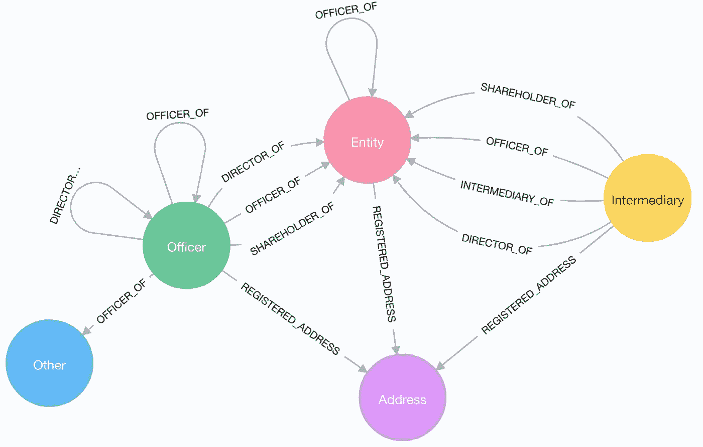
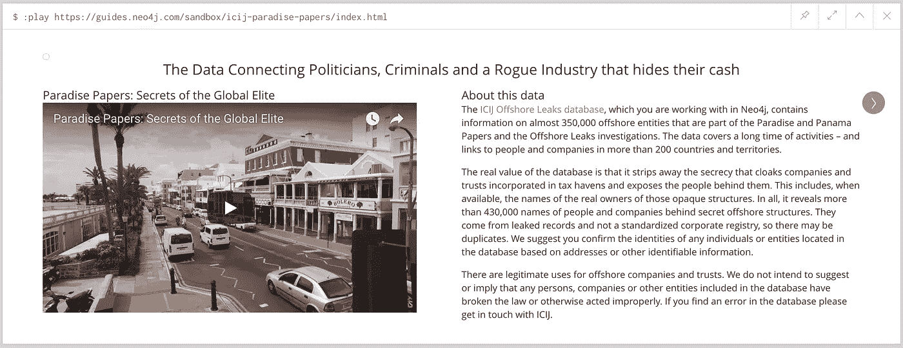
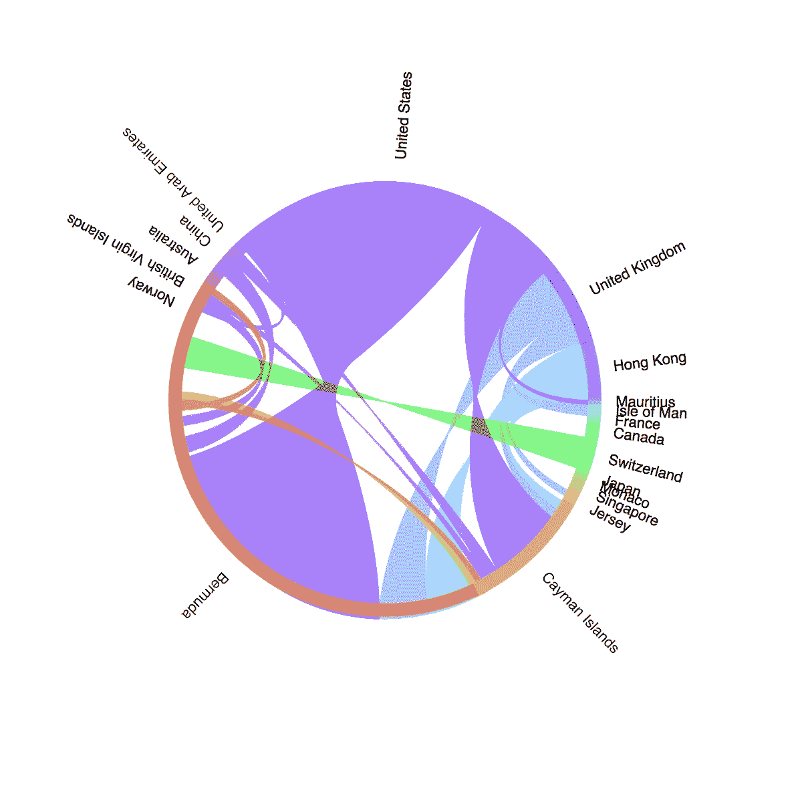
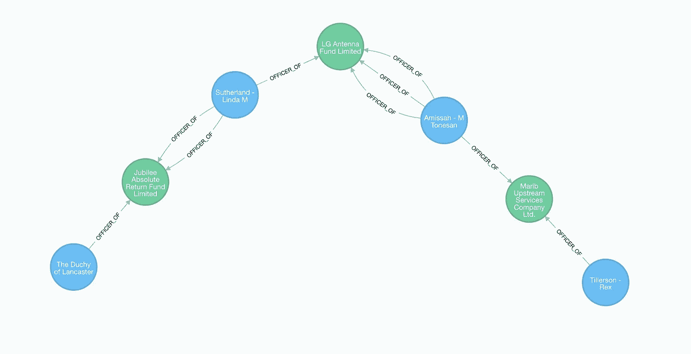

# 工程意识:天堂文件

> 原文：<https://towardsdatascience.com/engineering-awareness-paradise-papers-6303d93cee64?source=collection_archive---------3----------------------->


两周前，国际调查记者联盟发布了天堂文件，这是一份来自百慕大律师事务所艾波的文件集。这些文件由全球 380 名记者调查，揭示了精英们把钱藏在哪里。

昨天，他们发布了代表 77k 公司官员、25k 企业和他们之间 364k 连接的原始 CSV 文件。你能想到比使用图表更好的方法来分析这些数据吗？

我不想只是自己分析这些数据，而是想让世界更容易分析。

# 将所有的事情归档

Neo4j 通过分发[官方 docker 图像](http://hub.docker.com/_/neo4j/)使得在容器中运行图形数据库变得非常容易。虽然这些图像允许通过`docker run`选项传递配置和数据库，但我想让人们能够超级容易地访问天堂文件。

```
docker run -p 7474:7474 -p 7687:7687 ryguyrg/neo4j-paradise-papers
```

该图像包括 [APOC 库](https://github.com/neo4j-contrib/neo4j-apoc-procedures)和[图形算法库](https://github.com/neo4j-contrib/neo4j-graph-algorithms)。它还包含一个 [bash 脚本](https://github.com/ryguyrg/paradise-neo4j/blob/master/download_db.sh)来从 ICIJ 下载最新的 csv 数据，并调用`neo4j-import`来创建图形数据库。然后，脚本调用`neo4j-shell`来执行 [Cypher 语句](https://github.com/ryguyrg/paradise-neo4j/blob/master/configure.cql)，这些语句会创建适当的索引。

下面是完整的`Dockerfile`，它还设置了`EXTENSION_SCRIPT`环境变量，以便在 Neo4j 启动之前执行上述脚本。

```
FROM neo4j:3.3.0
MAINTAINER Ryan Boyd, <ryan@neo4j.com>RUN apk update
RUN apk add --quiet openssl sed wget unzip
RUN cd /var/lib/neo4j/plugins/; wget "https://github.com/neo4j-contrib/neo4j-apoc-procedures/releases/download/3.3.0.1/apoc-3.3.0.1-all.jar"
RUN cd /var/lib/neo4j/plugins/; wget "https://github.com/neo4j-contrib/neo4j-graph-algorithms/releases/download/3.3.0.0/graph-algorithms-algo-3.3.0.0.jar"COPY download_db.sh /download_db.sh
COPY configure.cql /configure.cqlENV EXTENSION_SCRIPT /download_db.sh
ENV NEO4J_AUTH=none
```



# 创建 Neo4j 沙盒

创建新的 [Neo4j 沙箱](https://neo4j.com/sandbox/)的过程与创建 Docker 映像非常相似，只是我们通常为大多数沙箱使用标准 Docker 映像[。这个标准映像复制了上面创建的 Neo4j 数据库，并在每次用户启动自己的沙箱实例时使其可用。](https://hub.docker.com/r/ryguyrg/neo4j-sandbox-3.3/)

它还提供了来自 ICIJ 的交互式指南，该指南提供了关于要执行的查询类型的逐步说明。



Interactive Guide for ICIJ Paradise Papers on Neo4j Sandbox

前往 [Neo4j 沙盒](https://neo4j.com/sandbox)亲自体验一下吧。

# 分析数据

我的同事威尔·里昂(Will Lyon)和迈克尔·亨格(Michael Hunger)在两篇博客文章中对这些数据做了一些精彩的分析——第一篇是搜集来的数据，第二篇是由 ICIJ 公布的最终数据。

一个例子是，他们绘制了特定国家的居民最有可能持有海外资产的地点:



Officer Residence (bolded) and Offshore location (non-bold)

在其他分析中，他们还研究了雷克斯·蒂勒森和英国女王之间的最短路径。



更多他们的分析，请阅读他们的博客文章。

# 我的下一步是什么？

我计划为一些即将到来的演讲做一些额外的分析，所以请留意我的 [Twitter](http://twitter.com/ryguyrg) 或 [Medium](https://medium.com/@ryguyrg) 的更新。