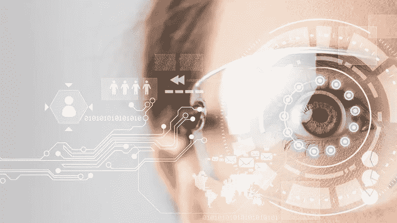
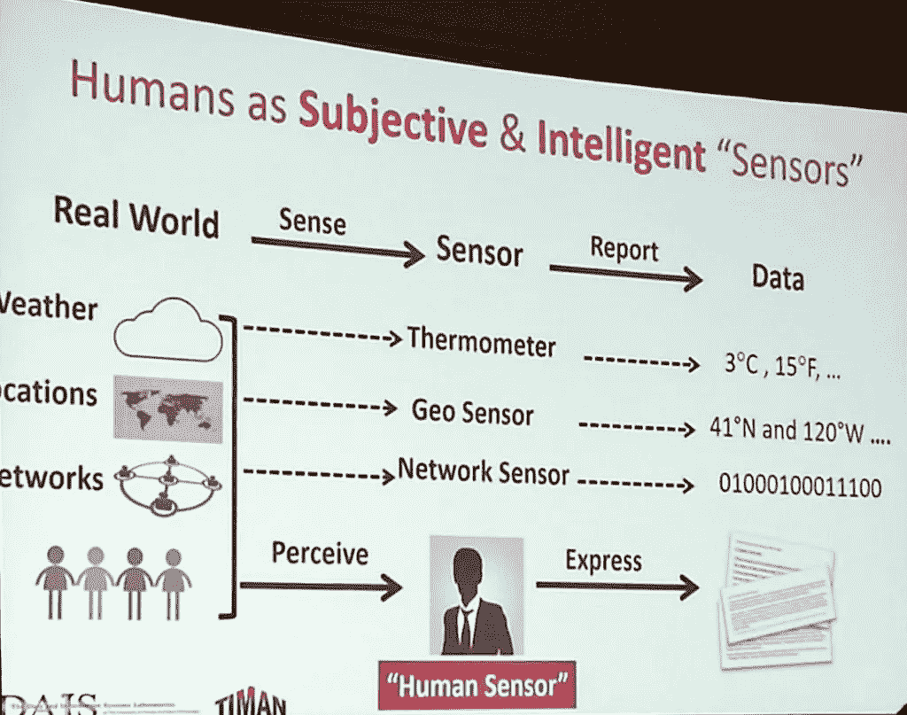
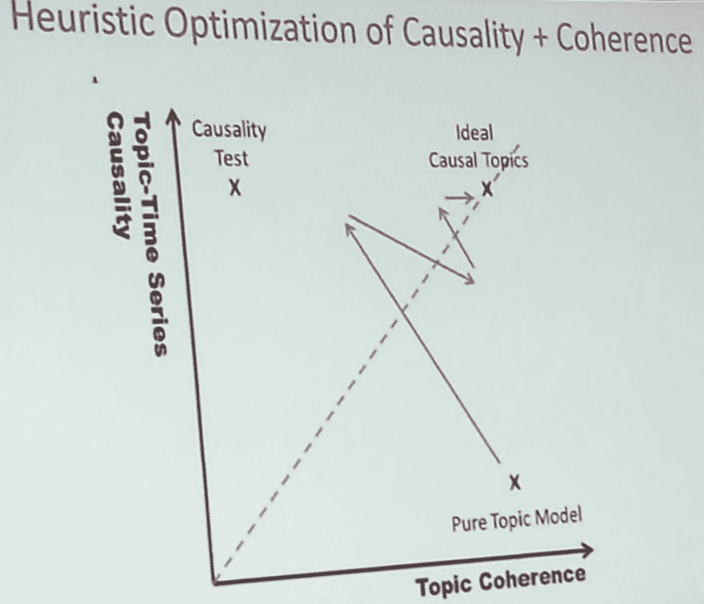
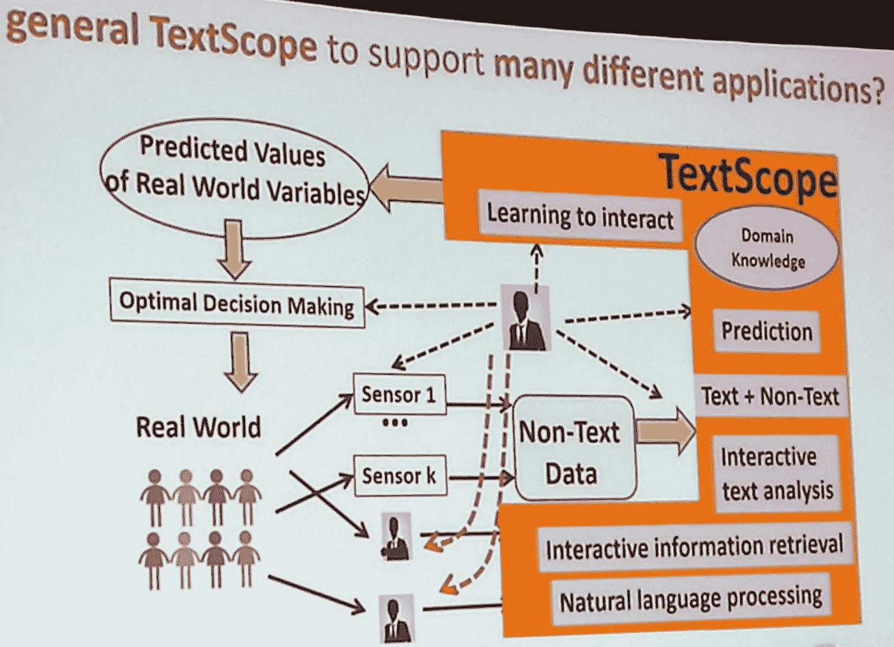

# 用 ML、AI、IR 和 NLP 增强人类感知

> 原文：<https://towardsdatascience.com/enhancing-human-perception-f5e6c82baf44?source=collection_archive---------3----------------------->

## 工作中的交互式文本挖掘和信息检索

文本数据仍然是大数据分析环境中最重要的来源之一。正如任何传感器都可以感知环境状态并报告收集的数据一样，人类也能够感知周围的世界，然后将他们的理解表达为文本数据。从某种意义上来说，人类实际上已经将输入数据转化为某种有价值的信息。因此，人类生成的文本内容已经超越了“原始数据”的层次。文本内容已经嵌入了对现实的阐述和感知。

我们可以挖掘这种文本信息的内容，并提取关于所观察的世界、关于观察者(人类)以及关于所使用的语言的知识。除此之外，通过预测分析，人们可以推断出现实世界的变量。此外，您还可以添加可用的全部上下文数据和元数据(例如，时间戳、地理位置等)。

然而，执行**真正的 NLP** (自然语言处理)是一项艰巨的任务。这里我们说的不是基本的文本处理，它已经成为一种普遍的做法。我们说的是真实文本理解。

那么，我们如何利用 ***不完美的 NLP*** 来生成 ***完美的应用*** ？简单:**让人类参与进来！**

正如你需要显微镜、望远镜或宏观镜，这取决于你想分析的真实世界，你需要一个**文本显微镜**来研究文本。这个工具必须是**一个结合了信息检索、文本挖掘、数据分析和** [**人在回路**](https://medium.com/off-the-grid-from-digital-to-physical-world-and/human-in-the-loop-machine-learning-9be3bc15c0f8) **技术**的智能交互式工具。

可以将几种技术结合起来:例如，实体提取、单词分类、将文本挖掘与时间序列上的因果分析(也包括非文本数据)相结合，等等。

在此图中，您可以看到优化因果关系(基于时间序列分析)和一致性(基于主题分析)的试探法

不幸的是，每个应用程序都需要对这种工具进行大量的定制和培训。我们需要**抽象和统一**来最小化覆盖不同领域和应用的学习努力。

这与我们对[社会知识提取](https://marco-brambilla.com/2017/04/06/extracting-emerging-knowledge-from-social-media-www2017/)的研究非常相关，它分析人类生成的内容，目的是生成新的形式化知识(例如，整合现有的知识库，如 DBpedia)。

这个故事的灵感来自于[伊利诺伊大学香槟分校(信息科学学院基因组生物学研究所统计系)ACM 研究员翟](http://czhai.cs.illinois.edu/)在[IEEE big data Conference 2017](http://cci.drexel.edu/bigdata/bigdata2017/)上的主题演讲。