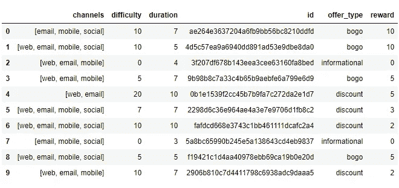
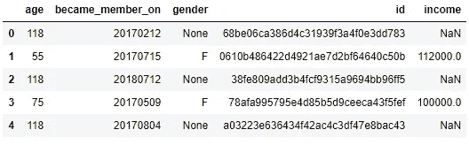
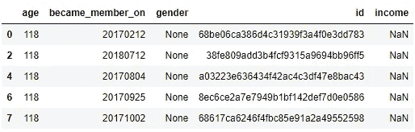
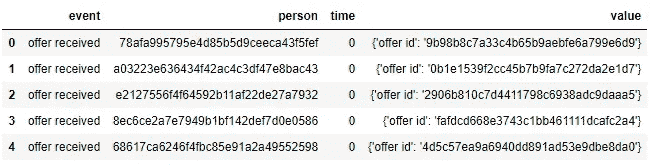

# 通过构建推荐引擎提升星巴克的顾客体验——第 1 部分

> 原文：<https://towardsdatascience.com/enhancing-starbucks-customer-experience-by-building-recommendation-engines-part-1-108ddd1d729?source=collection_archive---------20----------------------->

Photo by [Hans Vivek](https://unsplash.com/@rickyzden?utm_source=medium&utm_medium=referral) on [Unsplash](https://unsplash.com?utm_source=medium&utm_medium=referral)

# 介绍

星巴克已经成为全球主要的咖啡公司，在全球拥有超过 15000 家门店，包括公司所有和特许经营的门店。这家公司能够实现这一壮举的主要原因之一是坚持不懈地关注客户体验。

给其客户最大的便利是星巴克卡的推出，后来扩展到星巴克 App。它支持无现金支付，因此根据观察，客户在支付过程中的等待时间可以显著减少。此外，星巴克应用程序使顾客能够收到促销优惠，这些优惠强调顾客在星巴克购买商品时的利益最大化。

向客户进行促销的挑战在于，每个客户对他们收到的优惠都有不同的偏好。如果他们收到他们不喜欢的报价，他们很可能不会尝试完成报价，尽管所有报价都对他们有利。随着人工智能(AI)和机器学习(ML)的进步，星巴克解决这个问题已经成为可能。

# 项目概述

推荐引擎是可以用机器学习来实现的系统之一。它能够预测顾客喜欢什么，不喜欢什么。因此，该系统将推荐更有可能被顾客购买的商品，并随后提高星巴克的商店业绩，例如销售额或顾客购买的商品数量。

在这个项目中，我基于 3 个数据集创建了两个推荐引擎，这些数据集是模拟星巴克奖励移动应用程序上的客户行为的模拟数据。第一个数据集(portfolio.json)包含向客户提供的促销。它包含 id、类型、持续时间、渠道和报价奖励。

第二个数据集(profile.json)是关于星巴克顾客的人口统计资料。它包含用户的年龄、性别、收入、id，以及这些用户何时成为星巴克应用程序的成员。第三个数据集(transcripts.json)包含第二个数据集中星巴克客户的交易记录。它有事件，告诉我们要约是否被接收、查看或完成，以及事件何时完成。它还有用户 id 和值，这是一个报价 id 或交易金额的字典，具体取决于记录。

# 问题陈述

这里的挑战是用这 3 个数据集创建一个推荐引擎。它必须考虑用户在接收报价时的偏好，以及用户是否喜欢被给予报价。我解决这个问题的方法是创建两个推荐引擎。第一种是基于聚类，第二种是基于用户相似度。

创建推荐引擎所涉及的任务有:
1 .清理给定的数据集，因为它包含许多 NaN 值和几个错误。
2。探索和可视化数据，以获得人口统计资料以及客户购买行为的良好画面。
3。用于创建推荐引擎的工程特征。生成的特征是出价-购买行为的比率数据。
4。基于特征创建客户细分。这是使用 KMeans 集群完成的。
5。创建基于聚类的推荐引擎。这需要一个用户 id，将用户 id 映射到该用户所属的集群，并推荐集群成员喜欢的前 3 个报价。
6。基于用户相似度创建推荐引擎。这需要一个用户 id，搜索与该 id 相似的 10 个用户，并推荐这 10 个用户最喜欢的 top 3。

*如果你想看我用来创建这个推荐引擎的代码，点击这里的***。**

# *韵律学*

*衡量一个推荐引擎的有效性并不容易。星巴克总是可以做一段时间的 A/B 测试。星巴克必须在应用程序中分配 cookies，将用户分为 2 组，控制组和实验组。对照组不会得到这个推荐引擎，实验组会得到。然后，星巴克需要观察不变指标和评估指标的差异。*

***不变度量**
应该关注的不变度量有:
1。控制组和实验组的用户数量。这个至少应该差不多，接近五五开。
2。分配给每个组的 cookies 数量。*

***评价指标** 应该关注的评价指标有:
1。平均交易金额。如果实验组有较高的平均交易量，推荐引擎可以被认为是有用的。
2。完成出价的百分比。如果实验组具有较高的完成要约百分比，则推荐引擎可以被认为是有用的。
3。来自要约的交易与收到要约的比率。对实验组来说越高越好。
4。非来自要约的交易与收到的要约的比率。实验组越低越好。*

*在评估推荐引擎的有效性时应该考虑的另一种方法是离线方法。这些方法应在将发动机部署到实验组的最初几个月后**进行计算:***

1.  *精准。这是一个衡量指标，表示在已经提供的促销中，用户喜欢的数量。*
2.  *回忆一下。这是用户喜欢的推广优惠推荐给用户的比例。这两个指标应该最大化，因为它将告诉我们推荐引擎是否真正推荐了用户喜欢的项目，以及在推荐中，用户喜欢的促销报价的比例是多少。*

# *数据探索*

*给出的 3 个数据集不干净。除了投资组合数据，在数据准备好用于创建推荐引擎之前，还有许多任务要做。*

**

*Fig 1\. Portfolio Data*

*投资组合数据集非常简单。它包含促销渠道、难度、促销持续时间(天数)、优惠 id、优惠类型和完成促销的奖励。这里要打扫的东西不多，除了:
1。将渠道栏分为 4 个虚拟栏:网络、电子邮件、手机和社交。
2。创建一个字典，将 offer id 作为关键字和别名，以便简化以后 3 个数据集的合并。*

**

*Fig 2\. Profile Data*

*要清理这个数据集，需要做几件事情。我检测到的是:
1。有一对夫妇已经 118 岁了
2。有几个人在性别和收入栏中缺少数据。这是一个问题，因为没有完整的数据，我不能创建一个良好的客户细分。我输入这个数据帧的方法是使用随机森林回归器和随机森林分类器创建机器学习模型。*

**

*Fig 3\. Users with the Age of 118*

*从空值的数量和切片数据框的前几行判断，年龄为 118 岁的人没有记录性别和收入。这可能是因为注册问题或用户故意不填写栏。这使得为空值创建机器学习预测比我想象的要困难一些。*

**

*Fig 4\. Transactions Data*

*交易数据在用于创建客户细分或推荐引擎之前也包含许多问题。事件列应该根据记录的事件进行分隔，包含优惠 id、奖励或交易金额的值列也应该进行分隔。*

*基于数据的最初外观，我决定在清理数据之前不创建数据可视化。主要原因是为了避免在问题仍然存在的情况下给读者错误的数据描述。*

# *续第 2 部分*

*创建这一部分是为了让读者对数据有一个印象。第 2 部分将大量讨论这个项目的数据清理和特性工程阶段。如果有兴趣，请按照这个 [**链接**](https://medium.com/@agustinus.thehub/enhancing-starbucks-customer-experience-by-building-recommendation-engines-part-2-7703cf332767) 。*