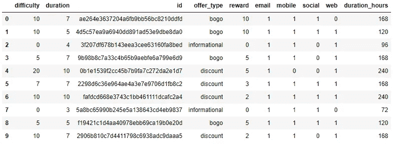
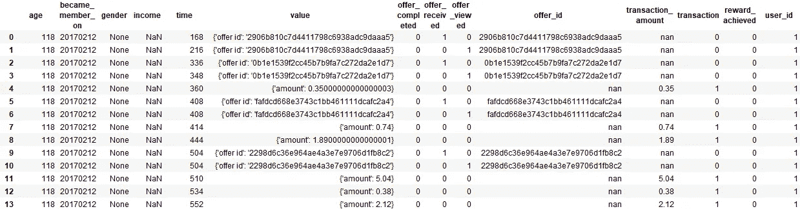
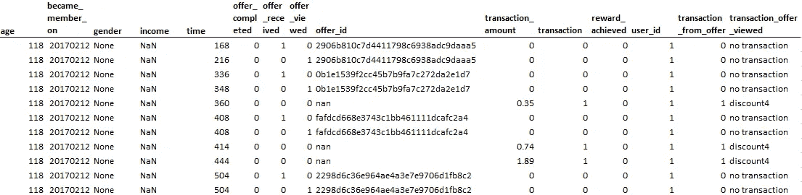
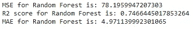
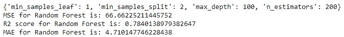
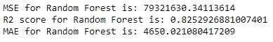
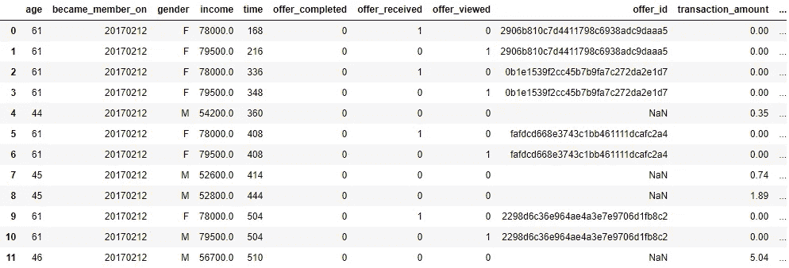
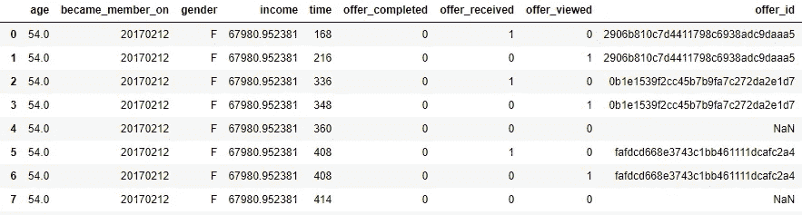
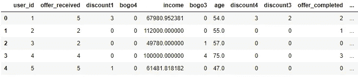
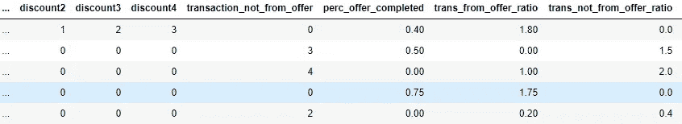

# 通过建立推荐引擎提升星巴克的顾客体验——第二部分

> 原文：<https://towardsdatascience.com/enhancing-starbucks-customer-experience-by-building-recommendation-engines-part-2-7703cf332767?source=collection_archive---------25----------------------->

Photo by [quan le](https://unsplash.com/@quanle2819?utm_source=medium&utm_medium=referral) on [Unsplash](https://unsplash.com?utm_source=medium&utm_medium=referral)

本系列的第二部分将关注项目的数据清理和特性工程方面。如果你还没有看过这个项目的介绍部分，我强烈建议你跟着这个 [**链接**](https://medium.com/@agustinus.thehub/enhancing-starbucks-customer-experience-by-building-recommendation-engines-part-1-108ddd1d729) 读一读，让你对我在做的事情有一个更清晰的了解。

*点击这里的***，你可以看到我用来清理数据的代码。**

# *数据清理*

*本项目中数据清理的目的是为数据探索和可视化提供更清晰的信息。它还使我能够为星巴克应用程序的用户创建客户细分，然后基于聚类构建推荐引擎。*

*我清理的第一个数据是投资组合数据，因为它是最快的。使用来自 pandas 的 get_dummies 和 stack 方法，我在数据框中添加了几列以使其更加清晰。我还通过将 duration 列乘以 24 来创建 duration hours 列，duration 列是特定报价的持续天数。生成的数据帧如下:*

**

*Fig 1\. Cleaned Portfolio Data Frame*

*清理另外两个数据帧有点困难。我做的第一件事是合并个人资料和交易数据。然后，我为 event 列创建了 3 个虚拟变量，根据发生的事件，它们的值分别为 1 和 0。*

*接下来，我将 value 列分成 4 个新列。第一个是要约 id。这告诉我们用户在特定时间收到、查看或完成了哪个报价。当用户进行交易而不是接收、查看或完成要约时，该列的值为 NaN，而不是要约 id。第二栏是交易金额。当用户进行交易时，该列保存交易的金额。否则，它包含 NaN 的值。我创建的第三列是事务列。根据用户是否进行了交易，该列的二进制值为 1 或 0。最后一个是奖励成就栏。如果用户完成了交易，则该列保存通过完成报价获得的奖励金额。*

*在创建了这 4 列之后，我决定将 person 列映射到 user id，以便简化以后将 user id 输入到推荐引擎的过程。生成的数据帧的前几行如下:*

**

*Fig 2\. Cleaned Combination of Profile and Transactions Data Frame*

*这些数据的一个主要问题是，它没有告诉我们交易是否是因为报价而发生的。如果是，哪一个报价导致了交易？为了回答这个问题，我创建了两个专栏。第一个是来自要约的交易，根据交易是由要约引起的(1)还是由要约引起的(0)来保存值 1 或 0。第二个是已查看的交易报价，其中包含导致交易的报价 id，或者如果在此期间没有交易或者交易不是由特定报价导致的，则为“无交易”。*

*我基于这些机制创建了这两个专栏:
1。如果发生交易，我会检查它是否是由报价引起的。
2。我假设，如果一个用户查看了一个优惠，然后做了一笔交易，甚至几笔交易(以实现促销目标)，那么这些交易就是由该优惠引起的。
3。要检查交易是否是由查看的报价引起的，我需要检查报价是否在交易时间和报价的最大持续时间内被查看。然后，我查看第一次出现的报价，并将其指定为导致交易的报价。逻辑是，如果用户首先查看交易，如果报价仍在时限内，他们会尝试完成报价。尽管该用户可能会收到另一个报价，但他会尝试完成查看的第一个报价。
我还使用之前创建的字典将优惠 id 映射到优惠别名。生成的数据帧的前几行如下:*

**

*Fig 3\. Data Frame with Transaction from Offer and Transaction Offer Viewed*

*完成此操作后，我将结果数据框与投资组合数据框合并，以创建一个主数据框。之后，我继续清理数据框，为没有输入性别、收入和正确年龄的用户创建年龄、性别和收入列的预测。*

# *预测年龄、性别和收入*

*在预测这些列的值时，我做的第一步是将主数据帧分成两个数据帧。这很容易做到，因为填错年龄的用户也没有填写性别和收入栏。因此，很容易将数据框划分为用于创建模型的数据框和用于预测值的数据框。*

*接下来，我从预测年龄开始。我使用随机森林回归器创建了一个预测模型。预测变量(X)是模型创建数据框中的列，除了“性别”、“收入”、“时间”、“报价类型”、“报价 id”、“交易报价查看”、“年龄”、“报酬实现”。目标变量(Y)是“年龄”。我得到的结果是:*

**

*Fig 4\. Random Forest Regression for Age Result*

*结果不太好。因此，我利用 scikit-learn 的网格搜索 CV 创建了一个更好的模型。结果如下:*

**

*Fig 5\. Random Forest Regression with Grid Search CV for Age Result*

*我意识到模型改进了，虽然改进没那么多。我应该可以调整更多的超参数。然而，由于时间限制，我选择使用这个模型来预测用户的年龄。之后，我再次使用随机森林回归器创建了一个收入预测。结果是:*

**

*Fig 6\. Random Forest Regression for Income Result*

*这个模型比年龄预测模型要好，尽管还远远不够。我决定也使用这个模型，并在未来对其进行微调，以创建更好的预测。预测的最后一栏是性别。我使用随机森林分类器来创建预测模型，平均 f1 值“微观”为 0.831。*

*我用这些模型来预测没有填写或填写错误的人的年龄、收入和性别。然而，我注意到一些预测是错误的。*

**

*Fig 7\. Data Frame with Age, Gender, and Income Already Predicted*

*图 7 是用户 id 为 1 的数据帧的前几行。年龄、性别和收入是不同的，这意味着模型没有做出很好的预测。例如，用户 1 的年龄被预测为 61、44、45 或 46 岁。性别预测为 F 和 m。这是正常的，因为每个用户在查看、接收和完成要约以及进行交易时的列值是不同的。*

*为了解决这个问题，我创建了更多的计算:*

1.  *平均年龄值，以获得每个用户的预测年龄*
2.  *收入值的平均值，以获得每个用户的预测收入*
3.  *性别值模式，以获得每个用户的预测性别*

**

*Fig 7\. Data Frame for User ID 1 After Adjustment*

*从用户 1 的年龄、性别和收入都相同的意义上来说，生成的数据框看起来比前一个更好。*

# *特征工程*

*酒店业的大多数企业依靠比率数据来评估他们的业绩。例如，餐馆更喜欢使用促销完成率和促销成本，而不是仅使用促销完成数。因此，我为数据框中的每个用户创建了这些比率数据。*

*然而，在设计这些特性之前，我注意到交易报价视图列有一些不正确的值。无论用户没有进行交易还是用户进行了非要约交易，值“无交易”都是相同的。因此，我决定更改值。如果事务列的值为 1，我将“无事务”更改为“事务 _ 非 _ 来自 _ 报价”。*

*在区分非要约交易和无交易后，我为“transaction_offer_viewed”列中的每个值创建了虚拟变量，根据用户执行的交易类型，这些变量的值为 1 或 0。使用这些专栏，我创建了一个用户人口统计和购买行为的数据框架。*

*该数据框架由 21 列组成，包含用户人口统计资料(年龄、收入、性别)和用户促销购买行为。例如，列“bogo1”是用户从星巴克应用程序查看“bogo1”促销后完成的交易数量。以下是数据框中的前几行和前几列:*

**

*Fig 8\. User Demographic and Promotion Purchase Behavior Data Frame*

*使用这个数据框，我创建了 3 个比率数据作为特征。第一个是完成要约的百分比，即完成要约与收到要约的比率。第二个是来自出价比率的交易。这是来自要约的交易和收到的要约之间的比率。最后，我创造了交易，而不是从出价比率。顾名思义，这是不是来自要约的交易和收到的要约之间的比率。我决定使用收到的报价而不是查看的报价作为分母，因为发送报价的“成本”需要考虑，尽管它可能不是金钱的形式。可能是时间或带宽。因此，我认为使用收到的报价作为比率数据的分母是合适的。*

**

*Fig 9\. The Snapshot of The Ratio Data Features*

*我做的最后一件事是用 0 填充数据帧中的 NaN 值，用 999 填充 inf 值。理由是，NaN 值源自比率数据，其分子值为 0，分母值为 0。例如，完成要约百分比的 NaN 值源自未完成要约且未收到要约的用户。因此，用 0 填充它是合适的。*

*至于 inf 值，它出现在交易中，而不是来自出价比率。例如，一个有 3 笔交易并收到 0 个报价的用户将产生 inf 值。因此，我分配了一个大值(999)来替换 inf 值。我相信这也是合适的，因为它代表了一个没有看到报价就进行交易的用户。*

# *续第 3 部分*

*这一部分是为了让读者了解我是如何为这个项目进行数据清理的。下一部分将重点关注用户人口统计的数据可视化，并提供购买行为。如果你有兴趣，请跟随这个 [**链接**](https://medium.com/@agustinus.thehub/enhancing-starbucks-customer-experience-by-building-recommendation-engines-part-3-45100f085daf) 。*

**如果你有建议或批评，请不要犹豫，发表意见。我仍然是，并将永远是这个领域的学生。如果你有任何问题或想知道我对你的项目的看法，请随时联系我。**