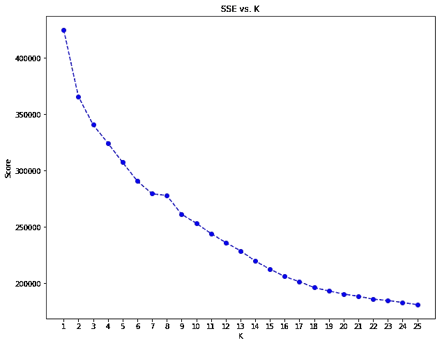
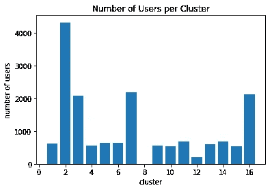
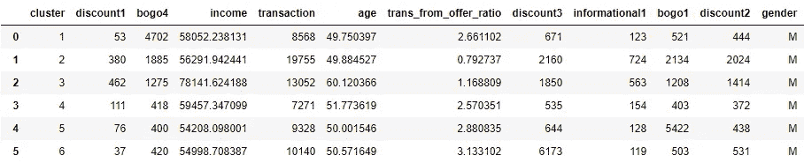
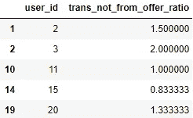
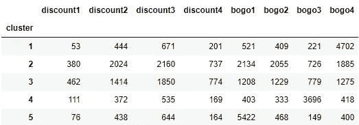
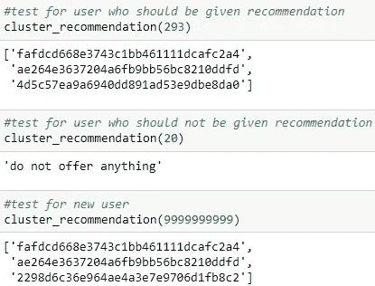
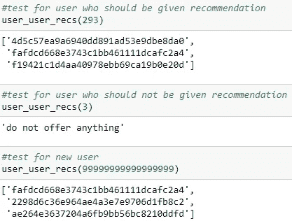

# 通过建立推荐引擎提升星巴克的顾客体验——第四部分

> 原文：<https://towardsdatascience.com/enhancing-starbucks-customer-experience-by-building-recommendation-engines-part-4-f67b9a45fc19?source=collection_archive---------23----------------------->

Photo by [Charles Koh](https://unsplash.com/@charles?utm_source=medium&utm_medium=referral) on [Unsplash](https://unsplash.com?utm_source=medium&utm_medium=referral)

本系列的第四部分重点介绍该项目的机器学习部分，即聚类和构建推荐引擎。如果你还没有看过这个项目的介绍部分，我强烈建议你跟着这个 [**链接**](https://medium.com/@agustinus.thehub/enhancing-starbucks-customer-experience-by-building-recommendation-engines-part-1-108ddd1d729) 读一读，让你对我在做的事情有一个更清晰的认识。

*点击这里* *这个链接* [*可以看到我用来清理数据的代码。*](https://github.com/nugroho1234/starbucks-project)

# 使聚集

在掌握了星巴克顾客的人口统计数据之后，我使用 KMeans 进行了聚类，将人口统计数据分成几个组。

**方法论** 在做聚类之前，我用标准的定标器来定标数据。这是必要的，因为有些列有很大的值，而有些列只有 0 和 1。换句话说，聚类中使用的每个特征的方差都有很大的差异。维护原始数据会导致方差较小的变量具有更大的权重。因此，产生的聚类将沿着具有更大方差的变量被分开。

**实现**
选择多少个簇(k)的方法我用的是肘法。我选择查看几个集群，从 1 到集群中使用的变量数量，并对每个数量执行 KMeans 集群。然后，我计算了每个 k 的误差平方和(SSE)分数，并将分数附加到一个列表中。后来，我创建了一个线图来查看肘部，并选择它作为进一步分析中使用的聚类数。

Fig 1\. SSE vs K on KMeans Clustering

在 KMeans 的结果中没有明显的拐点，除了 SSE 从第 7 类到第 16 类稍微大幅度的减少。因此，我决定用 16 个聚类来拟合和预测哪个用户属于哪个聚类。我创建了一个可视化工具来绘制每个集群的用户数量，如下所示:

Fig 2\. The Number of Users per Cluster

从图 2 中可以看出，每个集群的用户数量的分布变化很大。例如，属于集群 2 的用户超过 4000 个，属于集群 8 的用户不到 10 个。这可能影响推荐引擎的质量，因为大多数用户将被映射到集群 2、3、7 或 16。

接下来，我根据聚类对用户人口统计数据框进行分组。我最终得到了聚类数据框。这是数据框的前几行和前几列的快照。如果你想看完整的数据帧，请查看我的 github。

Fig 3\. The Cluster Data Frame

**描述第 3 集群** 1。第一个群体是年龄在 49 岁左右、收入在 58052 美元左右的男性客户。比起其他类型的报价，他们更喜欢 bogo4。收到报价后，他们会进行大约 2-3 笔交易。他们也做适度交易，而不是从收到的报价开始，这表明他们确实喜欢在星巴克喝咖啡。
2。第二个群体也是年龄在 49 岁左右、收入在 56291 美元左右的男性客户。比起其他类型的优惠，他们更喜欢打折。收到报价后，他们只做 1 笔左右的交易。然而，他们确实在星巴克购物，尽管他们没有收到任何报价。我认为，这些客户并不真正忠诚。他们想什么时候买咖啡就什么时候买，而且他们更喜欢打折。
3。第三个群体是年龄在 60 岁左右、收入在 78141 美元左右的男性顾客。比起其他类型的报价，他们更倾向于 bogo1。收到报价后，他们会进行大约 2-3 次交易，尽管他们没有收到报价，他们也会购买咖啡。这个集群类似于第一个集群，只是他们的收入更高。

# 基于聚类的推荐引擎

在对客户进行细分后，我创建了第一个推荐引擎，它是基于集群的推荐引擎。本质上，该引擎将依赖于之前创建的集群，并且基于将被给予推荐的用户所属的集群中的用户的喜好来创建推荐。

**方法论** 在创建推荐引擎之前，我必须考虑几件事情，它们是:
1。哪些用户不喜欢被给予优惠。
2。创建集群促销矩阵。
3。检查用户属于哪个集群。
4。推荐该用户所属集群喜欢的前 3 个优惠，并获取这些优惠 id 的列表。
5。如果用户属于不喜欢被提升的用户群，我不会给任何推荐。
6。如果用户是新的，我会给所有用户最喜欢的前 3 名。

**实现** 我创建了一个数据帧，包含用户 id 和交易非来自报价比率，以找出哪些用户不喜欢被给予报价。如果比率大于所有比率的平均值，我会认为用户是不喜欢优惠或促销的用户。

Fig 4\. The ‘Offer or Not’ Data Frame

之后，我创建了一个集群提升矩阵的数据框架。我使用的变量只有折扣和买一送一变量。我决定不包含信息变量，因为无论如何，信息应该提供给每个用户。生成的数据帧的前几行如下:

Fig 5\. Cluster-promotion Matrix

我使用这个数据框架和“提供或不提供”数据框架来创建推荐引擎。我创建了一个函数，它执行以下操作:
1。获取用户 id
2 的输入。如果用户 id 在“提供或不提供”数据框中，不要推荐任何东西。
3。如果用户 id 不在“提供或不提供”数据框中，请检查该用户属于哪个集群。
4。使用集群促销矩阵，推荐集群中用户最喜欢的前 3 个产品。
5。将优惠别名转换为原始优惠 id。

Fig 6\. Recommendation Result

推荐引擎设法推荐与用户 293 在同一集群中的用户喜欢的前 3 个提议。至于用户 20，由于该用户属于“提供或不提供”数据框，所以引擎不推荐任何东西。新用户将得到如图 6 所示的 3 个报价。

**细化**
总而言之，这个推荐引擎做了我想做的事情。然而，我确实有一个问题。如上所述，集群包含不同数量的用户。因此，大多数用户仅被放在 4 个集群中。这可能会导致推荐引擎给出不太个性化的报价。因此，我决定创建一个基于用户的推荐引擎。

# 基于用户的推荐引擎

我心目中的基于用户的推荐引擎更加个性化。基本上，该引擎依赖于在用户推广矩阵中找到相似的用户，并根据这些相似的用户最喜欢的优惠提供推荐。

**方法论** 创建基于用户的推荐引擎的方法论与基于聚类的推荐引擎非常相似。我不得不考虑几件事。哪些用户不喜欢被给予优惠。
2。创建用户推广矩阵。
3。检查与要推荐的用户 id 最相似的前 10 名用户。
4。推荐 10 个最相似的用户最喜欢的前 3 个优惠。
5。如果用户属于不喜欢被提升的用户列表，我不会给任何推荐。
6。如果用户是新的，我会给所有用户最喜欢的前 3 名。

**实施** 我仍然使用“提供或不提供”数据框架来找出哪些用户不喜欢被提供服务。因此，我没有为此创建新的数据框。我做的第一件事是创建用户推广矩阵。我使用了用户统计数据框架，以用户 id 作为索引，以折扣和买一送一作为变量。

Fig 7\. User-promotion Matrix

我用这个来计算每个用户之间的相似度。我使用的方法是计算要给出推荐的用户 id 的相应行的转置矩阵和用户矩阵数据帧的转置矩阵之间的点积。通过对用户相似度列表+ 1 的负值执行 argsort 来获得最相似的用户。最后要做的事情是从列表中删除用户 id。

为了创建推荐引擎，我创建了一个函数，它执行以下操作:
1。获取用户 id
2 的输入。如果用户 id 在“提供或不提供”数据框中，不要推荐任何东西。
3。如果用户 id 不在“提供或不提供”数据框中，则查找与该用户 id 最相似的 10 个用户。
4。使用用户推广矩阵，推荐 10 个最相似的用户最喜欢的前 3 个产品。
5。将优惠别名转换为原始优惠 id。

Fig 8\. User-based Recommendation Result

与之前的推荐引擎相比，基于用户的推荐引擎为用户 id 293 创建了略有不同的推荐。其中两项建议是相同的。对于用户 id 3，引擎不推荐任何内容，因为该用户属于“提供或不提供”数据框架。对于新用户，该算法产生的结果与它是同一算法产生的结果相同。

# 评估和验证

两个推荐引擎都成功地实现了我想要的结果:

1.  它识别哪些用户不应该被给予优惠
2.  它根据相似用户/集群的偏好推荐报价
3.  它为新用户推荐最受欢迎的产品。

评估推荐引擎不是一件容易的事情。星巴克必须花费一定的时间对这些系统进行 A/B 测试。这些指标已经在本文的引言部分提到过了(**第 1 部分**)。然而，在组的数量上有微小的变化。星巴克应该有 3 组，1 个对照组和 2 个实验组来测试这些推荐引擎。

**Justification** 个人认为基于用户的推荐引擎比基于聚类的好。它更加个性化和多样化，因为我们可以决定我们想要使用多少类似的用户。此外，正如我在上面提到的，每个集群中的用户数量是相当不同的。最大数量在 4000 以上，最小数量只有 8 个。这将影响基于集群的推荐引擎，因为集群中的用户越多，偏好的方差就越高。

# 结论

**反射**
给定的数据集确实很难，从这个意义上说，数据集中只有基本的特征。大多数时候，酒店行业的企业倾向于依赖比率作为衡量标准，所以我必须用这些数据集创建这些比率数据。然而，这并不是最困难的部分。

这个项目最困难的部分是清理数据，特别是输入年龄、性别和收入。我可以使用统计数据估算这些变量，如年龄均值、性别模式和收入均值/中值。但是，结果会不太准确。当我决定为这个项目创建一个推荐引擎时，我意识到获得最准确的数据是至关重要的，尤其是对于集群部分。因此，我决定使用机器学习来估算缺失/错误的值。这对我来说并不容易，尤其是因为我必须确定插补的顺序。我决定先用 R2 分数高的那个。

输入数据后，创建推荐引擎的过程并不困难。然而，推荐引擎的问题是，它应该在现实生活中进行测试，看看它是否工作得很好。我将需要进一步学习，以深化我在机器学习和推荐引擎方面的知识，以确保我可以构建出色的性能模型。

**改进**
可以做几个改进来构建更好的推荐引擎。其中一些是:

1.  建立一个更好的随机森林模型来预测年龄、性别和收入。R2 分数不够高，MSE 分数也不够低。如果我有更多的时间，我可以调整超参数，或者尝试使用其他算法，如 Ada Boost，甚至神经网络。
2.  建立一个更好的推荐引擎，将促销信息分为明星、主力、谜题和狗。我会用菜单工程的概念，实施分类推广。明星促销将是那些低成本和高交易量产生。主力将是那些成本高、交易量大的公司。难题将是那些成本低，但产生的交易量低。狗将是那些具有高成本和低交易量的狗。通过这样做，我们可以一直推广明星或益智推广，调整主力推广以及摆脱狗推广。当然，我需要额外的数据来做到这一点。

*如果您有建议或批评，请不吝赐教。我仍然是，并将永远是这个领域的学生。如果你有任何问题或想知道我对你的项目的看法，请随时联系我。*