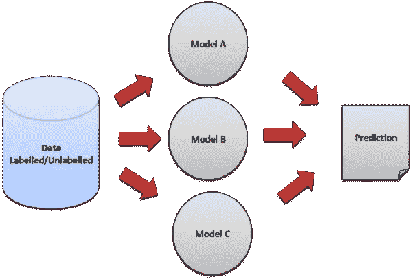
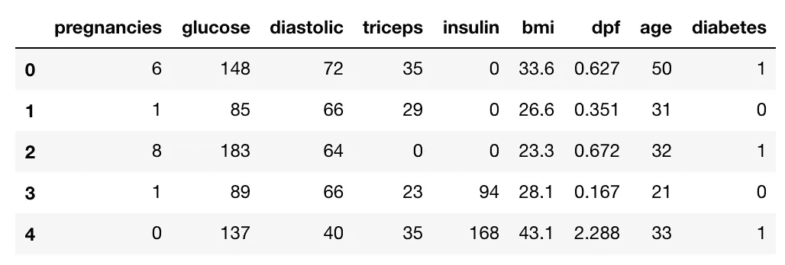
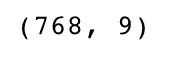
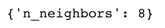
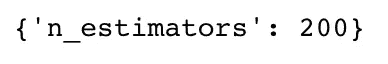
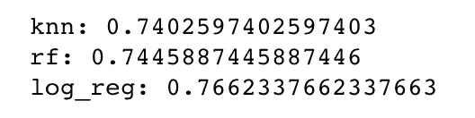
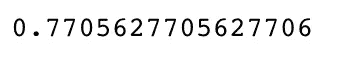

# 使用 Scikit-learn 构建集成学习模型

> 原文：<https://towardsdatascience.com/ensemble-learning-using-scikit-learn-85c4531ff86a?source=collection_archive---------3----------------------->



Ensemble Learning ([image credit](https://hub.packtpub.com/what-is-ensemble-learning/))

集成学习使用多个机器学习模型来尝试对数据集进行更好的预测。集成模型的工作原理是在数据集上训练不同的模型，并让每个模型单独进行预测。这些模型的预测然后在集合模型中组合，以做出最终预测。

每种模式都有其优点和缺点。集成模型可以通过组合单个模型来帮助隐藏单个模型的弱点。

在本教程中，我们将使用投票分类器，其中集成模型通过多数投票进行预测。例如，如果我们使用三个模型，并且它们预测目标变量为[1，0，1]，集合模型做出的最终预测将是 1，因为三个模型中的两个预测为 1。

我们将使用三种不同的模型来输入我们的投票分类器:k-最近邻、随机森林和逻辑回归。我们将使用 Python 中的 Scikit-learn 库来实现这些方法，并在我们的示例中使用糖尿病数据集。

注:集合模型也可用于回归问题，其中集合模型将使用不同模型的平均输出或加权平均值进行最终预测。

## 读入训练数据

第一步是读入我们将用作输入的数据。对于这个例子，我们使用糖尿病数据集。首先，我们将使用 Pandas 库读入数据。

```
import pandas as pd#read in the dataset
df = pd.read_csv(‘data/diabetes_data.csv’)#take a look at the data
df.head()
```



接下来，我们来看看我们有多少数据。我们将在数据帧上调用“shape”函数，查看数据中有多少行和多少列。行表示患者的数量，列表示特征(年龄、体重等)的数量。)在每个患者的数据集中。

```
#check dataset size
df.shape
```



## 将数据集分成输入和目标

现在让我们把数据集分成输入(X)和目标(y)。我们的输入将是除“糖尿病”之外的每一列，因为“糖尿病”是我们将试图预测的。因此，“糖尿病”将是我们的目标。

我们将使用 pandas 的‘drop’函数从数据帧中删除列‘diabetes ’,并将其存储在变量‘X’中。

```
#split data into inputs and targets
X = df.drop(columns = [‘diabetes’])
y = df[‘diabetes’]
```

## 将数据集拆分为训练和测试数据

现在，我们将数据集分为训练数据和测试数据。训练数据是模型将从中学习的数据。测试数据是我们将用来查看模型在看不见的数据上表现如何的数据。

Scikit-learn 有一个我们可以使用的名为“train_test_split”的函数，它使我们可以很容易地将数据集分成训练和测试数据。

```
from sklearn.model_selection import train_test_split#split data into train and test sets
X_train, X_test, y_train, y_test = train_test_split(X, y, test_size=0.3, stratify=y)
```

“train_test_split”接受 5 个参数。前两个参数是我们之前分开的输入和目标数据。接下来，我们将“测试大小”设置为 0.3。这意味着所有数据的 30%将用于测试，剩下 70%的数据作为模型学习的训练数据。

将“分层”设置为 y 会使我们的训练分割表示 y 变量中每个值的比例。例如，在我们的数据集中，如果 25%的患者患有糖尿病，75%的患者没有糖尿病，将“分层”设置为 y 将确保随机拆分有 25%的糖尿病患者和 75%的非糖尿病患者。

## 构建模型

接下来，我们必须建立我们的模型。我们建立的每个模型都有一组我们可以调整的超参数。调整参数是指通过一个过程来为您的模型找到最佳参数以提高准确性。我们将使用网格搜索来寻找每个模型的最佳超参数。

网格搜索通过在我们指定的参数范围内多次训练我们的模型来工作。这样，我们可以用每个超参数值测试我们的模型，并找出最佳值以获得最佳精度结果。

## k-最近邻

我们将建立的第一个模型是 k-最近邻(k-NN)。k-NN 模型通过获取一个数据点并查看“k”个最接近的标记数据点来工作。然后，给数据点分配“k”个最接近点中大多数的标签。

例如，如果 k = 5，3 个点为“绿色”，2 个点为“红色”，那么所讨论的数据点将被标记为“绿色”，因为“绿色”占大多数(如上图所示)。

代码如下:

```
import numpy as np
from sklearn.model_selection import GridSearchCV
from sklearn.neighbors import KNeighborsClassifier#create new a knn model
knn = KNeighborsClassifier()#create a dictionary of all values we want to test for n_neighbors
params_knn = {‘n_neighbors’: np.arange(1, 25)}#use gridsearch to test all values for n_neighbors
knn_gs = GridSearchCV(knn, params_knn, cv=5)#fit model to training data
knn_gs.fit(X_train, y_train)
```

首先，我们将创建一个新的 k-NN 分类器。接下来，我们需要创建一个字典来存储我们将为‘n _ neighbors’测试的所有值，这是我们需要调优的超参数。我们将测试“n_neighbors”的 24 个不同值。然后，我们将创建我们的网格搜索，输入我们的 k-NN 分类器、我们的超参数集和我们的交叉验证值。

交叉验证是指数据集被随机分成“k”个组。其中一组用作测试集，其余的用作训练集。该模型在训练集上被训练，并在测试集上被评分。然后重复该过程，直到每个唯一的组都被用作测试集。

在我们的例子中，我们使用 5 重交叉验证。数据集被分成 5 组，模型被训练和测试 5 次，因此每组都有机会成为测试集。这就是我们将如何对使用每个超参数值运行的模型进行评分，以查看“n_neighbors”的哪个值给了我们最好的分数。

然后，我们将使用“适合”功能来运行网格搜索。

现在，我们将使用“best_estimator_”函数将最佳 k-NN 模型保存到“knn_best”中，并检查“n_neighbors”的最佳值。

```
#save best model
knn_best = knn_gs.best_estimator_#check best n_neigbors value
print(knn_gs.best_params_)
```



对于接下来的两个模型，我将不再赘述，因为有些部分重复了 k-NN 模型的构建。

## 随机森林

我们要建立的下一个模型是一个随机森林。随机森林本身被认为是一个集合模型，因为它是一组决策树的集合，这些决策树组合在一起形成一个更精确的模型。

代码如下:

```
from sklearn.ensemble import RandomForestClassifier#create a new random forest classifier
rf = RandomForestClassifier()#create a dictionary of all values we want to test for n_estimators
params_rf = {‘n_estimators’: [50, 100, 200]}#use gridsearch to test all values for n_estimators
rf_gs = GridSearchCV(rf, params_rf, cv=5)#fit model to training data
rf_gs.fit(X_train, y_train)
```

我们将创建一个新的随机森林分类器，并设置我们想要调整的超参数。“n_estimators”是我们的随机森林中的树的数量。然后，我们可以运行网格搜索来找到最佳数量的树。

就像之前一样，我们将保存我们的最佳模型并打印最佳的“n_estimators”值。

```
#save best model
rf_best = rf_gs.best_estimator_#check best n_estimators value
print(rf_gs.best_params_)
```



## 逻辑回归

我们的最后一个模型是逻辑回归。即使它的名字中有“回归”，逻辑回归也是一种分类方法。这个更简单，因为我们不会调优任何超参数。我们只需要创建和训练模型。

```
from sklearn.linear_model import LogisticRegression#create a new logistic regression model
log_reg = LogisticRegression()#fit the model to the training data
log_reg.fit(X_train, y_train)
```

现在，让我们检查所有三个模型在测试数据上的准确性分数。

```
#test the three models with the test data and print their accuracy scoresprint(‘knn: {}’.format(knn_best.score(X_test, y_test)))
print(‘rf: {}’.format(rf_best.score(X_test, y_test)))
print(‘log_reg: {}’.format(log_reg.score(X_test, y_test)))
```



从输出可以看出，逻辑回归是三者中最准确的。

## 投票分类器

现在我们已经建立了三个独立的模型，是时候建立我们的投票分类器了。

代码如下:

```
from sklearn.ensemble import VotingClassifier#create a dictionary of our models
estimators=[(‘knn’, knn_best), (‘rf’, rf_best), (‘log_reg’, log_reg)]#create our voting classifier, inputting our models
ensemble = VotingClassifier(estimators, voting=’hard’)
```

首先，让我们把我们的三个模型放在一个叫做“估值器”的数组中。接下来，我们将创建投票分类器。它需要两个输入。第一个是我们三个模型的估计数组。我们将投票参数设置为 hard，这告诉我们的分类器通过多数投票进行预测。

现在，我们可以将我们的集成模型拟合到我们的训练数据中，并根据我们的测试数据对其进行评分。

```
#fit model to training data
ensemble.fit(X_train, y_train)#test our model on the test data
ensemble.score(X_test, y_test)
```



厉害！我们的集成模型比单独的 k-NN、随机森林和逻辑回归模型表现得更好！

就是这样！您现在已经构建了一个集合模型来组合各个模型！

感谢阅读！本教程的 GitHub 库(jupyter 笔记本和数据集)可以在[这里](https://github.com/eijaz1/Ensemble-learning-tutorial)找到。

如果你想了解我的机器学习内容，请关注我:)