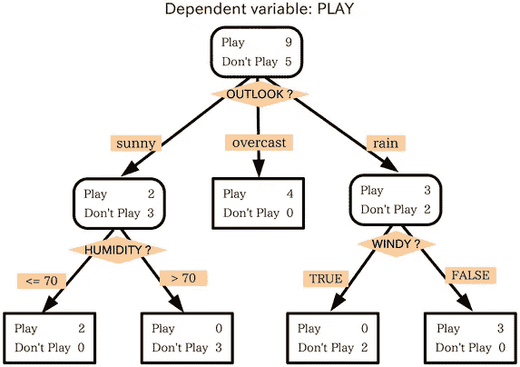
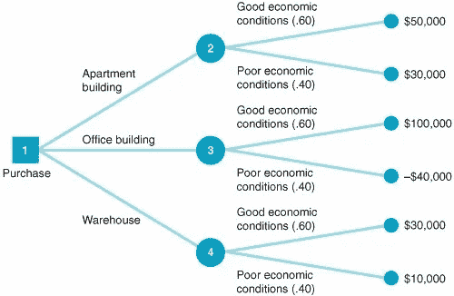
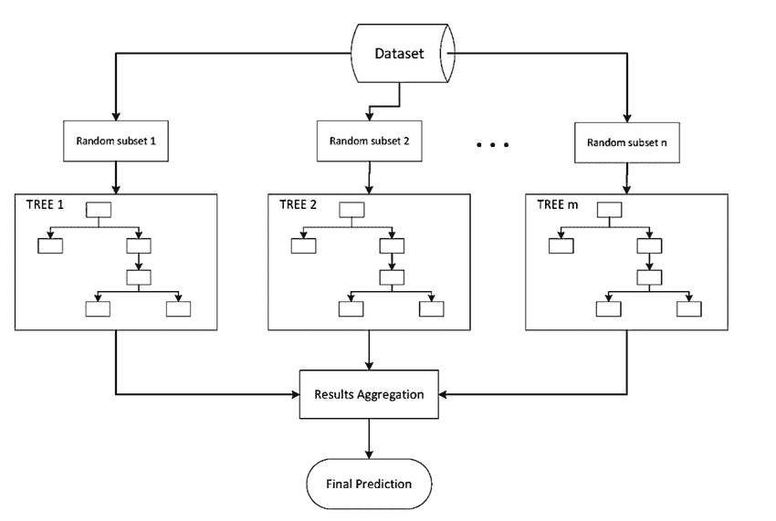
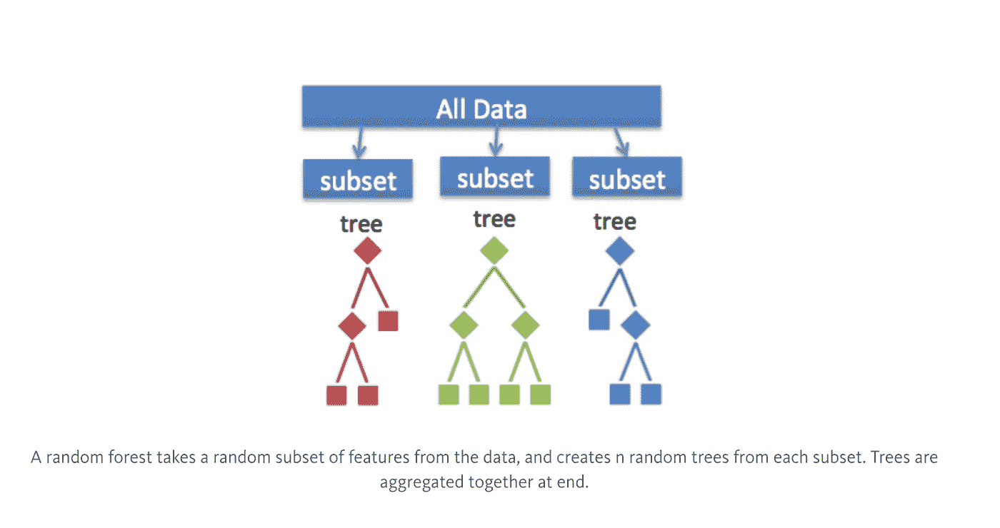

# 机器学习中的集成方法:它们是什么，为什么使用它们？

> 原文：<https://towardsdatascience.com/ensemble-methods-in-machine-learning-what-are-they-and-why-use-them-68ec3f9fef5f?source=collection_archive---------0----------------------->

合奏方法，它们是什么？**集成方法**是一种机器学习技术，它结合了几个基本模型，以产生一个最佳预测模型。为了更好地理解这个定义，让我们回到机器学习和模型构建的最终目标。随着我深入到具体的例子和为什么使用系综方法，这将变得更有意义。

我将主要利用决策树来概述集成方法的定义和实用性(然而，重要的是要注意，集成方法不仅仅适用于决策树)。

决策树基于一系列问题和条件来确定预测值。例如，这个简单的决策树决定了一个人是否应该在户外活动。该树考虑了几个天气因素，给定每个因素要么做出决定，要么提出另一个问题。在这个例子里，每次阴天的时候，我们都会在外面玩。但是，如果下雨了，一定要问有没有风？如果刮风，我们就不玩了。但是如果没有风，把鞋带系紧，因为我们要出去玩。

决策树也可以用同样的格式解决定量问题。在左边的树中，我们想知道是否投资商业房地产。是写字楼吗？一个仓库？一栋公寓楼？经济条件好？经济条件差？一项投资会有多少回报？这些问题都是用这个决策树来回答和解决的。

当制作决策树时，有几个因素我们必须考虑:我们根据什么特征做决策？将每个问题分类为是或否答案的阈值是什么？在第一个决策树中，如果我们想问自己是否有朋友一起玩呢？如果我们有朋友，我们每次都会玩。如果不是，我们可能会继续问自己关于天气的问题。通过添加一个额外的问题，我们希望更好地定义是和否类。

这就是集合方法派上用场的地方！集成方法允许我们考虑决策树的样本，计算在每次分裂时要使用的特征或要问的问题，并基于样本决策树的聚合结果做出最终预测，而不是仅仅依赖于一个决策树并希望我们在每次分裂时做出正确的决策。

# 集合方法的类型

1.  *ing，或***B***ootstrap***AGG***regating。 **BAGG** ing 得名于它将**B*B*t【17】o**t【19】ag**region 组合成一个系综模型。给定一个数据样本，抽取多个自举子样本。在每个自举子样本上形成决策树。在形成每个子样本决策树之后，使用算法在决策树上聚集以形成最有效的预测器。下图将有助于解释:***

**

*Given a Dataset, bootstrapped subsamples are pulled. A Decision Tree is formed on each bootstrapped sample. The results of each tree are aggregated to yield the strongest, most accurate predictor.*

*2.**随机森林**模式。随机森林模型可以被认为是 BAGG 模型，只是有一点小小的改动。当决定在哪里拆分以及如何决策时，袋装决策树具有可供选择的全部处置特征。因此，尽管引导样本可能略有不同，但数据在很大程度上会在每个模型中的相同要素处中断。相反，随机森林模型根据随机选择的要素来决定在哪里进行分割。随机森林模型实现了一定程度的区分，而不是在每个节点的相似特征处进行分割，因为每棵树都将基于不同的特征进行分割。这种程度的差异提供了一个更大的集合，因此产生了一个更准确的预测。请参考图片，以便更好地理解。*

**

*与装袋类似，自举子样本是从更大的数据集中提取的。在每个子样本上形成决策树。然而，决策树在不同的特征上被分割(在该图中，特征由形状表示)。*

# *概括起来*

*任何机器学习问题的目标都是找到一个能够最好地预测我们想要的结果的单一模型。集成方法不是制作一个模型并希望这个模型是我们能够制作的最好/最准确的预测器，而是考虑无数的模型，并对这些模型进行平均以产生一个最终模型。值得注意的是，决策树并不是集成方法的唯一形式，而是当今数据科学中最流行和最相关的形式。*