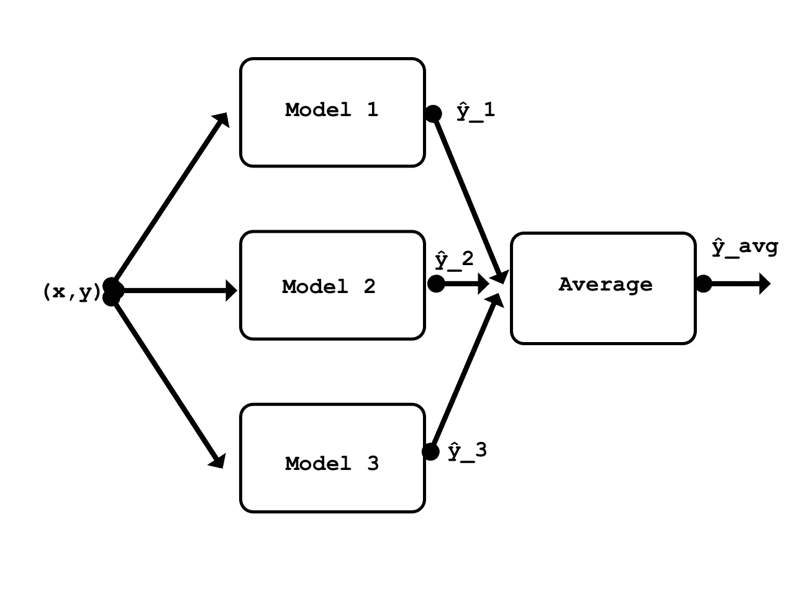
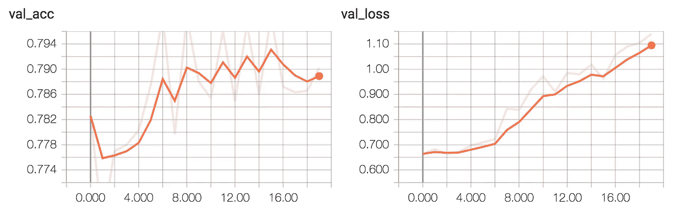
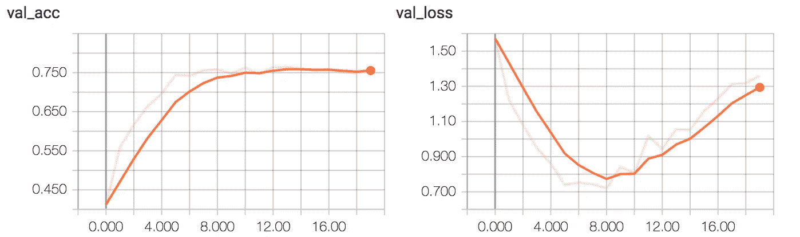
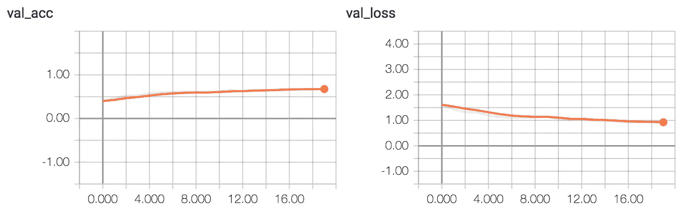

# 使用 Keras 组装 ConvNets

> 原文：<https://towardsdatascience.com/ensembling-convnets-using-keras-237d429157eb?source=collection_archive---------0----------------------->


> **编辑:2019 年 2 月**
> 
> 微小的代码更改。改进的[体验篇](https://github.com/LawnboyMax/keras_ensemblng)Jupyter 笔记本版。

# 介绍

> 在统计学和机器学习中，集成方法使用多种学习算法来获得比单独从任何组成学习算法获得的性能更好的预测性能。与统计力学中的统计集成(通常是无限的)不同，机器学习集成仅由一组具体的有限备选模型组成，但通常允许在这些备选模型中存在更加灵活的结构。[【1】](https://en.wikipedia.org/wiki/Ensemble_learning)

使用集成的主要动机是找到一个假设，该假设不一定包含在构建它的模型的假设空间内。从经验上看，当模型之间存在显著差异时，集成往往会产生更好的结果。[【2】](http://jair.org/papers/paper614.html)

## 动机

如果你看看一场大型机器学习比赛的结果，你很可能会发现，最好的结果是由一群模型而不是单个模型实现的。例如，ILSVRC2015 上得分最高的单一模型架构排在第 13 位。第 1-12 名由不同的组合占据。

我还没有看到关于如何在集成中使用多个神经网络的教程或文档，所以我决定就这个主题制作一个实用指南。

我将使用 [Keras](https://keras.io/) ，特别是它的[功能 API](https://keras.io/models/model/) ，重新创建三个小型 CNN(与 ResNet50、Inception 等相比)。)来自相对知名的论文。我将在 [CIFAR-10](https://www.cs.toronto.edu/~kriz/cifar.html) 训练数据集上分别训练每个模型。[【3】](https://www.cs.toronto.edu/~kriz/learning-features-2009-TR.pdf)然后，将使用测试集对每个模型进行评估。之后，我会把这三个模型放在一个合奏中进行评估。预计集成在测试集上将比集成中单独的任何单个模型表现得更好。

有许多不同类型的合奏；堆叠就是其中之一。它是更一般的类型之一，理论上可以代表任何其他的系综技术。堆叠包括训练一个学习算法来组合其他几个学习算法的预测。[【1】](https://en.wikipedia.org/wiki/Ensemble_learning#Stacking)为了这个例子，我将使用一种最简单的叠加形式，它包括取集合中模型输出的平均值。由于平均不需要任何参数，所以不需要训练这个集合(只需要它的模型)。



This post’s ensemble in a nutshell

## 准备数据

首先，导入依赖项。

```
from keras.callbacks import History
from keras.callbacks import ModelCheckpoint, TensorBoard
from keras.datasets import cifar10
from keras.engine import training
from keras.layers import Conv2D, MaxPooling2D, GlobalAveragePooling2D, Dropout, Activation, Average
from keras.losses import categorical_crossentropy
from keras.models import Model, Input
from keras.optimizers import Adam
from keras.utils import to_categorical
from tensorflow.python.framework.ops import Tensor
from typing import Tuple, List
import glob
import numpy as np
import os
```

我使用 CIFAR-10，因为相对容易找到描述在这个数据集上运行良好的架构的论文。使用一个流行的数据集也使得这个例子很容易重现。

在这里，数据集被导入。训练和测试图像数据都被归一化。训练标签向量被转换成独热矩阵。不需要转换测试标签向量，因为它不会在训练中使用。

```
def load_data() -> Tuple [np.ndarray, np.ndarray, 
                          np.ndarray, np.ndarray]:
    (x_train, y_train), (x_test, y_test) = cifar10.load_data()
    x_train = x_train / 255.
    x_test = x_test / 255.
    y_train = to_categorical(y_train, num_classes=10)
    return x_train, x_test, y_train, y_testx_train, x_test, y_train, y_test = load_data()
```

该数据集由来自 10 个类别的 60000 幅 32x32 RGB 图像组成。50000 幅图像用于训练/验证，另外 10000 幅用于测试。

```
print('x_train shape: {} | y_train shape: {}\nx_test shape : {} | y_test shape : {}'.format(x_train.shape, y_train.shape,                                                                                      x_test.shape, y_test.shape))
```

*>>>x _ train shape:(50000，32，32，3) | y_train shape: (50000，10)*

*>>>x _ 测试形状:(10000，32，32，3)| y _ 测试形状:(10000，1)*

由于所有三个模型都使用相同形状的数据，因此定义一个供每个模型使用的输入图层是有意义的。

```
input_shape = x_train[0,:,:,:].shape
model_input = Input(shape=input_shape)
```

## 第一个模型:ConvPool-CNN-C

我要训练的第一个模型是 ConvPool-CNN-C。

这个模型非常简单。它有一个共同的模式，即几个卷积层之后是一个池层。对于这个模型，有些人唯一不熟悉的是它的最后几层。不是使用几个完全连接的层，而是使用一个全局平均池层。

这里有一个全局池层如何工作的简要概述。最后一个卷积层`Conv2D(10, (1, 1))`输出对应十个输出类的 10 个特征图。然后，`GlobalAveragePooling2D()`层计算这 10 个特征地图的空间平均值，这意味着它的输出只是一个长度为 10 的矢量。之后，对该向量应用 softmax 激活。如您所见，这种方法在某种程度上类似于在模型顶部使用 FC 层。你可以在 Network paper 中阅读更多关于全球池层及其在 Network 中的优势。[【5】](https://arxiv.org/abs/1312.4400)

需要注意的重要一点是:没有激活函数应用于最后一个`Conv2D(10, (1, 1))`层的输出，因为这个层的输出必须首先通过`GlobalAveragePooling2D()`。

```
def conv_pool_cnn(model_input: Tensor) -> training.Model:

    x = Conv2D(96, kernel_size=(3, 3), activation='relu', padding = 'same')(model_input)
    x = Conv2D(96, (3, 3), activation='relu', padding = 'same')(x)
    x = Conv2D(96, (3, 3), activation='relu', padding = 'same')(x)
    x = MaxPooling2D(pool_size=(3, 3), strides = 2)(x)
    x = Conv2D(192, (3, 3), activation='relu', padding = 'same')(x)
    x = Conv2D(192, (3, 3), activation='relu', padding = 'same')(x)
    x = Conv2D(192, (3, 3), activation='relu', padding = 'same')(x)
    x = MaxPooling2D(pool_size=(3, 3), strides = 2)(x)
    x = Conv2D(192, (3, 3), activation='relu', padding = 'same')(x)
    x = Conv2D(192, (1, 1), activation='relu')(x)
    x = Conv2D(10, (1, 1))(x)
    x = GlobalAveragePooling2D()(x)
    x = Activation(activation='softmax')(x)

    model = Model(model_input, x, name='conv_pool_cnn')

    return model
```

实例化模型。

```
conv_pool_cnn_model = conv_pool_cnn(model_input)
```

为了简单起见，每个模型都使用相同的参数进行编译和训练。使用 20 个时段，批次大小为 32(每个时段 1250 步)，对于三个模型中的任何一个来说，似乎足以达到一些局部最小值。随机选择 20%的训练数据集用于验证。

```
NUM_EPOCHS = 20def compile_and_train(model: training.Model, num_epochs: int) -> Tuple [History, str]: 

    model.compile(loss=categorical_crossentropy, optimizer=Adam(), metrics=['acc']) 
    filepath = 'weights/' + model.name + '.{epoch:02d}-{loss:.2f}.hdf5'
    checkpoint = ModelCheckpoint(filepath, monitor='loss', verbose=0, save_weights_only=True,
                                                 save_best_only=True, mode='auto', period=1)
    tensor_board = TensorBoard(log_dir='logs/', histogram_freq=0, batch_size=32)
    history = model.fit(x=x_train, y=y_train, batch_size=32, 
                     epochs=num_epochs, verbose=1, callbacks=[checkpoint, tensor_board], validation_split=0.2)
    weight_files = glob.glob(os.path.join(os.getcwd(), 'weights/*'))
    weight_file = max(weight_files, key=os.path.getctime) # most recent file return history, weight_file
```

使用单个 Tesla K80 GPU 在一个时期内训练这个模型和下一个模型大约需要 1 分钟。如果您使用 CPU，训练可能需要一段时间。

```
_, conv_pool_cnn_weight_file = compile_and_train(conv_pool_cnn_model, NUM_EPOCHS)
```

该模型达到了约 79%的验证准确率。



ConvPool-CNN-C validation accuracy and loss

通过计算测试集的错误率来评估模型。

```
def evaluate_error(model: training.Model) -> np.float64: pred = model.predict(x_test, batch_size = 32)
    pred = np.argmax(pred, axis=1)
    pred = np.expand_dims(pred, axis=1) # make same shape as y_test
    error = np.sum(np.not_equal(pred, y_test)) / y_test.shape[0]   

    return errorevaluate_error(conv_pool_cnn_model)
```

*> > > 0.2414*

## 第二种模式:全 CNN-C

下一个 CNN，ALL-CNN-C，出自同一篇论文。[【4】](https://arxiv.org/abs/1412.6806v3)这款和上一款很像。实际上，唯一的区别是使用跨距为 2 的卷积层来代替最大池层。再次注意，在`Conv2D(10, (1, 1))`层之后没有立即使用激活功能。如果在该层之后立即使用 ReLU 激活，模型将无法训练。

```
def all_cnn(model_input: Tensor) -> training.Model:

    x = Conv2D(96, kernel_size=(3, 3), activation='relu', padding = 'same')(model_input)
    x = Conv2D(96, (3, 3), activation='relu', padding = 'same')(x)
    x = Conv2D(96, (3, 3), activation='relu', padding = 'same', strides = 2)(x)
    x = Conv2D(192, (3, 3), activation='relu', padding = 'same')(x)
    x = Conv2D(192, (3, 3), activation='relu', padding = 'same')(x)
    x = Conv2D(192, (3, 3), activation='relu', padding = 'same', strides = 2)(x)
    x = Conv2D(192, (3, 3), activation='relu', padding = 'same')(x)
    x = Conv2D(192, (1, 1), activation='relu')(x)
    x = Conv2D(10, (1, 1))(x)
    x = GlobalAveragePooling2D()(x)
    x = Activation(activation='softmax')(x)

    model = Model(model_input, x, name='all_cnn')

    return modelall_cnn_model = all_cnn(model_input)
_, all_cnn_weight_file = compile_and_train(all_cnn_model, NUM_EPOCHS)
```

该模型收敛到约 75%的验证准确性。



ALL-CNN-C validation accuracy and loss

由于两个模型非常相似，错误率不会相差太多。

```
evaluate_error(all_cnn_model)
```

*>>>0.260900000000002*

## 第三种模式:网络中的网络 CNN

第三个 CNN 是网络中的网络。[【5】](https://arxiv.org/abs/1312.4400)这是一篇 CNN 的文章，介绍了全局池层。它比前两个型号小，因此训练起来更快。最后卷积层后没有`relu`！

我没有在 MLP 卷积层中使用多层感知器，而是使用了 1x1 内核的卷积层。这样，需要优化的参数更少，训练速度更快，我可以获得更好的结果(当使用 FC 层时，无法获得高于 50%的验证精度)。该论文指出，mlpconv 层所应用的功能相当于普通卷积层上的级联跨通道参数池，而普通卷积层又相当于具有 1×1 卷积核的卷积层。如果我对架构的解释不正确，请纠正我。

```
def nin_cnn(model_input: Tensor) -> training.Model:

    #mlpconv block 1
    x = Conv2D(32, (5, 5), activation='relu',padding='valid')(model_input)
    x = Conv2D(32, (1, 1), activation='relu')(x)
    x = Conv2D(32, (1, 1), activation='relu')(x)
    x = MaxPooling2D((2,2))(x)
    x = Dropout(0.5)(x)

    #mlpconv block2
    x = Conv2D(64, (3, 3), activation='relu',padding='valid')(x)
    x = Conv2D(64, (1, 1), activation='relu')(x)
    x = Conv2D(64, (1, 1), activation='relu')(x)
    x = MaxPooling2D((2,2))(x)
    x = Dropout(0.5)(x)

    #mlpconv block3
    x = Conv2D(128, (3, 3), activation='relu',padding='valid')(x)
    x = Conv2D(32, (1, 1), activation='relu')(x)
    x = Conv2D(10, (1, 1))(x)

    x = GlobalAveragePooling2D()(x)
    x = Activation(activation='softmax')(x)

    model = Model(model_input, x, name='nin_cnn')

    return modelnin_cnn_model = nin_cnn(model_input)
```

这个模型的训练速度要快得多——在我的机器上，每个时期 15 秒。

```
_, nin_cnn_weight_file = compile_and_train(nin_cnn_model, NUM_EPOCHS)
```

该模型实现了约 65%的验证准确率。



NIN-CNN validation accuracy and loss

这个模型比其他两个更简单，所以错误率有点高。

```
evaluate_error(nin_cnn_model)
```

*> > > 0。0.3164000000000001*

## 三模型集成

现在这三个模型将被组合成一个整体。

这里，所有三个模型都被重新实例化，并且加载了最佳保存的权重。

```
CONV_POOL_CNN_WEIGHT_FILE = os.path.join(os.getcwd(), 'weights', 'conv_pool_cnn_pretrained_weights.hdf5')
ALL_CNN_WEIGHT_FILE = os.path.join(os.getcwd(), 'weights', 'all_cnn_pretrained_weights.hdf5')
NIN_CNN_WEIGHT_FILE = os.path.join(os.getcwd(), 'weights', 'nin_cnn_pretrained_weights.hdf5') conv_pool_cnn_model = conv_pool_cnn(model_input)
all_cnn_model = all_cnn(model_input)
nin_cnn_model = nin_cnn(model_input)

conv_pool_cnn_model.load_weights(CONV_POOL_CNN_WEIGHT_FILE)
all_cnn_model.load_weights(ALL_CNN_WEIGHT_FILE)
nin_cnn_model.load_weights(NIN_CNN_WEIGHT_FILE)

models = [conv_pool_cnn_model, all_cnn_model, nin_cnn_model]
```

集合模型定义非常简单。它使用所有先前模型之间共享的相同输入层。在顶层，集成通过使用`Average()`合并层计算三个模型输出的平均值。

```
def ensemble(models: List [training.Model], model_input: Tensor) -> training.Model:

    outputs = [model.outputs[0] for model in models]
    y = Average()(outputs)

    model = Model(model_input, y, name='ensemble')

    return model
```

正如所料，集合的错误率比任何单一模型都低。

```
evaluate_error(ensemble_model)
```

*> > > 0.2049*

## 其他可能的合奏

为了完整起见，我们可以检查由两个模型组合组成的集合的性能。其中两个模型的错误率低于单一模型。

```
pair_A = [conv_pool_cnn_model, all_cnn_model]
pair_B = [conv_pool_cnn_model, nin_cnn_model]
pair_C = [all_cnn_model, nin_cnn_model]pair_A_ensemble_model = ensemble(pair_A, model_input)
evaluate_error(pair_A_ensemble_model)
```

*>>>0.211999999999999*

```
pair_B_ensemble_model = ensemble(pair_B, model_input)
evaluate_error(pair_B_ensemble_model)
```

*>>>0.228199999999999*

```
pair_C_ensemble_model = ensemble(pair_C, model_input)
evaluate_error(pair_C_ensemble_model)
```

*> > > 0.2447*

# 结论

重申一下引言中说过的话:每个模型都有自己的弱点。使用集成背后的原因是，通过堆叠表示关于数据的不同假设的不同模型，我们可以找到不在构建集成的模型的假设空间中的更好的假设。

通过使用非常基本的集合，与在大多数情况下使用单一模型相比，实现了更低的错误率。这证明了组合的有效性。

当然，当使用系综来完成机器学习任务时，有一些实际的考虑要记住。由于集成意味着将多个模型堆叠在一起，这也意味着每个模型的输入数据都需要向前传播。这增加了需要执行的计算量，从而增加了评估(预测)时间。如果你在研究或比赛中使用系综，增加评估时间并不重要。然而，在设计商业产品时，这是一个非常关键的因素。另一个考虑因素是最终模型尺寸的增加，这也可能是在商业产品中整体使用的限制因素。

你可以从我的 [GitHub](https://github.com/LawnboyMax/keras_ensemblng) 获得 Jupyter 笔记本源代码。

## 参考

1.  **集成学习**。(未注明)。在*维基百科*里。检索于 2017 年 12 月 12 日，来自[https://en.wikipedia.org/wiki/Ensemble_learning](https://en.wikipedia.org/wiki/Ensemble_learning)
2.  D.Opitz 和 R. Maclin (1999 年)**流行的集合方法:实证研究**，第 11 卷，第 169-198 页(可在[http://jair.org/papers/paper614.html](http://jair.org/papers/paper614.html)获得)
3.  [**从微小图像中学习多层特征**](https://www.cs.toronto.edu/~kriz/learning-features-2009-TR.pdf) ，Alex Krizhevsky，2009。
4.  [arXiv:1412.6806 v3](https://arxiv.org/abs/1412.6806v3)【cs。LG]
5.  [arXiv:1312.4400 v3](https://arxiv.org/abs/1312.4400v3)【cs。NE]