# 熵是不确定性的度量

> 原文：<https://towardsdatascience.com/entropy-is-a-measure-of-uncertainty-e2c000301c2c?source=collection_archive---------0----------------------->

## 八个性质，几个例子和一个定理

假设你正在医生办公室的候诊室里与三个病人交谈。他们三人都刚刚完成了一项医学测试，经过一些处理后，得出两种可能的结果之一:疾病要么存在，要么不存在。让我们假设我们正在与好奇和面向数据的个人打交道。他们已经提前研究了他们特定风险状况的概率，现在急于找出结果。

患者 A 知道，从统计学上来说，他有 95%的可能性患有所述疾病。对于患者 B 来说，被确诊患病的概率是 30%。相比之下，病人 C 面临着 50/50 的可能性。

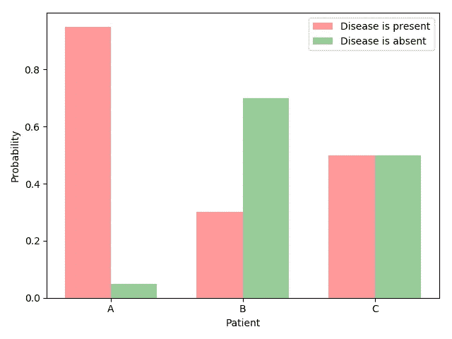

Uncertainty in the waiting room

我想着重谈一个简单的问题。在其他条件相同的情况下，三个病人中哪一个面临最大程度的不确定性？

我认为答案是明确的:病人 c。他不仅正在经历“许多不确定性”。他正在经历的是在这种情况下最大程度的不确定性:一个戏剧性的医学版的掷硬币游戏。

与病人 a 相比，当然，整体情况看起来相当严峻，但至少这个病人对他的医疗前景没有多少不确定性。

从直觉上讲，我们能说病人 B 什么呢？也许她的情况属于“中间某处”？

这就是熵产生的原因。将一种情况描述为“中间的某个地方”对于候诊室的谈话来说可能已经足够好了，但是对于机器学习的目的来说，这种描述肯定太粗糙了。

## 测量不确定性

熵允许我们对生活中最紧迫的问题之一做出精确的陈述和进行计算:不知道事情会如何发展。

换句话说，熵是对不确定性的一种度量。

(它也是一种信息的度量，但是，我个人更倾向于不确定性的解释。可能只是我，但当我不再试图将我对信息的先入为主的观念强加于方程式时，事情似乎变得清晰多了。)

在某种程度上，说熵是“*不确定性的*度量”是一种轻描淡写。给定某些假设(并预示着下面提到的一个重要结果)，熵是不确定性的*度量。*

顺便说一下，当我使用熵这个术语时，我指的是**香农熵**。还有很多其他熵，但我认为可以肯定的是，香农熵是自然语言处理和机器学习中使用最频繁的熵。

事不宜迟，这里是一个事件的熵公式 *X* 有 *n* 个可能的结果和概率 *p_1，…，p_n* :

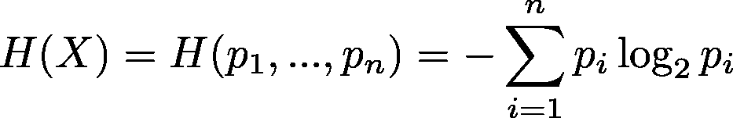

Shannon entropy

# 基本属性

如果你像我第一次看到这个公式时一样，你可能会问自己这样的问题:为什么是对数？为什么这是一个很好的不确定性的衡量标准？当然，为什么是字母 *H* ？(显然，使用英文字母 *H* 是从[希腊文大写字母 Eta](https://math.stackexchange.com/questions/84719/why-is-h-used-for-entropy) 演变而来，尽管历史看起来相当复杂。)

随着时间的推移，我学到的一件事是，一个好的起点——在这里和许多其他情况下——是问两个问题:(1)我试图理解的数学构造具有哪些理想的属性？以及(2)它们是具有所有这些期望特性的竞争结构吗？

简而言之，作为不确定性度量的香农熵的答案是:(1)许多和(2)没有。

让我们从愿望清单开始。

## 基本性质 1:均匀分布具有最大的不确定性

如果你的目标是最小化不确定性，远离均匀概率分布。

快速提醒:概率分布是一个函数，它为每一个可能的结果分配一个概率，使得概率总和为 1。当所有结果具有相同的概率时，分布是均匀的。例如，公平硬币(50%的尾部，50%的尾部)和公平骰子(六个面中的每一个面的概率为 1/6)遵循均匀分布。

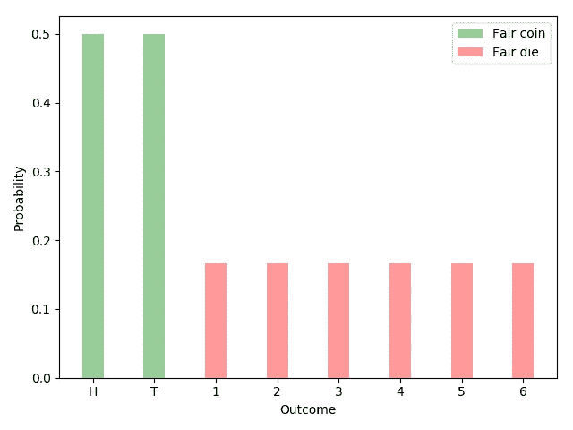

Uniform distributions have maximum entropy for a given number of outcomes.

对于均匀分布，不确定性的良好度量达到其最高值。熵满足标准。给定 *n* 种可能的结果，最大熵由等概率结果最大化:

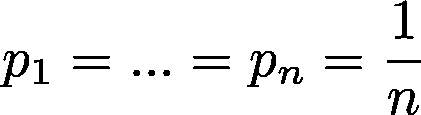

Equiprobable outcomes

这是应用于伯努利试验的熵函数图(具有两种可能结果和概率的事件 *p* 和 *1-p* ):

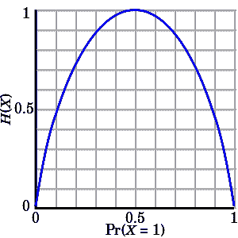

In the case of Bernoulli trials, entropy reaches its maximum value for p=0.5

## 基本性质 2:不确定性对于独立事件是可加的

设 *A* 和 *B* 为独立事件。换句话说，知道事件 *A* 的结果并不能告诉我们任何关于事件 *B* 的结果。

与这两个事件相关的不确定性——这是我们愿望清单上的另一个项目——应该是各个不确定性的总和:

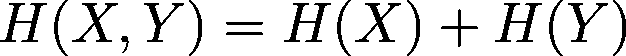

Uncertainty is additive for independent events.

让我们用抛两枚硬币的例子来更具体地说明这一点。我们可以同时掷两枚硬币，或者先掷一枚硬币，然后再掷另一枚。另一种思考方式是，我们可以同时或分别报告两次抛硬币的结果。这两种情况下的不确定性是一样的。

为了使这一点更加具体，考虑两个特殊的硬币。第一枚硬币正面朝上( *H* )的概率为 80%，反面朝上( *T* )的概率为 20%。另一枚硬币的概率是 60%和 40%。如果我们同时抛两枚硬币，有四种可能的结果: *HH* 、 *HT* 、 *TH* 和 *TT* 。对应的概率由*【0.48，0.32，0.12，0.08】*给出。

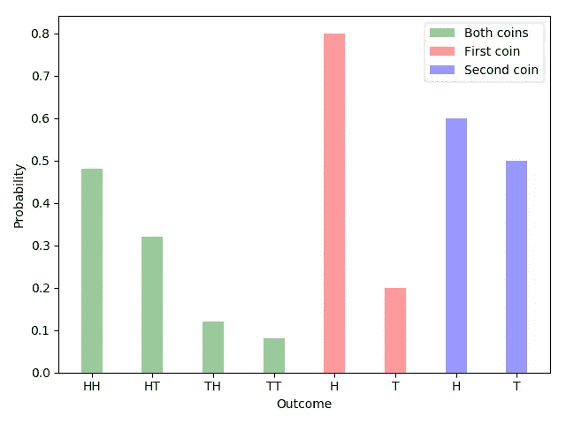

The joint entropy (green) for the two independent events is equal to the sum of the individual events (red and blue).

将这些数字代入熵公式，我们看到:

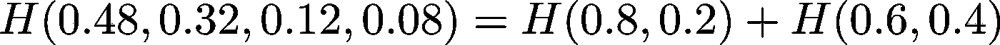

就像承诺的那样。

## 基本属性 3:添加概率为零的结果没有效果

假设(A)每当结果#1 出现时你就赢了，并且(B)你可以在两个概率分布中选择， *A* 和 *B* 。分配 *A* 有两种结果:比如说 80%和 20%。分布 B 有三种结果，概率分别为 80%、20%和 0%。

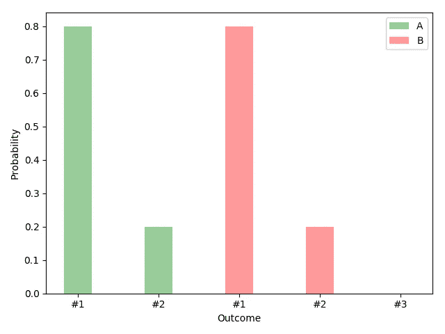

Adding a third outcome with zero probability doesn’t make a difference.

给选项 *A* 和 *B* ，你会选哪个？此时一个合适的反应是耸耸肩或者翻白眼。包含第三种结果既不增加也不减少与游戏相关的不确定性。 *A* 还是 *B* ，谁在乎。没关系。

熵公式同意这种评估:

Adding a zero-probability outcome has not effect on entropy.

换句话说，添加一个概率为零的结果对不确定性的测量没有影响。

## 基本性质 4:不确定性的度量在其所有论证中是连续的

最后一个基本属性是连续性。

众所周知，对连续函数的直观解释是没有“间隙”或“洞”。更准确地说，输出中任意小的变化(在我们的例子中是不确定性)应该可以通过输入中足够小的变化(概率)来实现。

对数函数在为其定义的每一点上都是连续的。在子集上连续的有限个函数的和与积也是如此。由此可见，熵函数在其概率论证中是连续的。

# 唯一性定理

[钦钦(1957)](https://books.google.de/books/about/Mathematical_Foundations_of_Information.html?id=0uvKF-LT_tMC&redir_esc=y) 表明，满足上述四个基本性质的唯一函数族具有以下形式:

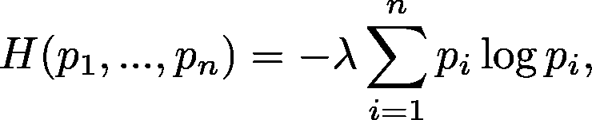

Functions that satisfy the four basic properties

其中λ是正常数。钦钦将此称为**唯一性定理**。设λ = 1 并使用二进制对数，我们得到香农熵。

再次重申，使用熵是因为它具有令人满意的性质，并且是满足基本愿望清单(性质 1-4)上所有项目的家族函数中的自然选择。(以后我可能会在单独的文章中讨论这个证明。)

# 其他属性

除了钦钦唯一性定理中使用的四个基本性质之外，熵还有许多其他性质。让我在此仅提及其中一些。

## 性质 5:具有更多结果的均匀分布具有更多的不确定性

假设你可以在一枚漂亮的硬币和一个漂亮的骰子之间做出选择:

Fair coin or fair die?

假设硬币正面朝上或者骰子正面朝上，你就赢了。

这两个选项你会选哪个？如果你是利润最大化者，A 和 *B* 如果你喜欢更多的变化和不确定性。

随着等概率结果数量的增加，我们对不确定性的度量也应该增加。

而这正是熵的作用:H(1/6，1/6，1/6，1/6，1/6，1/6，1/6)，H(0.5，0.5)。

一般来说，如果我们让 *L(k)* 是具有 *k* 个可能结果的均匀分布的熵，我们有

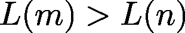

对于 *m > n* 。

## 属性 6:事件具有非负的不确定性

你知道什么是负面不确定性吗？我也不知道。

一个用户友好的不确定性度量应该总是返回一个非负的量，不管输入是什么。

这是熵满足的另一个标准。让我们再来看看这个公式:

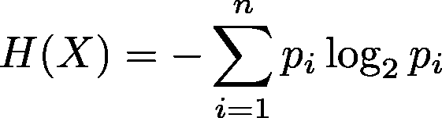

Shannon entropy

根据定义，概率的范围在 0 和 1 之间，因此是非负的。概率的对数是非正的。概率的对数乘以一个概率不会改变符号。非正乘积之和为非正。最后，非正值的负值是非负值。因此，对于每个可能的输入，熵都不是负的。

## 特性 7:具有特定结果的事件没有不确定性

假设你拥有一枚神奇的硬币。不管你怎么抛硬币，它总是正面朝上。

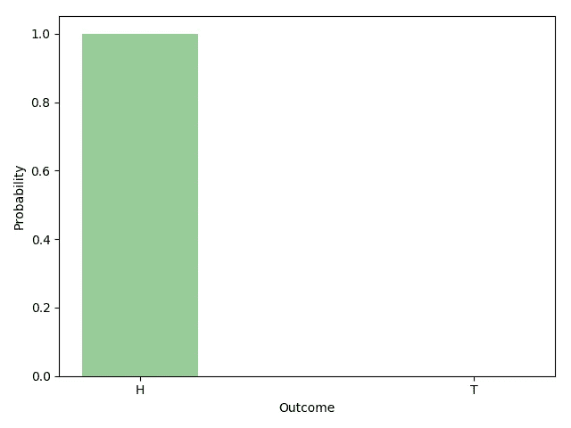

A magical coin

你如何量化魔法或任何其他情况下某个结果肯定会发生的不确定性？嗯，没有。所以自然的答案——我想，你会同意——是 0。

熵是否认同这种直觉？当然了。

假设结果肯定会发生。由此得出 *p_i* ，结果 *i* 的概率等于 1。 *H(X)，*由此，简化为:

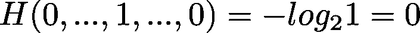

The entropy for events with a certain outcome is zero.

## 属性 8:翻转参数没有效果

这是另一个明显可取的属性。考虑两种情况。第一种情况，正面和反面的概率分别是 80%和 20%。在第二种情况下，概率正好相反:正面 20%，反面 80%。

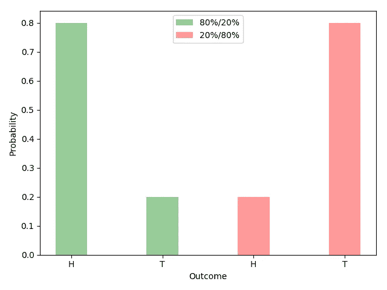

两次抛硬币的不确定性相同，熵相同: *H(0.8，0.2) = H(0.2，0.8)* 。

更一般地说，对于两种结果的情况，我们有:

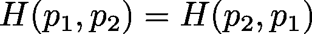

Flipping arguments

这个事实适用于任何数量的结果。我们可以按照我们喜欢的任何顺序排列论点(即分布的概率)。熵函数的结果总是相同的。

# 摘要

概括地说，香农熵是不确定性的度量。

它被广泛使用是因为它满足某些标准(也因为生活充满了不确定性)。唯一性定理告诉我们，只有一个函数族具有我们提到的所有四个基本性质。香农熵是这个家族中的自然选择。

除了其他事实之外，熵对于均匀分布是最大的(属性#1)，对于独立事件是可加的(#2)，对于非零概率的结果数量增加(#3 和#5)，连续的(#4)，非负的(#6)，对于某些结果为零(#7)和排列不变的(#8)。

# 感谢您的阅读！如果你喜欢这篇文章，请点击“鼓掌”按钮，跟随我了解更多关于自然语言处理和机器学习的知识。

# 此外，让我知道如果你有一个项目在这两个领域的交叉点，你想讨论。