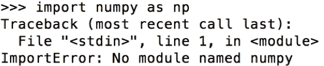
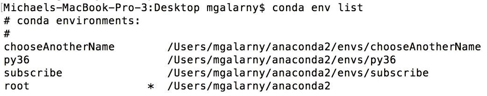
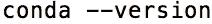
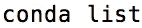
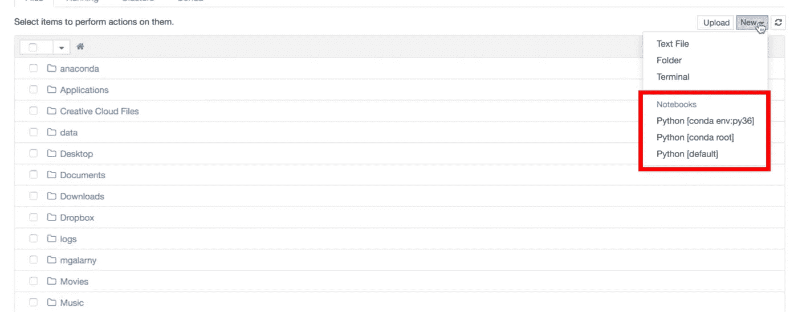

# 使用 Conda 的 Python 环境管理(Python 2 + 3，使用多个版本的 Python)

> 原文：<https://towardsdatascience.com/environment-management-with-conda-python-2-3-b9961a8a5097?source=collection_archive---------0----------------------->

Environment Management with Conda (Python + Configuring Ipython/Jupyter)

遇到类似下图中的 ImportError 可能会很烦人。



幸运的是，Anaconda 使得用 conda 的包管理器功能安装包变得很容易。如果您需要复习，软件包管理器是一个自动安装、更新和删除软件包的工具。虽然 conda 是一个包和环境管理器，但让我们首先回顾一下 Conda 的包管理器功能，然后重点介绍环境管理器功能。

## **安装包**

打开命令提示符/anaconda 提示符(windows)或终端(mac/linux)并运行下面的命令。你可以用`numpy`替换任何你想安装的包。

```
conda install numpy
```

## 卸载软件包

运行以下命令卸载软件包。您可以用`numpy`替换您想要卸载的任何包。

```
conda uninstall numpy
```

## 更新包

运行下面的命令来更新包。你可以用`scikit-learn`替换任何你想更新的包。

```
conda update scikit-learn
```

## 康达 vs 皮普

Pip 是一个 Python 包管理器，代表“Pip 安装包”，通常与 [**virtualenv**](https://virtualenv.pypa.io/en/stable/) (一个用于创建隔离环境的工具)结合使用。

大多数时候(除了一些例外),通过 conda 或通过 pip 安装包没有太大的区别。这是因为 pip 包也可以安装到 Conda 环境中。

```
conda install numpy
pip install numpy
```

这不是一个关于 conda 与 pip 的讨论，因为 Jake VanderPlas 已经非常广泛地讨论了这个问题，而是为什么你可以通过 pip 或者 conda 来安装软件包。

## 为什么需要多个 Conda/Python 环境。

假设你有多个项目，它们都依赖于一个库(Pandas，Numpy 等)。如果您升级一个包，它可能会破坏依赖旧版本包的其他项目，因为旧项目的语法可能会被否决或过时。你该怎么办？建立一个虚拟环境。它允许你从一个项目到另一个项目中分离出将要使用的包、依赖项和版本。

对于 python 用户来说，虚拟环境的一个常见用途是拥有独立的 Python 2 和 3 环境。例如，我在加州大学圣地亚哥分校的几个同学最近开设了一门机器学习课，其中一位教授用 Python 3 来布置作业。不过另一个班有个教授在 Python 2 里布置作业。因此，他们不得不在不同的类项目中频繁地在 python 2 和 3 之间切换。至此，让我们进入 conda 环境命令。我建议您在单独的标签中打开[视频，观看命令的运行。](https://www.youtube.com/watch?v=rFCBiP9Gkoo)

**创建新环境**

下面的命令在 python 版中创建了一个名为`subscribe`的 conda 环境。您可以用`subscribe`来代替您想要命名的环境。

```
conda create --name subscribe python=3.6
```

请记住，一旦激活(进入)该环境，您将需要在该环境中安装额外的软件包。您在根环境中拥有的包不一定就是您将在新环境中拥有的包，除非您安装它们。

您还可以创建一个包含多个包的环境。这也让您可以选择在以后需要时安装额外的软件包。

```
conda create --name chooseAnotherName python=3.6 numpy pandas scipy
```

**进入环境**

如果您的环境名称不是`subscribe`，您将需要用`subscribe`替换您的环境名称。

窗口:

```
activate subscribe
```

Mac:

```
source activate subscribe
```

**离开一个环境**

如果您的环境名称不是`subscribe`，您将需要用`subscribe`替换您的环境名称。

窗口:

```
deactivate subscribe
```

Mac:

```
source deactivate subscribe
```

**列出您的环境**

这个命令向您展示了所有这是一个非常有用的命令，可以查看您有什么样的环境，也可以查看您处于什么样的 conda 环境中。

```
conda env list
```



**移除一个环境**

如果您想要删除的环境名称不是`subscribe`，您需要用`subscribe`替换您想要删除的环境名称。

```
conda env remove --name subscribe
```

如果你对这部分有疑问，请参考[文档](https://conda.io/docs/using/envs.html)，留下评论或者参考上面的视频。

## **在 IPython 笔记本中同时使用 Python 2.x 和 Python 3.x 环境**

虽然这篇文章的这一部分很大程度上是从 [stackoverflow](http://stackoverflow.com/questions/30492623/using-both-python-2-x-and-python-3-x-in-ipython-notebook/30492913#30492913) 中截取和改进的，但我觉得回顾一下人们遇到的一些技术问题是很重要的。主要思想是拥有多个 ipython 内核。包 **nb_conda_kernels** 会自动检测笔记本内核的不同 conda 环境，并自动注册。

1.  确保您安装了 anaconda 4.1.0 或更高版本。打开一个新的终端，通过键入以下命令检查您的 conda 版本



checking conda version

如果你低于 anaconda 4.1.0，输入 **conda update conda**

2.接下来，我们通过键入以下命令来检查是否有库 **nb_conda_kernels**



Checking if we have nb_conda_kernels

3.如果没有看到 **nb_conda_kernels** 类型


Installing nb_conda_kernels

4.如果您正在使用 Python 2 并且想要一个单独的 Python 3 环境，请键入以下内容


py36 is the name of the environment. You could literally name it anything you want.

如果您正在使用 Python 3 并且想要一个单独的 Python 2 环境，您可以键入以下内容。


py27 is the name of the environment. It uses python 2.7.

5.关闭您的终端并打开一个新的终端。jupyter 型笔记本

6.单击 new，您将看到列出了您的虚拟环境。



如果你有任何问题，请在这里或者在 [youtube 视频](https://www.youtube.com/watch?v=rFCBiP9Gkoo)评论中告诉我！