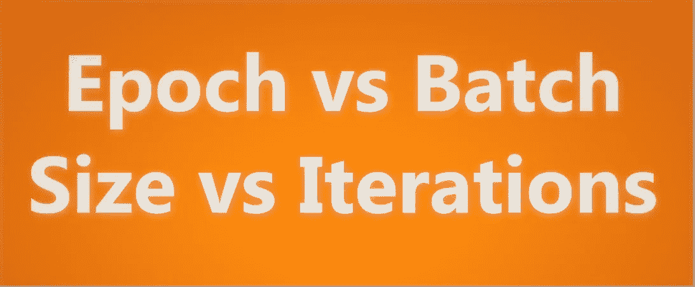
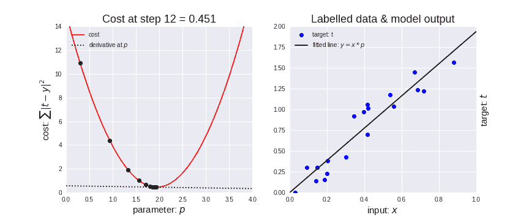
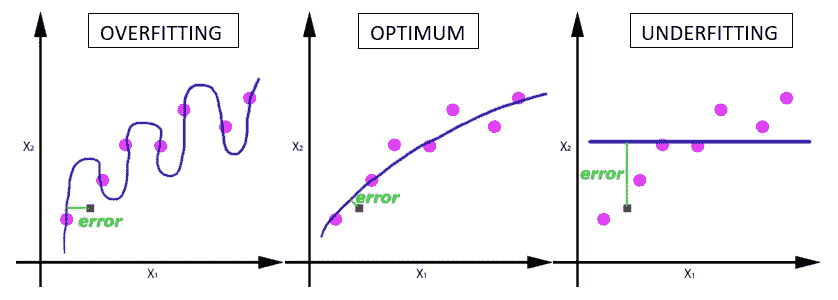

# 纪元与批量大小与迭代次数

> 原文：<https://towardsdatascience.com/epoch-vs-iterations-vs-batch-size-4dfb9c7ce9c9?source=collection_archive---------0----------------------->

## 了解您的代码…

你一定有过这样的时候，你看着屏幕，挠着头想知道“为什么我在代码中输入这三个术语，它们之间有什么区别”，因为它们看起来都很相似。

为了找出这些术语之间的区别，你需要知道一些机器学习术语，如梯度下降，以帮助你更好地理解。

这里有一个关于*梯度下降*的简短总结…

## **梯度下降**

它是一种 ***迭代*** 优化算法，用于机器学习中寻找最佳结果(曲线的极小值)。

*坡度*是指斜坡倾斜或下倾的*速率*。

*下降*表示*下降*的实例。

算法是**迭代**意味着我们需要多次得到结果才能得到最优结果。梯度下降的迭代质量有助于拟合不足的图形以最佳方式拟合数据。

[Source](https://medium.com/onfido-tech/machine-learning-101-be2e0a86c96a)

梯度下降有一个参数叫做**学习率。**正如你在上面(左图)看到的，最初步长越大，意味着学习率越高，随着点的下降，步长越小，学习率越小。还有，**成本**功能在降低或者成本在降低。有时候你可能会看到有人说**损失**功能在减少或者损失在减少，*两个* ***成本*** *和* ***损失*** *代表的是同一个东西*(顺便说一句，我们的损失/成本在减少是件好事)。

只有当数据太大时，我们才需要像纪元、批量大小、迭代这样的术语，这在机器学习中是经常发生的，我们不能一次将所有数据传递给计算机。因此，为了克服这个问题，我们需要将数据分成更小的尺寸，并将其一个接一个地提供给我们的计算机，并在每一步结束时更新神经网络的权重，以使其适应给定的数据。

# 纪元

> 一个时期是整个数据集仅通过神经网络向前和向后传递一次。

由于一个时期太大，不能一次输入计算机，我们把它分成几个小批。

## 为什么我们使用一个以上的纪元？

我知道这在一开始是没有意义的——通过神经网络传递整个数据集是不够的。我们需要将整个数据集多次传递给同一个神经网络。但是请记住，我们使用的是有限的数据集，为了优化学习和图表，我们使用了**梯度下降**，这是一个 ***迭代*** 过程。因此，*用单遍或一个历元更新权重是不够的。*

> 一个时期导致图中曲线的欠拟合(下图)。

随着时期数的增加，神经网络中改变权重的次数越多，曲线从**欠拟合**到**最优**再到**过拟合**曲线。

## 那么，什么是时代的正确数字呢？

可惜这个问题没有正确答案。对于不同的数据集，答案是不同的，但是你可以说历元的数量与你的数据的多样性有关…举个例子-你的数据集中只有黑猫还是有更多的多样性？

# 批量

> 单个批次中存在的训练示例总数。

> **注意:**批次大小和批次数量是两回事。

## 但是什么是批呢？

正如我所说的，你不能一次将整个数据集传递到神经网络中。因此，您**将数据集分成若干批次、集合或部分。**

就像你把一篇大文章分成多个集合/批次/部分一样，比如引言、梯度下降、纪元、批次大小和迭代，这使得读者很容易阅读整篇文章并理解它。😄

# 迭代次数

要得到迭代次数，你只需要知道乘法表或有一个计算器。😃

> 迭代是完成一个历元所需的批数。

> **注:**批次数等于一个历元的迭代次数。

假设我们有 2000 个将要使用的训练示例。

> 我们可以将 2000 个例子的数据集分成 500 个一批，然后将需要 4 次迭代来完成 1 个时期。

## 其中批量大小为 500，迭代次数为 4，用于 1 个完整的历元。

关注我在[媒体](https://medium.com/@sagarsharma4244)获得类似的职位。

在[脸书](https://www.facebook.com/profile.php?id=100003188718299)、[推特](https://twitter.com/SagarSharma4244)、 [LinkedIn](https://www.linkedin.com/in/sagar-sharma-232a06148/) 、 [Google+](https://plus.google.com/u/0/+SAGARSHARMA4244) 上联系我

如果你有任何意见或问题，请写在评论里。

**鼓掌吧！分享一下！跟我来。**

乐意帮忙。荣誉……..

# 你会喜欢的以前的故事:

 [## 蒙特卡罗树搜索

### 每个数据科学爱好者的 MCTS

towardsdatascience.com](/monte-carlo-tree-search-158a917a8baa)  [## 强化学习中的政策网络与价值网络

### 在强化学习中，代理在他们的环境中采取随机决策，并学习选择正确的决策…

towardsdatascience.com](/policy-networks-vs-value-networks-in-reinforcement-learning-da2776056ad2)  [## 神经网络中的激活函数及其类型

### 它是一条曲线(sigmoid，tanH，ReLU ),用于映射有界值之间的网络值。这就完成了…

theffork.com](https://theffork.com/activation-functions-in-neural-networks/)  [## 如何使用 Python 发送电子邮件

### 使用 Flask 设计专业邮件！

medium.com](https://medium.com/@sagarsharma4244/how-to-send-emails-using-python-4293dacc57d9)  [## TensorFlow 图像识别 Python API 教程

### 在带有 Inception-v3 的 CPU 上(以秒为单位)

towardsdatascience.com](/tensorflow-image-recognition-python-api-e35f7d412a70)