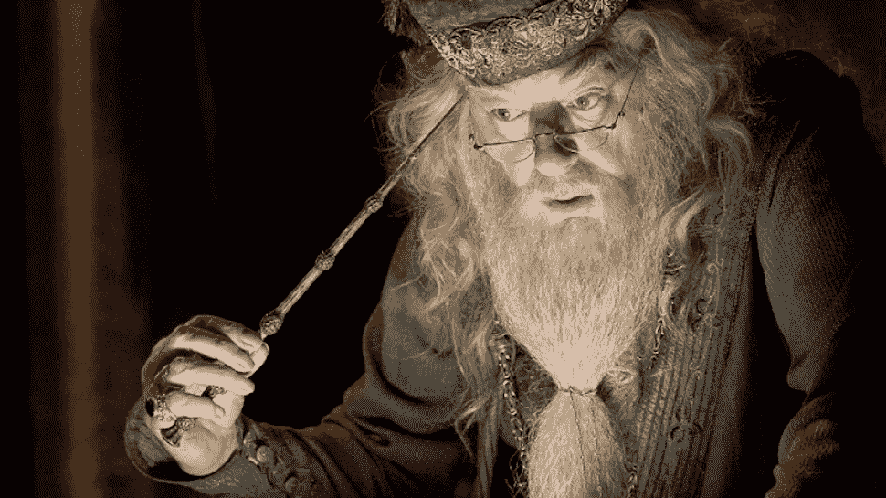
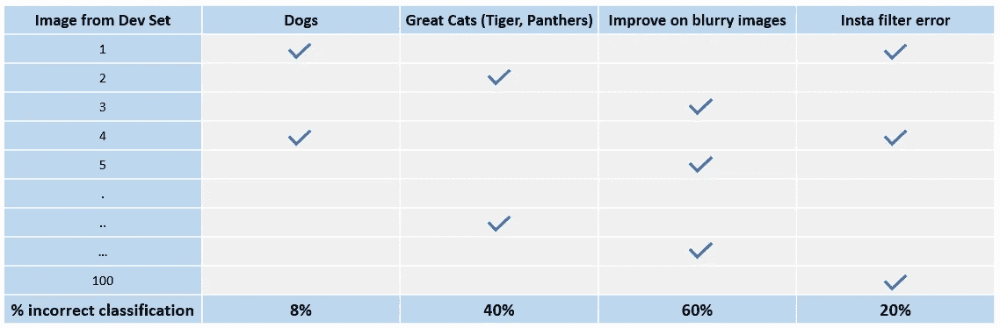
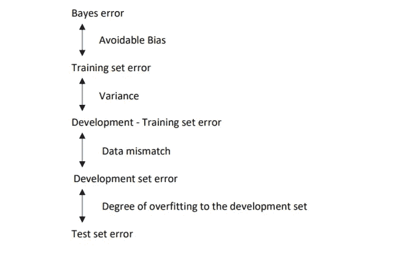

# 错误分析拯救你！

> 原文：<https://towardsdatascience.com/error-analysis-to-your-rescue-773b401380ef?source=collection_archive---------3----------------------->

修复算法中的错误时应遵循的策略

欢迎来到 ML 第三章 Ng 的经验教训！是的，这是完全基于吴恩达最近在 Coursera 上的[课程](https://www.coursera.org/learn/machine-learning-projects/home/welcome)的系列的延续。虽然这个帖子可以是一个独立的学习，但阅读前面的两篇文章只会有助于更好地理解这一篇。这里是这个系列的[第一篇](/how-to-improve-my-ml-algorithm-lessons-from-andrew-ngs-experience-i-551ca1a32634)和[第二篇](/how-to-improve-my-ml-algorithm-lessons-from-andrew-ngs-experience-ii-f66926926f88)的链接。我们开始吧！

当试图解决一个新的机器学习问题(已经没有太多在线资源可用的问题)时，吴恩达建议先快速构建一个系统，然后再迭代。建立一个模型，然后反复识别错误，并不断修正它们。如何发现错误以及如何修复它们？正当你这样想的时候，**错误分析**穿着一件巨大的长袍，长长的胡须插在腰带下，戴着半月形眼镜，说道——

> “是误差，哈利，向我们展示了我们的模型到底是什么，远远超过了准确性”

[Source](https://nerdist.com/wp-content/uploads/2017/11/dumbledore.jpg)

# **为什么要进行误差分析？**

当建立一个新的机器学习模型时，你应该尝试并遵循以下步骤

**设置目标:**设置开发/测试集，并选择一个评估指标来衡量性能(参见第一篇文章)

**快速建立初始模型:** 1。使用训练集进行训练—调整参数
2。开发设置—调整参数
3。测试集—评估性能

**区分后续步骤的优先顺序:** 1。使用偏差和方差分析处理欠拟合和过拟合(参考第二篇文章)2。分析导致错误的原因并修复它们，直到您准备好所需的模型！

手动检查算法正在犯的错误可以让你了解下一步该做什么。这个过程叫做误差分析。举个例子，你建立了一个显示 10%测试误差的猫分类器，而你的一个同事指出你的算法把狗的图像误分类为猫。你应该试着让你的猫分类器在狗身上做得更好吗？

# 要修复哪个错误？

与其花上几个月的时间去做这件事，冒着最后发现它没什么用处的风险，这里有一个错误分析程序，可以让你很快判断出这是否值得你去努力。

1.  获取大约 100 个标签错误的开发集示例
2.  数数有多少只狗
3.  如果你只有 5%的狗图片，而你完全解决了这个问题，你的误差只会从 10%下降到 9.5%，最多！
4.  相比之下，如果你有 50%的狗图片，你可以更乐观地改善你的错误，并有希望将其从 10%减少到 5%

这就是你如何评价错误修复的单一想法。以类似的方式，您可以通过创建一个网格来评估多个想法，并选择最能提高性能的想法-

**The ceiling of error correction for blurry images is pretty good and should be fixed first**

这个过程的结论给你一个估计，在这些不同类别的错误上工作是多么值得。例如，这里很明显，我们犯的很多错误是在模糊的图像上，然后是很棒的猫图像。这给你一种追求最佳选择的感觉。

它还告诉你，无论你在狗狗图片或 Instagram 图片上做得有多好，你最多只能提高 8%或 20%的表现。因此，根据你有多少提高大猫或模糊图像性能的想法，你可以从这两个中选择一个，或者如果你的团队有足够的人员，也许你可以让两个不同的团队独立研究其中的每一个。

现在，如果在模型构建过程中，您发现您的数据中有一些标注不正确的数据点，您该怎么办？

# 标签不正确的数据

## 训练集校正

深度学习算法对训练集中的随机错误非常鲁棒。只要这些错误是无意的，并且是随机的，就不要花太多时间去修复它们。举个例子，在我们的猫分类器的训练集中有一些错误标记的狗图像。

然而！然而，深度学习算法对系统错误并不鲁棒，例如，如果你将所有白色狗图像标记为猫，你的分类器将学习这种模式。

## 开发/测试集校正

您还可以选择在开发/测试集上进行错误分析，以查看有多少百分比的错误标签，以及是否值得修复它们。如果您的开发集误差为 10%,并且由于错误标记的开发集图像而导致这里有 0.5%的误差，那么在这种情况下，尝试修复它们可能不是很好的利用时间。相反，如果有 2%的 dev 集误差，0.5%的误差是由于错误标记的 dev 集，那么在这种情况下，修复它们是明智的，因为它占总误差的 25%。

对于错误标记的图像，您可以选择只修复训练集，而不修复开发/测试集。在这种情况下，请记住，现在，您的训练集和开发/测试集都来自稍微不同的发行版。这没关系。让我们谈谈如何处理训练集和开发/测试集来自不同发行版的情况

# 不匹配的培训和开发/测试集

## 不同发行版的培训和测试

假设你正在构建一个应用程序，从用户点击的图片中对猫进行分类。你现在有两个来源的数据。首先是来自网络的 200，000 张高分辨率图片，其次是用户点击的应用程序上的 10，000 张不专业/模糊的图片。

现在，为了让培训和开发/测试集具有相同的分布，您可以将来自两个源的图像混洗，并在两个组之间随机分布。然而，在这种情况下，您的 dev set 在 2500 个图像池中只有大约 200 个来自移动用户的图像。这将优化你的算法，在网页图像上表现良好。但是，开发/测试集的理想选择是拥有它们，以便反映您期望在未来获得的数据，并认为做好这些数据是重要的。

我们在这里可以做的是，让开发/测试集中的所有图像都来自移动用户，并将来自移动用户的剩余图像与 web 图像一起放入训练集中。这将导致培训和开发/测试集中不一致的分布，但从长远来看，这将让您达到您想要的目标。

## 数据分布不匹配时的偏差和方差

当训练集与开发集和测试集来自不同的分布时，分析偏差和方差的方法会发生变化。由于显而易见的原因(它们已经来自不同的发行版)，您不能再将 train 和 dev 之间的误差称为方差。在这里，您可以做的是定义一个**训练开发集**，它将与训练集具有相同的分布，但不会用于训练。然后你可以分析你的模型，如下图所示-

**Data mismatch error will get added to the variance if Training-Dev set is not defined**

# 结论

了解你的机器学习算法的应用，相应地收集数据，随机拆分训练/开发/测试集。想出一个单一的优化评估指标，并调整你的旋钮，以改善这一指标。使用偏差/方差分析来了解您的模型是过拟合还是欠拟合，或者在那里工作得很好。跳到错误分析，确定修复哪个最有帮助，最后，努力把你的模型设置正确！

这是这个系列的最后一篇文章。感谢阅读！希望它能帮助你更好地处理你的错误。

如果您有任何问题/建议，请随时在这里提出您的意见或通过 [LinkedIn](https://www.linkedin.com/in/kritikajalan/) / [Twitter](https://twitter.com/Kritika_Jalan) 与我联系