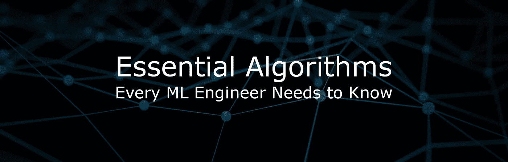
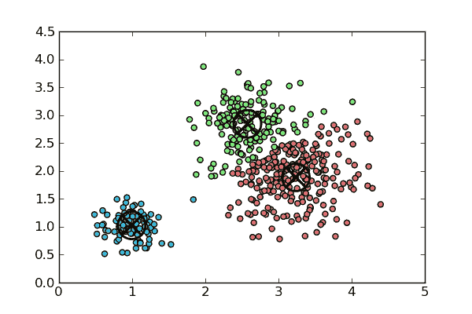
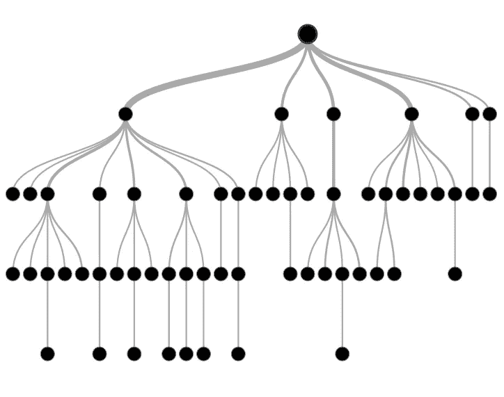
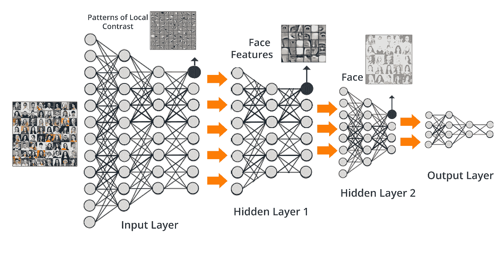

# 每个 ML 工程师都需要知道的基本算法

> 原文：<https://towardsdatascience.com/essential-algorithms-every-ml-engineer-needs-to-know-3167b1e940f?source=collection_archive---------2----------------------->

在深度神经网络接管场景之前，机器学习作为一个领域已经存在了很长时间。这里有一个你需要知道的算法列表，这样你就可以解决任何遇到的问题。这不是一个详尽的列表，但是你的基础将会被覆盖。

我还想宣布，我的媒体博客将从一般的机器学习焦点转变为深度学习焦点。我现在的大部分工作都涉及到创建新颖的深度学习系统，所以我想花更多的时间来写这方面的东西！

## 回归算法

回归算法模拟变量之间的关系。最初是一种来自统计学的技术，它们已经成为每个机器学习工程师工具箱中的重要工具。

常见回归算法

*   最小二乘回归
*   线性回归
*   逻辑回归

约翰霍普金斯大学关于回归模型的 Coursera 课程

## 聚类算法

聚类算法可以将数据点分成具有相似属性的组。他们通过寻找数据中的内在结构来将数据组织到不同的组中。群体中的事物比其他群体中的事物相互之间的联系更紧密。

有两种类型的聚类算法。硬聚类是指数据点是否在一个组中。软聚类是指一个数据点可以不同程度地属于多个不同的组。

常见聚类算法

*   k 均值
*   分层聚类

令人惊叹的[集群介绍视频](https://www.youtube.com/watch?v=ZueoXMgCd1c)

## 降维算法

当特征的数量与数据点的数量相比非常大时。降维算法可以帮助您将特征的数量减少到手头问题所需的数量。它们可以删除多余或无用的功能，帮助您获得更好的结果。

降维算法有两种工作方式。第一种方法是通过特征选择，其中算法挑选可用特征的子集。第二种方法是特征提取，将高维空间中的数据降低到一个较低的维度。

常见的降维算法

*   主成分分析
*   低方差滤波器
*   高相关滤波器
*   随机森林
*   反向特征消除/正向特征构建

这不是一个详尽的列表，只是我用过的一些。如果你想进一步了解这方面的内容，也想看看这些算法的投资回报率，请查看 [KDnuggets 的博客文章](https://www.kdnuggets.com/2015/05/7-methods-data-dimensionality-reduction.html)。

## 决策树算法

决策树根据数据中的值创建决策模型。在树结构中进行分叉，直到对每个数据点都有预测。与其他算法(深度学习)不同，他们的结果易于理解，并且易于在许多不同的数据类型上使用。

常见的决策树算法:

*   分类和回归树
*   C4.5 和 C5.0
*   随机森林
*   卡方自动交互检测器

[Analytics Vidhya 有一篇很棒的文章](https://www.analyticsvidhya.com/blog/2016/04/complete-tutorial-tree-based-modeling-scratch-in-python/)，深入探讨了决策树。列出不同的算法及其优缺点

## 深度学习

机器学习和“AI”背后的炒作是深度学习造成的。它们是人工神经网络的现代版本，利用廉价的计算来训练更大的神经网络。它们是强大的通用函数近似值，已经证明它们有能力解决一些最困难的问题。参见[阿尔法围棋](https://en.wikipedia.org/wiki/AlphaGo)。

通用深度学习人工智能

*   堆叠式自动编码器
*   卷积神经网络
*   递归神经网络
*   胶囊网络([更多信息在此](https://hackernoon.com/what-is-a-capsnet-or-capsule-network-2bfbe48769cc))

查看这本书的片段。它介绍了深度学习的主要架构。

## 减去

如果你对机器学习很认真，你必须了解你可以使用的工具。对这些工具有一个很好的理解将会帮助你解决你遇到的任何问题。