# 基本数据技能——就业市场上的供给和需求

> 原文：<https://towardsdatascience.com/essential-data-skills-supply-and-demand-on-the-job-market-4f7dffa23b70?source=collection_archive---------12----------------------->

## 深入了解 Kaggle 数据科学调查结果

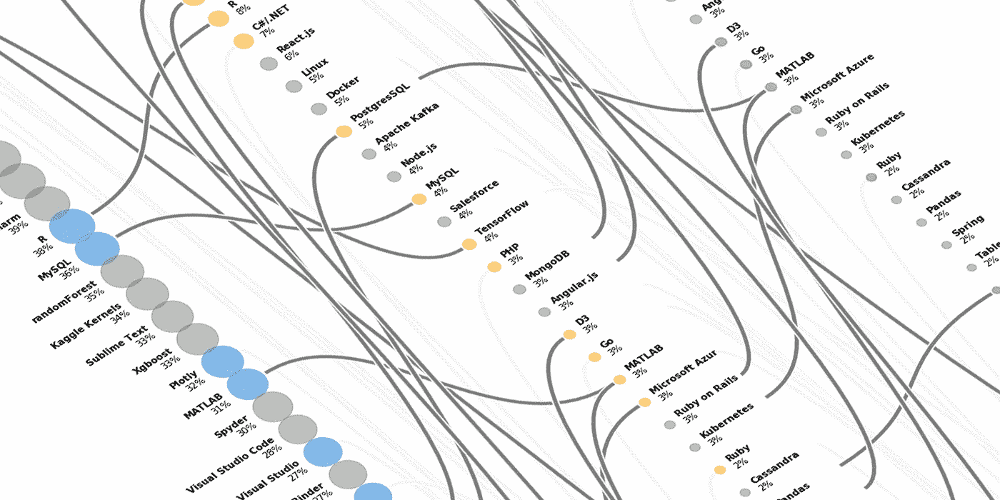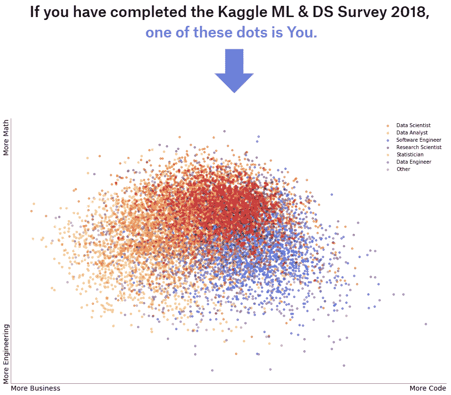

The Data Science Community on Kaggle

## Kaggle 数据科学调查

如果你错过了，不要担心，你可以明年加入我们。拥有超过 20，000 名受访者的 **Kaggle ML & DS 2018** 是迄今为止对数据科学界状况进行的最重要、最广泛的调查之一。该数据集包含超过 50 个问题的答案，其中许多是多项选择甚至是自由文本，因此对于数据爱好者来说有一个巨大的游乐场可以探索。这篇文章是我作为 Kaggle 调查 2018 年挑战的一部分所做的内核[的抄本。](https://www.kaggle.com/mullervilmos/essential-data-skills-supply-and-demand)

# 我们就业吧！

这项研究的主题是**就业能力**，所以我的大部分探索将集中在社区的一个相当大的子集:那些已经就业并目前活跃在数据科学领域主要角色之一的人。

> ***就业能力*** *，名词*
> 
> 拥有就业市场上急需的技能。

在第一部分，我将使用精选的调查数据回答如下问题:

*   **在数据科学领域，哪些是最重要的角色？**
*   **这些角色的个性特征是什么？**
*   是什么让他们与众不同，与众不同？
*   对他们中的每一个人来说，最需要的技术技能是什么？

我认为，这些问题的答案与学生、失业者以及任何计划职业转型或简单提升自己的人尤其相关。希望这个内核的读者不同意下面的观点:

> *“我是学生，请不要问这些问题”*
> 
> 27 号回应者以自由形式回应

在第二部分中，我将重点关注每个角色特定的技术堆栈，比较它们在就业市场上的供求，并确定最有用的技能。

# 选择正确的角色

如果你是一名学生或刚刚开始职业生涯，仍然不确定要瞄准的技术技能，或者如果你是一名经验丰富的数据科学家，正在寻找提高就业市场机会的方法，第一步是确定所有可能性，并探索它们之间的差异。

## 绘制社区地图

我通过输入缺失值、转换为虚拟变量和标准化数值来清理数据。然后，我使用 [LDA](https://sebastianraschka.com/Articles/2014_python_lda.html) 执行监督的[降维](https://idyll.pub/post/dimensionality-reduction-293e465c2a3443e8941b016d/)并将结果特征向量映射到一个二维空间，同时马锡明聚类的分离。我在 LDA 中使用的特征集是基于我认为最能预测一个人日常工作活动的问题。

对产生的主成分的解释和轴的命名是高度主观的，因为它是多个特征的加权组合，并且可能太复杂而无法用简单的词语来描述。基于各个小组的最终位置，我喜欢将 **PC1(水平)**视为**业务(左)对代码(右)**轴，将 **PC2(垂直)**视为**工程(底部)对研究(顶部)**轴。

## 这些角色相对于彼此处于什么位置？

正如你可能注意到的第一张图片，集群明显重叠，这些角色的定义非常模糊。例如，**数据分析师**和**业务分析师**角色拥有大部分相同的特征，但在应用分析得出的结论方面略有不同。尽管有重叠，星团质心的位置揭示了一些有趣的模式。气泡的大小代表了群体的大小。

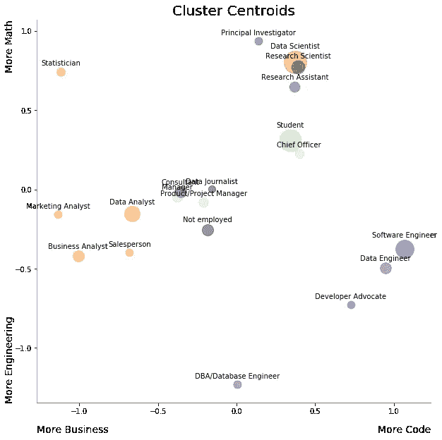

**观察结果**:

*   营销和业务角色在图表的中心左侧区域形成一个集群组，离密切相关的**管理**集群不远，这些集群使用**数据分析师**提供的报告和分析来做出数据驱动的业务决策。
*   学术角色，即**首席研究员**、**研究研究员**和**研究科学家**在图表的顶部中间部分形成一个紧密的集群组。从技术角度来看，他们与**数据科学家**的角色最为相似。
*   **学生**群体与其他学术角色关系密切，明显偏向于更实用的工程相关群体。
*   **数据库工程师**比预期的距离**数据工程师**集群更远。原因可能是这些角色包括大量的查询、报告生成和数据维护，这与业务集群组的工作更密切相关。
*   **学生**，以及**首席执行官**和**顾问**是**数据科学**社区中真正的多面手角色。我想象这些**首席执行官**作为前**数据科学家**现在领导一个**人工智能**或**大数据**驱动的创业公司。

## 他们每天都在做什么？

让我们通过工作方法来探讨这些角色。对于前 5 个类别，我计算了认为某项活动重要的人的百分比。

> 哪些活动是你工作中的重要组成部分？

由于代码编写的重要性，答案以百分比给出，所以我直接使用它们。

> *Q23:你在工作或学校中大约有百分之多少的时间是花在主动编码上的？*

彩色条表示与平均值的偏差，单位为百分点。方框旁边的小圆点表示该值是相关行中的最大值(蓝色)或最小值(红色)。

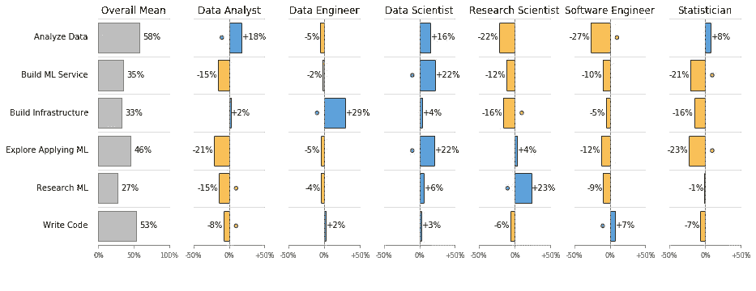

Main Activities

**观察结果**

*   这两个问题完美地抓住了角色的本质。大多数角色都有一个优点，数据科学家是个例外。他们对每一项活动都给予了高于平均水平的重视，并且是构建和探索 ML 解决方案的明确领导者。这支持了数据科学家应该精通多个领域的先入之见。

## 数据管道

现在让我们看看数据管道的每一步花费了他们多少时间。

> *Q34 —在数据科学项目中，您大约有多少时间用于以下活动？*

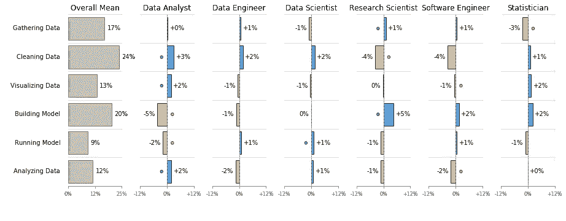

Working on the data pipeline

**观察结果**:

*   数据清理是数据管道中最重要的部分。**研究科学家**和**软件工程师**是幸运的人，他们的数据被端上了银盘。他们也是花最少时间分析它的人。

## 工具使用

他们使用什么样的工具和软件？

> *Q12 —您分析数据的主要工具是什么？*

Tool Usage

**观察结果**

*   统计学家在高级统计学领域遥遥领先。
*   **研究科学家**是使用其他类型软件包的领导者，这些可能是他们用于生物信息学、物理学、数学的特定领域软件。

## 黑盒模型？

不要。你只是学习不够！

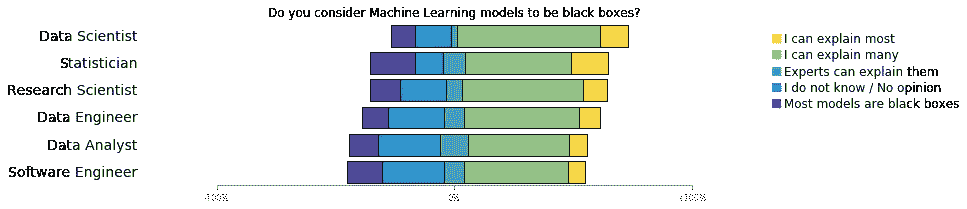

Black box models

**观察结果**

*   **统计学家**是拥有最多*万事通*和*一无所知类型*的领导者。
*   几乎每个数据科学家都对 ML 模型有多不透明或多黑有自己的看法，有点令人惊讶的是，数据分析师对这个问题最不感兴趣。

## 我离成为数据科学家还有多远？

让我们以**数据科学家**角色为参考，探讨其他角色与之相关的方式。问题 26 的答案有助于我们评估每个人的自我评估:

> *Q26 —你认为自己是数据科学家吗？*

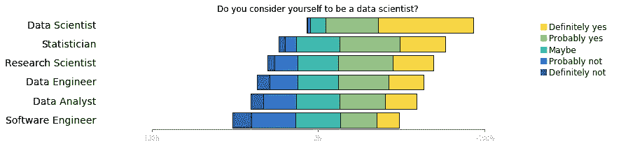

Self assessment

**观察结果**:

*   请注意，两个答案中的角色顺序完全相同。能够深刻理解**机器学习**模型是**数据科学家**的必备技能。
*   0 轴左侧的**数据科学家**是自我怀疑者。他们第一次被问到的时候挑了**数据科学家**的头衔，但是第二次面对问题的时候开始质疑自己的真实身份:“真的？你呢。看看你自己！你认为自己是数据科学家？”

我们可以通过计算聚类质心之间的[欧几里德距离](https://tekmarathon.com/2015/11/15/different-similaritydistance-measures-in-machine-learning/)，使用我们的 LDA 特征空间来估计每个角色与**数据科学家**角色的相似性。

现在，我们已经对每个角色需要什么有了一个大致的概念，并且已经看到了他们看待自己的方式，让我们彼此对照一下“自我评估”、感知的相似性以及每个角色与**数据科学家**角色之间的实际相似性。

气泡的大小代表团队的规模，X 轴代表团队到**数据科学家**角色的距离，通过自我评估(Q26 —你是数据科学家吗？)，Y 轴代表小组到**数据科学家**角色的距离。

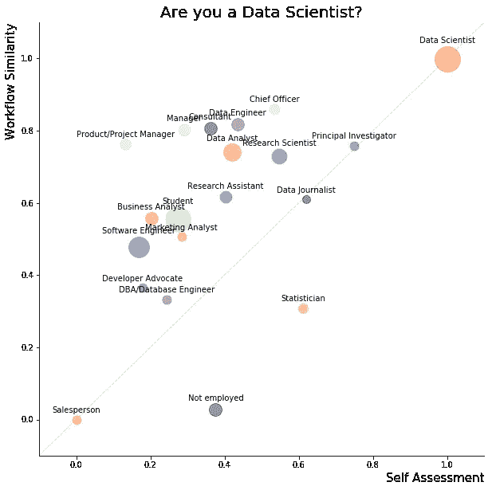

Self assessment vs. workflow similarity

## 观察结果:

*   大多数统计学家似乎认为自己是数据科学家，尽管上面的图表强调了这些差异。
*   另一方面，数据工程师似乎没有意识到他们的工作与 T42 的数据科学家有多么相似。

# 选择正确的技能

在接下来的几行中，我将深入挖掘关于**数据科学**就业市场的数据。我将 Kaggle 的调查数据与我目前正在处理的一个更大的数据集的一部分结合起来，这个数据集由 1500 多个与技术栈信息相关的数据职位组成。这些帖子是从过去两年的 StackOverflow 中搜集来的。我保留的唯一信息是标题和技术栈。将这组数据与调查结果进行比较，给了我一个绝佳的机会来探索社区如何满足数据工作市场的技能需求。

# 数据科学家的进化

**数据科学**是一个蓬勃发展、快速发展的领域，大多数相关技术和框架都是最近才出现的，尚未成熟。例如 [Tensorflow](https://www.tensorflow.org/) ，符号数学和神经网络技术的领导者，仅在 3 年前发布。鉴于**数据科学**技术堆栈的极度动态性，我将只关注 10 年经验以下的开发人员。我认为，在这个水平之上，技术栈在就业能力中发挥的作用越来越小，对掌握一套特定语言和技术的期望让位于不太可测的技能，如架构、管理、特定领域的经验等等。

因此，让我们看一下**数据科学家**的技能堆栈如何随着时间的推移而发展。我假设从零技能的“空白页面”开始，但是很少出现这种情况。通常，在开始使用代码进行数据分析之前，人们已经熟悉了一些编程语言。

我根据个人经历创建了 5 个小组:

*   实习生—不到 1 年
*   初级——1-2 岁
*   中级—3-5 年
*   高年级—5-10 岁
*   经验丰富—超过 10 年

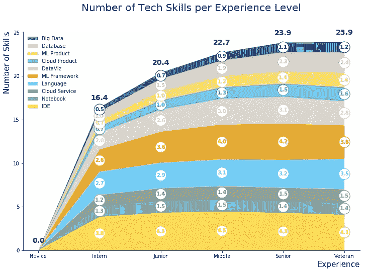

Number of tech skills per experience level

**观察结果**

*   学习曲线在开始时非常陡峭，但在高级阶段达到平稳。
*   有趣的是，**编程语言**是知识不会随着年龄增长而减少的一个类别。数据科学中使用的大多数语言已经存在了很长时间。 [SQL (1974)](https://en.wikipedia.org/wiki/SQL) ， [Python (1991)](https://en.wikipedia.org/wiki/Python_(programming_language) ， [Java (1995)](https://en.wikipedia.org/wiki/Java_(programming_language) 。

## 他们需要的技能

为了了解故事的另一部分，我们来看看与数据相关的职位发布的要求。我使用的原始数据集包含 30，000 多个条目。选择与**数据科学**领域相关的数据并不是一个简单的过程。我试图将选择限制在那些包含**机器学习**、**数据科学**或**大数据**相关术语的范围内。过滤后的结果可以在我发布在 **Kaggle** 上的数据集里找到。以下是需求数量百分比的细分:

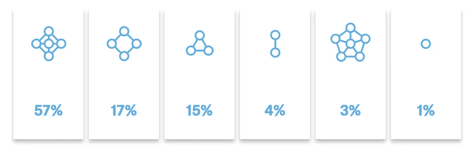

Number of skills required in job postings

**观察结果**:

*   快速浏览一下数据就会发现，超过 88%的职位描述要求至少具备 3 种不同的技能。超过 60%的人提到了申请人应该熟悉的 5 个不同的术语。

时间是有限的，所以我们必须仔细决定在哪些技能上投资，以使我们在就业市场上的机会最大化。下一节将通过分析这些技能在数据集中的出现频率来帮助我们选择这些技能。

## 学习 Python。没有借口。

我按照熟悉相关技术的用户百分比(供应)和提及该技术的工作需求百分比(需求)来可视化前 50 项技术。出现在两个列表中的技术用灰色丝带连接。灰色的技能是供应或需求栏中缺少的技能。

我决定不包括一些我觉得过于笼统的术语，但尽管如此，这些概念仍然是雇主要求的 50 件最重要的事情之一。按重要性排序:`Machine Learning`、`Big Data`、`Cloud`、`Sys Admin`、`Agile`、`Algorithm`、`NoSQL`、`Database`、`Data Science`、`REST`、`Deep Learning`、`Artificial Intelligence`、`Web-Services`、`Testing`、`Computer Vision`、`QA`、`Security`、`Automation`、`Design`、`Microservices`、`DevOps`、`Data Warehouse`、`NLP`、`Statistics`、`ETL`、`Data`、`ETL`、`Data`

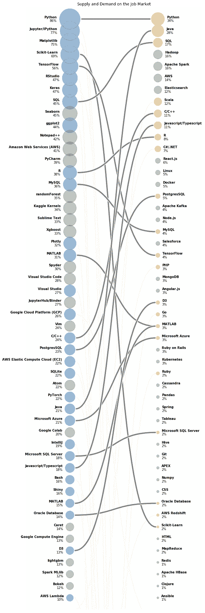

Supply and Demand of tech skills for data-related jobs

## 按角色划分的技能重要性

每项技能的重要性因角色而异，因此，尽管有一个概述很有用，但按职位细分供应和需求给了我们更有价值的洞察力:

Supply and Demand by role

**观察结果**:

*   学习 **Python** 。没有借口。熊猫[和 Numpy](https://pandas.pydata.org/) ，它最重要的数据争论库也出现在 50 强名单中。
*   大多数 T42 IDE、笔记本和数据可视化库在工作要求中从未提及。
*   另一方面， [Hadoop](https://hadoop.apache.org/) 、 [Spark](https://spark.apache.org/) 和 [Elasticsearch](https://www.elastic.co/) 是就业市场上最受欢迎的技术，但在调查中没有提到。其他出现在前 50 名的**大数据**技术还有: [Hive](https://hive.apache.org/) 、 [Cassandra](http://cassandra.apache.org/) 、 [Kubernetes](https://kubernetes.io/) 和 [Kafka](https://kafka.apache.org/) 。
*   Java 很重要，但是它在全球排名中的重要性可能被数据集中的大部分软件工程工作夸大了。同样的还有 **Javascript** 、 **React** 和 **Angular** 。之所以选择这些职位，是因为它们在某种程度上构成了数据管道的一部分，但它们往往夸大了一些技术在名单中的存在。
*   没有对操作系统的使用情况进行调查，但是需要注意的是，在所有与数据相关的工作需求中，超过 5%的需求提到了 Linux。
*   [Tableau](https://www.tableau.com/) 在数据可视化工具的调查中没有被提及，尽管基于 **Google Trends** ，[它比最受欢迎的 **Python** dataviz 工具 **Matplotlib** 受欢迎程度高两倍多。它不受语言限制，用途广泛，易于学习，并且正在崛起。](https://trends.google.com/trends/explore?geo=US&q=learn%20tableau,learn%20matplotlib)
*   Git 和 T42 Docker 在我看来是不可或缺的工具。尽管它们只出现在列表的下半部分，但它们应该是开发人员首先需要掌握的技能之一。

# 学习顺序

没有哪个头脑正常的人会通过使用 MapReduce 或 Hadoop 来开始学习编程。他们说，在开始写小说之前，你首先需要学习 ABC。那么，如果学习这些技能有一个自然的顺序，我们能从数据中揭示这种潜在的顺序吗？

关联规则可能会给我们一些答案。**关联规则挖掘**的目标是根据项目的单独出现概率和同时出现概率来识别项目之间的共现模式。例如，如果 **RStudio** 出现在几乎所有出现 **R** 的堆栈中，但反之则不成立，我们可以假设 **R** 是 **RStudio** 的先决条件。这是一个在预定义的置信度阈值之上识别的关联的图表，边的权重表示置信度，节点的大小和垂直位置都表示特定技能的出现频率。

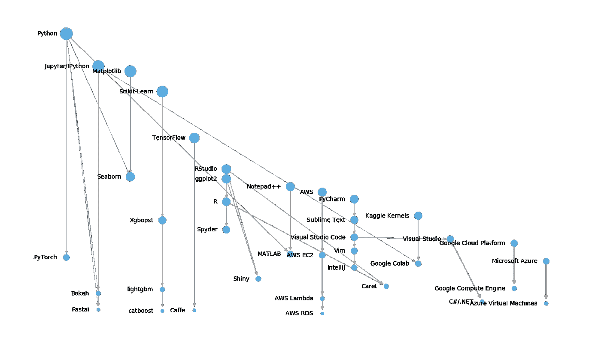

Tech skill learning order

**观察结果**

*   大多数确定的关联似乎是有效的先决条件关系，例如 **Seaborn** 是作为对 **Matplotlib** API 的抽象构建的，没有 **RStudio** 就没有 **Shiny** 。其他的，例如**张量流** — **Caffe** 是竞争关系，其中更受欢迎的选择(在这种情况下**张量流**)通常在学习不太受欢迎的之前已经被探索过。
*   [Xgboost](https://xgboost.readthedocs.io/en/latest/) 、 [lightgbm](https://github.com/Microsoft/LightGBM) 和 [catboost](https://github.com/catboost/catboost) 是先进的合奏工具，可以等到你觉得受到 [ScikitLearn](https://scikit-learn.org/stable/) 提供的可能性的限制。

## 数据科学家技术堆栈

现在让我们来看看每个经验等级最有可能的筹码数量。我们将使用一个简单的指标来衡量这一堆人的就业机会:我们得到**1 分**了解需求集的第一个技能，**2 分**第二个，**3 分**第三个，依此类推。这样更深的堆栈将得到适当的推动。最终得分是候选人在每项工作要求中得到的所有分数的总和。

当然，对少数技术的深入了解总是胜过对几种技术的肤浅熟悉，但是深度比广度更难衡量，所以我将坚持根据符合要求的技能数量来比较堆栈。

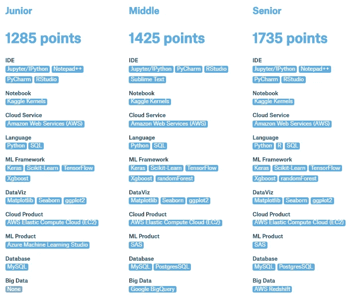

**观察结果**:

*   从初级**到中级**和**级**之间，最重要的改进是学习第二个数据库提供商。
*   在**中级**水平和**高级**水平之间，学习 **R** 开启了可能性。

## 现在让我们来看看数据分析师

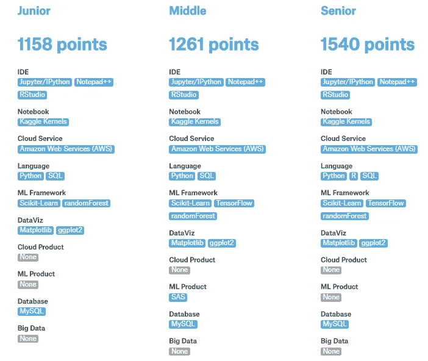

**观察结果**:

*   在**初级**和**中级**之间**张量流**给予最大的推动。
*   在**中级**和**高级**等级之间，增加了 **R** 似乎是进步，分数上升到 1500 以上。

## 我们来玩个游戏吧！

让我们以一个技能数量适中的**初级数据工程师**的身份开始游戏。我们知道下一级(**中级**)人员的平均技术水平，所以让我们从每个类别中挑选相同数量的技能，并尝试最大化我们的就业能力。然后，我们会将我们选择的结果与下一个级别人员的平均分数进行比较。

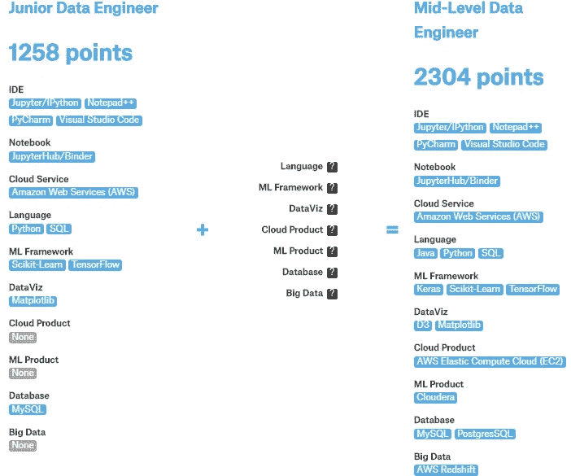

**观察结果**

*   一个**中级数据工程师**在 Kaggle 上的平均分是 **2198** 。另一方面，根据实际需求挑选的技能会得到 **2304** 的分数。
*   Java 显然是新堆栈中得分最高的技术。
*   增加的**PostgreSQL**和 **AWS 红移**是一个**数据工程师**的绝佳选择。
*   将 [D3](https://d3js.org/) 添加到堆栈中打开了数据可视化的可能性。
*   用 [Keras](https://keras.io/) 进行深度学习也是一项抢手的技能。

## 数据科学技术栈的皇家同花顺

如果我们从一张白纸开始，从零开始选择所有技能来填充高级数据科学家的堆栈，会发生什么？

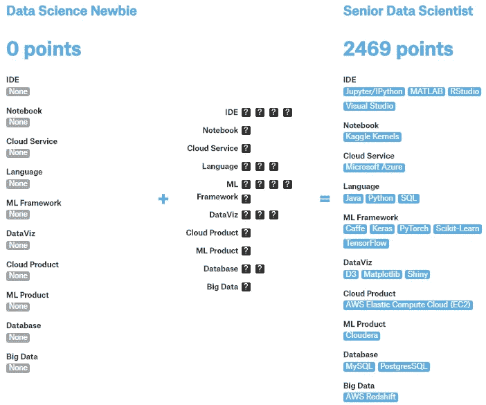

**观察结果**:

*   一个**资深数据科学家**在 Kaggle 上的平均分是 **1735** 。根据技能需求分数 **2469** 自由选择相同大小的筹码。
*   栈的核心是 **Python** 、 **Java** 和 **SQL** 。这三项涵盖了所有工作要求的 50%以上。
*   亚马逊网络服务也给了这个堆栈一个很好的提升。
*   [D3](https://d3js.org/) 、 [Matplotlib](https://matplotlib.org/index.html) 和 [Shiny](https://shiny.rstudio.com/) 涵盖了 **Javascript** 、 **Python** 和 **R** 中最重要的 dataviz 工具。
*   **PostgreSQL** 和 **MySQL** 是最流行的开源数据库，它们最大化了我们在这个领域的机会。

# 结论

*   选择合适的角色。如果你喜欢写代码，就成为**软件工程师**，如果你喜欢数学，就成为**统计员**，如果你是 DevOps 一类的人，就做**数据工程**，如果你喜欢数据可视化，做 EDA，就做**数据分析师**。如果这些你都想要，那就成为**数据科学家**！
*   选择合适的技能。 **Python** 、 **Java** 和 **SQL** 需求量大。 **Git** 、 **Docker** 和 **Linux** 必不可少。 **ScikitLearn** 、 **Tensorflow** 和 **Keras** 是 ML 库的领导者。 **Hadoop** 、 **AWS** 和 **Spark** 不容忽视。