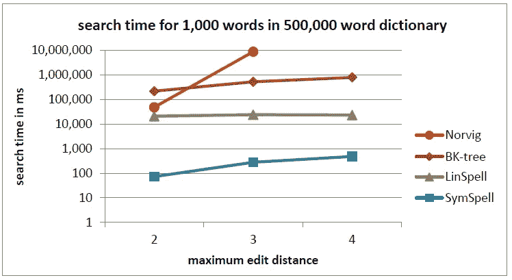

# NLP 任务的基本文本更正过程

> 原文：<https://towardsdatascience.com/essential-text-correction-process-for-nlp-tasks-f731a025fcc3?source=collection_archive---------3----------------------->


“person walking on sea near bridge during daytime” by [frank mckenna](https://unsplash.com/@frankiefoto?utm_source=medium&utm_medium=referral) on [Unsplash](https://unsplash.com?utm_source=medium&utm_medium=referral)

在之前的[故事](/correcting-your-spelling-error-with-4-operations-50bcfd519bb8)中，引入了 Norvig 的算法来纠正拼写错误。它使用了 4 种操作(即删除、转座、替换和插入)。在这个故事中，我想介绍另一种方法，只使用删除操作来找到潜在的正确单词。

在处理文本时，我们可能需要处理不正确的文本。尽管我们仍然可以使用[字符嵌入](/besides-word-embedding-why-you-need-to-know-character-embedding-6096a34a3b10)和[单词嵌入](/3-silver-bullets-of-word-embedding-in-nlp-10fa8f50cc5a)来计算类似的向量。它对看不见的数据和词汇表之外的东西很有用(OOV)。不过如果能纠正错别字就更好了。

看完这篇帖子，你会明白:

*   对称删除拼写纠正(SymSpell)
*   履行
*   拿走

# 对称删除拼写纠正(SymSpell)

Garbe 引入了对称删除拼写纠正(SymSpell)。这是一种简单但有用的纠正拼写错误的方法。

在离线训练期间，需要执行预先计算来建立语料库。用编辑距离生成 word(仅删除操作)并将它们与原始项目连接。换句话说，它使用额外的存储和内存资源来节省在线预测时间。如果匹配，新生成的单词将用于搜索并返回原始单词。在线预测时，输入单词经过同样的计算，然后从预先计算的结果中查找。你可以查看这个故事的细节。

速度方面的性能非常好，因为:

*   预计算是离线完成的。
*   在线预测只涉及删除操作和索引搜索(哈希表)



[https://github.com/wolfgarbe/symspell](https://github.com/wolfgarbe/symspell)

# 履行

为了方便拼写检查，需要语料库。为了便于演示，我简单地使用了 sklearn 库中的数据集，没有进行预处理。您应该使用特定领域的数据集来为您的数据构建更好的语料库。

*建立语料库*

```
from collections import Counter
from sklearn.datasets import fetch_20newsgroups
import recorpus = []
for line in fetch_20newsgroups().data:
    line = line.replace('\n', ' ').replace('\t', ' ').lower()
    line = re.sub('[^a-z ]', ' ', line)
    tokens = line.split(' ')
    tokens = [token for token in tokens if len(token) > 0]
    corpus.extend(tokens)corpus = Counter(corpus)corpus_dir = '../../data/'
corpus_file_name = 'spell_check_dictionary.txt'symspell = SymSpell(verbose=10)
symspell.build_vocab(
    dictionary=corpus, 
    file_dir=corpus_dir, file_name=corpus_file_name)symspell.load_vocab(corpus_file_path=corpus_dir+corpus_file_name)
```

修正

```
results = symspell.correction(word='edwarda')
print(results)
```

输出是它将“edward”和“edwarda”标识为 1 个距离，而“count”是指原始语料库的频率。

```
[{'distance': 1, 'word': 'edward', 'count': 154}, {'distance': 1, 'word': 'edwards', 'count': 50}]
```

除了单词校正，Symspell 还提供了一个复合词的距离计算。

```
results = symspell.corrections(sentence='Hello I am Edarda')
print(results)
```

与单字校正不同，复合函数支持拆分和分解操作。有关详细信息，您可以查看[符号拼写 API](https://github.com/wolfgarbe/symspell) 。

下面的输出计算与原始句子的总距离。给出“你好我是 Edarda”，它发现如果修正为“你好我是 ed 区”最短距离是 3。

```
[{'distance': 3, 'word': 'hello i am ed area'}]
```

# 拿走

要访问所有代码，你可以访问我的 github repo。

*   和拼写校正器一样，符号拼写**不考虑上下文**，而仅仅考虑拼写。
*   由于方法简单，**搜索时间复杂度为 O(1)** 为常数时间。
*   允许更大的编辑距离会引入更大的词汇，并导致更大的硬盘和内存消耗，但在当前的资源规模下应该没问题。

# 关于我

我是湾区的数据科学家。专注于数据科学、人工智能，尤其是 NLP 和平台相关领域的最新发展。你可以通过[媒体博客](http://medium.com/@makcedward/)、 [LinkedIn](https://www.linkedin.com/in/edwardma1026) 或 [Github](https://github.com/makcedward) 联系我。

# 参考

[C #中的符号拼写](https://github.com/wolfgarbe/symspell)(原始)

[python 中的符号拼写](https://github.com/mammothb/symspellpy)