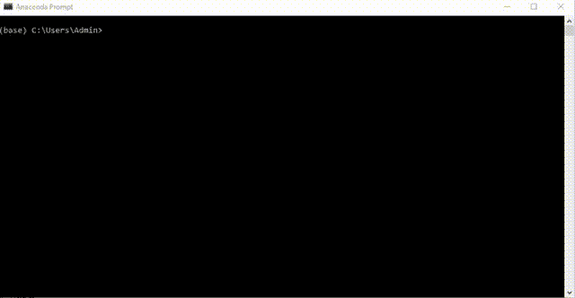
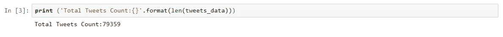
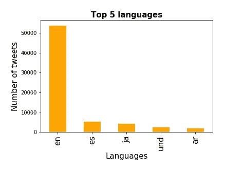
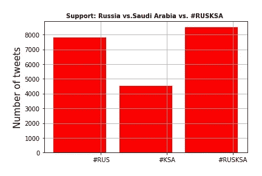
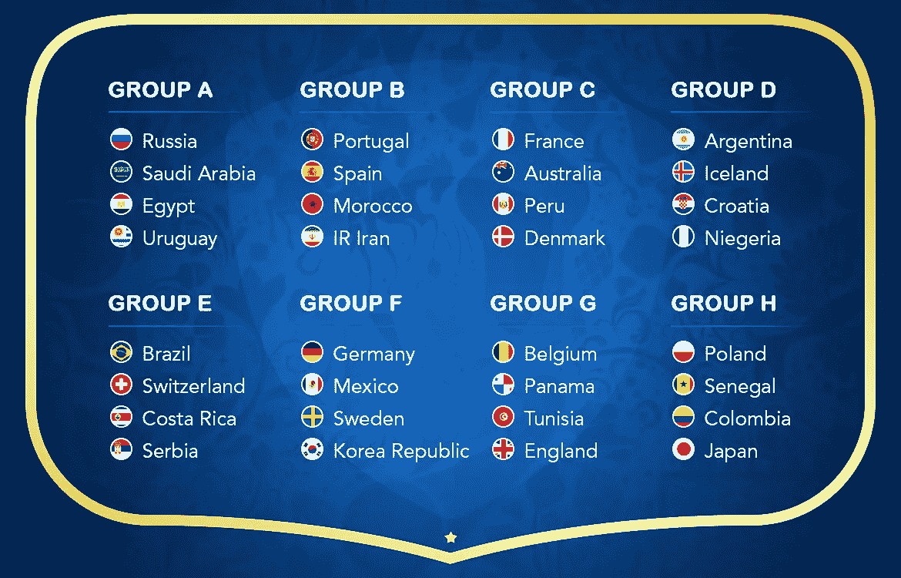

# 通过抓取推文找到 2018 年 FIFA 世界杯最喜欢的球队

> 原文：<https://towardsdatascience.com/estimate-the-favorite-scraping-tweets-using-python-863303384e29?source=collection_archive---------9----------------------->

**source**: [blog.cpdfootball.de](http://blog.cpdfootball.de/2017/12/01/fifa-world-cup-russia-2018-final-draw-conducted-in-moscow/)

> 足球运动员和数据科学家的工作展示了相同的工作-生活设置，即技能和意志的组合*。*

*6 月 14 日前夕，一个备受赞誉的所有足球爱好者的宗教节日——**2018 年 FIFA 世界杯**在俄国拉开帷幕。这个月久负盛名的体育盛宴将在全球范围内庆祝，直到 7 月 15 日的大结局。*

*抓住这个机会，我测试了我新发现的技能，以判断在给定的比赛中两个竞争团队中谁将是最受欢迎的。*

> ****你将在这里学到的东西*** :*

1.  *如何从 Twitter 上抓取数据？*
2.  *数据挖掘*

> ***先决条件:***

1.  *Tweepy 库应该安装在您的计算机上。*

*2.访问 Twitter。如果您还没有帐户，请创建一个帐户。*

*抓取文本数据是自然语言处理的一个组成部分。当手头的任务是分析情绪时，Twitter 是一个非常实用的平台。*

> ***思维过程:***

**

***source**: [www.nocodewebscraping.com](https://nocodewebscraping.com/twitter-json-examples/)*

*这就是我们的方法——首先，我们将生成所需的凭证以利用 Twitter API，然后我们将编写 python 代码来提取实时推文，最后我们将通过选择相关的关键字来分析推文。*

*让乐趣开始吧…*

> ****抓取推文的分步指南****

## *A.为 Twitter API 生成凭据:*

***我**。访问 https://apps.twitter.com/**的[T21，用你的 twitter 凭证登录。](https://apps.twitter.com/)***

*****二。**点击**创建新应用*****

*****三**。输入必要的详细信息，然后点击“**创建您的 Twitter 应用程序*****

*****四**。在下一页，点击“ **API 密钥**选项卡，复制您的“API 密钥”和“ **API 秘密**”。(建议:务必在桌面上贴上这些凭证的便笺)***

*****V** 。向下滚动点击“**创建我的访问令牌**，复制你的“访问令牌”和“**访问令牌秘密**”。***

## ***B.通过 Python 代码连接到 Twitter API:***

***下面是您需要的代码，以便连接到 Twitter 上的实时推流，并将它们下载到您的机器上。***

*   ***注意:编码时使用 Python 2.7 版本。***

***一旦您在命令提示符下执行代码(对于 windows 用户)，您将看到下面的数据流。***

******

*****Live Streaming Tweets*****

## ***C.分析数据:***

***在命令行下输入保存下载的推文。***

> ***python Twitter _ streaming . py > Twitter _ data . txt***

***为了理解锦标赛揭幕战的极性方向，我定期(在 6 月 13 日和 14 日)运行该程序两天，以获得相当大且有意义的数据样本。我可以在上面提到的时间段内抓取 79，359 条大小为 450 MB 的推文。***

******

***您可以根据业务案例的需要从原始文本中提取尽可能多的见解。比如说。这是写推特的一种语言。在底部找到这个练习的 Jupyter 笔记本。***

******

***由于第一场比赛是在东道主俄罗斯和对手沙特阿拉伯之间，我选择了以下关键词。***

*   ***国际足联，世界，世界杯，足球，国际足联世界杯，#FIFA2018***
*   ***世界杯，#WorldCup2018，#FifaWorldCup，***
*   ***#FIFAWorldCup，RUSKSA，#RUSKSA，预测，赢，#FIFA。***

***为了估计这两个帖子中哪一个是最受欢迎的，用#RUS、#KSA 和#鲁斯卡作为目标推文，并分离结果。***

******

*****Final Outcome*****

***令人惊讶是，比赛结果也与公众情绪一致。当俄罗斯人痛击平庸的沙特人时！***

> ***俄罗斯 5 比 0 沙特阿拉伯***
> 
> ***多么片面的事情啊！***

***你还在等什么，还有 63 场比赛要打。玩得开心！！下面是参加本届世界杯的球队的信息图。 [**在这里**](https://www.fifa.com/worldcup/matches/) 你可以找到所有比赛的赛程。***

******

*****FIFA WC 2018 Qualified Teams** . source: [www.Ivacy.com](https://www.ivacy.com/blog/watch-fifa-world-cup-2018-online-free/)***

> *****朱庇特笔记本**:***

***希望你喜欢这篇文章。所以，释放你的爱和情感吧，这将根据你点击拍手图标的次数来估算。**# seeyou next time #直到那时****# KeepLearningNewThings*****

> *****参考文献**:***

1.  ***[十二页文档](http://docs.tweepy.org/en/v3.5.0/)***
2.  ***[Twitter 流媒体 API — Python &代码！](https://www.youtube.com/watch?time_continue=7&v=bmdM-sezWGg)***

> *****更多阅读:*****

***如果你喜欢我的文章，那就花几分钟看看我的其他博客吧-***

1.  ***[**什么是探索性数据分析？**](/exploratory-data-analysis-8fc1cb20fd15)***
2.  ***[**K 表示聚类:在陌生人的世界里识别 F . r . I . e . n . d . s**](/k-means-clustering-identifying-f-r-i-e-n-d-s-in-the-world-of-strangers-695537505d)***
3.  ***[**决策树—数据科学家破解哈姆雷特困境的灵丹妙药**](/decision-tree-data-scientists-magic-bullet-for-hamletian-dilemma-411e0121ba1e)***