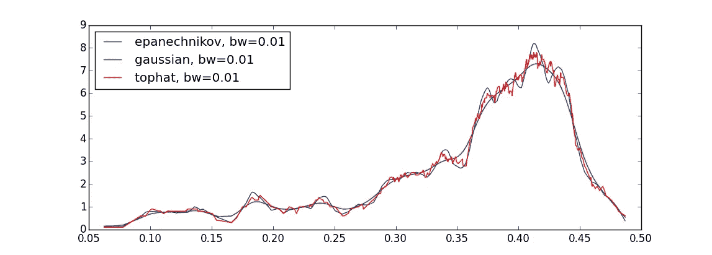
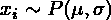
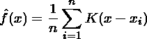
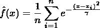
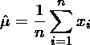
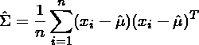
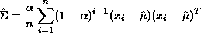

# 估计分布:非参数

> 原文：<https://towardsdatascience.com/estimating-distributions-nonparametric-713ccf0647b?source=collection_archive---------14----------------------->



Taken from [here](https://stats.stackexchange.com/questions/218514/how-to-decide-whether-a-kernel-density-estimate-is-good)

这篇文章是我深入研究如何优化投资组合配置的系列文章的一部分。本系列解释了我的开源投资组合优化库 [OptimalPortfolio](https://github.com/VivekPa/OptimalPortfolio) 背后的数学和设计原则。第一篇文章[是关于寻找市场不变量的。这样做之后，我们现在必须估计市场不变量的分布，以便从中提取有用的信息。](/market-invariants-can-there-really-be-predictive-power-in-market-data-6eefc1b4a2ab)

估计数据的统计特性是一个深入研究的领域。困难出现在几个方面:

1.  选择我们假设数据是从哪个分布产生的。
2.  使得估计器稳健，使得它们对数据的变化不太敏感。
3.  将数据拟合到所选择的分布，以有效地获得最佳估计。
4.  确保估计值能很好地推广到总体，而不仅仅是样本数据。

在我们进一步讨论之前，我们需要对这里的一些术语进行形式化。

## 估计量

给定从具有固定参数的某个分布生成的数据样本，



为简单起见，我们假设分布可以完全由均值和方差(或标准差)来表征。现在，估计量实质上是使用样本数据计算的分布的均值和方差的估计。可以想象，这个问题与数据的结构、数据点的数量、数据点是如何生成的以及是否有任何缺失值紧密相关。

考虑到这些问题，有许多方法可以从数据中找到估计值。我将它们分为如下三类:

1.  非参数—当有大量数据时，这种方法很有效。
2.  最大似然-当数据集较小时，这比非参数更有效
3.  收缩-这最适用于高维或非常小的数据集

因为在一篇文章中讨论这三种方法会使文章太长，所以在这篇文章中，我们探讨非参数估计量。在后续文章中，我将深入讨论另外两种估算方法。

## 非参数的

非参数估计量顾名思义。这些估计量并不局限于任何特定的参数化分布。相反，只考虑数据，并将分布建模为经验分布。经验分布本质上是在每个数据点都有一个核函数的分布。这个核函数被经典定义为狄拉克δ函数。然而，由于使用 Dirac delta 函数进行计算的困难，现代实现考虑高斯核。换句话说，经验分布是对于每个数据点



在我们的例子中，我们让核函数 K 是高斯函数，所以



其中参数γ被认为是平滑参数，它可以被认为是每个数据点处的高斯分布。很容易证明，这种经验分布将产生与样本均值和方差相等的均值和方差。因此，



经验分布似乎很简单，很容易理解。这可以实现为

```
def sample_mean(invariants, frequency=252):
    *"""
    Calculates sample mean.
    """
*    daily_mean = invariants.mean()
    return daily_mean*np.sqrt(frequency)

def sample_cov(invariants, frequency=252):
    *"""
    Calculates sample covariance
    """*
    daily_cov = invariants.cov()
    return daily_cov*frequency
```

当我们试图改进它以解决各种错误时，困难就来了。首先，让我们关注经验分布的局限性。

## 限制

非参数估计受到许多限制。首先，为了获得真实均值和方差的合理估计，我们需要大量的数据。对数据的大量需求是由于大数定律。该定律指出，随着数据点的数量趋于无穷大，样本均值和样本方差将趋于总体均值和总体方差(有些情况超出了本文的范围)。换句话说，如果我们有一个无限的数据集，那么非参数估计量将是估计总体统计量的最佳方法。然而，在现实生活中，数据并不总是足够的(也不是无限的)。这导致非参数估计失去准确性，成为一个坏的估计。

非参数估计的另一个限制是对数据的敏感性。考虑添加或更改单个数据点会如何影响平均值和方差的估计值。直觉上，一个数据点的微小变化不会显著改变总体的均值和方差。然而，非参数估计的情况并非如此。因为它们完全依赖于数据来导出均值和方差，所以数据点的微小变化会导致估计值的不小变化。这可以用估计量的崩溃点来形式化。估计量的崩溃点被定义为为了改变估计量的值而要改变的数据点的最小比例。这实质上衡量了我们刚才讨论的内容。非参数估计量的崩溃点显然是 1/n，这在稳健统计领域被认为是不好的。

## 改进非参数

使用非参数估计量的好处是对基础分布的性质没有任何假设。所以，在寻找估计量时，这将给我们最一般的结果。虽然它有局限性，但我们想看看我们是否能保持它的一般性质。

一个可能的扩展是给不同时期的数据一些权重的概念。换句话说，我们对不同时间点的数据有不同的评价。这方面的一个例子是指数加权协方差估计。我最近在[这篇文章](https://reasonabledeviations.science/2018/08/15/exponential-covariance/)中读到了这一点，看起来很有希望。这个概念类似于`pandas.ewm` ，其中每个先前的时间步长被赋予一个较小的权重，通常是小于 1 的某个数的幂。



这可以如下实现

```
def exp_cov(invariants, span=180, frequency=252):
    *"""
    Calculates sample exponentially weighted covariance
    """*
    assets = invariants.columns
    daily_cov = invariants.ewm(span=span).cov().iloc[-len(assets):, -len(assets):]
    return pd.DataFrame(daily_cov*frequency)
```

注意，权重不需要总是指数的或有序的。考虑这样一种情况，您可能想要估计协方差矩阵，但是数据部分中存在一些波动性聚类。一种方法可能是对聚类内的值给予较大的权重，而对聚类外的值给予较小的权重。这种方法的局限性在于，它需要针对每个数据集进行调整，当数据集非常大时，这可能会变得计算量很大。

## 结论

总的来说，我们发现定义的估计量是生成数据的基础分布的参数的“估计”。然后，我们讨论了有三种类型的估计:非参数，极大似然和收缩估计。我们探讨了非参数估计量以及如何在 python 中实现它。考虑到它的一些局限性，我们从一篇文章中得到启发，提出了指数加权协方差的扩展，并实现了它。

展望未来，我们将探索最大似然估计量，它们如何优于非参数估计量，以及在什么情况下应该使用它们。