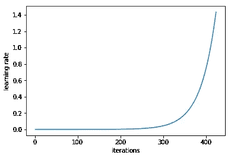
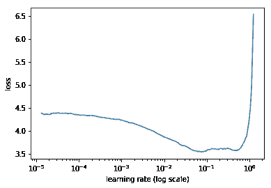
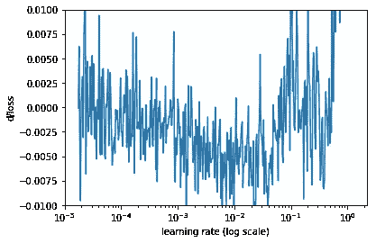
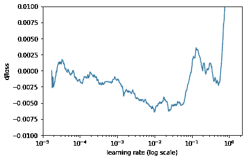

# 估计深度神经网络的最佳学习速率

> 原文：<https://towardsdatascience.com/estimating-optimal-learning-rate-for-a-deep-neural-network-ce32f2556ce0?source=collection_archive---------1----------------------->

学习率是用于训练深度神经网络的最重要的超参数之一。

在这篇文章中，我正在描述一个简单而强大的方法来找到一个合理的学习率，这是我从 [fast.ai 深度学习课程](http://www.fast.ai/)中学到的。我正在三藩市[大学](https://www.usfca.edu/data-institute/certificates/deep-learning-part-one)亲自参加新版本的课程。它还没有对公众开放，但将于今年年底在 [course.fast.ai](http://course.fast.ai/) (目前有去年的版本)上发布。

# 学习率如何影响培训？

深度学习模型通常由随机梯度下降优化器训练。随机梯度下降有很多变种:Adam，RMSProp，Adagrad 等。它们都可以让你设定学习速度。该参数告诉优化器在与小批量梯度相反的方向上移动权重的距离。

如果学习率低，那么训练更可靠，但是优化将花费大量时间，因为朝向损失函数的最小值的步骤很小。

如果学习率很高，那么训练可能不收敛，甚至发散。重量变化可能如此之大，以至于优化器超过了最小值，使损失更严重。

训练应该从相对较大的学习率开始，因为在开始时，随机权重远非最佳，然后学习率可以在训练期间降低，以允许更细粒度的权重更新。

有多种方法可以为学习速度选择一个好的起点。一个天真的方法是尝试几个不同的值，看看哪个给你最好的损失，而不牺牲训练速度。我们可以从一个像 0.1 这样的大值开始，然后尝试指数级的低值:0.01、0.001 等等。当我们以较大的学习率开始训练时，当我们运行训练的最初几次迭代时，损失不会改善，甚至可能增加。当以较小的学习速率训练时，在某个点，损失函数值在最初几次迭代中开始下降。这个学习率是我们可以使用的最大值，任何更高的值都不会让训练收敛。甚至这个值也太高了:它不足以训练多个时期，因为随着时间的推移，网络将需要更细粒度的权重更新。因此，开始训练的合理学习率可能会低 1-2 个数量级。

# 一定有更聪明的方法

Leslie N. Smith 在 2015 年的论文“[训练神经网络的循环学习率](https://arxiv.org/abs/1506.01186)”的第 3.3 节中描述了一种为神经网络选择学习率范围的强大技术。

诀窍是从低学习率开始训练网络，并为每一批以指数方式增加学习率。

Learning rate increases after each mini-batch

记录每批的学习率和培训损失。然后，画出损失和学习率。通常情况下，它看起来像这样:

The loss decreases in the beginning, then the training process starts diverging

首先，在低学习率的情况下，损失改善缓慢，然后训练加速，直到学习率变得太大，损失增加:训练过程出现偏差。

我们需要在图上选择一个损失减少最快的点。在这个例子中，当学习率在 0.001 和 0.01 之间时，损失函数快速减小。

查看这些数字的另一种方法是计算损失的变化率(损失函数相对于迭代次数的导数)，然后在 y 轴上绘制变化率，在 x 轴上绘制学习率。

Rate of change of the loss

它看起来太吵了，让我们使用简单移动平均来平滑它。

Rate of change of the loss, simple moving average

这个看起来更好。在这张图上，我们需要找到最小值。接近 lr=0.01。

# 履行

杰瑞米·霍华德和他在 [USF 数据研究所](https://www.usfca.edu/data-institute)的团队开发了 [fast.ai](https://github.com/fastai/fastai) ，这是一个深度学习库，是 PyTorch 之上的高级抽象。这是一个易于使用但功能强大的工具集，用于训练最先进的深度学习模型。杰里米在深度学习课程的最新版本( [fast.ai](http://www.fast.ai/) )中使用该库。

该库提供了学习率查找器的实现。您只需要两行代码来绘制您的模型在学习率上的损失:

该库没有绘制损失函数变化率的代码，但计算起来很简单:

请注意，在训练之前选择一次学习率是不够的。最佳学习率在训练时下降。您可以定期重新运行相同的学习率搜索过程，以便在培训过程的稍后时间找到学习率。

## 使用其他库实现方法

我还没有看到像 Keras 这样的其他库准备使用这种学习率搜索方法的实现，但是写起来应该很简单。只需多次运行培训，一次一个小批量。每次小批量后，通过乘以一个小常数来提高学习率。当损耗大大高于先前观察到的最佳值时(例如，当当前损耗>最佳损耗* 4 时)，停止该程序。

# 事情还不止这些

选择学习率的起始值只是问题的一部分。另一个需要优化的是学习进度:如何在训练中改变学习率。传统观点认为，学习率应该随着时间的推移而降低，并且有多种方式来设置这一点:当损失停止改善时的逐步学习率退火、指数学习率衰减、余弦退火等。

我上面提到的论文描述了一种循环改变学习率的新方法。该方法提高了卷积神经网络在各种图像分类任务中的性能。

如果你知道训练深度神经网络的其他有趣的技巧和诀窍，请给我发消息。

另请参见:

 [## Fast.ai:我从第 1-3 课中学到了什么

### Fast.ai 是一个非常棒的深度学习课程，适合那些喜欢通过做来学习的人。与其他课程不同，在这里您将…

hackernoon.com](https://hackernoon.com/fast-ai-what-i-learned-from-lessons-1-3-b10f9958e3ff)  [## 深度学习新闻的最佳来源

### 深度学习领域非常活跃，可以说每周都有一两个突破。研究论文…

medium.com](https://medium.com/@surmenok/best-sources-of-deep-learning-news-fbc98815bad3)  [## 杰夫·迪恩关于大规模深度学习的演讲

### 杰夫·迪恩是谷歌高级研究员。他领导谷歌大脑项目。2017 年 8 月在 Y Combinator 演讲。的…

becominghuman.ai](https://becominghuman.ai/jeff-deans-talk-on-large-scale-deep-learning-171fb8c8ac57)