# 用 Python 中的贝叶斯模型估计概率

> 原文：<https://towardsdatascience.com/estimating-probabilities-with-bayesian-modeling-in-python-7144be007815?source=collection_archive---------0----------------------->


([Source](https://www.adventure-journal.com/2016/03/where-bears-have-the-right-of-way/))

## 概率编程在 Python 中的一个简单应用

像最好的项目一样，它从几条推特开始:

Twitter is a [great resource for data science](https://www.becomingadatascientist.com/2015/10/04/how-to-use-twitter-to-learn-data-science-or-anything/)!

这似乎是一个简单的问题——患病率与观察到的数据完全相同(50%的狮子，33%的老虎和 17%的熊),对吗？如果你相信我们所做的观察是对潜在真理的完美再现，那么是的，这个问题再简单不过了。然而，[作为一个贝叶斯](https://rationalwiki.org/wiki/Bayesian)，这种世界观以及随后的推理却令人深感不满。

首先，我们如何确定这一次去保护区的旅行代表了所有的旅行？如果我们在冬天熊冬眠的时候去呢？考虑到有限的数据，我们需要将*不确定性*纳入我们的估算中。第二，我们如何将*先前*对形势的信念整合到这个估计中？如果我们从朋友那里听说保护区里每种动物的数量相等，那么这肯定会在我们的估计中起一些作用。

> 幸运的是，有一个解决方案可以表达不确定性*并且*将先验信息整合到我们的估计中:贝叶斯推理。

在本文中，我们将在学习概率分布、[贝叶斯推理](https://en.wikipedia.org/wiki/Bayesian_inference)和[基本概率规划](https://github.com/CamDavidsonPilon/Probabilistic-Programming-and-Bayesian-Methods-for-Hackers)以及 [PyMC3](https://docs.pymc.io/api.html) 的过程中，探索在贝叶斯框架中从数据中估计概率的问题。完整的代码可以从 GitHub 上的 [Jupyter 笔记本中获得。](https://github.com/WillKoehrsen/probabilistic-programming/blob/master/Estimating%20Probabilities%20with%20Bayesian%20Inference.ipynb)

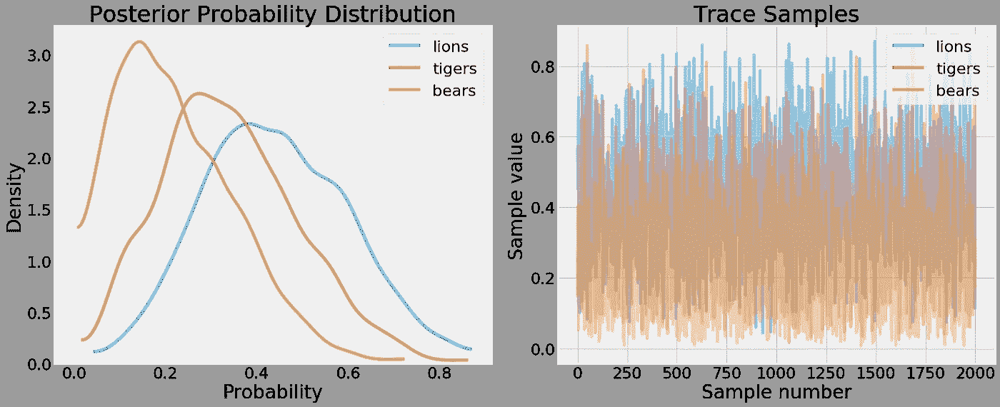

PDF and trace values from PyMC3

# 背景:概念

通常，特别是在统计学中，我发现解决方案背后的理论比实际解决问题更令人困惑。(我相信统计学家为了证明统计数据的存在而将其复杂化。)对我来说，编码一个答案并可视化解决方案通常比阅读无尽的方程更有用。因此，当我着手解决这个问题时，我研究了足够的想法来编码一个解决方案，只有在之后的*我才重新挖掘概念。*

这反映了我一般的 [*自上而下*学习新话题](https://course.fast.ai/about.html)的方法。不要从基础开始——这通常是乏味和难以理解的——找出如何实现一个想法，这样你就知道*为什么它是有用的*,然后回到形式主义。所以，如果你觉得自己对这个理论感到沮丧，继续寻找解决方案(从下面的推理部分开始)，如果你仍然感兴趣，再回到概念上来。

(这种自上而下的哲学在关于深度学习的优秀 fast.ai 课程中得到了体现。除了有效地教授神经网络之外，这些课程还对我学习新技术的方法产生了影响。)

# 贝叶斯模型

因为我们想用贝叶斯方法解决这个问题，所以我们需要构建一个情境模型。基本的设置是我们有一系列的观察结果:3 只老虎，2 只狮子和 1 只熊，从这些数据中，我们想估计野生动物保护区中每个物种的流行程度。也就是说，我们正在寻找在给定数据的情况下看到每个物种的后验概率。

在我们开始之前，我们想建立我们的假设:

*   把对一个物种的每一次观察当作一次独立的试验。
*   我们最初(先前)的信念是每个物种都有平等的代表。

整个系统是一个多项分布**，其中我们有 3 个**离散的**选择(物种),每个选择具有未知的概率和 6 个总观察值。多项式分布是二项式分布在有两个以上结果的情况下的扩展。多项式的一个简单应用是掷骰子 5 次，每次有 6 种可能的结果。**

具有 3 个离散结果的多项式的[概率质量函数](https://en.wikipedia.org/wiki/Probability_mass_function)如下所示:

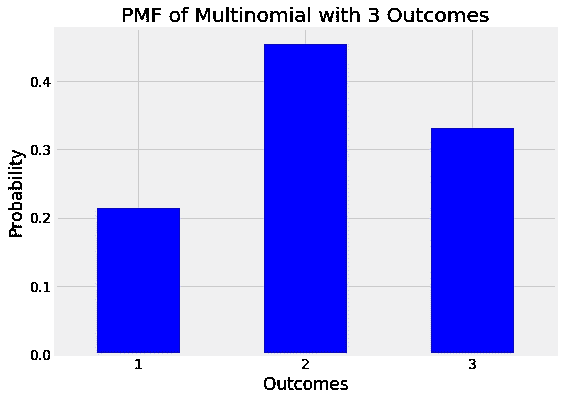

Probability Mass Function (PMF) of a multinomial with 3 outcomes

多项式分布的特征是 k，即结果的数量，n，即试验的数量，以及 **p** ，即每个结果的概率向量。对于这个问题， **p** 是我们的终极目标:我们想从观测数据中算出看到每个物种的概率。在贝叶斯统计中，多项式的参数向量从形成参数先验分布的**狄利克雷分布**中提取。

反过来，狄利克雷分布的特征在于，k(结果的数量)和**α**(称为浓度参数的正实值向量)。这被称为**超参数**，因为它是先前 **的*参数。(***这个链可以继续下去:如果 **alpha** 来自另一个发行版，那么这就是一个*超优先级*，它可以有*自己的参数*称为*超超参数*！).我们将通过显式设置 alpha 的值来停止我们的模型，每个结果都有一个条目。

## 超参数和先验信念

将 Dirichlet 参数向量视为伪计数的最佳方式是，在收集实际数据之前对每个结果进行观察。这些假计数*捕捉了我们对情况*的先验信念。例如，因为我们认为在进入保护区之前，每种动物的流行程度是相同的，所以我们将所有的阿尔法值设置为相等，比如说**阿尔法**=【1，1，1】。

相反，如果我们希望看到更多的熊，我们可以使用像[1，1，2]这样的超参数向量(顺序是[狮子，老虎，熊])。伪计数的确切值反映了我们对先前信念的信心水平。较大的伪计数将对后验估计值产生较大的影响，而较小的值将产生较小的影响，并将让数据支配后验估计值。当我们进入推理时，我们会看到这一点，但现在，记住超参数向量是伪计数，反过来，它代表我们先前的信念。

具有 3 个结果的狄利克雷分布如下所示，具有不同的超参数向量值。颜色表示浓度权重。

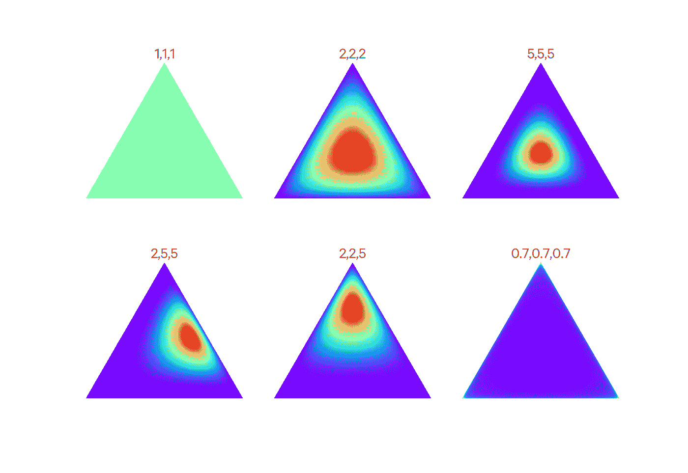

Effect of the hyperparameter vector alpha on the Dirichlet Distribution ([source](https://frnsys.com/ai_notes/machine_learning/bayesian_learning.html)).

还有很多细节我们不需要在这里深入讨论，但是如果你仍然好奇，可以看看下面列出的一些资源。

我们的最终目标是根据数据和超参数，估计观察到每个物种的概率的后验分布， **p** :

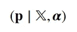

The posterior distribution of the parameter is our objective. X is observations and alpha is hyperparameters.

我们的最终模型由具有狄利克雷先验的多项式分布组成，称为狄利克雷多项式，如下所示:

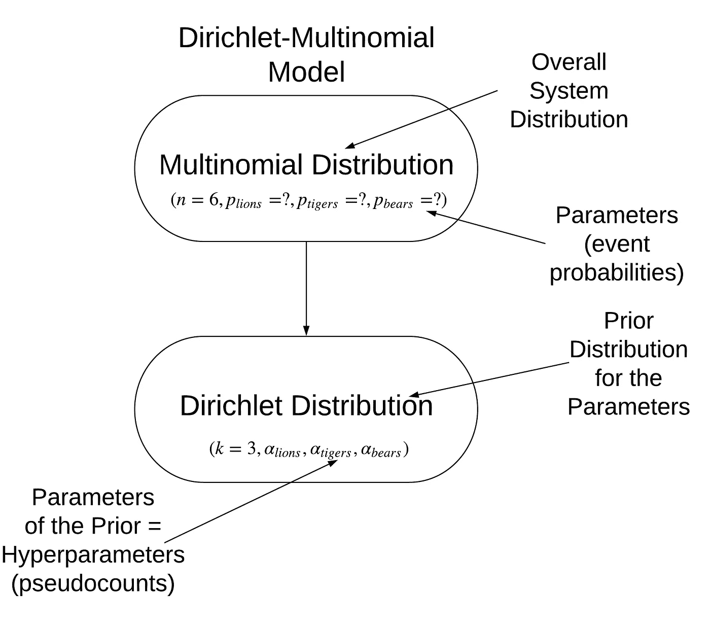

Model of problem

下面是问题细节的摘要:

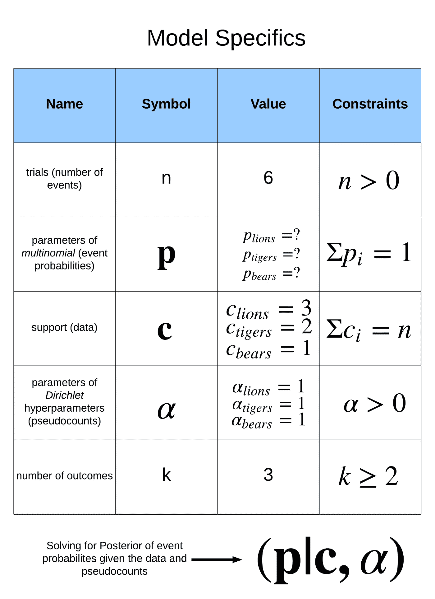

Model specifics

如果你还想要更多的背景细节，这里是我所依赖的一些来源(第一个可能是最有价值的):

**来源:**

1.  [狄利克雷多项式的贝叶斯推断](http://users.cecs.anu.edu.au/~ssanner/MLSS2010/Johnson1.pdf)
2.  [分类数据/多项式分布](http://christianherta.de/lehre/dataScience/bayesian/Multinomial-Dirichlet.slides.php)
3.  [狄利克雷-多项式维基百科文章](https://en.wikipedia.org/wiki/Dirichlet-multinomial_distribution#Dirichlet-multinomial_as_a_compound_distribution)
4.  [多项分布维基百科文章](https://en.wikipedia.org/wiki/Multinomial_distribution)
5.  [狄利克雷分布中的阿尔法](https://stats.stackexchange.com/questions/244917/what-exactly-is-the-alpha-in-the-dirichlet-distribution/244946)
6.  [狄利克雷分布维基百科文章](https://en.wikipedia.org/wiki/Dirichlet_distribution)
7.  [超参数维基百科文章](https://en.wikipedia.org/wiki/Hyperparameter)
8.  [推导狄利克雷多项式的 MAP 估计](https://stats.stackexchange.com/questions/304148/deriving-the-map-estimate-for-multinomial-dirichlet)

还有其他方法来解决这个问题；艾伦·唐尼的解决方案产生了类似的结果。

# 推论:从数据中做出估计

现在我们有了问题的模型，我们可以使用贝叶斯方法来求解后验概率。[统计学中的推断](https://en.wikipedia.org/wiki/Statistical_inference)是从数据中估计(推断)一个概率分布的未知参数的过程。我们的未知参数是每个物种的流行程度，而数据是我们从野生动物保护区观察到的一组数据。我们的目标是找到看到每个物种的概率的后验分布。

我们推导后验概率的方法将使用贝叶斯推理。这意味着我们建立模型，然后用它从后验数据中*取样，用[马尔可夫链蒙特卡罗](/markov-chain-monte-carlo-in-python-44f7e609be98) (MCMC)方法近似后验数据*。当难以进行精确推断时，我们使用 MCMC，并且随着样本数量的增加，估计的后验收敛于真实的后验。

MCMC 的结果不仅仅是我们答案的一个数字，而是一系列样本，让我们量化我们的不确定性，尤其是在数据有限的情况下。我们将很快看到如何在 Python 中执行贝叶斯推理，但是如果我们想要一个单一的估计，我们可以使用分布的*期望值*。

## 预期值

期望值是后验分布的平均值。对于狄利克雷多项式，它可以用[解析地表示为](http://users.cecs.anu.edu.au/~ssanner/MLSS2010/Johnson1.pdf):

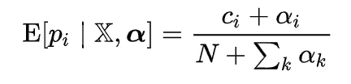

Expected value of a Multinomial with Dirichlet priors.

一旦我们开始输入数字，这个问题就很容易解决了。n 是试验次数，6，c_i 是每个类别的*观测计数*，alpha_i 是每个类别的*伪计数*(超参数)。设置所有α等于 1，可以计算预期物种概率:

```
species = ['lions', 'tigers', 'bears']
# Observations
c = np.array([3, 2, 1])
#Pseudocounts
alphas = np.array([1, 1, 1])expected = (alphas + c) / (c.sum() + alphas.sum())**Species: lions    Prevalence: 44.44%.
Species: tigers   Prevalence: 33.33%.
Species: bears    Prevalence: 22.22%.**
```

这代表了考虑了伪计数的预期值，伪计数代表了我们对情况的初始信念。

我们可以通过增加伪计数的大小来调整我们对这个先验信念的置信度。这迫使期望值更接近我们最初的信念，即每个物种的流行程度是相等的。几个不同超参数的预期值如下所示:

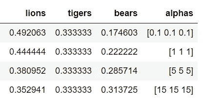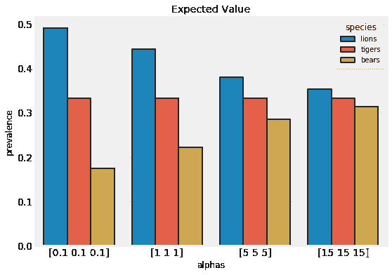

Expected values for different pseudocounts.

我们对超参数的选择有很大的影响。如果我们对自己的信念更有信心，那么我们就增加超参数的权重。另一方面，如果我们希望数据有更大的权重，我们就减少伪计数。

虽然这个结果提供了一个点估计，但它具有误导性，因为它没有表达任何不确定性。我们只去过一次野生动物保护区，所以在这些估计中应该有很大的不确定性。通过贝叶斯推理，我们可以得到点估计和不确定性。

# 用 PyMC3 实现 Python 中的贝叶斯推理

为了得到一个估计范围，我们使用贝叶斯推理，构建一个情境模型，然后*从后验样本中取样以近似后验。*这是通过 PyMC3 中的马尔可夫链蒙特卡罗(或一种更有效的变体，称为[不掉头采样器](https://arxiv.org/abs/1111.4246))实现的。与模型背后的理论相比，在代码中设置它很简单:

然后，我们可以从后面取样:

此代码在 2 个不同的链中从后部抽取 1000 个样本(丢弃 500 个用于调整的样本)。我们剩下一个`trace`，它包含了运行过程中抽取的所有样本。我们用这个轨迹来估计后验分布。

PyMC3 有许多方法来检查轨迹，如`pm.traceplot`:


PDF and trace of samples.

左边是采样参数的核密度估计——事件概率的 PDF。在右边，我们为模型中的每个自由参数绘制了完整的样本。我们可以从 KDE 看到，正如预期的那样，熊 pm.posterior_plot:

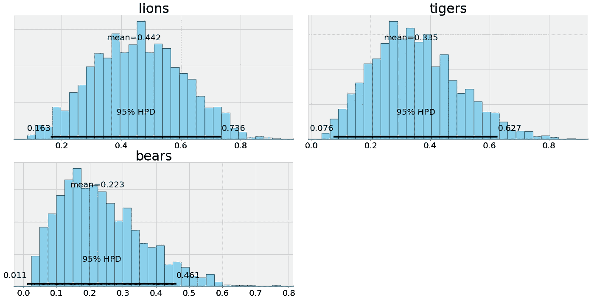

Posterior plots from PyMC3

下面是直方图，显示了从后验概率中采样每个概率的次数。我们有概率的点估计值——平均值——以及置信区间的贝叶斯等价值——95%的最高概率密度(也称为[可信区间](https://en.wikipedia.org/wiki/Credible_interval))。我们在这些估计中看到了极端程度的不确定性，这与有限的数据相符。

为了量化不确定性水平，我们可以得到结果的数据框架:

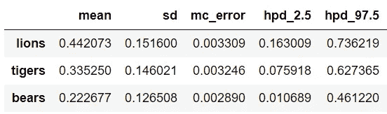

这显示了患病率的最佳估计值(平均值),而且 95%可信区间非常大。根据我们对保护区的一次考察，我们只能确定狮子的患病率在 16.3%到 73.6%之间。

贝叶斯推理之所以如此强大，就是因为这种内置的不确定性。在现实世界中，数据总是嘈杂的，我们通常比我们想要的少。因此，任何时候我们根据数据进行估计，我们都必须显示这种不确定性。对于这个问题，如果我们得到的野生动物保护区的熊的百分比不正确，没有人会受到伤害，但是如果我们用医学数据做一个类似的方法来推断疾病概率，会怎么样呢？

## 从后面取样

一旦我们有了踪迹，我们可以从后面取样来模拟去保护区的额外旅程。比如我们再考虑去 1000 次。每次旅行我们能看到多少个物种？

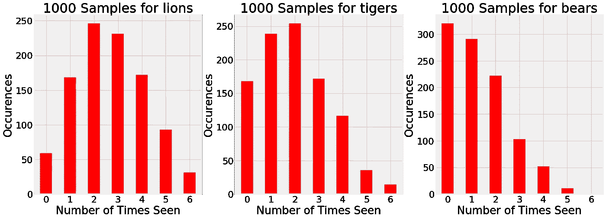

1000 samples drawn from the estimated posterior.

根据证据，有时候我们去保护区看到 5 只熊和 1 只老虎！当然，这不太可能，像这样的图表显示了可能结果的整个*范围*，而不是只有一个。我们去保护区的一次旅行只是一个结果:1000 次模拟表明，我们不能指望每次去保护区都得到准确的观察结果。

如果我们想在采样后看到新的狄利克雷分布，它看起来像:

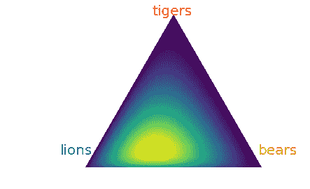

Dirichlet distribution after sampling.

## 纳入附加信息

当我们去了 4 次保护区，并想在我们的模型中加入额外的观察结果，会发生什么？在 PyMC3 中，这很简单:

通过更多的观察，后验概率的不确定性将会减少，事实上，这就是我们在数量和视觉上所看到的。直觉上，这又是有意义的:随着我们收集更多的数据，我们对世界的状态变得更加确定。在无限数据的情况下，我们的估计将收敛于真实值，先验将不起作用。

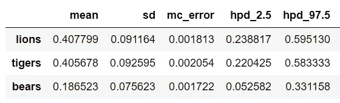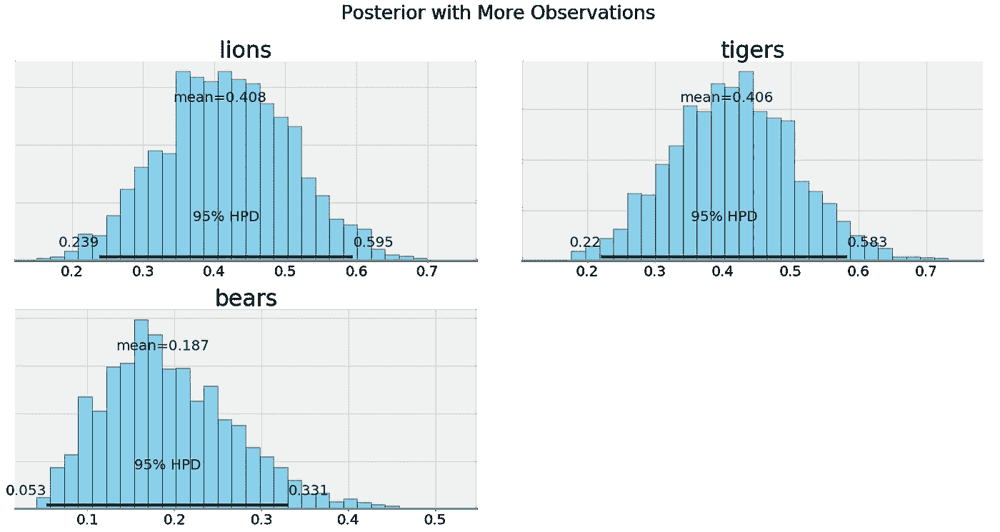

Posteriors with more data

## 增加和减少对先前信念的信心

前面我们讨论了超参数如何被认为是代表我们先前信念的伪计数。如果我们将 alpha 的所有值都设置为 1，我们将得到目前为止看到的结果。如果我们降低或增加我们对患病率相等的最初理论的信心呢？要做到这一点，我们所要做的就是改变阿尔法矢量。然后，我们再次从后验样本(使用原始观察)并检查结果。

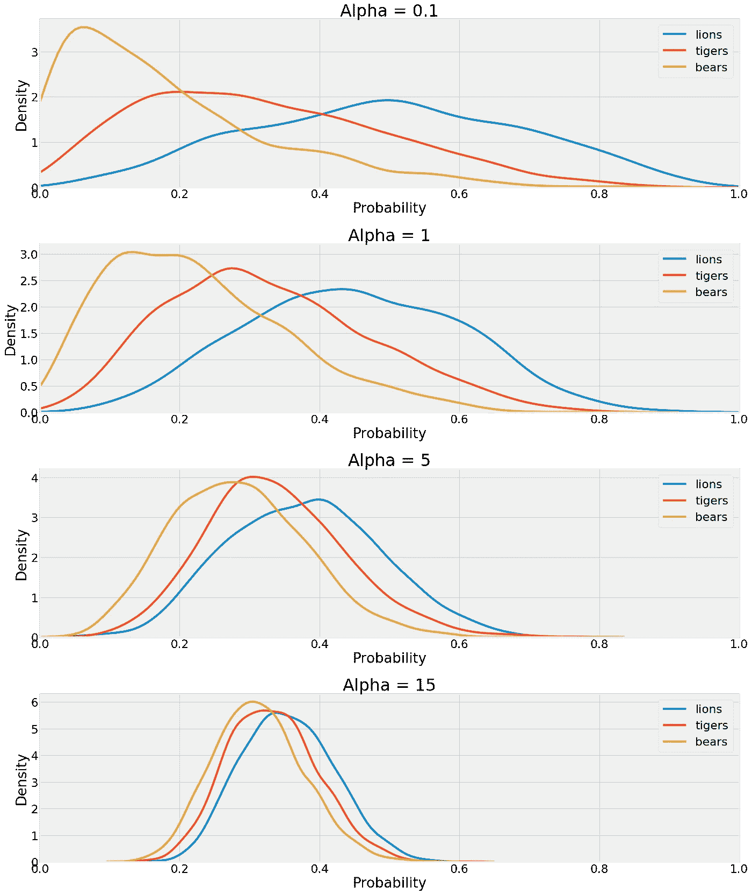

超参数对结果有很大的影响！较低的值意味着数据本身在后验概率中具有较大的权重，而较高的值导致伪计数具有较大的权重。随着该值的增加，分布相互收敛。在最后一种情况下，我们需要大量的数据来克服我们强大的超参数。

我们可以比较α= 0.1 和α= 15 时的后验曲线:

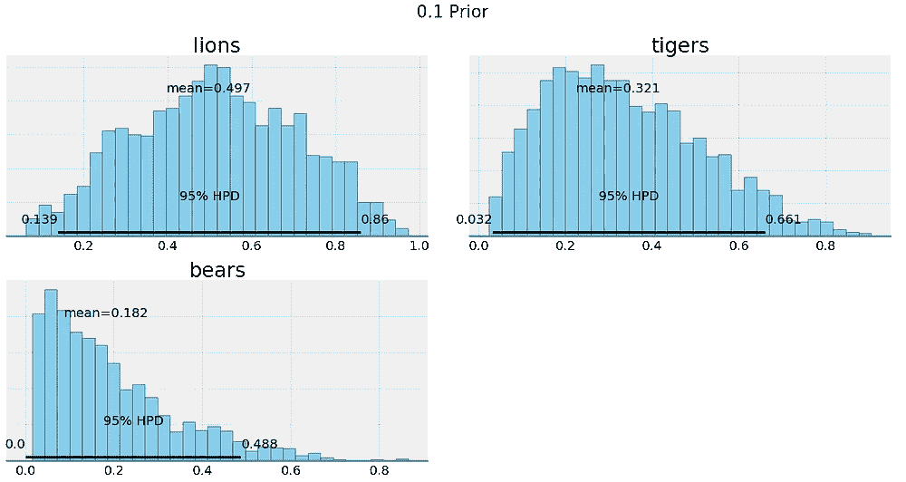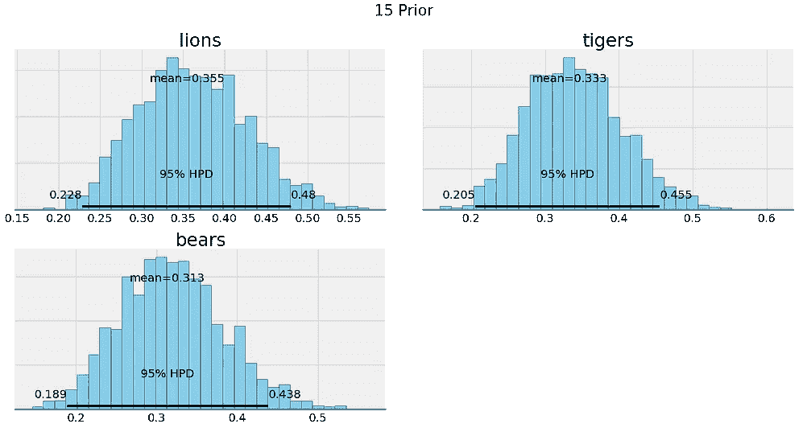

最终，我们对超参数的选择取决于我们对信念的信心。如果我们有充分的理由认为物种的流行是相等的，那么我们应该使超参数具有更大的权重。如果我们想让数据说话，那么我们可以降低超参数的影响。

# 结论

那么，对于流行率这个问题，我们的最终答案应该是什么呢？如果我们是好的贝叶斯主义者，那么我们可以提出一个点估计，但只能附带不确定性(95%可信区间):

*   **狮子:44.5% (16.9% — 75.8%)**
*   **老虎:32.7% (6.7% — 60.5%)**
*   **空头:22.7% (1.7% — 50.0%)**

我们估计下一个观察对象是一头熊？基于后验抽样，大约 23%。虽然这些结果可能不会让想要简单答案的人满意，但他们应该记住现实世界是不确定的。

贝叶斯推理的[好处](https://andrewgelman.com/2015/05/19/bayesian-inference-the-advantages-and-the-risks/)是我们可以整合我们先前的信念，并通过我们的答案得到不确定性估计。世界是不确定的，作为负责任的数据科学家，贝叶斯方法为我们提供了处理不确定性的框架。

此外，随着我们获得更多的数据，我们的答案变得更加准确。与贝叶斯推理的许多方面一样，这符合我们的直觉和我们自然地看待世界的方式，随着额外信息的增加，错误变得更少。最终，贝叶斯统计是令人愉快和有用的，因为它是最终有意义的统计。

一如既往，我欢迎反馈和建设性的批评。可以通过 Twitter [@koehrsen_will](http://twitter.com/@koehrsen_will) 或者通过我的个人网站 [willk.online](https://willk.online) 找到我。