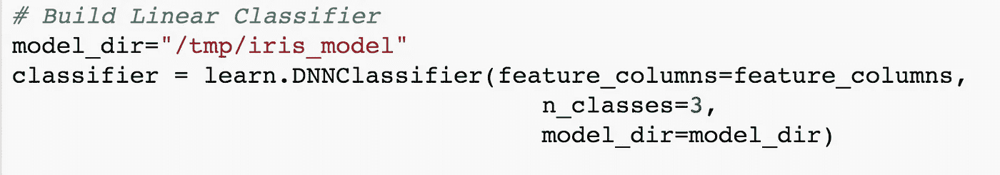
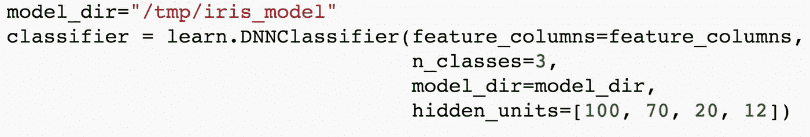
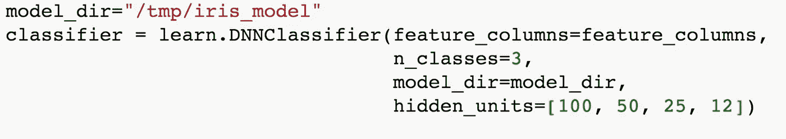
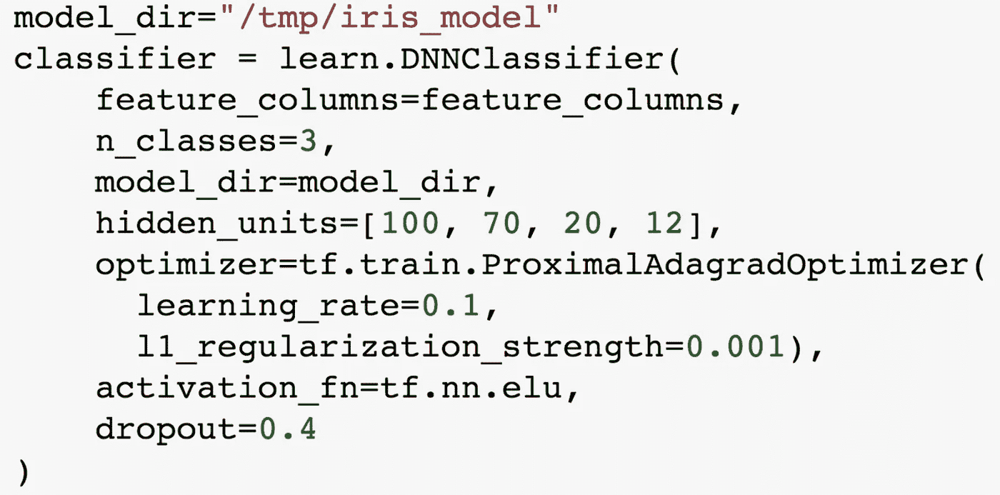

# 评估者再探:深度神经网络

> 原文：<https://towardsdatascience.com/estimators-revisited-deep-neural-networks-311f38fe1986?source=collection_archive---------5----------------------->

在这一集的[云人工智能冒险](https://goo.gl/S0AS51)中，学习如何通过将线性模型转换为深度神经网络来训练日益复杂的数据集！

随着线性模型中要素列数量的增长，在训练中实现高精度会变得越来越困难，因为不同列之间的交互会变得更加复杂。这是一个已知的问题，对于数据科学家来说，一个特别有效的解决方案是使用深度神经网络。

# 为什么要深入？

深度神经网络能够适应更复杂的数据集，并更好地推广到以前看不到的数据，主要是因为它的多层结构，因此它们被称为*深度*。与线性模型相比，这些图层允许它们适应更复杂的数据集。然而，代价是该模型往往需要更长的训练时间、更大的规模和更少的可解释性。那么为什么会有人想用它呢？因为它可以导致更高的最终精度。

Where will your deep learning journey take you?

深度学习的一个棘手问题是让所有参数“恰到好处”。根据您的数据集，这些配置看起来几乎是无限的。然而，TensorFlow 内置的深度分类器和回归器类提供了一组合理的默认值，您可以立即开始使用，从而快速轻松地开始使用。

# 从线性到深度

让我们看一个如何将 iris 示例从线性模型更新为深度神经网络(通常缩写为 DNN)的示例。

我不打算展示一个 DNN 可以利用的 2000 列模型…所以我只使用我们在本系列中一直使用的 4 列。(要么全有，要么全无，对吧？)两种方式的机制都是一样的。

主要的变化来自于用 [DNNClassifier](https://www.tensorflow.org/api_docs/python/tf/estimator/DNNClassifier) 替换我们的 [LinearClassifier](https://www.tensorflow.org/api_docs/python/tf/estimator/LinearClassifier) 类。这将为我们创建一个深度神经网络。

Replace LinearClassifier with DNNClassifier

## 其他变化

事实上，其他一切都保持不变！深度神经网络需要一个额外的参数，这是我们之前没有包括的。

由于深度神经网络有多层，并且每层有潜在的不同数量的节点，我们将添加一个`hidden_units`参数。

Add your hidden units argument to wrap things up

`hidden_units`参数允许您为每个层提供一个包含节点数量的数组。这使你可以简单地通过考虑它的大小和形状来创建一个神经网络，而不是手工从头开始连接整个网络。添加或删除层就像在数组中添加或删除一个元素一样简单！

Changing your network configuration is a one-line change!

## 更多选项

当然，对于任何预先构建的系统，您在便利性方面获得的好处往往会在可定制性方面失去。DNNClassifier 试图通过包含一些您可以选择使用的附加参数来解决这个问题。如果不考虑，会使用一些合理的默认值。例如，优化器、激活函数和掉线率都可以和许多其他参数一起定制。

Yes, there’s an activation function called ‘ELU’

## 仅此而已

为了将我们的模型从线性转换到深度，你还需要做什么？没什么！这就是使用[评估者框架](https://www.tensorflow.org/api_docs/python/tf/estimator)的美妙之处:一种组织数据、训练、评估和模型导出的通用方法，同时仍然给你试验不同模型和参数的灵活性。

# 深入，简单的方法

有时，深度神经网络可以胜过线性模型。在这些情况下，TensorFlow 通过利用估算器框架来替换一个函数调用，可以很容易地从线性模型切换到深度模型，并且只需很少的代码更改。这意味着有更多的时间来处理数据、模型和参数，而不是建立训练循环。对于简单的深度神经网络，使用[张量流估值器](https://www.tensorflow.org/api_docs/python/tf/estimator)！

感谢阅读深度模型！如果你想了解更多，请务必[订阅频道](https://goo.gl/S0AS51)来了解云人工智能冒险的其余内容。