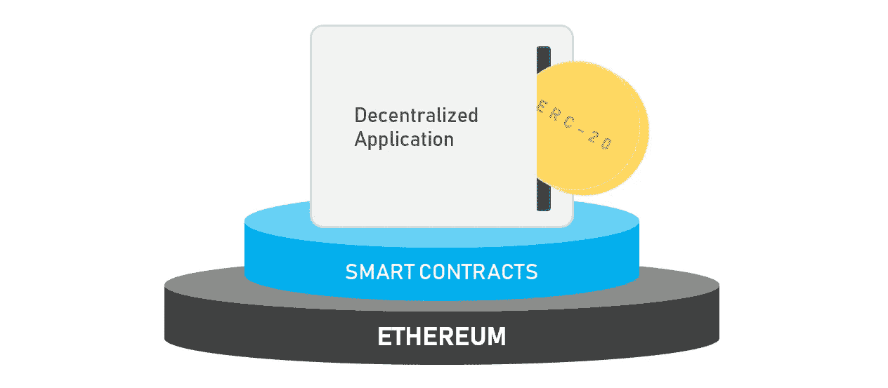
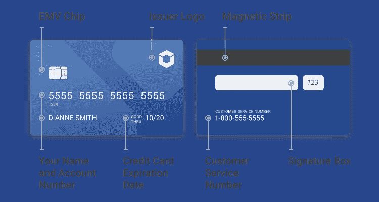

# 以太坊的 ERC-20 代币解释简单

> 原文：<https://towardsdatascience.com/ethereums-erc-20-tokens-explained-simply-88f5f8a7ae90?source=collection_archive---------10----------------------->

## [区块链系列的未来](https://medium.com/tag/the-future-of-blockchain)

加密货币领域有很多缩写。这让新来者望而生畏。事实上，这个领域的首字母缩写有时甚至是字母和数字的组合，混淆了这种程度的恐吓。但是没有什么花哨的。长话短说，ERC-20 代币只是一种建立在以太坊平台上的加密货币。别担心，我会解释这是什么意思。

Review this image again after you read this article, and it’ll make much more sense to you if it doesn’t already.

许多人知道以太坊，因为它是一种可以在比特币基地交易的加密货币。比特币与众不同的一个独特之处(至少到目前为止)是它拥有编写智能合约的能力。*智能合约*只是营销用语，指你可以在区块链上运行的代码。本质上，你可以将代码写入以太坊区块链。因此，除了存储货币的历史交易，您还可以存储逻辑。逻辑的结合创造了我们熟悉和喜爱的程序和应用。

[Cryptokitties](https://www.cryptokitties.co/) has arguably been the most popular Dapp on Ethereum. You just breed and trade them.

但是，忠于行话，我们不能仅仅称它们为应用程序。毕竟，它们不像普通的应用程序——这些被写入以太坊区块链的应用程序本质上是去中心化的，因为以太坊本身就是去中心化的。因此，我们称它们为分散应用，简称 d apps(有些人说 *d-apps* ，其他人只是发音为 *dapps* )。

对于这些 dapp 中的大多数，创作者希望制作他们自己的硬币(统称为令牌)，这意味着用户在与 dapp 互动时必须使用他们特定的硬币——这是好事还是坏事有待讨论，但我在这篇介绍性文章中不会回答这个问题。

## ERC-20 是描述以太币的标准

人们很快意识到创造自己的硬币需要一定的标准。就像制作信用卡一样。每张卡的背面都有一个黑色的长条用来刷卡，大多数现代卡的正面都有一个芯片。到期日期、安全代码和所有者姓名都出现在卡上的标准位置，智能手机摄像头可以通过扫描快速识别它们。

但是想象一下，如果有人决定制作一张除了二维码之外没有任何信息的信用卡。当然，这听起来时尚简约，但没有商店会接受它，因为它不符合标准的信用卡设计规则，只是看起来很可疑。

ERC-20 正是应用于以太坊区块链智能合约代币创建的标准。这里有一个令牌必须遵守的规则列表，但是我不会在这个解释中涉及细节。如果你想更深入地了解 ERC-20 令牌标准的细节，请看一下维基百科的文章[。](https://theethereum.wiki/w/index.php/ERC20_Token_Standard)

## 存储和交易 ERC-20 代币

因为 ERC-20 代币是在区块链以太坊上建造的，所以它们也可以在以太坊上兑换。你可以用你的以太坊钱包来存放它们，也可以发送到其他以太坊钱包。不过，有一点你应该小心，那就是永远不要使用交换地址。

不要纠缠于为什么不这样做的复杂细节，只要明白交换会为每枚硬币生成唯一的地址。换句话说，你的以太坊地址和你的 ERC 20 令牌地址是不同的。如果你试图发送一个 ERC-20 代币到你的交易所的以太坊地址，交易所不会识别它，你也不会得到 ERC-20 代币。不过，在你自己的钱包里，你可以存放任何你想要的以太币。你可能已经注意到我用了钱包和地址这两个词。如果你认为它们是一样的，那你就错了。在我的文章[加密钱包与地址](https://hackernoon.com/crypto-wallet-vs-address-54f7fb980bd3)中了解更多信息。

# 为什么要在以太坊上建立 Dapps？

嗯，这是个好问题。简单的回答是，你不必。自从以太坊在 2015 年推出智能合约以来，许多其他区块链都出现了自己的智能合约功能。例如，NEO 是一个区块链，它使用 Java 等传统编程语言编写合同脚本，而以太坊有自己的语言 Solidity。但是如果我刚才说的对你没有意义，不要担心——只要知道除了以太坊，还有其他区块链可以托管智能合约。

不过，以太坊拥有先发优势，在所有支持智能合约的区块链公司中，它的市值仍然是最大的。简而言之，这意味着以太坊比其他竞争者得到了更多的支持。如果你试图建立一个 Dapp 和围绕它的公司，你可能会选择最安全的选择——一个可能在几年内仍然存在的选择。

当然，这并不是说竞争对手将不复存在。我当然相信并投资了其中的许多，尤其是因为以太坊确实有其自身的缺点。但是随着数千个 Dapps 的建立和对以太坊的大量投资，它在采用方面仍然远远领先于竞争对手。

每当有人说“以太坊令牌”或“ERC-20 令牌”或其他类似的东西，我希望你现在不会立即被吓倒，并在你的大脑中旋转加载屏幕，试图破译你刚刚听到的东西。这只是一种建立在以太坊区块链上的加密货币。