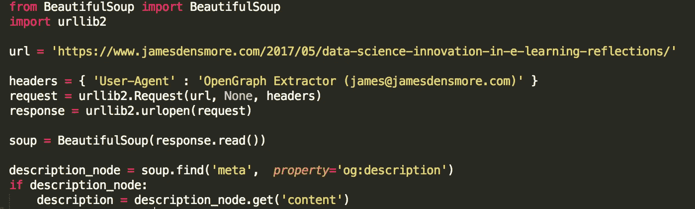

# 网络搜集中的伦理

> 原文：<https://towardsdatascience.com/ethics-in-web-scraping-b96b18136f01?source=collection_archive---------1----------------------->

我们都收集网络数据。我们这些处理数据的人会。数据科学家、营销人员、数据记者和数据好奇者都是如此。最近，我一直在思考这种做法的伦理问题，并对在这个问题上缺乏共识感到不满。

让我澄清一下，我说的是道德规范而不是法律。关于抓取网络数据的法律很复杂、模糊，改革的时机已经成熟，但那是另一回事。这并不是说没有人在思考或写作刮擦的道德问题，而是刮擦者和被刮擦者都无法就基本原则达成一致。

我两边都去过。我主要为个人项目收集数据，但我也把它作为工作中收集数据的一种形式。另一方面，我一直在纠结如何从我自己或我雇主的网络日志和分析中过滤掉“机器人”，以便专注于真正的客户。这是多年来生活的现实，与其与之抗争，不如让我们制定一些基本规则。

虽然我并不幻想这些规则是完整和绝对的，但它们涵盖了我多年来遇到的争论的关键点。

# 道德刮刀

我，web scraper 将遵循以下原则:

*   如果你有一个公共 API 提供我正在寻找的数据，我会使用它，避免拼凑。
*   我将始终提供一个用户代理字符串，使我的意图清晰明了，并为您提供一种有问题或疑虑时与我联系的方式。
*   我会以合理的速度请求数据。我将努力不被 DDoS 攻击所迷惑。
*   我只会保存我绝对需要的数据。如果我只需要 OpenGraph 元数据，那就是我要保留的全部。
*   我会尊重我保存的任何内容。我永远不会把它当成我自己的。
*   我会想办法把价值还给你。也许我可以给你的网站带来一些(真正的)流量，或者在一篇文章或帖子中表扬你。
*   我将及时回应您的请求，并与您合作解决问题。
*   我将为从数据中创造新价值的**目的而努力，而不是复制它。**

# 道德网站所有者

我，网站所有者将遵循以下原则:

*   我将允许道德刮刀访问我的网站，只要它们不会对我的网站的性能造成负担。
*   我将尊重透明的用户代理字符串，而不是阻止它们，并鼓励使用伪装成人类访问者的刮刀。
*   在永久屏蔽之前，我将联系刮刀的所有者(感谢他们的道德用户代理字符串)。出于现场性能或道德考虑，临时封锁是可以接受的。
*   我知道 scrapers 是开放网络的现实。
*   我会考虑使用公共 API 来提供数据，作为对抓取器的替代。

# 这给我们留下了什么？

The ease of scraping in Python

事实是，搜集数据很容易。有了几行 Python 代码和一些很棒的库的帮助，比如 [urllib2](https://docs.python.org/2/library/urllib2.html#module-urllib2) (或者 [Requests](http://docs.python-requests.org/en/latest/index.html) ，如果你喜欢的话)和 [BeautifulSoup](https://www.crummy.com/software/BeautifulSoup/) ，你可以抓取并解析一个页面的 HTML。事实上，这很容易，负责任的使用比以往任何时候都重要。

当然，为一个周末项目搜集几千篇博文不是问题。见鬼，在我看来，即使是用于商业用途的刮痧也是符合道德的。对于我们这些依靠海量网络数据来创新、学习和创造新价值的人来说，最受关注的是针对可疑商业用途的大量网络抓取，这也带来了最高的风险。

只要有一点点尊重，我们就能让好事继续下去。

感谢阅读！你可以在我的网站上联系我或者阅读我的其他博客文章。