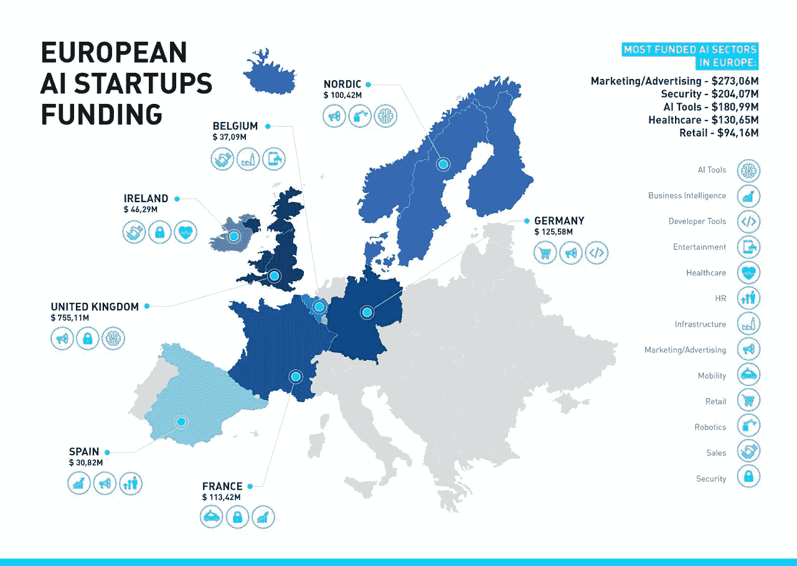

# 欧洲人工智能初创公司格局

> 原文：<https://towardsdatascience.com/european-ai-startups-landscape-52c299617e09?source=collection_archive---------7----------------------->

欧盟人工智能初创企业资助研究

在看了[欧洲的太空科技景观](https://medium.com/@GalyaD/spacetech-is-going-global-57ccfe6f654d#.9xauwtx70)之后，我进一步探索前沿科技，深入挖掘欧洲的人工智能景观。我分析了 797 家总部位于欧洲的初创公司，它们来自我们在 [Maxfield Capital](http://www.maxfield.vc/) 和 Pitch Book & Tracxn 数据库的网络。

这项研究的主要目标是概述:

*   人工智能创业公司中资金最充足的部门；
*   从受资助创业公司的来源来看，投资最活跃的国家

关于方法论的几句话:

*   初创公司根据以下几个方面进行细分:(1)垂直行业(如医疗保健或零售)；㈡业务职能(如人力资源或营销)；㈢产品类型
*   详述“产品类型”类别，我已经分离了“垂直和功能不可知”的部分，例如“人工智能工具”和“开发人员工具”，分别为开发人员提供核心人工智能应用程序(例如语音识别或计算机视觉)作为服务(针对 B2B)和 API 及其他产品

## **观察结果**

*   欧洲人工智能初创公司中资金最充足的部门是:
    (i)营销/广告；㈡安全；㈢人工智能工具；㈣医疗保健；㈤零售；
*   虽然营销/广告和人工智能工具部门的资金由大量公司(分别为 40 家和 41 家)驱动，但安全和医疗保健主要由“大型轮次”驱动，如安全领域的 [Darktrace](https://www.darktrace.com/) (总资金 1.045 亿美元)和 [Onfido](https://onfido.com/) (总资金 3030 万美元)以及医疗保健领域的[慈善人工智能](http://benevolent.ai/)(总资金 1 亿美元)；
*   就人工智能初创公司融资而言，英国是欧洲最发达的国家，融资额为 7.5511 亿美元，其次是德国(1.2558 亿美元)、法国(1.1342 亿美元)和北欧(1.0042 亿美元)。爱尔兰、比利时和西班牙紧随其后，分别融资 4629 万美元、3709 万美元和 3082 万美元

总而言之，这是包含所有数据的电子表格([链接](https://docs.google.com/spreadsheets/d/1KaBg6qbGd4l66kahzz1pynW2Fv6ARJL55aAyMmmf9Ec/edit?usp=sharing)),如果我错过了什么或者你想在 AI 上聊天，请发微博给我 [@GalyaDegtyareva](https://twitter.com/galyadegtyareva) ！此外，如果你想要更详细的概述，可以看看这些由[法比安](https://medium.com/u/5e062e7b8747?source=post_page-----52c299617e09--------------------------------)、[大卫·凯尔纳](https://medium.com/u/4934916676ca?source=post_page-----52c299617e09--------------------------------)和[克里斯·奥布莱恩](https://twitter.com/obrien)创作的[德国](https://medium.com/@bootstrappingme/the-german-artificial-intelligence-landscape-b3708b325124#.1yb0ta5oy)、[英国](https://medium.com/mmc-writes/artificial-intelligence-in-the-uk-landscape-and-learnings-from-226-startups-70b9551f3e4c#.8xnryzz09)和[法国](http://venturebeat.com/2016/11/06/france-makes-its-bid-to-be-recognized-as-a-global-ai-hub/)人工智能风景。