# 推荐系统的评价指标

> 原文：<https://towardsdatascience.com/evaluation-metrics-for-recommender-systems-df56c6611093?source=collection_archive---------0----------------------->


Photo by [rawpixel](https://unsplash.com/@rawpixel?utm_source=medium&utm_medium=referral) on [Unsplash](https://unsplash.com?utm_source=medium&utm_medium=referral)

推荐系统在在线零售中越来越受欢迎，因为它们能够为独特的用户提供个性化的体验。K 处的平均精度(MAP@K)通常是用于评估推荐系统性能的选择度量。然而，使用额外的诊断指标和可视化可以对模型的性能提供更深入的、有时令人惊讶的见解。本文探讨了 K(MAR @ K)**个性化**列表内相似度*的平均召回率，并使用这些指标来比较三个简单的推荐系统。*

*如果您想使用本文中讨论的任何指标或图表，我已经在 python 库 [recmetrics](https://github.com/statisticianinstilettos/recmetrics) 中提供了它们。*

```
*$ pip install recmetrics*
```

# *Movielens 数据集*

*本例中使用的数据是流行的 [Movielens 20m](https://grouplens.org/datasets/movielens/20m/) 数据集。该数据包含用户对电影的评级，以及电影类型标签。(为了增加训练时间，对该数据进行了缩减采样，以仅包括来自对超过 1000 部电影进行评级的用户的评级，并且移除了少于 3 颗星的评级。)*

*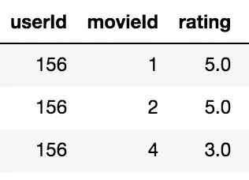*

*Example of user movie ratings*

# *模型*

*测试和比较了三种不同的推荐系统。*

1.  *随机推荐器(向每个用户随机推荐 10 部电影)*
2.  *受欢迎程度推荐器(向每个用户推荐 10 部最受欢迎的电影)*
3.  *协同过滤(使用奇异值分解矩阵分解方法)*

*让我们深入研究指标和诊断图，并比较这些模型！*

# *长尾图*

*我喜欢通过查看*长尾理论*来开始每一个推荐项目。该图用于探索用户项目交互数据(如点击、评级或购买)中的流行模式。通常，只有一小部分项目具有高的交互量，这被称为“头部”。大多数项目都在“长尾”中，但它们只占交互的一小部分。*

*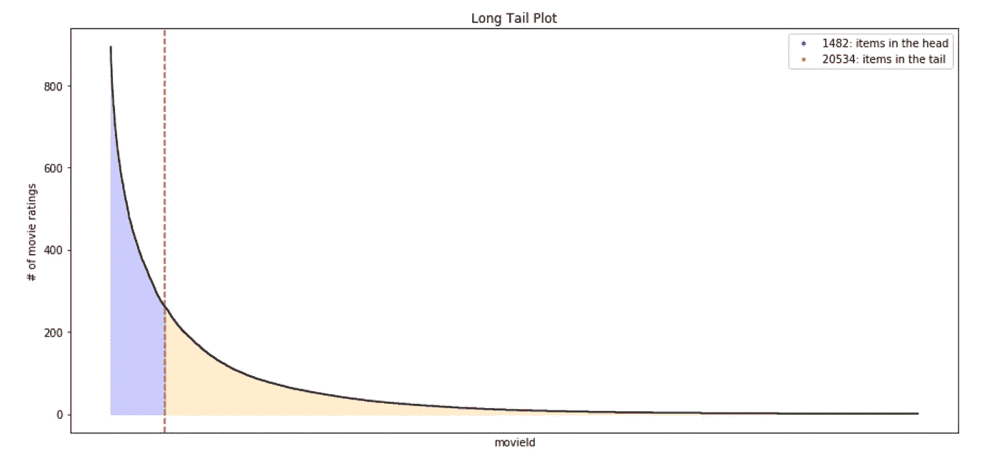*

*Long tail plot. (Sample of Movielens 20m ratings data)*

*因为在训练数据中有许多流行项目的观察值，所以推荐系统学习准确预测这些项目并不困难。在电影数据集中，最受欢迎的电影是大片和经典。这些电影已经为大多数用户所熟知，对它们的推荐可能不会提供个性化的体验或帮助用户发现新的、相关的电影。相关推荐被定义为用户在测试数据中正面评价的项目的推荐。这里确定的指标提供了评估建议的相关性*和*有用性的方法。*

# *地图@K 和标记@K*

*推荐系统通常为测试集中的每个用户产生一个有序的推荐列表。MAP@K 提供了对推荐项目列表的相关程度的洞察，而 MAR@K 提供了对推荐者能够回忆起用户在测试集中正面评价的所有项目的程度的洞察。我不会详细描述 MAP@K 和 MAR@K，因为在这里可以找到很好的描述:*

*[](http://sdsawtelle.github.io/blog/output/mean-average-precision-MAP-for-recommender-systems.html) [## 推荐系统的平均精度

### (好吧，这里有一个双关语。)既然你正在读这篇文章，你可能刚刚遇到了“平均精度”这个术语，或者…

sdsawtelle.github.io](http://sdsawtelle.github.io/blog/output/mean-average-precision-MAP-for-recommender-systems.html) 

MAP@K 在 [ml_metrics](https://github.com/benhamner/Metrics) 库中可用，我已经让 MAR@K 在 [recmetrics](https://github.com/statisticianinstilettos/recmetrics) 中可用。

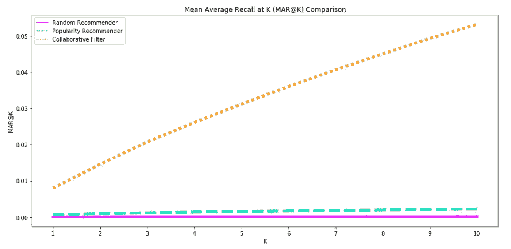

By MAR@K, the collaborative filter is able to recall the relevant items for the user better than the other models.

# 新闻报道

*覆盖率*是模型能够在测试集上推荐的训练数据中的项目的百分比。在这个例子中，流行度推荐器只有 0.05%的覆盖率，因为它只推荐了 10 个项目。随机推荐器具有预期的接近 100%的覆盖率。令人惊讶的是，协作过滤器只能推荐 8.42%的经过训练的项目。

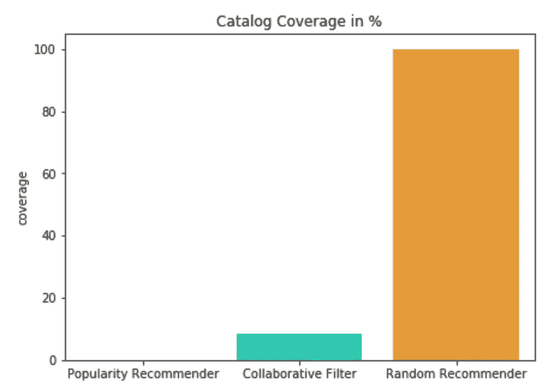

Coverage comparison for three recommender systems.

# 个性化

个性化是评估一个模型是否向不同的用户推荐了许多相同的商品的好方法。它是用户推荐列表之间的相异度(1 余弦相似度)。一个例子将最好地说明个性化是如何计算的。

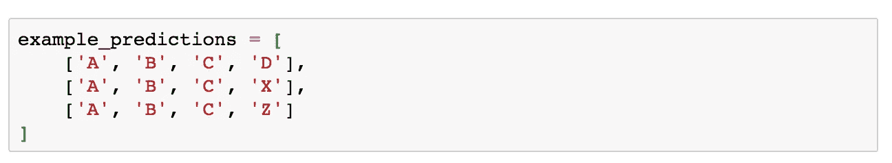

Example list of recommended items for 3 different users.

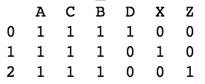

First, the recommended items for each user are represented as binary indicator variables (1: the item was recommended to the user. 0: the item was not recommended to the user).

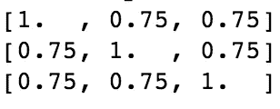

Then, the cosine similarity matrix is calculated across all user’s recommendation vectors.

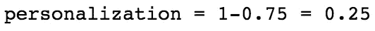

Finally, the average of the upper triangle of the cosine matrix is calculated. The personalization is 1-the average cosine similarity.

高个性化分数表明用户的推荐是不同的，这意味着该模型为每个用户提供了个性化的体验。

# 列表内相似性

列表内相似度是推荐列表中所有项目的平均余弦相似度。该计算使用推荐项目的特征(例如电影类型)来计算相似性。这个计算也最好用一个例子来说明。

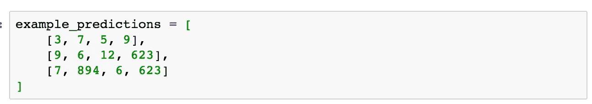

Example recommendations of movie ids for 3 different users.

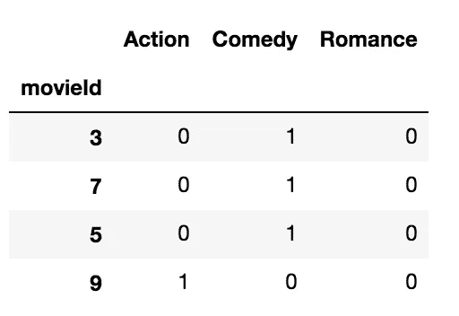

These movie genre features are used to calculate a cosine similarity between all the items recommended to a user. This matrix shows the features for all recommended movies for user 1.

可以为每个用户计算列表内相似性，并对测试集中的所有用户进行平均，以获得模型的列表内相似性的估计。

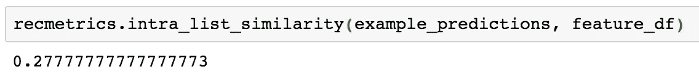

如果推荐系统向单个用户推荐非常相似项目的列表(例如，用户只接收浪漫电影的推荐)，那么列表内的相似性将会很高。

# 使用正确的训练数据

可以对训练数据做一些事情来快速改进推荐系统。

1.  从培训数据中删除热门项目。(这适用于用户可以自己发现这些项目，并且可能不觉得这些建议有用的情况)。
2.  根据用户的价值(如平均交易价值)调整项目评级。这可以帮助模特学会推荐能带来忠诚或高价值顾客的商品。

# 结论

一个优秀的推荐系统会提供相关和有用的推荐。使用多个评估指标的组合，我们可以开始评估一个模型的性能，而不仅仅是相关性。如果您想使用这些指标和图表来评估您自己的推荐系统，请查看我的 [python 库](https://github.com/statisticianinstilettos/recmetrics)。有问题吗？请随意向[伸出手](https://arize.com/community/)放松！*