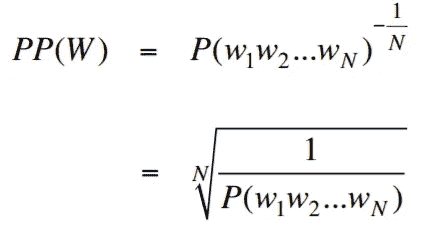
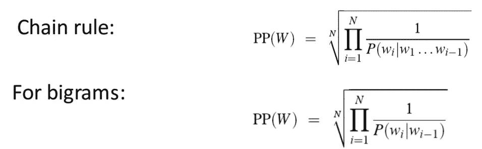
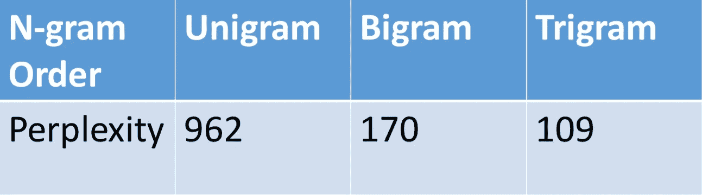
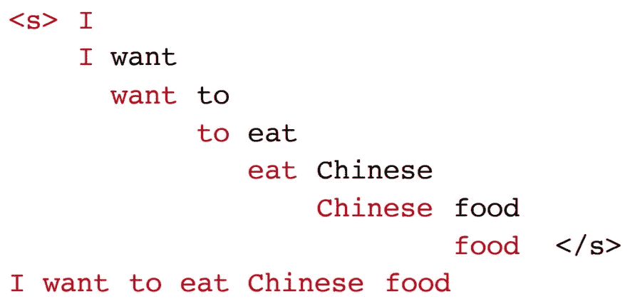

# 基于困惑度和香农可视化方法的语言模型评估

> 原文：<https://towardsdatascience.com/evaluation-of-language-models-through-perplexity-and-shannon-visualization-method-9148fbe10bd0?source=collection_archive---------10----------------------->

## 你的自然语言处理模型有多好？

# 你的语言模型有多好？

为了回答语言模型的上述问题，我们首先需要回答下面的中间问题:与那些很少遇到或有一些语法错误的句子相比，我们的语言模型是否为语法正确和频繁的句子分配了更高的概率？为了训练任何模型的参数，我们需要一个训练数据集。在训练完模型之后，我们需要评估模型的参数被训练得有多好；为此，我们使用完全不同于训练数据集的测试数据集，因此模型看不到它。之后，我们定义一个评估指标来量化我们的模型在测试数据集上的表现。

# 语言模型的体内评估

为了比较两个语言模型 A 和 B，让这两个语言模型通过一个特定的自然语言处理任务并运行作业。之后，比较模型 A 和 B 的准确性，以评估相互比较的模型。自然语言处理任务可以是文本摘要、情感分析等。

**限制**:耗时的评估方式。

# 语言模型的内在评价:困惑

困惑是由语言模型分配给测试集的概率的乘法倒数，由测试集中的单词数归一化。如果语言模型可以从测试集中预测未见过的单词，即 P(测试集中的句子)最高；那么这样的语言模型更准确。

Perplexity equations. Image credit: *Speech and Language Processing (3rd edition)*, Chapter 3 Language Modeling with N-grams, **Slide 33**, available at [http://web.stanford.edu/~jurafsky/slp3/3.pdf](http://web.stanford.edu/class/cs124/lec/languagemodeling.pdf)

因此，对于测试集来说，更好的语言模型将具有更低的困惑值或更高的概率值。

**使用来自*华尔街日报数据集*** 的 3800 万个单词训练并使用 150 万个单词测试的不同 N 元语言模型的示例困惑值

Image credit: *Speech and Language Processing (3rd edition)*, Chapter 3 Language Modeling with N-grams, **Slide 36**, available at [http://web.stanford.edu/~jurafsky/slp3/3.pdf](http://web.stanford.edu/class/cs124/lec/languagemodeling.pdf)

# 困惑背后的直觉作为一个评价指标和香农可视化方法

下面这个例子可以解释困惑背后的直觉:假设给出一个句子如下:教授给我的任务是 ____。一个更好的语言模型将通过基于使用训练集分配的条件概率值放置单词来产生有意义的句子。因此，我们可以说，语言模型能够多好地预测下一个单词并因此生成有意义的句子是由基于测试集分配给语言模型的困惑值来断言的。

**香农可视化方法**

这是一种从经过训练的语言模型生成句子的方法。假设经训练的语言模型是二元模型，则香农可视化方法创建如下句子:

> 根据概率选择一个随机二元模型(~~，w)现在根据概率选择一个随机二元模型(w，x)以此类推，直到我们选择~~然后将单词串在一起

这里的~~和~~分别表示句子的开始和结束。例如:

Image credit: *Speech and Language Processing (3rd edition)*, Chapter 3 Language Modeling with N-grams, **Slide 39**, available at [http://web.stanford.edu/~jurafsky/slp3/3.pdf](http://web.stanford.edu/class/cs124/lec/languagemodeling.pdf)

**近似于莎士比亚**

Sentences generated from unigram, bigram, trigram and quadrigram language models trained using Shakespeare’s corpus. Image credit: *Speech and Language Processing (3rd edition)*, Chapter 3 Language Modeling with N-grams, **Figure 3.3**, available at [http://web.stanford.edu/~jurafsky/slp3/3.pdf](http://web.stanford.edu/~jurafsky/slp3/3.pdf)

**莎士比亚的语料库和句子生成使用香农可视化方法的局限性**

令牌数= 884，647，类型数= 29，066。然而，在 V * V = 844 亿个可能的二元模型中，莎士比亚的语料库包含了大约 300，000 个二元模型。因此，大约 99.96%的可能二元模型从未在莎士比亚的语料库中出现过。结果，那些看不见的二元模型的二元模型概率值将等于零，使得句子的总概率等于零，进而困惑度等于无穷大。这是一个限制，可以使用**平滑**技术解决。

Quadrigram 更糟糕，因为它看起来像莎士比亚的语料库，因为它是莎士比亚的语料库，这是由于 Quadrigram 语言模型中的依赖性增加到等于 3 而导致的**过度学习**。

**逼近华尔街日报**

Sentences generated from unigram, bigram and trigram language models trained using The Wall Street Journal’s corpus. Image credit: *Speech and Language Processing (3rd edition)*, Chapter 3 Language Modeling with N-grams, **Figure 3.4**, available at [http://web.stanford.edu/~jurafsky/slp3/3.pdf](http://web.stanford.edu/~jurafsky/slp3/3.pdf)