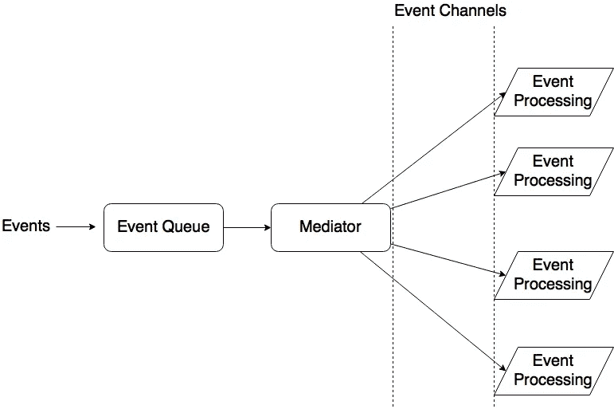
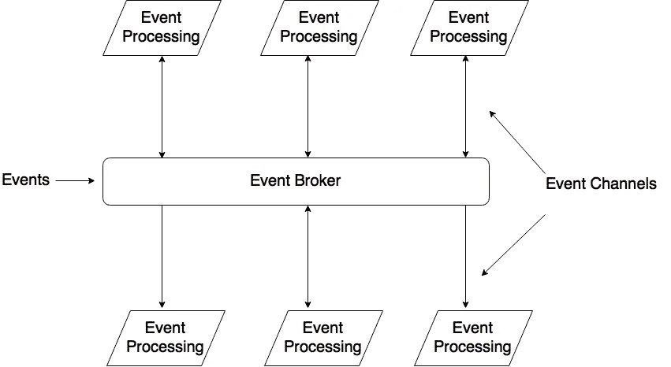

# 事件驱动架构模式

> 原文：<https://towardsdatascience.com/event-driven-architecture-pattern-b54fc50276cd?source=collection_archive---------1----------------------->

## 入门和实践中的一瞥

这是用于开发高度可伸缩系统的最常见的分布式异步架构。该体系结构由单一用途的事件处理组件组成，这些组件监听事件并异步处理它们。

事件驱动架构中有两种主要的拓扑结构。

1.  中介拓扑
2.  代理拓扑

# 中介拓扑

中介拓扑有一个事件队列和一个将每个事件导向相关事件处理器的中介。通常，事件通过事件通道被送入事件处理器，以过滤或预处理事件。

事件队列的实现可以是简单消息队列的形式，甚至是大型分布式系统中的消息传递接口，该系统涉及复杂的消息传递协议，如 Rabbit MQ。下图展示了中介拓扑的架构实现。



Mediator Topology for Event Processing

# 代理拓扑

这种拓扑不涉及事件队列。事件处理器负责获取事件，处理和发布另一个表示结束的事件。正如拓扑的名称所暗示的，事件处理器充当链接事件的代理。一旦一个事件被一个处理器处理，另一个事件被发布，以便另一个处理器可以继续处理。

考虑下图。



Broker Topology for Event Processing

如图所示，一些事件处理器只是处理而不留下任何痕迹，一些倾向于发布新事件。这与我们在 NodeJS 应用程序中看到的非常相似。某些任务的步骤以回调的方式链接在一起，当一个任务结束时，就触发回调。所有的任务本质上都是异步的。

# NodeJS 事件循环

下图展示了官方文档中描述的 NodeJS 架构。

```
 ┌───────────────────────┐
┌─>│        timers         │
│  └──────────┬────────────┘
│  ┌──────────┴────────────┐
│  │     I/O callbacks     │
│  └──────────┬────────────┘
│  ┌──────────┴────────────┐
│  │     idle, prepare     │
│  └──────────┬────────────┘      ┌───────────────┐
│  ┌──────────┴────────────┐      │   incoming:   │
│  │         poll          │<─────┤  connections, │
│  └──────────┬────────────┘      │   data, etc.  │
│  ┌──────────┴────────────┐      └───────────────┘
│  │        check          │
│  └──────────┬────────────┘
│  ┌──────────┴────────────┐
└──┤    close callbacks    │
   └───────────────────────┘ 
```

所有传入的连接都被推入轮询，它们将被异步处理。这不会阻止正在处理的其他呼叫。因此，该架构提供了更大的单线程可扩展性。我们可以运行几个节点进程，在它们之上平衡负载，并相应地引导请求。

> 延伸阅读:[https://nodejs . org/en/docs/guides/event-loop-timers-and-next tick/](https://nodejs.org/en/docs/guides/event-loop-timers-and-nexttick/)

## 少数事件驱动的 web 框架

*   netty(JAVA)——[https://netty . io](https://netty.io)
*   垂直。X (JVM 语言)— [http://vertx.io](http://vertx.io)
*   spring Reactor(JAVA)——[https://spring.io/guides/gs/messaging-reactor/](https://spring.io/guides/gs/messaging-reactor/)
*   http://reactphp.org

# 模式分析

该模式缺乏事务的原子性，因为不能保证事件的执行顺序。这是因为事件处理器被实现为高度分布式、解耦和异步的。结果预计将在未来某个时间提供，主要是以回调的方式。

## 易测性

由于处理的异步性质，测试具有事件驱动架构的系统并不容易

## 表演

由于任务本质上是异步和非阻塞的，所以执行是并行的。因此，这超过了提供高性能的排队机制的成本。

## 可扩展性和易开发性

尽管系统是高度可扩展的，但是开发工作是巨大的。这是因为单元测试和组件测试由于异步特性而变得困难，这使得系统具有可伸缩性。由于事件处理器的解耦特性，系统可以并行运行，从而提高可伸缩性和并行性。