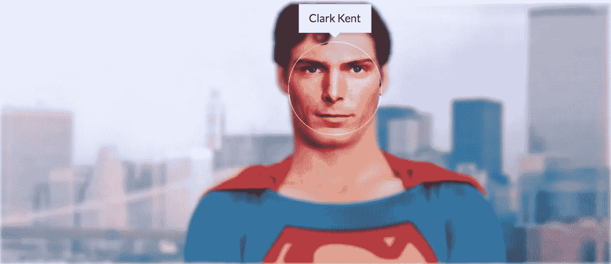
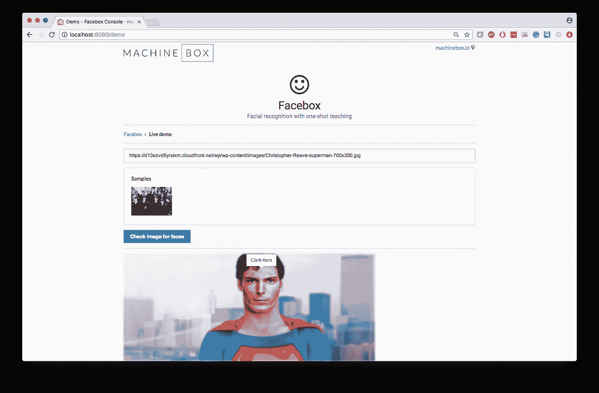
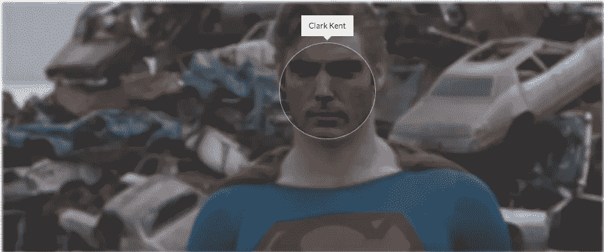
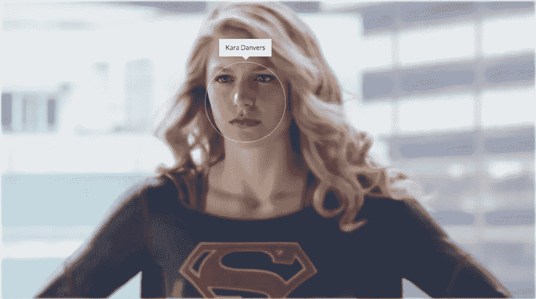
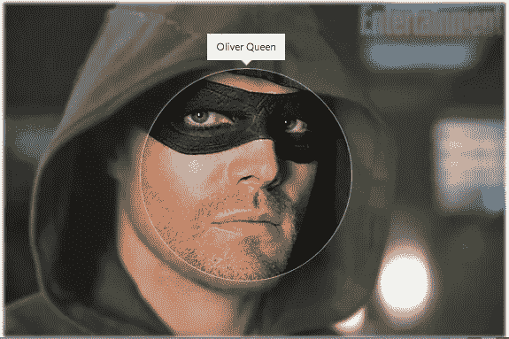
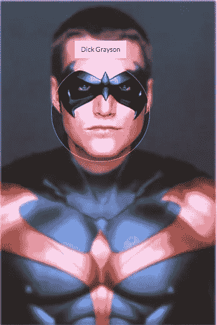
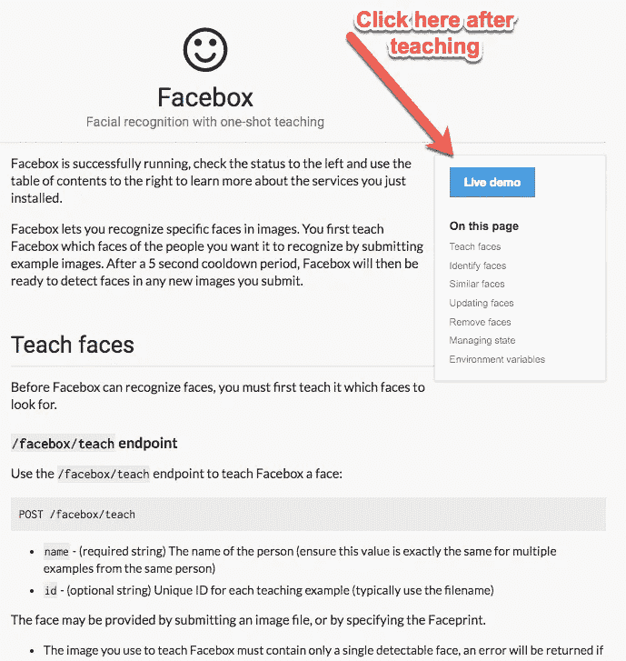

# 秘密身份骗不了现代人脸识别

> 原文：<https://towardsdatascience.com/every-superheros-secret-identity-wouldn-t-fool-modern-face-recognition-32c6fda07bb9?source=collection_archive---------8----------------------->

和我这个年龄的大多数人一样，我试图给我的孩子看 1978 年的原版《超人》,向他们介绍我最喜欢的超级英雄，这时我 4 岁的孩子大声问为什么没人认出克拉克·肯特就是超人：钢铁之躯。

这让我想到了超级英雄的秘密身份以及它们对现代人脸识别技术的有效性。

> 很有可能，如果一个 4 岁的孩子能认出某人，那么机器学习模型也能。所以我决定测试一下。

自然，我的第一个测试是看我能否训练一个模型来识别超人是克拉克·肯特。在电影中，他的伪装完美无缺。似乎没有人能看着克拉克的脸认出他是超人。在我的想象中，这是因为没有人真正看清楚超人(因为他总是飞来飞去什么的)，所以很难回忆起他长什么样。但是面对现代 AI，要中止我的不相信越来越难了(哈哈)。

> 今天，几乎任何媒体公司都可以对其所有内容进行人脸识别，并注意到《星球日报》第二好的记者是来自氪星的外星人。下面是我如何进行测试的:

首先，我找了一张克拉克·肯特完全伪装的照片。

Christopher Reeve will always be Superman to me

我复制了照片的网址，并在我的电脑上打开了一个 [Facebox](https://goo.gl/YLbFk1) 的实例。我在我的网络浏览器中打开控制台，向下滚动到`/teach`终点，并使用小演示工具教 Facebox 这张图片。我给它贴上标签*克拉克·肯特*。

然后，为了测试它，我打开了控制台的 live demo 部分，粘贴了一个 URL 到一个超人看起来最帅的屏幕截图(他是怎么卷曲的？):

Screenshot of the Facebox console

它立刻认出了他。我只训练了一个例子的人脸识别模型[！超人的秘密身份看来不妙。也许他应该换个发型？](https://blog.machinebox.io/machine-learning-model-training-vs-machinebox-teaching-f959f5fa4635)

Still image from Superman III

不——那也不起作用。

所以我决定测试其他超级英雄的秘密身份，看看他们如何对抗 Facebox。

卡拉·丹弗斯怎么样？

没有。

奥利弗·奎恩怎么样？

用这张图片教了 Facebox，让我们看看结果:

没有——还是认出了他。即使戴着面具和兜帽。

Facebox 和其他好的人脸识别系统将能够理解人脸的结构，而不管假眼镜、面具或头发是否模糊。

> 深度学习模型模糊地受到生物[神经系统](https://en.wikipedia.org/wiki/Nervous_system)中信息处理和通信模式的启发。神经网络寻找其他方法来识别人脸，类似于人类如何识别。这就是为什么这些伪装骗不了一个深度学习模型。

Taught Facebox Dick Grayson on the left, tested it with Robin on the right.

实际上，我有点惊讶，它仅仅用一张照片就能很好地识别出这些人。其实你可能根本不相信我，我也不会怪你。这就是为什么我鼓励你自己尝试一下。[下载 Facebox](https://goo.gl/YpFmJZ) ，右键点击上面的训练图像并保存到你的硬盘上，然后，按照 Facebox 控制台上的指示教脸。教学后，在控制台中打开现场演示，用你在互联网上(或在这篇博客中)找到的任何图像进行测试。

享受吧。