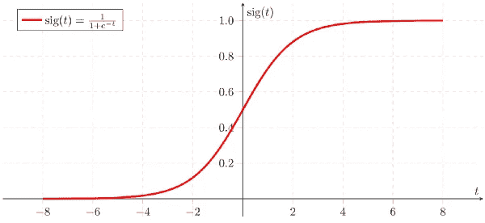

# 每个人都讨厌垃圾邮件，我们如何阻止它？

> 原文：<https://towardsdatascience.com/everyone-hates-spam-how-do-we-stop-it-38be071ff88e?source=collection_archive---------17----------------------->

Photo by [Ribkhan](https://pixabay.com/en/users/ribkhan-380399/) on [Pixabay](https://pixabay.com/en/email-newsletter-marketing-online-3249062/)

我讨厌垃圾邮件。你讨厌垃圾邮件。每个人都讨厌垃圾邮件。但是我们如何阻止已故亚瑟·范·杜克爵士的儿子试图把他们的财产寄给我们呢？嗯，最显而易见的解决方案是雇佣一组猴子来阅读和检查每封邮件中的垃圾邮件。但是我想我们都同意这不太实际，说实话，猴子并不真的那么聪明。相反，像谷歌这样的大公司所做的是使用机器学习来区分恶意发送的电子邮件和来自老板的电子邮件，老板对你错过昨天的会议非常不满。

## 我们如何检测垃圾邮件？

垃圾邮件检测使用一种机器学习算法，可以将电子邮件分类为垃圾邮件/非垃圾邮件，它从您训练它的数据中学习如何做到这一点。Gmail 每天都会收到大量数据，这些数据来自像你我这样的人，他们报告说，如果他们的收件箱收到了垃圾邮件。每次你这样做，Gmail 的预测模型在识别垃圾邮件时都会稍微好一点。你可以想象，制作一个真正好的垃圾邮件分类器需要大量数据，这就是为什么 Gmail 有最好的分类器之一——多年来，他们收集了大量数据，以帮助他们更好地识别垃圾邮件。

Photo by [Rawpixel](https://unsplash.com/@rawpixel) on [Unsplash](https://unsplash.com/photos/JIL_WDufQzs)

人们能够对垃圾邮件进行分类的一种方法是使用逻辑回归。逻辑回归是一种预测模型，当您试图预测的数据是分类数据(1 和 0、是和否等)时，您可以使用它。逻辑回归使用逻辑函数来进行预测。

Logistic Function(Sigmoid) — [Source](https://upload.wikimedia.org/wikipedia/commons/thumb/5/53/Sigmoid-function-2.svg/2000px-Sigmoid-function-2.svg.png)

这是一个被称为 Sigmoid 的逻辑函数的图形，它被用于**二元分类预测**。基本上将事物分为两类。这个函数需要优化，以适应我们的数据集，这样它就可以做出很好的预测。为了做到这一点，我们使用一种叫做**成本函数**的东西——它计算出*与我们的预测模型*有多大的误差，然后我们试图通过使用**梯度下降**来修正它。这些都是相当复杂的话题，我不会多谈。如果你想了解更多，可以查看这个[链接](https://ml-cheatsheet.readthedocs.io/en/latest/logistic_regression.html)。

## 我们自己做

现在我们知道了垃圾邮件分类器的基本工作原理，我们可以使用 Python 创建自己的程序，只用 10 行代码就可以对邮件进行分类。

我们将只使用 **Scikit-Learn** 和 **Pandas** 作为我们的依赖项，然而，在最后会有一个 Google Colab 链接，在那里你将能够跟随代码并在线运行一切。

如果您想自己编写代码，请确保从这个[链接](https://www.kaggle.com/c/spam-detection#)中获取数据集！该数据集包含几千封不同的邮件，这些邮件都被分类为垃圾邮件和非垃圾邮件。

我们需要导入 Pandas 来加载我们用来训练模型的数据。我们将使用 Scikit-Learn 的内置逻辑回归作为我们的预测算法——这非常容易使用，让我们只用一行代码就可以建立一个模型，但是，如果你想从头开始学习如何编写逻辑回归模型，请查看这个[链接](https://beckernick.github.io/logistic-regression-from-scratch/)。我们还需要 CountVectorizer，它对单词的重复次数进行计数，并将该数字放入一个数组中，这样我们的算法就可以在数据中找到模式。

现在，我们使用 pandas 加载数据，并初始化我们的逻辑回归模型和计数矢量器。Scikit-Learn 的逻辑回归模型已经配备了我们使其工作所需的所有部件；逻辑函数、成本函数和梯度下降。所以我们需要做的就是运行一个命令。

数据集的*“v2”*列中的数据是我们想要分类的短语，而*“v1”*有标签(分别是*“火腿”*和*“垃圾邮件”*)。计算机计算单词的重复次数，并将它们插入一个数组，这基本上只是将这些短语变成数字。这样做之后，我们创建另一个数组，其中包含消息中数据的所有分类器。最后，我们可以使用数据和目标来训练我们的模型。

在我们将数据拟合到我们的模型之后，我们可以对它进行一些预测！您可以运行这个命令，用您自己的消息替换引号内的内容，看看它是否被归类为垃圾邮件。

就是这样！创建我们的机器学习模型来检测垃圾邮件只需要 10 行代码。如果你想玩玩它，去我的 [Google Colab 大纲](https://colab.research.google.com/drive/1xpIIFxqrRBLKXRfcD0v29LuHAOOAZmAb)。

在本文中，我们介绍了机器学习如何用于分类垃圾邮件，这可能是比使用猴子更好的替代方法。这是一个很酷的话题，我们每天都在体验这种努力的成果，但机器学习的应用确实是无限的，随处可见。

数据安全、医疗保健和在线一切等巨大行业已经被机器学习彻底改变了。请记住，这只是我们通过机器学习可以实现的目标的开始，可以改变我们生活的新技术每天都在被发现。

感谢阅读！我希望你喜欢我的文章，并学到一些新东西。如果有，请务必通过以下方式与我联系:

*   [LinkedIn](https://www.linkedin.com/in/aryan-misra)
*   或者发邮件给我:aryanmisra@outlook.com