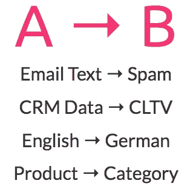
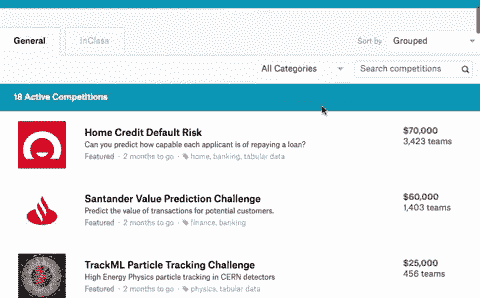

# 首席执行官需要知道的关于人工智能的一切

> 原文：<https://towardsdatascience.com/everything-a-ceo-needs-to-know-about-ai-35048caea84c?source=collection_archive---------10----------------------->

## 人工智能是如何工作的。你能用它做什么。以及如何入门。

# 人工智能就是把 A 和 B 连接起来

关于人工智能的信息经常令人困惑，有时甚至是彻头彻尾的误导。不过艾对于商业**很简单**:

> *“今天人工智能创造的 99%的经济价值都是通过一种人工智能来实现的，这就是学习 A 到 B 或输入到输出的映射。”* [*吴恩达*](https://youtu.be/NKpuX_yzdYs)

今天，人工智能的几乎每一个商业应用都是关于**学习从某些输入产生某些输出**:

# AI 如何学会预测正确的输出？

1.  您收集了**输入->输出**对的示例(越多越好)。
2.  AI 算法**学习输入和输出之间的联系**(这就是神奇之处)。
3.  你将训练好的算法(即*“模型”*)应用于**新的输入数据**来预测**正确的输出**。

就是这样！几乎所有用 AI 做$$的人都是完全这样做的。

# 当你有很多数据的时候使用 AI

**人工智能需要数据**

人工智能是强大的，因为它将数据转化为洞察力。但是人工智能的学习效率不如人(是的，效率更低)，所以它需要大量的数据来学习。如果你有大量的数据，你应该考虑人工智能！

**数据是竞争优势，*不是*算法。**

这就是为什么谷歌和脸书对开源他们的算法没有任何问题。但是他们绝对不会公开他们的数据。如果你有很多别人没有的数据，那么这就是建立一个独特的人工智能系统的绝佳机会。

# 找到你的人工智能用例的 3 个最简单的方法

所以你有很多数据。现在你做什么？以下是我知道的发现人工智能用例的 3 种最佳方式:

## 1.改善自动化决策

您在哪里拥有自动化基于规则的决策的软件？

**例如:**

*   呼叫路由
*   资信评分
*   图像分类
*   市场细分
*   产品分类

人工智能很有可能提高这些决策的准确性，因为人工智能模型可以捕捉更多连接 A 和 b 的底层复杂性。相比之下，当你手动将规则写入软件时(传统方式)，你只能编码基本的依赖关系。

对于我们的一个客户(ImmobilienScout24)，我们的电子邮件收入增加了 250%。只需将基于规则的电子邮件分段替换为更智能、更精细的 [*基于人工智能的分段*](https://www.datarevenue.com/usecases/email_targeting/) *。*

## 2.人们可以在< 1 second

Another great heuristic I first heard from Andrew Ng is:

> *中做的事情“一个正常人在< 1 秒内可以做的几乎任何事情，我们现在都可以用人工智能来自动化。”* [*推特*](https://twitter.com/AndrewYNg/status/788548053745569792)

那么在< 1 sec?

*   Who’s in that picture?
*   Do I have a good feeling about this potential customer?
*   Does this look like a problematic CT Scan?

Also many jobs are **一系列< 1 秒决策**中，人类可以决定哪些事情。喜欢**开车:**

*   那个人要过马路吗？
*   我离人行道太近了吗？
*   我应该慢下来吗？
*   …还有很多很多。

你能在不到 1 秒钟内完成的任何事情，AI 很可能也能做到。(或者很快就能)。

## 3.从 Kaggle 竞赛中获得灵感

像 [Zillow](https://www.kaggle.com/c/zillow-prize-1) 、 [Avito](https://www.kaggle.com/c/avito-demand-prediction) 、 [Home Depot](https://www.kaggle.com/c/home-depot-product-search-relevance) 、 [Santander](https://www.kaggle.com/c/santander-customer-satisfaction) 、 [Allstate](https://www.kaggle.com/c/allstate-claims-severity/rules) 、 [Expedia](https://www.kaggle.com/c/expedia-hotel-recommendations) 这样的大公司正在 **Kaggle** 上举办数据科学竞赛。这些是他们希望外部数据科学家解决的挑战。因此，这些比赛让你了解他们正在开发什么类型的人工智能解决方案。这真的是一个很好的资源。

看看比赛并从中获得灵感。

**TL；DR:寻找人工智能用例:**

*   升级已经自动化的决策
*   自动化人们在< 1 sec
*   Get inspired by Kaggle competitions

# Don’t wait until you have a Data Science Team

## Building a good data science team is super hard (and expensive!)

Many companies struggle (and ultimately fail) to build an **高效数据科学团队**中做的事情。为什么这么难？

*   关于雇佣谁的错误信息
*   激烈的人才竞争
*   很少有管理者能够有效地领导数据科学团队

更重要的是…

## 你还不知道你是否需要一个数据科学团队

你可能有很多数据和想法，但这并不意味着你需要自己的数据科学团队。只有在你建立了你的第一个人工智能系统之后，你才会真正知道从长远来看你需要多少人力。所以…

## 快速构建有效的东西

你的第一个目标应该是**摘下挂得最低的 AI 果**并快速完成。这会让你遥遥领先:

*   你会取得切实的成功，让投资者、董事会和你的团队兴奋不已；
*   你将了解**人工智能**的味道，并获得什么有效什么无效的真实体验；
*   你会对下一步在哪里使用 AI 有更好的想法。

有了第一个完成的系统，您就能更好地雇佣和培训数据科学团队。或者也许你发现你不想(或不需要)雇用整个团队，因为那个容易摘到的果子已经占了你可以用人工智能做的事情的 80%。

## 人工智能团队应该在整个公司范围内工作

如果你确实建立了一个 AI 团队，你应该为整个公司建立，而不仅仅是一个部门。一支**横艾的队伍。**

## 不要在部门中思考

人工智能体验是非常可转移的:对一个数据科学家来说，你的 CRM 数据看起来和你的库存数据几乎一样。对于算法来说，它们看起来更相似。因此，为整个公司建立一个人工智能工作组是非常有意义的。

*旁注*:为了工作，你也应该把你的**数据放在一个地方**！

# 更多救生技巧

## 不要听别人推销“更好的算法”

要么他们没有经验，要么他们试图向你出售开源软件以获取利润。在人工智能中，**每个人都在用水做饭**，这意味着他们使用公开可用的算法。

## 关注业务体验和工程质量

与那些花时间真正理解你试图解决的业务问题并且在工程质量方面有高标准的人一起工作。如果你想得到更多的结果而不那么麻烦，那么管道比流过管道的可爱算法更重要。

# 魔力三角会议😋

当你把三种类型的人放在一个房间里时，最好的想法就产生了:

1.  了解当前**业务重点**的人(你？),
2.  知道你拥有的数据的人(你的数据库工程师)，以及
3.  一个在构建人工智能系统方面有丰富实践经验的人。

这三个人一起就能**做出现实的计划，真的很快。**

# TL；速度三角形定位法(dead reckoning)

就这样:

*   AI 就是把 A 和 b 连接起来。
*   研究涉及大量数据和不到 1 秒决策的流程。
*   在你制定大计划之前取得第一次胜利。

如果你一路上需要帮助，给我写信。我总是很高兴听到令人兴奋的挑战: **m.schmitt 在 datarevenue.de**

*最初发表于*[T5【www.datarevenue.com】](https://www.datarevenue.com/blog/everything-a-ceo-needs-to-know-about-ai)*。*