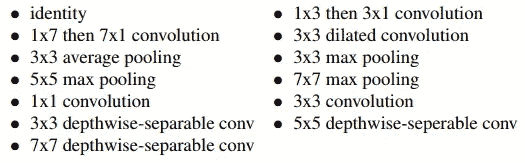
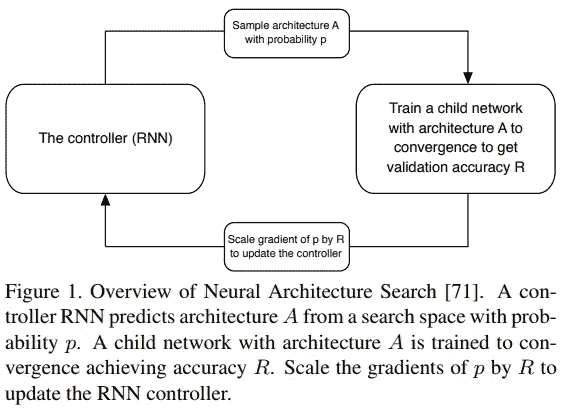
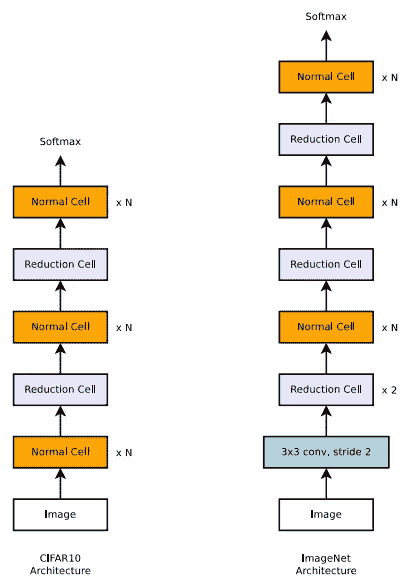
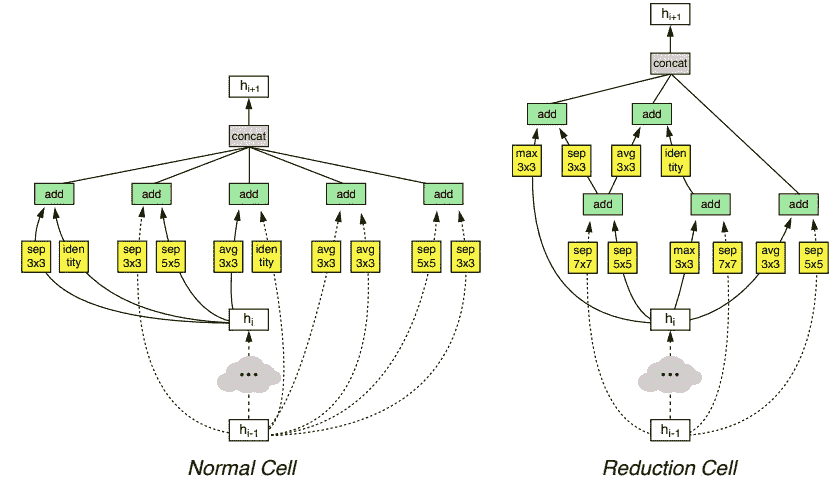
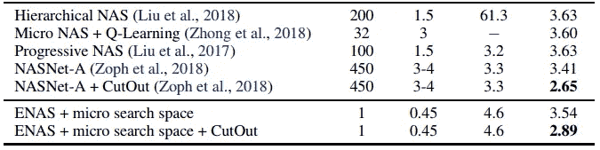
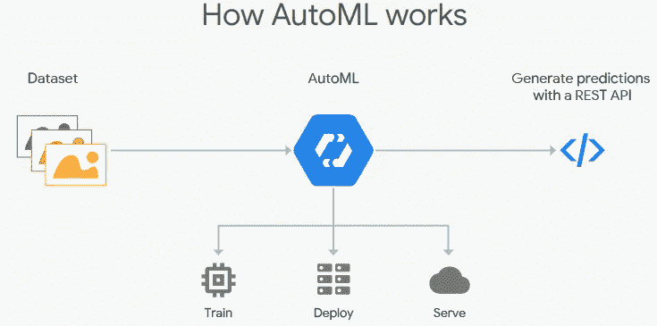

# 关于 AutoML 和神经结构搜索你需要知道的一切

> 原文：<https://towardsdatascience.com/everything-you-need-to-know-about-automl-and-neural-architecture-search-8db1863682bf?source=collection_archive---------1----------------------->

> 想获得灵感？快来加入我的 [**超级行情快讯**](https://www.superquotes.co/?utm_source=mediumtech&utm_medium=web&utm_campaign=sharing) 。😎

AutoML 和神经架构搜索(NAS)是深度学习城堡的新国王。它们是在不做太多工作的情况下，为您的机器学习任务获得巨大准确性的快速而肮脏的方法。简单有效；这就是我们想要的人工智能！

那么它是如何工作的呢？你如何使用它？今天你有什么选择来驾驭这种力量呢？

这里是您需要了解的关于 AutoML 和 NAS 的所有信息。

# 神经结构搜索(NAS)

开发神经网络模型通常需要大量的架构工程。有时你可以通过[转移学习](http://cs231n.github.io/transfer-learning/)，但是如果你真的想要最好的性能，通常最好设计你自己的网络。这需要专业技能(从商业的角度来看，这很昂贵,),总体来说具有挑战性；我们甚至可能不知道当前最先进技术的极限！这需要反复试验，而且实验本身既耗时又昂贵。

这就是 NAS 的用武之地。NAS 是*搜索*寻找最佳*神经网络架构*的算法。大多数算法都是这样工作的。首先定义一组可能用于我们网络的“构建块”。例如，最先进的 [NASNet 论文](https://arxiv.org/pdf/1707.07012.pdf)提出了图像识别网络的这些常用模块:

NASNet blocks for image recognition network

在 NAS 算法中，控制器递归神经网络(RNN)对这些构建块进行采样，将它们放在一起以创建某种端到端架构。这种架构通常体现了与最新网络相同的风格，如 [ResNets](https://www.cv-foundation.org/openaccess/content_cvpr_2016/papers/He_Deep_Residual_Learning_CVPR_2016_paper.pdf) 或 [DenseNets](https://arxiv.org/pdf/1608.06993.pdf) ，但使用了非常不同的块组合和配置。

然后，这个新的网络体系结构被训练收敛，以在保留的验证集上获得一定的准确性。由此产生的精度用于更新控制器，使得控制器将随着时间的推移产生更好的架构，可能通过选择更好的块或进行更好的连接。控制器权重用策略梯度更新。完整的端到端设置如下所示。

The NAS algorithm

这是一种相当直观的方法！简而言之:让一个算法抓取不同的块，并将这些块放在一起组成一个网络。训练并测试网络。根据您的结果，调整您用来制作网络的块以及如何将它们放在一起！

这个算法成功的部分原因是因为它的约束和假设。NAS 发现的体系结构是在比真实世界小得多的数据集上训练和测试的。这样做是因为在像 ImageNet 这样的大型系统上进行训练需要很长时间。但是，这个想法是，在较小但结构相似的数据集上表现更好的网络也应该在较大和更复杂的数据集上表现更好，这在深度学习时代通常是正确的。

第二，是搜索空间本身相当有限。NAS 旨在构建在风格上与当前最先进的体系结构非常相似的体系结构。对于图像识别，这是指在网络中有一组重复的块，同时进行逐步下采样，如下左图所示。在当前的研究中，选择一组积木来建造重复积木也是非常普遍的。NAS 发现网络的主要部分是块如何连接在一起。

在右下方查看 ImageNet 网络的最佳发现块和结构。有趣的是注意到它们是如何包含看起来相当随机的混合运算，包括许多可分离的卷积。

# 建筑搜索的进展

NASNet 的论文具有惊人的进步性，因为它提供了深度学习研究的新方向。不幸的是，它的效率很低，而且谷歌之外的普通用户无法访问。使用*450 GPU*花了*3-4 天*的训练才找到那个伟大的架构。因此，NAS 的许多最新研究都集中在使这一过程更加高效。

[渐进式神经架构搜索(PNAS)](https://arxiv.org/pdf/1712.00559.pdf) 提出使用所谓的基于序列模型的优化(SMBO)策略，而不是 NASNet 中使用的强化学习。使用 SMBO，我们不是随机地从外部集合中抓取和尝试块，而是测试块并按照复杂度增加的顺序搜索结构。这不会缩小搜索空间，但它确实使搜索以更智能的方式进行。SMBO 基本上是在说:*不要一次尝试所有的事情，让我们从简单开始，只在需要的时候变得复杂。*这种 PNAS 方法的效率是原始 NAS 的 5 到 8 倍(因此成本更低)。

[高效的神经架构搜索(ENAS)](https://arxiv.org/pdf/1802.03268.pdf) 是另一种尝试，试图使一般的架构搜索更有效，这一次普通的 GPU 从业者都可以使用。作者的假设是，NAS 的计算瓶颈是训练每个模型收敛，只测量其测试精度，然后*扔掉所有训练的权重*。

研究和实践已经反复表明，迁移学习有助于在短时间内达到高精度，因为为有些相似的任务训练的网络发现相似的权重；迁移学习基本上只是网络权重的转移。ENAS 算法迫使所有模型共享权重，而不是从零开始训练到收敛。我们以前在以前的模型中尝试过的任何块都将使用那些以前学习的权重。因此，每次我们训练一个新的模型，我们本质上都在做一个*转移学习*，收敛得更快！

论文中的表格显示了 ENAS 使用单个 1080Ti GPU 半天的训练效率有多高。

Performance and efficiency of ENAS

# 深度学习的新方式:AutoML

许多人将 AutoML 称为进行深度学习的新方式，这是整个系统的一种变化。我们不用设计复杂的深度网络，只需运行预设的 NAS 算法。谷歌最近将这一点发挥到了极致，推出了[云自动化](https://cloud.google.com/automl/)。只需上传你的数据，谷歌的 NAS 算法就会为你找到一个架构，又快又简单！

AutoML 的想法是简单地抽象出深度学习的所有复杂部分。你需要的只是数据。让 AutoML 来做网络设计的难点就好了！深度学习就像其他工具一样变成了一个插件工具。获取一些数据，并自动创建一个由复杂的神经网络驱动的决策函数。

Google Cloud’s AutoML pipeline

Cloud AutoML 的价格高达 20 美元，不幸的是，一旦你的模型被训练好，你就不能导出它；你必须使用他们的 API 在云上运行你的网络。有几个完全免费的替代方案，但是需要多做一点工作。

AutoKeras 是一个使用 ENAS 算法的 GitHub 项目。它可以使用 pip 安装。因为它是用 Keras 编写的，所以很容易控制和使用，所以你甚至可以深入 ENAS 算法并尝试做一些修改。如果你更喜欢 TensorFlow 或 Pytorch，这里还有那些[这里](https://github.com/melodyguan/enas)和[这里](https://github.com/carpedm20/ENAS-pytorch)的公共代码项目！

总的来说，现在有几种选择来使用 AutoML。这只是取决于你是否会玩弄你想要的算法，以及你愿意付出多少来获得更多的代码抽象出来。

# NAS 和 AutoML 的未来预测

很高兴看到过去几年在自动化深度学习方面取得的长足进步。它使用户和企业更容易接触到它；深度学习的力量变得越来越容易为大众所接受。但是，总有一些改进的空间。

建筑搜索变得更加高效；像 ENAS 一样在一天的训练中找到一个只有一个 GPU 的网络是非常令人惊讶的。然而，我们的搜索空间仍然非常有限。当前的 NAS 算法仍然使用手工设计的结构和构建块，它们只是以不同的方式将它们放在一起！

一个强大的和潜在的突破性的未来方向将是更广泛的搜索，真正寻找新的架构。这种算法可能会揭示这些庞大而复杂的网络中隐藏的更多深度学习秘密。当然，这样的搜索空间需要高效的算法设计。

NAS 和 AutoML 的这一新方向为人工智能社区提供了令人兴奋的挑战，也为科学领域的另一次突破提供了机会。