# 你想知道的关于纽约市餐馆等级的一切

> 原文：<https://towardsdatascience.com/everything-youve-ever-wanted-to-know-about-new-york-city-s-restaurant-ratings-cb73a8701f28?source=collection_archive---------1----------------------->

任何去过纽约市的人都可能注意到几乎所有餐馆的餐馆字母等级。字母等级是在 2010 年引入的，范围从 A 到 C，A 是最高(最好)的评级。餐馆被要求清楚地展示字母等级，尽管一些机构很有创意。

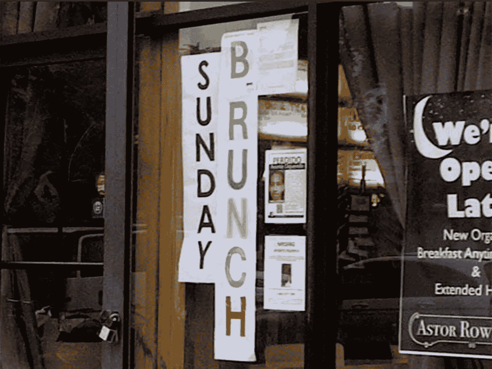

The “B” is for Brunch!

我一直对收视率很好奇，既然数据可以在网上获得，我想我应该亲自测试一下。TLDR:检查员不喜欢给除了 As 以外的分数，不喜欢周末工作，连锁餐厅也很干净。还有一个我无法解开的谜团(跳到结尾，关于餐馆多久被评论一次)。所有的代码都可以在[这里](https://github.com/breeko/nyc_restaurants/blob/master/nyc_restaurants.ipynb)找到。

# 无聊的东西

数据(186，185 行，12 列):

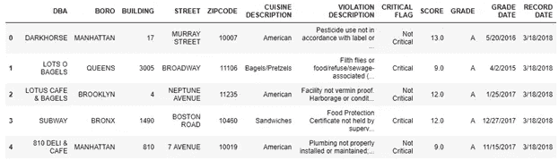

DBA 是餐厅名称，其余部分不言自明。餐厅的命名并不总是一致的(例如星巴克和星巴克咖啡)，所以我必须稍微清理一下。

数据集提供了每家餐厅的历史评分以及最近的评分。但是评级也分为重要和不重要两类。因此，一个评级将有两行，一行表示严重违规，另一行表示非严重违规。所以我删除了关于违规描述/类型的信息，并删除了重复的内容。

由于数据集包含历史信息，我还为每个餐馆创建了一个惟一的键。为此，我创建了一个结合了餐馆名称、建筑、街道和邮政编码的值(例如，DARKHORSE 17 MURRAY STREET 10007)。

# 成绩的分类是什么？

分数从 0 开始。低分数是好的，因为它表示没有违规。每个违规都有一定的分值，因此 0 分意味着没有违规。有三种类型的违规:

1.  一般——例如，没有正确消毒烹饪用具——最低 2 分
2.  关键——例如，提供生的食物，如沙拉，但没有先清洗干净——最低 5 分
3.  公共健康危害——例如，未能将食物保存在合适的温度下——最低 7 分

最终成绩是基于所有分数的总和。

1.  0 到 13 岁的学生得 A
2.  14 岁到 27 岁可以得 B
3.  28 岁或以上得 C

下面可以看到按百分比分列的成绩细目，按最近成绩和所有成绩分组。

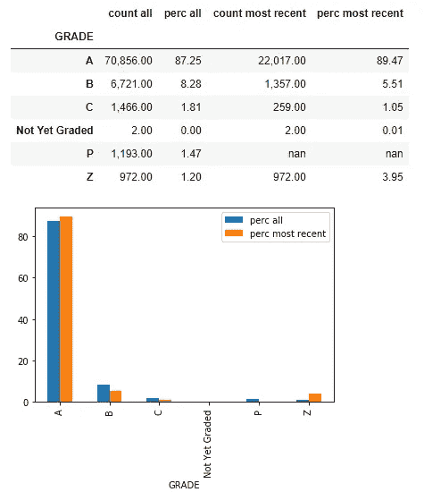

我并不感到惊讶，大部分成绩是 As，只有不到 2%的检查结果是 C。数字分数的分布情况如何？

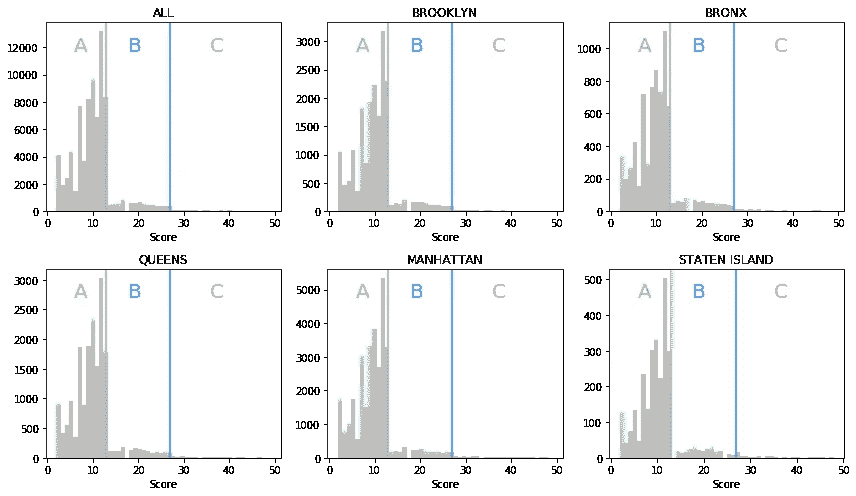

在从 A 到 b 的分界点上有 14 个点的急剧下降。来自[城市的网站](http://www1.nyc.gov/assets/doh/downloads/pdf/rii/how-we-score-grade.pdf):

> 两种类型的检查会导致字母等级:餐厅获得 A 的初次检查和获得 A、B 或 c 的再次检查。餐厅在每个检查周期有两次获得 A 的机会。如果它在第一次检查中没有获得 A，它被计分但未被分级。检查员通常会在一个月内突然回到餐馆，再次检查，并对再次检查进行评分。如果等级为 B 或 C，餐厅将获得等级卡和等级待定卡。它可以邮寄任何一张卡片，直到它有机会在行政审判和听证办公室健康法庭得到听证。直到一家餐厅有了分级检查，才在卫生部门网站上列为尚未分级。

因此，非 A 级最初不会被报道，餐厅还有一次机会。这抑制了报告的 B 和 C 等级。但是在 A 到 B 的分界点上的高分数是很奇怪的。我的猜测是，视察员在接近禁产门槛时会表现出宽容。如果很接近，检查员会给餐馆更高的分数，因为字母分数对顾客来说是最明显的部分。它也可能是分配给每个违规的分数的结果。例如，严重违规最低为 5 次，公共健康危害最低为 7 次。所以 10 分或 12 分应该更常见，这就是我们看到的。

# 检查员什么时候检查？

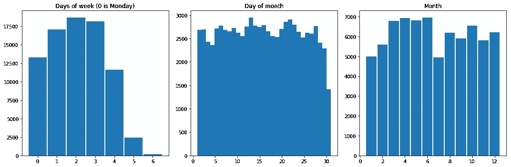

看来食品检查员不喜欢周末工作，尤其是周日。哦，他们在七月也很放松。

# 这些年来有分数膨胀吗？

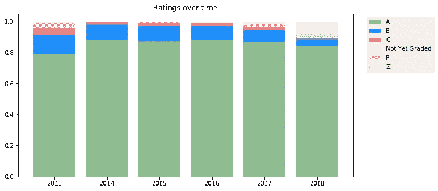

呃，也不尽然。第一年只有大约 80%的 A 评级，但样本量只有大约 100 人。B 级和 C 级评级分别稳定在 12%和 4%左右。今年到目前为止还有很多 Z 或者还没有评分。

# 哪些餐厅的菜肴评价最高？

数据集对美食描述的命名不一致(例如，16 柄有时归类为美式，有时归类为冰淇淋)。在这种情况下，我使用了最常见的美食描述。我也排除了评级总数少于 50 的公司。分数越低越好(违规越少)。

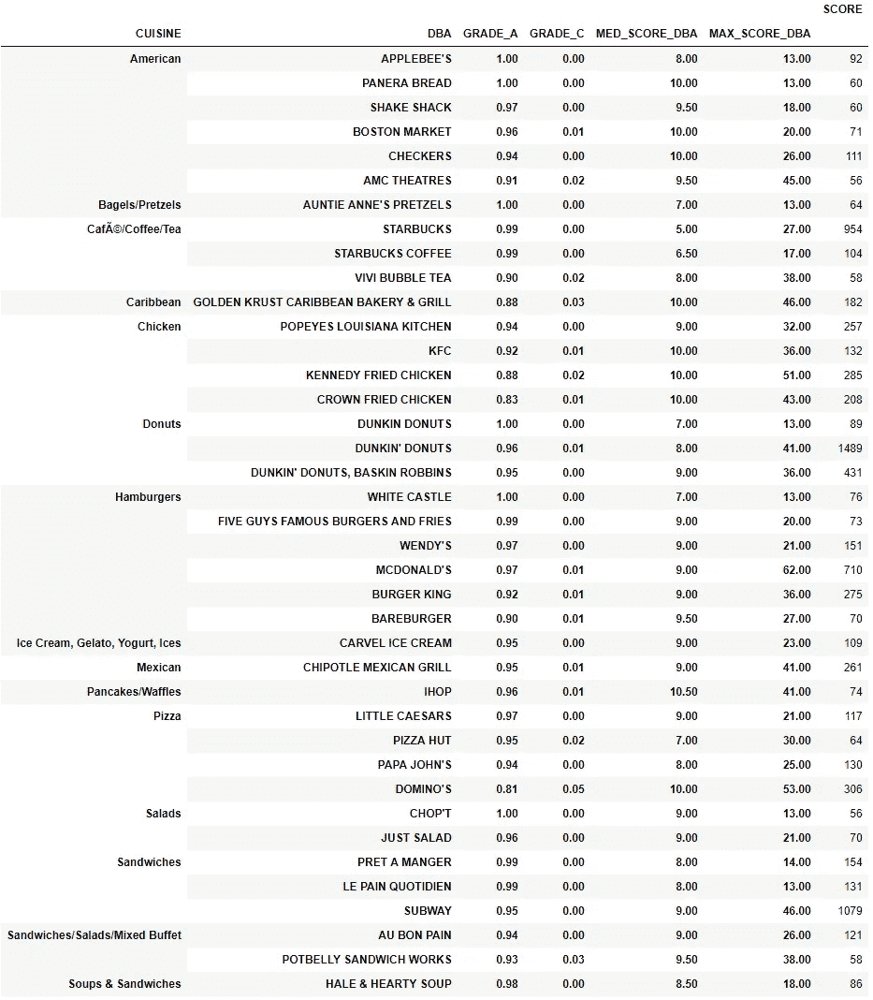

收视率出奇的好，但我想这是大型连锁店的预期。记住高分是不好的。一些机构像苹果蜂的，Panera 面包和白色城堡(！)除了 a 之外从来没有拿到过一个公开的成绩，其他像达美乐这样的团体很不一致，经常很差(他们拿到的成绩只有 81%是 a，5%是 c)。然而，麦当劳在所有大型餐厅中拥有最差(最高)分数 62 分的可疑荣誉。

# 个别餐厅的评分如何随时间变化？

考虑这个问题的一个方法是通过滚动率。滚动率是从一种状态转换到另一种状态(或停留在同一状态)的概率。我根据从一个等级到另一个等级的概率创建了一个滚动率(关于如何创建滚动率的更简单的通用示例，请参见[这个堆栈溢出问题](https://stackoverflow.com/questions/48671636/designing-a-roll-rate-transition-martix-table-in-python/49319388#49319388))。

大约 90%的情况下，A 评级会在下一次检查中再次获得 A。在下一次评级中，B 级餐厅有 71%的机会获得 A 级，C 级餐厅有 68%的机会获得 A 级。这对那些在 B 级和 C 级餐厅用餐的人来说应该是一种安慰。

# 餐厅多长时间保持一个给定的等级？

我查看了每家餐厅点评的时间间隔。我把它按等级分类，因为我发现等级低的餐馆更容易被评论。

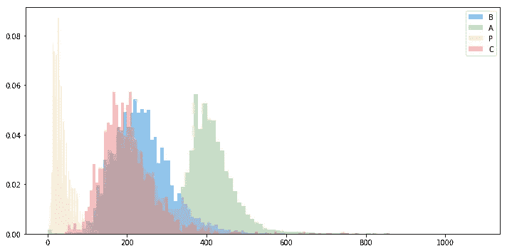

从上面看不出来，但是 A 级有双峰分布。

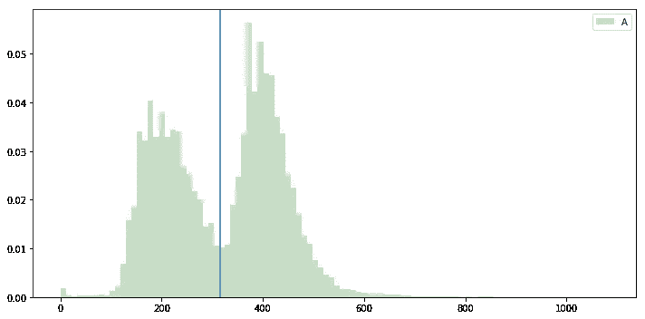

我花了一些时间试图找出区别，但我从来没有找到一个令人满意的答案。A 级天数的分布在几年内和几个月内都是一致的。一般来说，所有菜系和所有行政区都是双模式的。

这多少与餐馆被分级的频率有关，但不是绝对相关(例如，像星巴克这样的餐馆几乎都在右峰)。我可能遗漏了一些显而易见的东西，但我猜测这是由于一些没有报告的分数。如前所述，如果一家餐馆得到了 B 以外的分数，分数不会被报告，餐馆在一个月内还有机会得到 A。我的猜测是，未能通过这一未被报道的评级会导致餐馆更频繁地被审查。这就解释了为什么评级高的餐厅很少得到评级。即使你看看那些从未被评为 A 级以下的餐馆，双峰分布也是存在的，但那可能只是因为非 A 级餐馆没有被报道。

我对其他想法持开放态度。

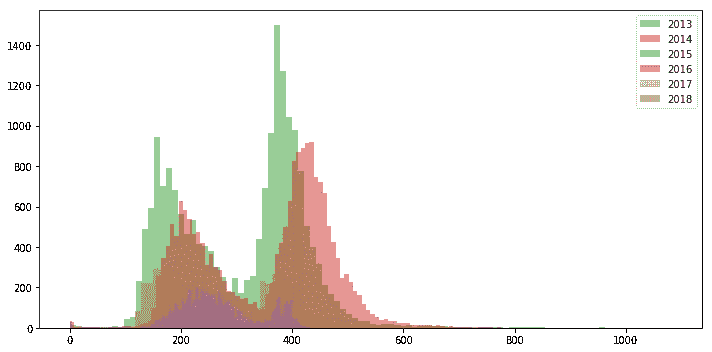

It always existed

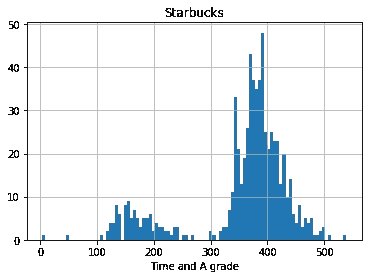

Large chains are still somewhat bi-modal

Even those with perfect grades are bi-modal

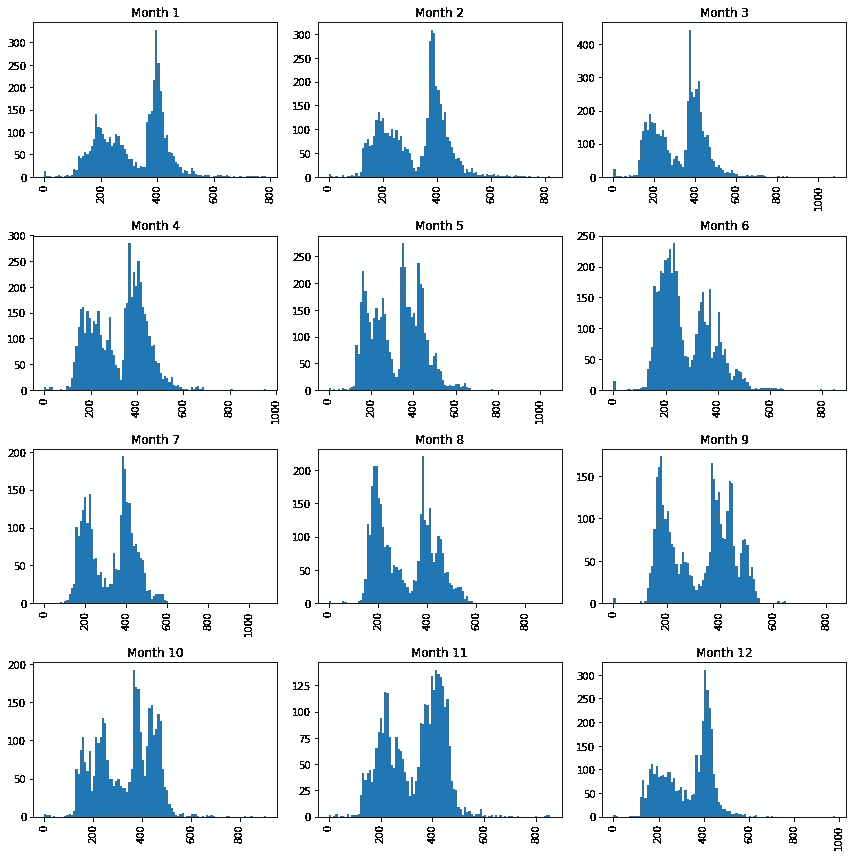

Bi-modal across months

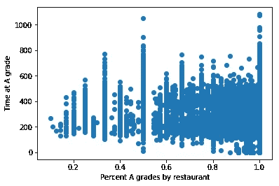

No clear pattern between A-grade consistency and time at grade