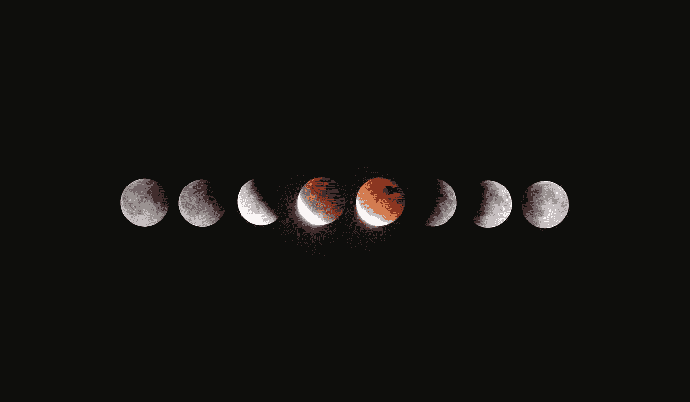
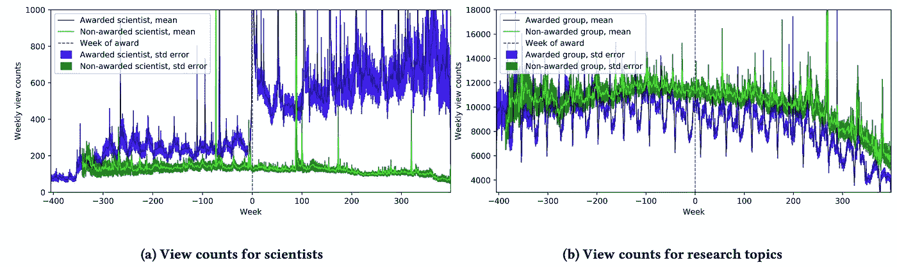
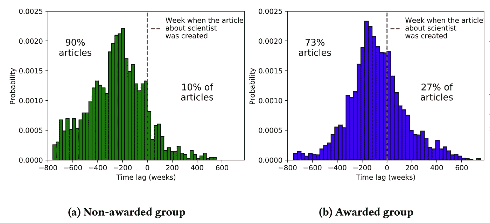

# 对科学家和研究主题的关注的演变

> 原文：<https://towardsdatascience.com/evolution-of-attention-towards-scientists-and-research-topics-based-on-awards-a2453ebb574?source=collection_archive---------10----------------------->

## 科学奖项影响力的数据科学研究

Photo by [Celso](https://unsplash.com/@celsooliveira?utm_source=medium&utm_medium=referral) on [Unsplash](https://unsplash.com?utm_source=medium&utm_medium=referral)

为了了解**公众对科学和科学家的关注如何演变**，对描述科学家和研究主题的维基百科页面进行了一项研究，以了解人们如何感知、更新和访问这些内容。

特别是，**比较了获得某种奖项或奖励(诺贝尔奖、图灵奖等等)的科学家和没有获得任何奖励的科学家之间的注意力**(尽管他们贡献了一个关键的科学进步)。

显然，一个奖项的存在对科学家的受欢迎程度和受关注程度有着深远的影响。获奖科学家的文章在可见性和更新方面也增长得更快，即使是在获奖多年之后。

令人难以置信的是，这些奖项并没有增加相应科学主题的知名度和关注度，如下所示:

另一个有趣的问题是，主题文章是在科学家的页面创建之前还是之后创建的。对于获奖科学家，维基百科上 27%的研究主题页面是在科学家页面创建之后创建的，而只有 10%的研究主题是在未获奖科学家之后创建的，如下所示:

这项研究已经在阿姆斯特达姆举行的 2018 年[网络科学大会](https://websci18.webscience.org/)上发表，作者是 [Claudia Wagner](http://www.claudiawagner.info/) ，Olga Zagovora，Tatiana Sennikova，Fariba 卡利米(德国科布伦茨-兰道大学社会科学学院)。

完整的文章可以在这里找到。