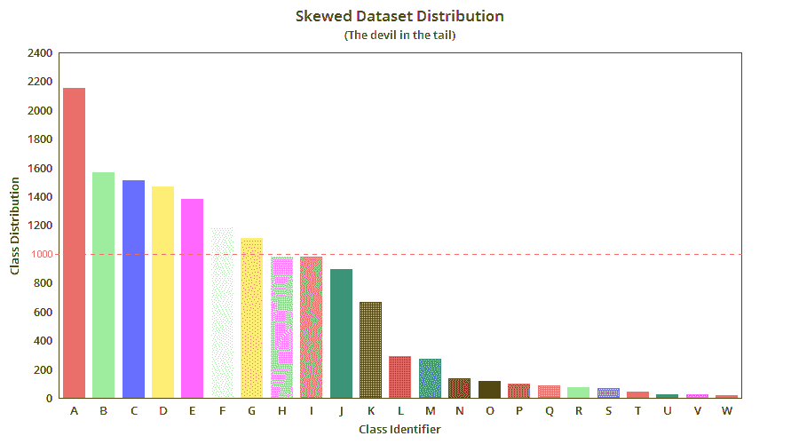
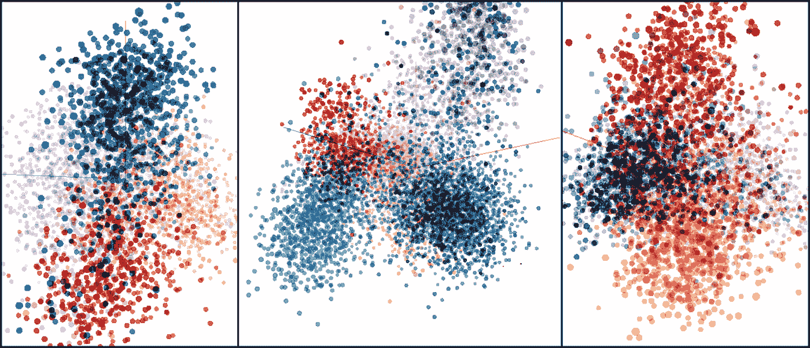
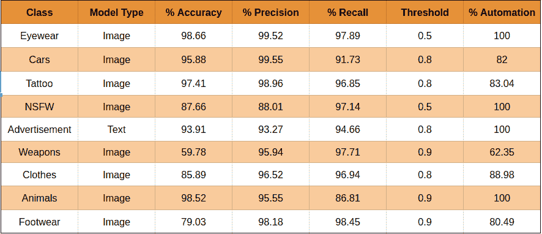
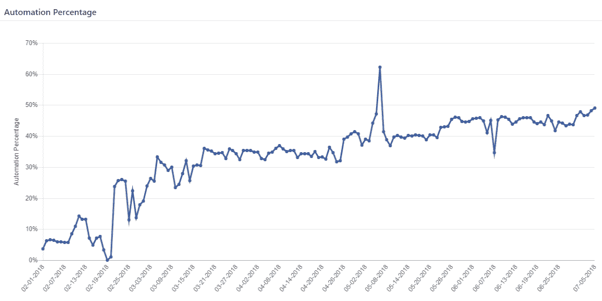

# “内核”的进化:团队的支柱

> 原文：<https://towardsdatascience.com/evolution-of-kernel-the-backbone-of-squadai-7c605ec64b28?source=collection_archive---------10----------------------->

由于其以丰富的可能性改善我们生活的潜力，人工智能正在成为每个行业不可或缺的一部分。虽然，获得人工智能可能对一家公司来说很有吸引力；是 a)伟大的思想，b)发现，c)耐心和 d)完成任务的能力的结合使它成为现实。

在[小队](https://www.squadplatform.com/)，我们正在变革在线分类广告和市场的[内容审核](https://www.squadplatform.com/blog/content-moderation-humans-ai/)。我们帮助在批准最近上传到网站的用户生成的列表和保持列表质量的高标准之间取得平衡。目前，我们的客户在不牺牲质量的情况下体验到了极高的效率，节省了高达 70%的成本。

除了我们的产品，我们使用人工智能来自动化我们客户的大部分工作，这进一步降低了成本，并将交付质量大幅提高到一个新的水平。

内容审核问题通常涉及高度主观的判断，这需要一个思维过程，我们的人力受过良好的训练，而机器可能不会产生自信的判断。正如我们的首席执行官 [Apurv Agarwal](https://www.linkedin.com/in/apurvagrawal/) ，“*我们本质上并没有解决那些可以通过机器学习*直接解决的问题”。

可以说，为了解决艰巨的自动化任务，我们需要人在回路中，帮助稳健地训练机器学习算法。

# 第一个大挑战

当我们收到为我们的一个客户自动执行内容审核任务的第一个挑战时，该客户恰好是美国前 5 大 C2C 市场之一，像任何其他机器学习团队一样，我们开始进行探索性数据分析，了解重叠的类并识别独特的类，可视化不同的簇并探索随时可用的工具和方法，这些工具和方法可用于解决涉及文本和图像分类的复杂问题。

我们在最先进的深度学习架构和迁移学习上使用预先训练的模型进行了初步实验，认为我们希望为我们的 C2C 客户端自动化的大多数类已经存在于 [imagenet 对象类](https://gist.github.com/yrevar/942d3a0ac09ec9e5eb3a)中，令我们惊讶的是，所有模型的准确率都超过了 95%。早期实验的成功让我们很高兴，我们觉得我们已经完成了挑战，但有趣的是，它花了 6 个月的时间来真正解决端到端的问题。

最终，我们了解了探索阶段和生产环境之间的区别(在生产环境中，每个模型都必须 99%精确)。对于我们这样一个非常年轻的团队来说，在一个创业环境中工作，一切都必须从费米能级开始，有一系列的打击在等着我们。

# 自动化的马拉松

从一开始，在我们的数据科学家 [Sanchit Aggarwal](https://www.linkedin.com/in/sanchit-aggarwal-4b8b47b/) 的指导下，所有崭露头角的机器学习工程师都直接或间接地致力于不同内容审核用例的自动化，探索相关的 ML 算法，编写代码以进行快速实验，并根据我们的 C2C 巨头共享的指南持续分析和学习适当的模型。

我们训练了许多性能良好的基于图像和文本的模型，建立了一个像样的训练和测试结构，并不断探索其他改进方法，如跳格法、单词嵌入、一类学习、GMMs 等。

**Figure 1: Devil’s in the tail: Large number of categories with mostly small data for various classes in long tail distribution.**

我们还深入了解了数据集分布不均匀、类重叠的问题，以及模型和工作流集合的需求。当期望是 99.5%的精确度和召回率时，另一个挑战是挑选高质量的训练数据，以从关于目标标签严重重叠的真实世界列表中获得高度自动化。

**Figure 2: Tensorboard Visualisations for RESNET features for various classes (different colors) showing high magnitude of overlap.**

一旦我们收集了所需的数据集，我们就可以连续成功地从实验中获得结果，并且越来越接近与客户达成一致的 SLA 数字。

我们都对我们采用的机器学习实践感到非常兴奋，并享受着处理大量机器学习算法来解决复杂问题的新鲜感。在几个月的专门实验中，我们有了许多模型，它们可以部署在生产环境中，并用于进行实时质量检查。但是我们的团队没有预料到一个非常重要的桥梁，在我们跨越为客户列表的内容审核做出高质量实时预测的里程碑之前，需要建立这个桥梁。

**Table 1: Evaluation of some of our generic models.**

# 内核的进化

在尝试了各种聚类方法、数据清理技术、数据扩充、监督和非监督算法(如 SMOTE、KM-SVM)之后，我们意识到我们总是可以改进我们的模型，而且没有停止的标准。但是，为了给企业带来真正的价值，我们还需要一个稳定、强大的基础设施。

这是我们开始深入研究可用基础设施的时候。我们开始探索模型版本控制和预测系统的可用工具，如[厚皮动物](http://www.pachyderm.io/)、[火花](https://spark.apache.org/)、[数据版本控制](https://dvc.org/)、 [HDFS](https://hadoop.apache.org/) 等等。所有这些系统都非常复杂，需要进行大量的修改才能与我们现有的人在回路框架集成。我们意识到，开发自己的内部系统，*内核*，来处理实时预测会更快更容易。这时，我们感觉到团队内部需要更多的工程带宽。我们请来了 Ketan Bhatt，用他的精力和经验为 SquadAI 创建一个强大的基础设施。

在 Squad，我们遵循[求解团队](https://labs.spotify.com/2014/03/27/spotify-engineering-culture-part-1/)的概念。

在我们新的 solver 团队基础设施中，我们中很少有人开始专注于机器学习来学习高精度模型，而其他人则探索基础设施主干所需的数据库设计和架构，*内核*。我们一步一步地计划和解决每个问题，采用集中的方法和适量的协作，以 1%的自动化和 99%的精确度开始。下面的图表显示了复杂 C2C 用例的自动化水平稳步提高。

**Figure 3: Graph showing continuous improvement over time for automating content moderation for our C2C client after we had created the bridge, Kernel.**

我们不断改进最新的最先进的方法、微调模型、深度学习优化、文本分类中的 CNN、定义的可扩展流程和基础设施，以实现 AI + HI 工作流 50%自动化的目标，而不会影响判断的精确度。

为了更深入地理解我们自动化框架的技术方面， ***SquadAI*** 及其骨干 ***内核、*** 请参考我们的博客- [***SquadAI:用于构建、管理和评估机器学习工作流的众包驱动平台***](/squadai-crowdsourced-driven-platform-for-building-managing-and-evaluating-machine-learning-ca5d28ac9b23)

非常感谢所有参与构建内核的 ML 工程师: [Aniket Bhatnagar](https://www.linkedin.com/in/aniket-bhatnagar-a323a7117/) 、 [Medha Katehar](https://www.linkedin.com/in/medhakatehara/) a、 [Pragya Jaiswal](https://www.linkedin.com/in/pragya-jaiswal-61016172/) 和 [Priyank Jain](https://www.linkedin.com/in/priyank-jain-a0566a113/) 。