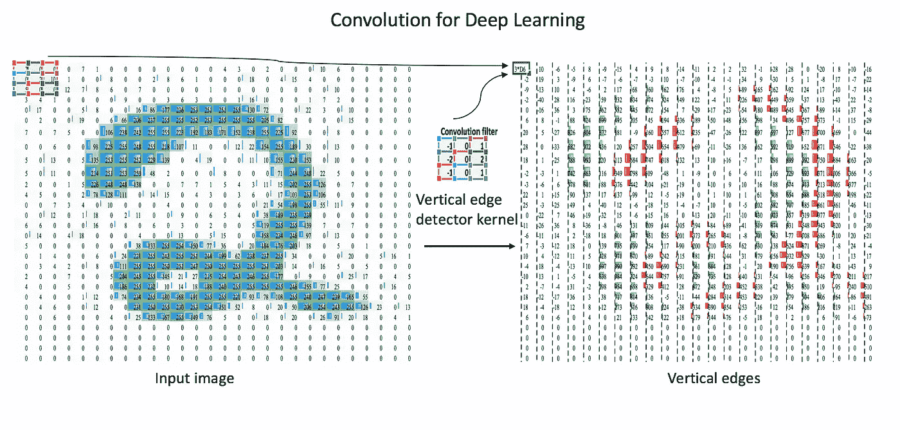
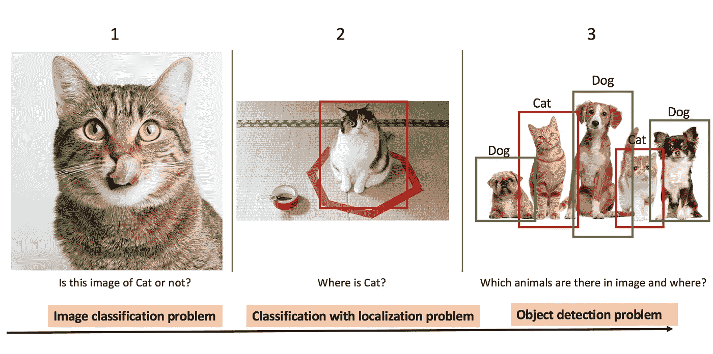
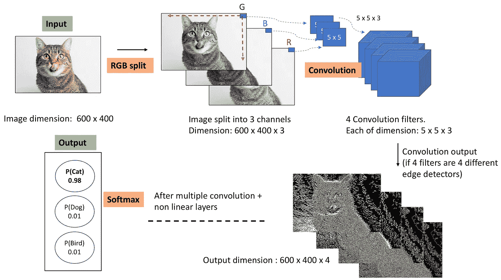
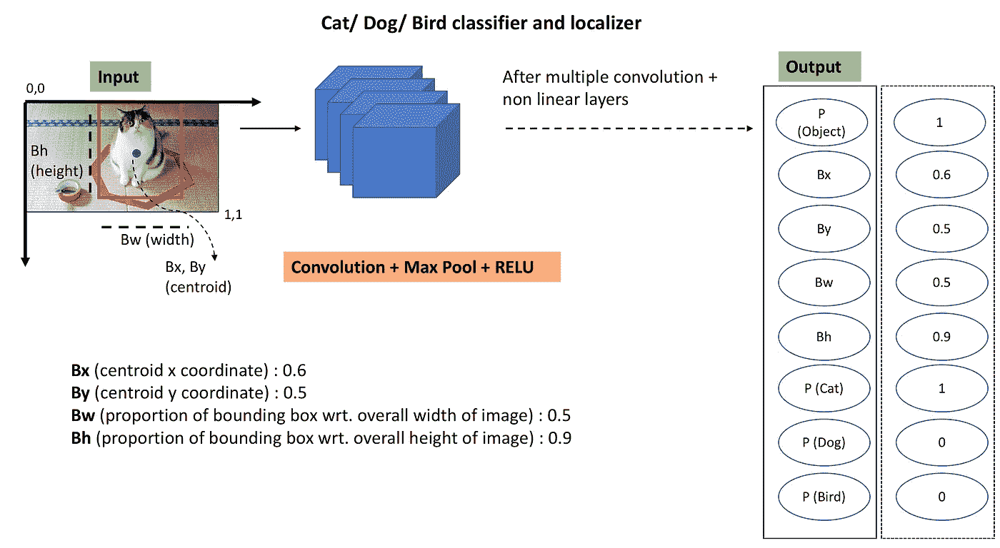
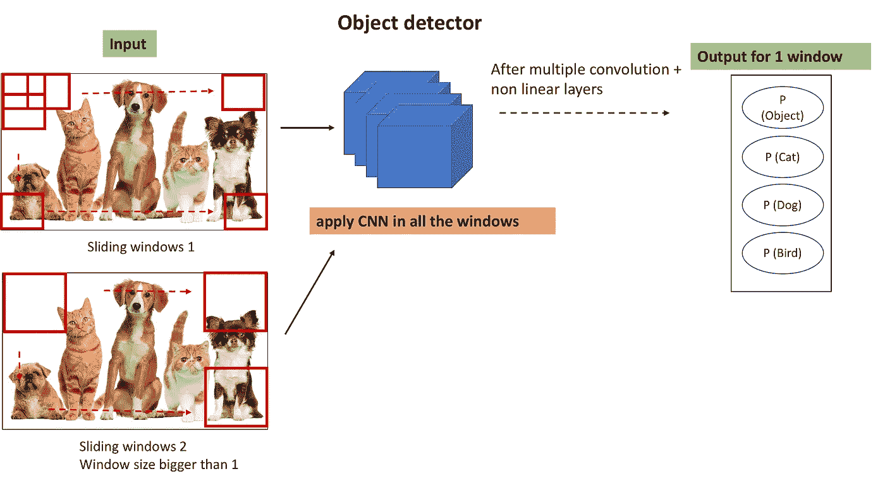
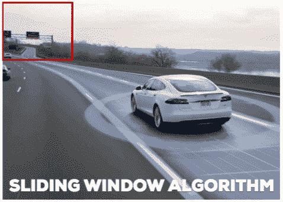
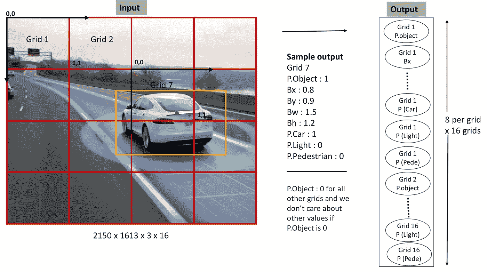
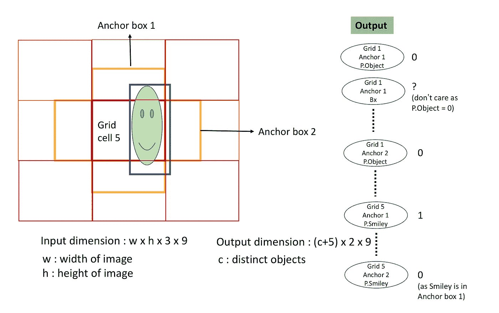

# 目标检测和定位算法的发展

> 原文：<https://towardsdatascience.com/evolution-of-object-detection-and-localization-algorithms-e241021d8bad?source=collection_archive---------0----------------------->

通过对基本概念的直观解释，理解对象检测和定位的最新进展。

目标检测是计算机视觉中发展非常迅速的领域之一。感谢深度学习！每年都有新的算法/模型不断超越以前的算法/模型。事实上，脸书人工智能团队上周刚刚发布了一个最新的物体探测软件系统。这款软件名为 [Detectron](https://github.com/facebookresearch/Detectron) ，整合了众多针对物体检测的研究项目，由 [Caffe2](https://github.com/caffe2/caffe2) 深度学习框架提供支持。

今天，有太多的预训练模型用于物体检测(YOLO，RCNN，快速 RCNN，掩模 RCNN，多框等)。).因此，只需要很少的努力就可以检测出视频或图像中的大多数对象。但是我博客的目的不是谈论这些模型的实现。相反，我试图以一种清晰和简洁的方式解释基本概念。

我最近完成了**吴恩达的** **卷积神经网络课程**的第三周，他在课程中讲述了物体检测算法。这个博客的大部分内容都是受那门课的启发。

**编辑:**我目前在做 **Fast.ai 的《程序员前沿深度学习》课程，老师是杰瑞米·霍华德**。现在，我已经使用 PyTorch 和 fast.ai 库实现了下面讨论的算法。这里是[链接](https://github.com/groverpr/deep-learning/tree/master/computer_vision)到代码。如果你想了解下面讨论的算法的实现部分，可以看看这个。实现已借用 fast.ai [课程笔记本](https://github.com/fastai/fastai/tree/master/courses)，有注释和笔记。

# CNN 简介

在我解释对象检测算法的工作原理之前，我想花一些时间介绍卷积神经网络，也称为 CNN 或 ConvNets。在深度学习时代，细胞神经网络是大多数计算机视觉任务的基本构建模块。

**Fig. 1\. Convolution demo in Excel**

**我们想要什么？**我们想要某种算法，它查看图像，看到图像中的模式，并告诉图像中有什么类型的对象。例如，是猫或狗的图像。

什么是计算机的图像？只是数字矩阵。例如，参见上面的图 1。左边的图像只是手写数字 2 的 28*28 像素图像(取自 MNIST 数据)，在 Excel 电子表格中表示为数字矩阵。

**我们怎样才能教会计算机学会识别图像中的物体？**通过让计算机学习像垂直边缘、水平边缘、圆形以及许多其他人类未知的模式。

**计算机如何学习模式？**回旋！
(看这个的时候看上图)卷积是两个矩阵之间给出第三个矩阵的数学运算。较小的矩阵，我们称之为过滤器或内核(图 1 中的 3x3 ),对图像像素矩阵进行操作。根据滤波器矩阵中的数字，输出矩阵可以识别输入图像中存在的特定模式。在上面的例子中，滤波器是垂直边缘检测器，它学习输入图像中的垂直边缘。在深度学习的背景下，输入图像及其随后的输出从许多这样的过滤器中通过。滤波器中的数字由神经网络学习，而模式则自行产生。

**为什么卷积有效？**因为在大多数图像中，对象在相对像素密度(数量级)上具有一致性，这可以被卷积利用。

*我知道对于一个不了解 CNN 的读者来说，CNN 上只有几行字是不够的。但是 CNN 并不是这篇博客的主要话题，我已经提供了基本的介绍，所以读者在继续阅读之前不必再打开 10 个链接来理解 CNN。*

看完这篇博客后，如果你还想了解更多关于 CNN 的信息，我强烈建议你阅读亚当·盖特吉的博客。

# **计算机视觉任务的分类**

**Fig. 2: Common computer vision tasks**

以图 2 中的猫和狗图像为例，以下是计算机视觉建模算法完成的最常见任务:

1.  **图像分类:**这是最常见的计算机视觉问题，算法查看图像并对其中的对象进行分类。图像分类具有广泛的应用，从社交网络上的人脸检测到医学中的癌症检测。这种问题通常使用卷积神经网络(CNN)来建模。
2.  **物体分类与定位:**假设我们不仅想知道图像中是否有猫，还想知道猫的确切位置。目标定位算法不仅标记目标的类别，而且在图像中围绕目标的位置画出一个包围盒。
3.  **多目标检测和定位:**如果图像中有多个目标(如上图中的 3 只狗和 2 只猫)并且我们想检测它们，该怎么办？这将是一个目标检测和定位问题。这一点的一个众所周知的应用是在自动驾驶汽车中，其中该算法不仅需要检测汽车，还需要检测行人、摩托车、树木和帧中的其他物体。这类问题需要利用从图像分类和目标定位中学到的思想或概念。

现在回到计算机视觉任务。在深度学习的背景下，上述 3 种类型的任务之间的基本算法差异只是选择相关的输入和输出。让我用一个信息图来详细解释一下这条线。

## **1。图像分类**

**Fig. 3: Steps for image classification using CNN**

图 3 中的信息图显示了用于图像分类的典型 CNN 的样子。

> **1。**通过 n 个滤波器(图 3 中 n = 4)对具有一定高度、宽度和通道深度(上例中为 940、550、3)的输入图像进行卷积【如果您仍然不清楚卷积的确切含义，请查看[此链接](https://medium.com/@ageitgey/machine-learning-is-fun-part-3-deep-learning-and-convolutional-neural-networks-f40359318721)以了解深度神经网络中的卷积】。
> **2。**卷积的输出用非线性变换处理，通常是最大池和 RELU。
> **3。**卷积、最大池和 RELU 的上述 3 个操作被执行多次。
> **4。**最终层的输出被发送到 Softmax 层，soft max 层将数字在 0 和 1 之间转换，给出图像属于特定类别的概率。我们使损失最小化，以便使最后一层的预测尽可能接近实际值。

## **2。物体分类和定位**

**Fig. 4: Input and output for object localization problems**

现在，为了让我们的模型绘制对象的边界框，我们只需改变前面算法的输出标签，以便让我们的模型学习对象的类别以及对象在图像中的位置。我们在输出层增加了 4 个数字，包括物体的质心位置和图像中边界框的宽度和高度的比例。

简单吧？只需要加上一堆输出单位就可以吐槽出你要识别的不同位置的 x，y 坐标。这些不同的位置或标志对于我们所有的图像中的特定对象来说是一致的。例如，对于汽车，与图像中的其他点相比，高度将小于宽度，并且质心将具有特定的像素密度。

*同样的逻辑，如果图像中有多个物体，我们想对它们进行分类和定位，你认为会发生什么变化？我建议你此刻停下来思考一下，你可能会自己找到答案。*

## **3。多目标检测和定位**

**Fig. 5: Input and output for object detection and localization problems**

为了检测图像中的各种对象，我们可以直接使用我们迄今为止从对象定位中学到的知识。不同之处在于，我们希望我们的算法能够对图像中的所有对象进行分类和定位，而不仅仅是一个对象。因此，这个想法是，只需将图像裁剪成多个图像，并对所有裁剪的图像运行 CNN 来检测对象。

算法的工作方式如下:

> **1。**制作一个尺寸远小于实际图像尺寸的窗口。裁剪它并将其传递给 ConvNet (CNN)并让 ConvNet 进行预测。
> **2。**继续滑动窗口，将裁剪后的图像传入 ConvNet。
> **3。**在用该窗口尺寸裁剪完图像的所有部分后，再次重复所有步骤以获得更大的窗口尺寸。再次将裁剪后的图像传入 ConvNet，让它进行预测。
> **4。**最后，你将得到一组裁剪区域，其中包含一些对象，以及对象的类和边界框。

这种解决方案被称为滑动窗口对象检测。这是一个非常基本的解决方案，有如下许多注意事项:

**答:计算量很大:**裁剪多幅图像并通过 ConvNet 传输，计算量非常大。

**解决方案:**有一个简单的 hack 来提高滑动窗口法的计算能力。它是用 1x1 卷积层替换 ConvNet 中的全连接层，并且对于给定的窗口大小，仅传递输入图像一次。因此，在实际实现中，我们并不是一次传递一个裁剪后的图像，而是一次传递完整的图像。

**B .不准确的边界框:**我们在整个图像上滑动正方形的窗口，可能对象是矩形的，也可能没有一个正方形与对象的实际大小完全匹配。虽然这种算法能够在一幅图像中找到并定位多个目标，但是包围盒的精度仍然很差。

**Fig. 6\. Bounding boxes from sliding window CNN**

我已经谈到了对象检测问题的最基本的解决方案。但是它有许多注意事项，不是最准确的，并且实现起来计算量很大。那么，如何才能让我们的算法更好更快呢？

## **更好的解决方案？YOLO**

原来我们有 YOLO(你只看一次)，它比滑动窗口算法更准确，更快。它仅仅是基于我们已经知道的算法之上的一个小调整。这个想法是将图像分成多个网格。然后，我们更改数据的标签，以便为每个网格单元实现定位和分类算法。让我再用一个信息图来解释一下。

**Fig. 7\. Bounding boxes, input and output for YOLO**

YOLO 轻松地说道:

> **1。**将图像分成多个网格。为了便于说明，我在上图中画了 4x4 的网格，但是 YOLO 的实际实现有不同数量的网格。(7x7 用于在 PASCAL VOC 数据集上训练 YOLO)
> 
> **2。**标注训练数据，如上图所示。如果 C 是数据中唯一对象的数量，S*S 是我们将图像分割成的网格数量，那么我们的输出向量的长度将是 S*S*(C+5)。例如，在上述情况下，我们的目标向量是 4*4*(3+5)，因为我们将图像划分为 4*4 的网格，并针对 3 个独特的对象进行训练:汽车、灯光和行人。
> 
> **3。制作一个深度卷积神经网络，损失函数作为输出激活和标签向量之间的误差。基本上，该模型只需将输入图像通过 ConvNet 向前传递一次，即可预测所有网格的输出。**
> 
> **4。**请记住，网格单元中存在的对象标签(P.Object)是由该网格中存在的对象质心决定的。这对于不允许一个对象在不同的网格中被多次计数很重要。

**YOLO 的注意事项及其解决方案:**

**A .无法检测同一网格中的多个对象。**这个问题可以通过选择较小的网格尺寸来解决。但是，即使选择较小的网格尺寸，该算法在物体彼此非常接近的情况下仍然会失败，例如一群鸟的图像。

**解决方案:锚箱。**除了每个网格单元有 5+C 个标签(其中 C 是不同对象的数量)之外，锚定框的想法是每个网格单元有(5+C)*A 个标签，其中 A 是必需的锚定框。如果一个对象被分配给一个网格中的一个锚定框，其他对象可以被分配给同一网格的另一个锚定框。

**Fig. 8\. YOLO with anchor boxes**

**B .多次检测一个物体的可能性。**

**解:** **非 max 抑。**非最大值抑制移除与高概率边界框非常接近的低概率边界框。

## **结论:**

截至今天，在不同的深度学习框架中有多个版本的预训练 YOLO 模型可用，包括 [Tensorflow](https://github.com/thtrieu/darkflow) 。最新的 YOLO 论文是:[《yolo 9000:更好更快更强》](https://arxiv.org/pdf/1612.08242.pdf)。该模型在 9000 个类上进行训练。还有一些基于选择性区域提议的区域 CNN (R-CNN)算法，我没有讨论过。由脸书 AI 开发的软件系统 Detectron 也实现了 R-CNN 的变体，屏蔽 R-CNN。

## 参考资料:

1.  【https://arxiv.org/pdf/1506.02640.pdf】你只看一次:统一的、实时的物体检测

2.  更好、更快、更强
    [https://arxiv.org/pdf/1612.08242.pdf](https://arxiv.org/pdf/1612.08242.pdf)
3.  **吴恩达的卷积神经网络(deep learning . ai)** [https://www . coursera . org/learn/卷积神经网络](https://www.coursera.org/learn/convolutional-neural-networks)