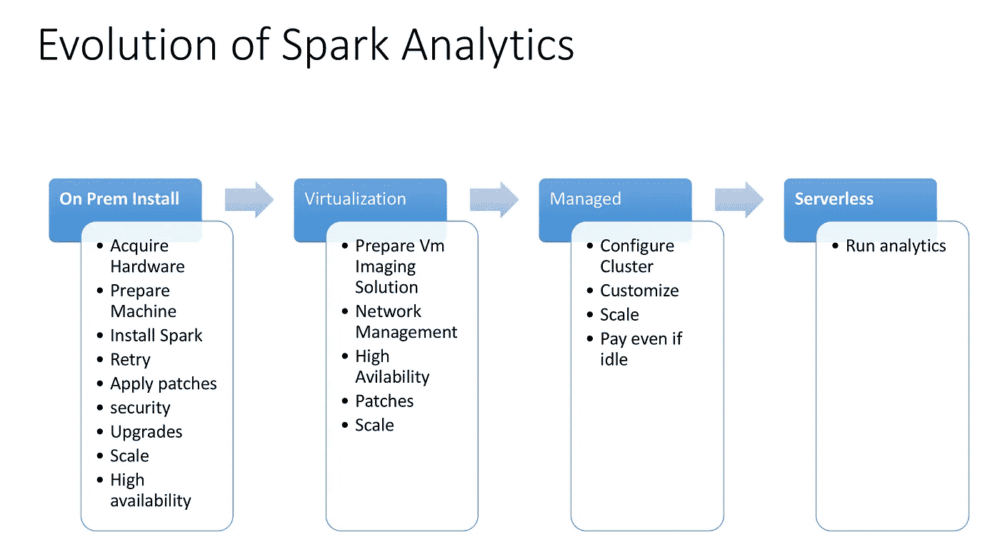
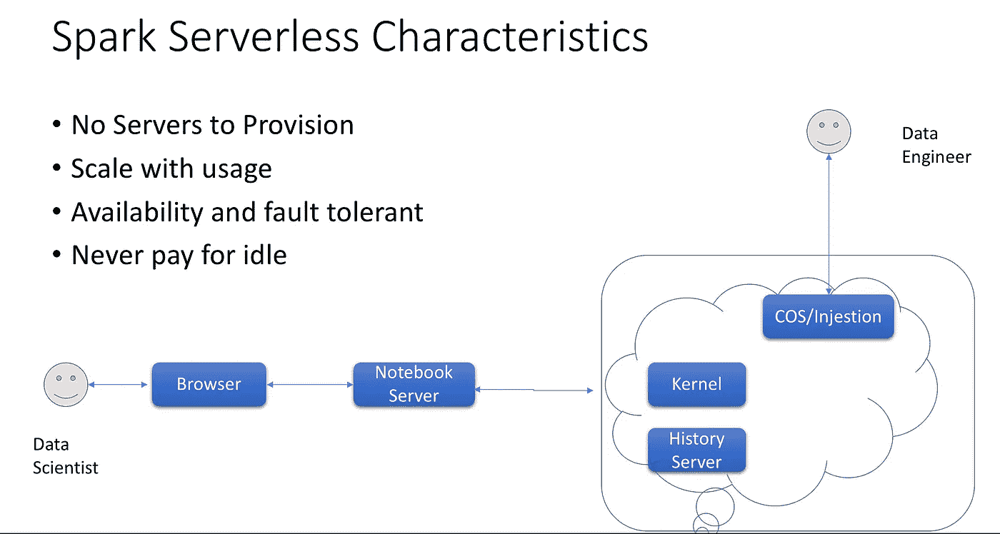

# Spark 分析的发展

> 原文：<https://towardsdatascience.com/evolution-of-spark-analytics-eb9d47c9cf51?source=collection_archive---------9----------------------->

Apache Spark 是一个开源、可扩展、大规模并行的内存执行环境，用于运行分析应用程序。

**数据科学家**主要负责构建预测分析模型和构建洞察力。他将分析数据工程师使用机器学习工具(如沃森机器学习)编目和准备的数据。他将使用 Jupyter 笔记本电脑构建应用程序，RStudio
在数据科学家分享他的分析结果后，应用程序开发人员可以像认知聊天机器人一样构建应用程序。随着聊天机器人与客户互动，它将不断完善自己的知识，并帮助发现新的见解。

让我们站在数据科学家的角度，看看作为一名数据科学家，我想做些什么:

*   我想运行我的分析工作，我想运行社交媒体分析或文本分析
*   我想按需运行查询
*   我想在 Spark 上运行 R，Python 脚本
*   我想提交 Spark 作业
*   我想查看我的应用程序的历史服务器日志，以便比较我的作业性能并进一步改进
*   我想为我的调试查看守护进程日志
*   我想写笔记本

现在你知道我想做什么，现在让我们看看我一直在做什么来实现我真正想做的事情。几年前，如果我需要做同样的事情，我通常会这样做

## **我自己的裸机上的 Spark Analytics**

如果我需要在我自己的机器上运行 Spark，我需要首先**获得硬件。**一旦我有了合适的可用硬件，我需要准备好它，以便安装 Spark 和我的其他分析产品。我需要做很多工作来让硬件为运行我的 Spark 工作负载做好准备。如果你有兴趣知道在裸机上设置你自己的 Spark 运行时会遇到哪些挑战，请参考我的另一个[博客](https://medium.com/@rachit1arora/why-move-to-cloud-for-running-bigdata-analytical-pipelines-3bf2bf11bb8e)。以下是其中的几个。

*   **设置网络** : Spark 是一个集群软件，所以我需要多台机器来运行我的 Spark 作业。为了在这些机器之间建立网络，我需要在它们之间设置正确的线路，我需要**配置网络接口**以便它们被适当地调整。
*   **安装盘**:一旦联网完成，我就可以访问那些机器了，我需要格式化这些盘，给它们贴上正确的标签，配置它们，使它们在重启时不会被破坏。我需要设置 raid 控制器，创建分区，为所有磁盘创建挂载点，并正确配置它们
*   **维护**:安装火花簇是容易的部分，维护起来比较困难。我将需要应用常规的操作系统补丁，监视磁盘错误并在需要时替换它们，我已经花费了许多资源来维护 Spark 集群
*   **监视器**:我需要确保我的集群中的各种组件都是健康的，并且需要安装和配置一些监视解决方案来监视故障并通知我
*   **扩展:**我将需要添加更多的机器，并重复相同的过程在我现有的集群中添加新的节点。
*   **合规**:因为我是大企业的一部分，我需要确保我的分析管道中的所有组件都符合某些合规标准，如 ISO270001 等。

## 在我自己的虚拟机上激发分析

现在，我已经到了这样一个阶段，在我的组织中，运行分析工作的要求越来越高，我不能花费太多的时间和资源在裸机上设置 Spark 集群，我需要一种可以根据需要轻松快速扩展的产品。

为了满足不断增长的工作负载需求，我将寻求虚拟化解决方案。这当然会帮助我获得重复能力，但我仍然需要注意很多事情，如

*   **维护**
*   **安全**
*   **监视器**
*   **升级**
*   **刻度**
*   **高可用性**

## 对托管公共云产品进行 Spark 分析

许多云提供商，如 Google、IBM、Microsoft 和 Amazon，正在提供许多服务，这些服务将 Spark 运行时作为托管产品。

请参考以下大数据领域中流行的云服务的文档链接

*   [亚马逊电子病历](https://aws.amazon.com/documentation/emr/)
*   [IBM 分析引擎](https://www.ibm.com/cloud/analytics-engine)
*   微软 Azure HDInsight
*   [谷歌云 Dataproc](https://cloud.google.com/dataproc/)

我可以从这些云提供商那里请求一个 Spark 实例，它为我解决了许多难题。比如说。我不需要担心购买硬件、准备机器、设置网络、安装和维护活动。

所有繁重的工作都由云提供商负责，但在这种情况下，我需要负责以下工作

*   **配置:**许多云提供商提供的集群都带有基本配置，我需要对它们进行调整以适应我的需求。
*   **定制**:我需要安装运行我的作业所需的库，这可能需要几个小时才能完成。
*   **为闲置时间付费**:使用托管服务的一个主要问题是成本。我并没有一直使用这些集群，但是我为资源付费，即使它们没有运行任何东西。

托管云产品对于运行批处理、流和其他**生产场景有其明确定义的用例。**

## **无服务器火花**

作为一名数据科学家，我真正想做的是运行分析工作。我对购买、准备机器、建立 Spark 集群和维护它们并不感兴趣。

同时，如果我不使用这些资源，我也不想为它们付费。

我也不想为了 Spark 集群出现在流行的云产品中而等待很长时间(甚至几分钟)。

## **作为一名数据科学家，我真正想要的是什么？**

## —无服务器 Spark 运行时

根据 Wikipedia "**的说法，无服务器计算**是一种云计算**执行模型，其中云提供商充当服务器，动态管理机器资源的分配。定价基于应用程序消耗的实际资源量，而不是预先购买的容量单位”**

## **我有哪些选择可以尝试无服务器 Spark？**

Qubole 做了一件了不起的工作，让 Spark 在 AWS lamda 函数上运行。如果你对更多细节感兴趣，这里是博客。许多云提供商正在提供**服务**，该服务提供一个平台，允许客户开发、运行和管理应用程序功能，而无需构建和维护复杂的基础设施。

但是这种采用无服务器 Spark 的方法存在一些挑战

**对于功能即服务，我没有得到火花簇，我只得到执行者**

我也得不到和以前一样的体验。这里缺少历史服务器日志和监控工具。

如果我想选择这个选项，我还需要考虑以下一些因素。

**无法直接通信:** Spark 使用 [DAG](https://en.wikipedia.org/wiki/Directed_acyclic_graph) 执行框架产生多阶段作业。对于级间通信，Spark 需要跨执行器进行数据传输。许多功能即服务不允许两个功能之间的通信。这给在这种环境下运行执行器带来了挑战。

**极其有限的运行时资源:**目前很多函数调用都被限制在最大执行时长 5 分钟，1536 MB 内存和 512 MB 磁盘空间。Spark 喜欢内存，可以占用大量磁盘空间，并且可以产生长时间运行的任务。这使得函数成为运行 Spark 的困难环境。

## ***其他新选项？—星火环境***

IBM 宣布 Spark 环境将在 IBM Watson Studio 中正式发布！

[Spark 环境](https://dataplatform.cloud.ibm.com/docs/content/analyze-data/spark-envs.html?audience=wdp)定义硬件和软件配置，按需启动定制 Spark 集群。Spark 环境可以针对资源快速扩大或缩小规模。这使得它们非常适合各种用例，从在样本数据集上尝试新的机器学习算法到在分布式计算引擎上运行大型生产工作负载。Spark 环境可以与工具一起使用，如[笔记本](https://dataplatform.cloud.ibm.com/docs/content/analyze-data/notebooks-parent.html?audience=wdp)、[模型构建器](https://dataplatform.cloud.ibm.com/docs/content/analyze-data/ml-overview.html?audience=wdp)，或 [**沃森工作室**](https://www.ibm.com/cloud/watson-studio) 中的[流编辑器](https://dataplatform.cloud.ibm.com/docs/content/analyze-data/ml-canvas-ovr.html?audience=wdp)。

对于每个 Spark 环境，我都有一个专用的 Spark 集群和专用的资源，这保证了我的应用程序在每次执行时都能在同一时间完成。

Spark 环境提供了许多好处:

*   **Spark kernel on-demand**—节省时间和精力，专注于您的分析；在 Watson Studio 中创建一个 Spark 环境，并直接启动到笔记本中。
*   **可配置的弹性计算** —配置您的 Spark 环境，并从 Watson Studio 中选择您的内核硬件配置。
*   **轻松共享您的环境—** Spark 环境是项目资产，因此您的合作者可以轻松使用它们。
*   **多语言支持**——为您的 Spark 内核选择最流行的语言(Python 2、Python 3、R、Scala)。

Spark 环境正在提供一些特性，这些特性为我提供了我已经习惯的使用 Spark 的相同体验。IBM 正在添加许多令人兴奋的新功能，如定制软件包管理的软件定制，以及对 Spark 历史服务器和 Spark 应用程序 UI 的访问，这将使我的体验更好。

如果你想尝试 Spark 环境，请阅读这篇[公告博客](https://medium.com/ibm-watson/ibm-watson-studio-spark-environments-generally-available-f3dda78d3668)文章

# 摘要

Apache Spark 是数据科学家的一个基本工具，为从大规模数据转换到分析到机器学习的各种应用程序提供了一个强大的平台。

从在裸机上部署它到在容器上运行它，再到提供其 as 无服务器产品，它已经发展了很多，这在易用性、成本方面为其用户提供了好处，并且仍然提供与他们正在使用的 Spark 相同的使用体验。

试用 IBM 的 [Spark environments](https://dataplatform.cloud.ibm.com/docs/content/analyze-data/spark-envs.html?audience=wdp) ，在试用该功能后，请在下面的评论或推文中给出您对本文的反馈 [Rachit Arora](https://medium.com/u/ab129dc322da?source=post_page-----eb9d47c9cf51--------------------------------)