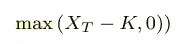
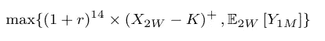
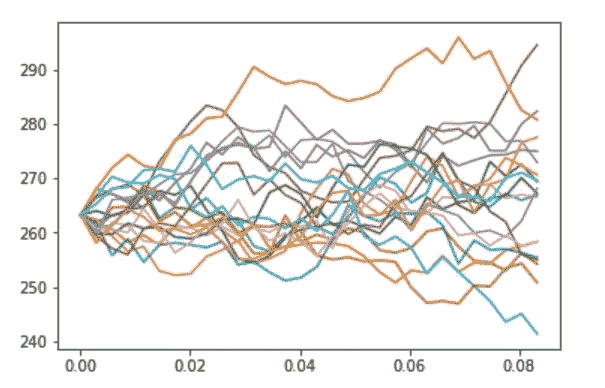
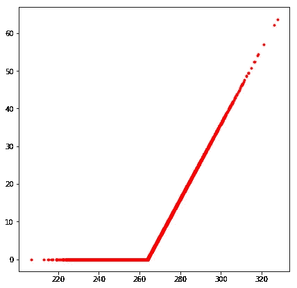
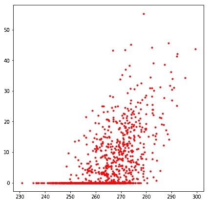
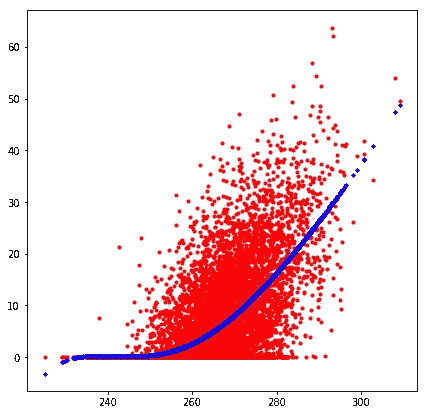
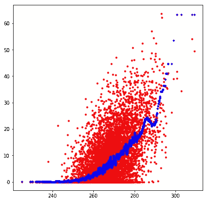
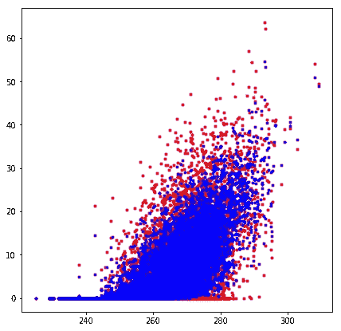

# 随机森林在金融中的应用实例:期权定价

> 原文：<https://towardsdatascience.com/example-of-random-forest-application-in-finance-option-pricing-d6ee06356c6e?source=collection_archive---------9----------------------->

今天，【2018 年 9 月 9 日下午 1.56，在埃隆·马斯克被发现在电视直播中吸烟后，特斯拉的股票价值 **263.24** 美元。

假设我预计接下来几天还会有埃隆马斯克的丑闻。

我预见到上述股票价格的下跌，所以我给你提供一个购买的选择，在任何时候，一个月内，每股 264 美元。万一我错了，股价上涨超过 264 美元，你就可以在市场上买卖你的股票并赚钱！

但是，如果特斯拉股票不断减少，你将永远不会行使你的期权，我会积极的，感谢你为这个期权支付的溢价。

**问题，你愿意为这样的期权支付多少钱？当我在这个选项中加入其他股票时会发生什么？**

# 期权定价

这就是所谓的期权定价理论，自 1973 年 Black 和 Scholes 模型首次出现以来，这是文献中一个众所周知的主题。

上述期权被称为美式期权(实际上是百慕大期权，即你只能在 T2 时间{T0，T1，..其中 T 是到期日或期权到期日)。

常见的方法，特别是在银行中应用的方法，回忆动态规划和 Longstaff Schwartz 算法来解决这个问题。

直觉上，你可以把它想成一个逆向过程，你在 T 点的期权收益是

其中 X_T 是特斯拉到期时的股价。

动态编程完全是一个视角问题！

假设我们在一个月内只能行使两次期权(两周时间，用 2W 表示，一个月内，用 T=1M 表示)。

那么在时间 t=2W 时你只有两个选择:

*   你要么运动(如果 X(2W) > K)。然后，你将得到(X(2W)- K)$投资于一个自由风险账户，每天支付无风险利率 r，并在时间 T=1M 时得到(1+r)⁴*(x(2w)-k)$ 14(账户每天支付的两周的指数)，
*   或者你**期望**特斯拉份额在 T 点更高(你这个疯狂的傻瓜)，因此增加你的期权价值(所以你会等到 T 点)。

设 Y 为该期权价值价格。你在直观地解下面的逆向方程，

上述方程没有封闭形式的公式，但我们可以在数值上提供近似值。

我们如何获得上述方程的近似值？

# 回归

假设我们知道特斯拉股票在 2W 的价格。

已知 t=2W 时的所有信息，我们唯一的未知数是未来期权价值(Y_T)。换句话说，如果你在两周内(即未来)，你的投资组合的期望值是多少，由这一个美式期权组成。

这时回归就出现了。

你有 2W 的信息，你想预测 100 万英镑的期权价值。

***输入/标签***:t = 2W 时特斯拉股价的所有样本

***输出【at t = T = 1M 时的选项值***

## 正向模拟

事先，我们需要模拟特斯拉股价的多种情景。

Geometric Brownian Motion simulation applied on Tesla Share

为了简化模型，我们假设特斯拉股票遵循几何布朗运动路径，平均 r(无风险利率)和波动率适马= 20%(我们让感兴趣的读者参考[随机过程理论](http://www.math.harvard.edu/~knill/books/KnillProbability.pdf))。

注意:1 个月的时间大约相当于 0.08 年的时间。因此在这张图上 T = 0.08，2W = 0.04。

## 数据可视化

在左边，我们画出了 T 时对特斯拉股价的回报(你可以在这里认出非线性的 max 函数，或者深度学习读者的 ReLu 激活函数)，在右边，画出了 t=2W 时对特斯拉股价的回报。

Left : Payoff against Stock price at t=1M— — Right : Payoff against Stock price at t=2W

**回归**

存在多种回归方法，在准确性和时间方面表现良好，以解决这种预测问题。在一个维度上(即只有一只股票，这里是特斯拉)，我们可以想到多项式回归(你可以查看[比约恩·哈特曼](https://medium.com/u/e2be6afa4436?source=post_page-----d6ee06356c6e--------------------------------)关于此事的帖子)，或者[高斯核回归](http://mccormickml.com/2014/02/26/kernel-regression/)。

第一个会导致角点问题(见下文，在 240 之前，回归在拟合数据下开始)，而第二个在计算上可能是昂贵的。

**NB** :如果上面的交互代码无法加载，我在下面添加了预期的输出(感谢 [William Koehrsen](https://medium.com/u/e2f299e30cb9?source=post_page-----d6ee06356c6e--------------------------------) ，他的文章“如何在一篇中等大小的文章中放置完全交互的、可运行的代码”)和 Jupyter 笔记本(使用 [Vera Chernova](https://medium.com/u/fd2fe2bc0784?source=post_page-----d6ee06356c6e--------------------------------) 的建议)。

但是，你是一个真正的玩家！

你查看新闻，注意到大众和脸书的股票正在慢慢恢复过去的势头。

我阅读了我这边的新闻，决定值得冒险，并向你提供一个类似的美式期权，这次到期日为 1 年，可以行使 4 次，几何平均回报(即，当你行使时，如果你希望你的银行账户为正，你需要特斯拉 x FB x VW 立方根的乘积大于我们今天定义的罢工)。

*   如今，这一几何平均值将等于(263.24 x 158.97 x 165.94)^(1/3)~ 190.78 美元
*   让我们解决一个罢工 K = 191 美元(我们称之为货币期权，因为它几乎是今天的价格)。

在这种情况下，我们仍然可以利用多项式回归，但如果我们决定玩更多的份额，它就不是**可伸缩的**！

**我们如何在高维空间(即多股)为期权定价？**

## 我们叫一个朋友，随机森林！

我邀请你提前(为新人)阅读一下[威廉·科尔森](https://medium.com/@williamkoehrsen/random-forest-simple-explanation-377895a60d2d)的这篇关于随机森林回归的杰出解释。

尽管在一维空间使用它听起来像使用核武器，但它显示了在解决高维情况时的高效性。

回到我们的一维模型(只有特斯拉份额)，应用随机森林回归看起来像

它在精确地建模和预测(从图中)，甚至可能太多(过度拟合)。

然而，使用一些方差减少方法(如 Picard 迭代)，并调整随机森林超参数，我们可以与文献中提到的大多数方法竞争(例如 [Gobet 的超立方体](https://core.ac.uk/download/pdf/52897448.pdf)、 [Glasserman 和 Broadie s' Mesh](http://www.columbia.edu/~mnb2/broadie/Assets/mesh_working_paper.pdf) ，..).

当将随机森林应用于相关资产或超过 20 项资产的期权时，这一发现更加真实。

# 结论

我们在这里展示了机器学习方法如何应用于历史金融问题，如期权定价，以及它如何用于处理巨大的投资组合。

***NB*** :下面是上面模拟用的 Jupyter 笔记本。

*我向感兴趣的读者推荐* [*我在 2017 年 6 月提交给新加坡国立大学(应用概率统计系)的理学硕士论文*](http://scholarbank.nus.sg/bitstream/10635/136056/1/RabiaM.pdf) *，其中我们重点比较了用于期权定价的多种行业方法，包括随机森林、核回归、Mesh、…*