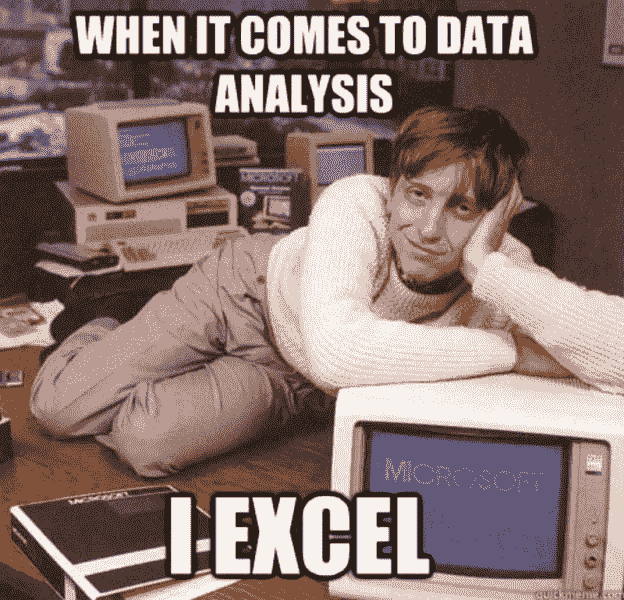
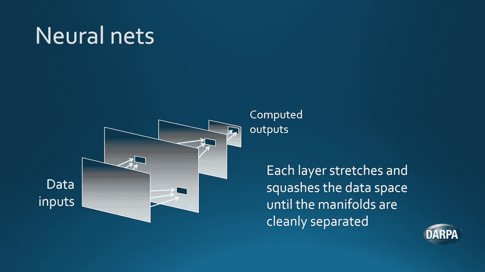
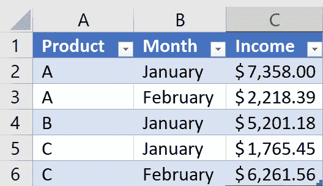
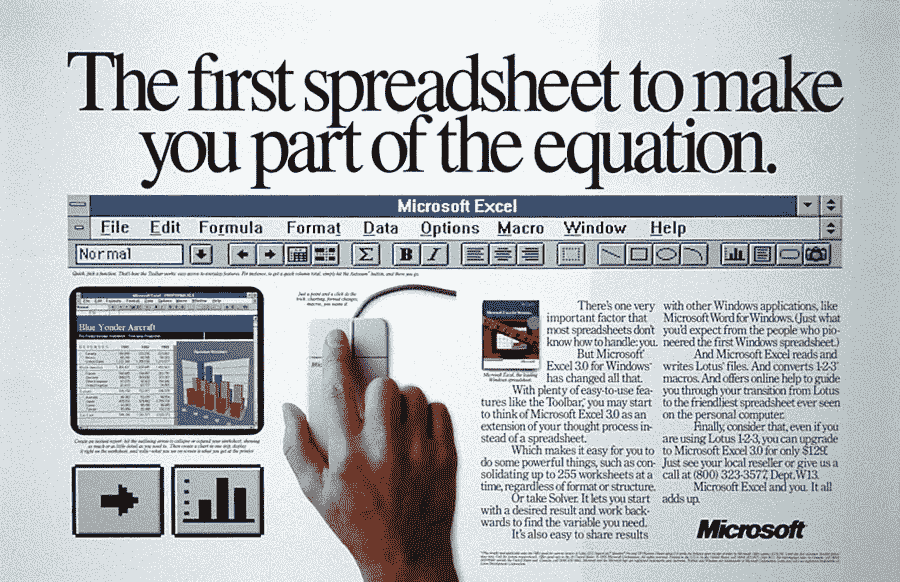
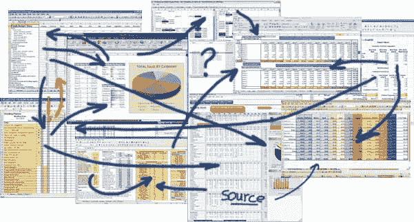

# 数据科学用 Excel？

> 原文：<https://towardsdatascience.com/excel-for-data-science-a82247670d7a?source=collection_archive---------1----------------------->

## 了解最古老的分析工具之一如何促进您的数据科学工作



Microsoft Excel 可能是最知名的数据处理工具。几乎每个人都知道这一点，我们对表格、枢轴、VBA 脚本和图表有自己的恨或爱。我们做每月的业务电子表格，计算假期成本，甚至在 Excel 中处理联系人列表。“Excel”这个词甚至成了“表格”或一组表格的同义词，比如:“嘿，我能给你发一个 Excel 吗？”连你奶奶都用过。毕竟，它从 1987 年就存在了，而且它的网格和表格看起来仍然非常相似。他们可能在设计上做对了什么？

但是等等。数据科学？在 Excel 中？？难道数据科学不是关于网络浏览器中大肆宣传的 Jupyter 笔记本，云中的大数据和 Hadoop，GPU 上的深度学习和高级交互图和可视化，以及…？这听起来可能和你所知道的 Excel 相差甚远。嗯，等一下…

获得物理学硕士学位后，我花了十多年时间应用“数据科学”来解决问题。从汽车行业的自动驾驶汽车，到保险领域的风险管理和医疗技术领域的预测性维护，Excel 一直紧随其后。现在，我想与你分享我的经验。

是时候振作起来承认:

> Excel 是数据科学的强大工具。

对此可能有很多支持(和反对)的理由。但在开始之前，让我们先澄清一下:我和微软没有任何职业关系，从来没有。

这些是我自己的想法和经验——我可能错了，所以请纠正我！

# **2D 数据最佳编辑**

没有比这更好的二维数据编辑器了。大概这就是为什么 Excel 这么多年来都是同样的布局。这些表格易于编辑、格式化、着色和共享。Google Sheets 是对 Excel 数据编辑设计的明确肯定——但也适用于多个用户。允许多个用户同时编辑是我在 Excel 中怀念的东西(在 SharePoint 和 OneDrive 上丢失数据太多次之后)。分享链接的便利可能也是像 [Jupyter](https://jupyter.org/) 这样的数据科学笔记本背后的成功的一部分。

然而，在 Excel 中，只需按一下[F11]键，就可以使用公司的视觉标识将您的表格变成图表(假设有人花时间设置了[主题](https://support.office.com/en-us/article/Change-a-theme-and-make-it-the-default-in-Word-or-Excel-c846f997-968e-4daa-b2d4-42bd2afef904))。除此之外，内置的表格，过滤器，切片器，分组，窗口分割，单元格公式和其他功能，以及任何替代的表格或数据库编辑器都保持不变。也就是说，只要您对每张工作表的最大行数为 1，048，576，列数为 16，384 没有问题！对于大数据来说，这并不令人印象深刻，但对于实际编辑和查看数据来说，这通常就足够了。

# **高级分析平台**

在一部关于人工智能视角的[电影](https://www.darpa.mil/about-us/darpa-perspective-on-ai)中，DARPA 使用电子表格来说明神经网络如何工作。

[](https://www.darpa.mil/about-us/darpa-perspective-on-ai)

DARPA using spreadsheets to explain neural nets

事实上，Excel 有[深度学习方法](https://news.ycombinator.com/item?id=11308718)，但也许这不是你首选的工具。但是 Excel 附带了一个[分析工具库](https://support.office.com/en-us/article/Load-the-Analysis-ToolPak-in-Excel-6a63e598-cd6d-42e3-9317-6b40ba1a66b4)，可以被激活以释放更多高级功能。前几天，我听到一位微软代表被问到“高级分析和普通分析的区别是什么？”。她回答“使用机器学习的能力”。由于分析工具库通过[回归和其他复杂数据分析](https://support.office.com/en-us/article/Use-the-Analysis-ToolPak-to-perform-complex-data-analysis-6C67CCF0-F4A9-487C-8DEC-BDB5A2CEFAB6)进行机器学习，我假设微软将 Excel 视为其高级分析平台之一。

无论如何，工具库感觉有点老派，因为在 SAS 或 SPSS 中使用硬编码的函数。现代数据科学是关于开放图书馆和透明度的。也许你出于某种原因想要调整你的[高斯混合模型](https://en.wikipedia.org/wiki/Mixture_model)或者了解它是如何被优化的？在 Excel 中做这些或者在[Visual Basic for Applications(VBA)](https://en.wikipedia.org/wiki/Visual_Basic_for_Applications)中改编一些开源代码可能会很麻烦(在 VBA 你怎么能对一个矢量切片呢？).

# **编写 Excel 脚本**——**像数据科学家**

当然，您会喜欢使用您最喜欢的数据科学脚本语言(Python、R、Scala、Julia、Java、JavaScript 等等)和可信库。这很好:你可以在 Excel 中使用 Python。至少如果你用的是 Windows 系统的机器(这是我推荐的，因为 Mac 上的 [Excel 仍然不是很稳定](https://duckduckgo.com/?q=excel+mac+unstable))。

# **现在越来越专业了:Python 在 Excel 中的应用**



Example data in “Table1” in Excel

要在 Excel 中演示 Python，只需创建一个新的电子表格，并输入一些类似于此处截图的数据。选择所有数据并制作表格[Ctrl+T 或 insert table]。如果您使用的是英文版的 Excel，该表默认为“Table1”。下面的 Python 代码使用包 [win32com](https://sourceforge.net/projects/pywin32/) 与 [Excel 的对象模型](https://msdn.microsoft.com/en-us/vba/excel-vba/articles/object-model-excel-vba-reference)(一个程序员对 Excel 的接口)进行实时交互。请注意，您得到了一个与正在运行的程序交互的活动连接，我们不仅仅是读写磁盘上的文件。

**实时连接到正在运行的 Excel 和活动工作表**

```
import win32com.client
import pandas as pdapp = win32com.client.Dispatch("Excel.Application")
ws = app.ActiveSheet
```

**获取表格内容和标题，放入 Pandas 数据框** 注意，我们可以使用 Ranges 以及 ListObjects 等。

```
x = ws.Range("Table1").Value
headers = ws.ListObjects("Table1").HeaderRowRange.Value[0]df = pd.DataFrame(list(x), columns=headers)>>> df
Product     Month       Income
0       A   January  7358.001583
1       A  February  2218.386731
2       B   January  5201.179032
3       C   January  1765.453011
4       C  February  6261.555208
```

**计算每种产品的收入中值，并写回 Excel 中**
注意，Excel 在分配范围时总是期望 2D 形状:

```
income_med = df.groupby('Product').Income.median()ws.Range("A10:A12").Value = (('A',), ('B',), ('C',))
ws.Range("C10:C12").Value = tuple((_,) for _ in income_med)
```

**让我们演示一下 Python 与 Excel live 的交互**
为表格设置一个过滤器并选择某个范围:

```
ws.ListObjects("Table1").Range.AutoFilter(
        Field=2,
        Criteria1="=January")ws.Range("C10:C12").Select()
```

上面的例子可以很容易地扩展到几十万行，而不会有性能问题。Python 可以直接访问 Excel 内部的数组存储。与运行 VBA 相比，Python 和 Pandas 在更高的抽象层次上提供了更强的数据操作能力。你也可以很容易地从 SciPy 和其他一些资源中获得科学工具——但是要保持 Excel 作为查看数据的“前端”。

# **更多可能性**

使用 Excel 还有几种进一步分析的可能性。内置的[数据库引擎](https://en.wikipedia.org/wiki/Microsoft_Jet_Database_Engine)可以对表和动态数据集执行 SQL 查询， [Power 查询编辑器](https://support.office.com/en-us/article/Introduction-to-Microsoft-Power-Query-for-Excel-6E92E2F4-2079-4E1F-BAD5-89F6269CD605)可以从各种数据源(包括 Azure cloud 或 Hadoop)获取数据。如果你还没有，还有很多东西值得探索。

# 数据唾手可得还是数据沿袭？

与数据科学工作流程相比，Excel 可以直接呈现数据。你可以随心所欲，想存多少版本就存多少版本，操纵自如。[数据传承](https://en.wikipedia.org/wiki/Data_lineage)，从起点追踪数据的能力，通过操作到目的地或结论，因此很难。另一方面，在数据科学笔记本中，整个操作过程被列为脚本，其他人可以重复和验证。自然，自动化或投入生产的步骤要比笔记本小得多。更不用说处理版本控制和跟踪变更了。



Ad for Excel for Windows 3.0 (released 1990)

对于数据新手来说，Excel 的简单性降低了入门门槛，允许快速开始数据操作。重复任务的功能和宏可以在这个过程中学习。笔记本中的数据科学轨道最初看起来更艰难，但当涉及到更大的操作和更复杂和自由的分析时，它将会给你带来回报。

# **太早，还是领先？**

我认为微软早在 90 年代就推出了 Office 套件。Excel 是一个很好的例子，它将数据仓库、图形用户界面、分析工具和 VBA 脚本环境都放在了一起。开放对象模型使得构建扩展、插件和直接与电子表格的核心交互变得相当容易。Microsoft Access 是另一个类似的、但更面向数据库的解决方案，它将所有这些结合在一起。你可以把它作为一个文件来分享，这不是很棒吗？微软显然是这种数据分析自助服务套件的领导者。在某种程度上，我认为他们甚至太早了。或者是 Excel、Access 和类似工具带来了我们最近看到的数据科学革命？

# **那些辉煌的日子**

可悲的是，Excel 在脚本语言方面远远落后(VBA 是建立在 60 年代发明的 BASIC 之上的)，更不用说脚本的版本控制或安全性了。数据容量并不令人印象深刻(即使[数据模型可以在内部承载超过 1 百万行](https://support.office.com/en-us/article/Data-Model-specification-and-limits-19AA79F8-E6E8-45A8-9BE2-B58778FD68EF))并且 Excel 可能永远达不到大数据水平(不管那是什么)。图形是另一个 Excel 远远落后于开源库的主题，比如 [ggplot](http://ggplot2.tidyverse.org/) 和 [matplotlib](https://matplotlib.org/) 。显然，微软把所有的精力都放在了数据可视化的 Power BI 上。自从 Excel 成为唯一工具的辉煌时代以来，已经发生了很多事情。

# **数据科学家:向过去学习**

许多超级大国依然存在。我认为 Excel 是几乎所有小规模 2D 数据的最佳编辑器，它被大量使用，有点像共享电子表格的默认编辑器。脚本和分析有很多种可能性，甚至像我们在 Python 中看到的交互方式。也许这就是为什么如此多的组织遭受“Excel 地狱”？绕过顽固的业务系统并构建自己的 Excel 解决方案实在是太容易了。(我知道，我已经贡献了不少了；-))



Depicting the “Excel Hell” ([3xcorp](https://www.3xcorp.com/is-your-business-too-dependent-on-spreadsheets/))

现代数据科学平台可以从 Excel 中学到很多东西。数据科学就是从数据中学习，从数据中学习意味着从过去中学习。Excel 有很多过往的经验可以分享。也许 Jupyter 笔记本可以找到一种更好的方式来包含数据集以供共享？在线数据科学工作台能否提供更好的界面，以可视化方式快速编辑和格式化数据？有很多种可能。我认为优势在于允许智能存储、编辑、可视化、分析和共享。

对我来说，数据科学一直是关于**组合最适合完成工作的工具**。通常 Excel 就是其中之一。我不断尝试迁移到 Linux 上的 LibreOffice(享受开放软件，摆脱微软)，但仍然经常发现自己启动了一个虚拟的 Windows 机器来访问 Excel 的超级功能。要么是我已经沉迷其中，要么是 Excel 的设计中隐藏了一些伟大之处。无论如何，我认为一个没有 Excel 经验的数据科学家和一个从来没有用过锤子的木匠是不相上下的。我可能会在很长一段时间内继续通过电子邮件向人们发送电子邮件。它仍然是数据交换的最佳格式，允许接收者立即进行自己的分析——每个人都知道这一点。

# 让你超越自我的工具

总而言之，Excel 已经存在了几十年，毫无疑问，它是编辑和分析表格数据最流行的工具。许多人在日常生活中离不开它。数据唾手可得，而且正如我们所展示的，可以从 Python 脚本和机器学习包中直接访问，您还能期望什么呢？我建议真正探索和学习 Excel，作为一名数据科学家，你将获得令人印象深刻的超能力。

你的体验是什么？