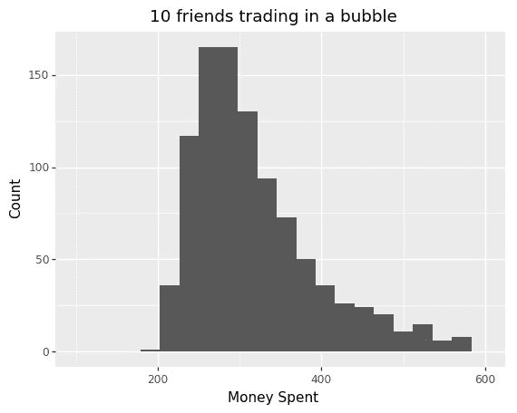
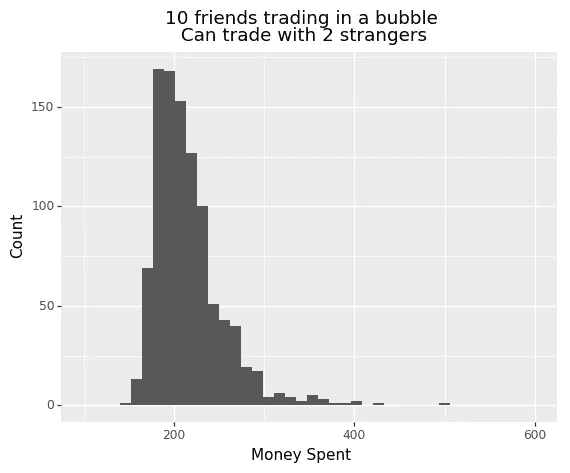
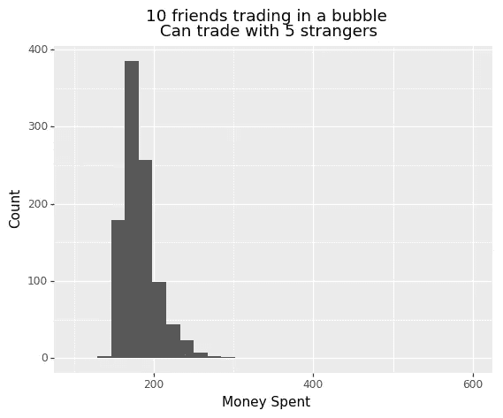
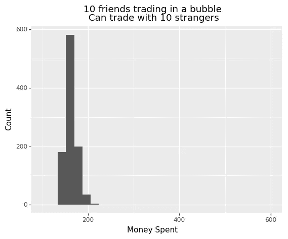
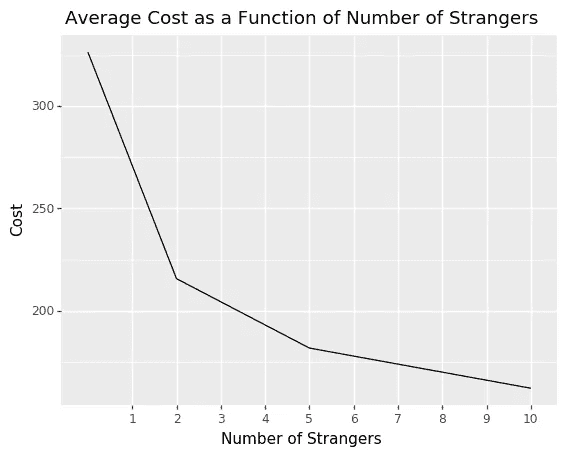

# 预计支付 215 美元来填写你的 2018 年世界杯贴纸相册

> 原文：<https://towardsdatascience.com/expect-to-pay-290-to-fill-out-your-2018-world-cup-sticker-album-689719c982d2?source=collection_archive---------14----------------------->

Photo from Emilio Garcia at [Unsplash](https://unsplash.com/photos/AWdCgDDedH0)

加的夫大学的保罗·哈珀教授最近[计算出](http://www.bbc.com/news/business-43566749)如果收集者不与任何人交换她的任何复制品，填写 2018 年帕尼尼世界杯贴纸专辑将花费 773 英镑(1100 美元)。根据教授的计算，如果 10 个朋友互相交换，费用可能会下降到 247 英镑(352 美元)。贴纸专辑的制造商帕尼尼发布了一份官方声明，称哈珀教授假设收藏者生活在泡沫中，不与陌生人交易，从而高估了真实成本。

我最近开始填写我的贴纸相册，我想自己计算一下我应该支付多少来完成它。我写了一个程序来模拟各种交换场景下的贴纸收集，我认为真正的成本接近 290 美元。下面我将向您介绍我是如何设置模拟的以及我的发现。

# 该设置

自 1970 年墨西哥世界杯以来，帕尼尼世界杯贴纸专辑每四年发行一次。收藏家们成包地购买贴纸，并交换他们重复的贴纸，以便完成相册。今年，该专辑由 682 张贴纸组成。每包售价 1 美元，有 5 张贴纸。

我的模拟做了以下假设:

*   每个标签都同样有可能出现在任何包装中。
*   收藏者只能在互利的交易中交换重复的贴纸*
*   每位收集者从随机抽取的 25 张贴纸开始。

在我的模拟中，有 10 个朋友试图完成这张专辑。在每一个时间点，这 10 个朋友会互相交易。好友间的交易完成后，每个人都有机会和 k 个完全陌生的人进行交易。我对 k {0，2，5，10}的以下值进行了模拟。如果玩家不能和他的朋友或陌生人交易，他就买一包贴纸。当所有 10 个朋友完成相册时，模拟终止。

总而言之，以下是我的模拟所采用的参数和我使用的数值:

*   交易的朋友数量= 10
*   相册中的贴纸数量= 682
*   每包中的贴纸数量= 5
*   每位玩家每轮可以交易的陌生人数量= {0，2，5，10}
*   陌生人在交易前购买的贴纸数量= 100

# 结果

对于所有的场景，我都进行了 100 次模拟，然后研究了这 10 个朋友花钱的分布情况。因此，每次分配都以 1000 点为基础。

**场景 1:不与陌生人交易**

在这种情况下，这 10 个朋友只能相互交易。对我来说，这就是哈珀教授计算出的 352 美元的成本。经过 100 次模拟，我发现平均成本是 326 美元，但有很多噪音。成本低至 199 美元，高至 1218 美元。我怀疑正在发生的事情是，一些不幸的朋友是唯一一个收集专辑的人，她需要求助于购买包，直到她完成。

**场景二:与朋友交易后可以与 2 个陌生人交易**

在这种情况下，结果噪音较小。收藏家们平均花费 215 美元，但也可能从 146 美元到 498 美元不等。

**场景三:和朋友交易后可以和 5 个陌生人交易**

这种情况下的平均成本是 181 美元。分布的范围正在接近平均值。

**场景四:和朋友交易后可以和 10 个陌生人交易**

在这种情况下，完成专辑的平均成本是 135 美元。

# 结论

与陌生人交易将有助于你以更低的成本更快地完成专辑，这是常识，但我的模拟通过量化成本预计会随着与你交易的陌生人数量的增加而减少，从而深入了解这种关系。我发现最令人信服的是，与只和同样的 9 个朋友交易相比，只和两个陌生人频繁交易可以减少 30%的成本。此外，随着陌生人数量的增加，与多一个陌生人频繁交易的额外好处也会减少。要点是，你只需要一点点打破你的泡沫，就能最大限度地降低成本。

最终，我认为哈珀教授和帕尼尼的观点都有道理。帕尼尼是对的，这张专辑的成本和你想要的一样高。如果你不想买很多包，你应该试着和尽可能多的陌生人交易。然而，哈珀是对的，他指出，随着帕尼尼增加专辑中贴纸的数量以及贴纸的价格，专辑的奖金会随着时间的推移而不断增加。考虑到帕尼尼故意提高专辑的价格，期望人们经常与 10 个以上的陌生人交易以保持价格低于 100 美元似乎有点不合理。

我希望这能让你对完成世界杯专辑的成本有一个更好的了解，但这一分析绝非详尽无遗。我邀请你看看我在这个模拟中使用的代码[和修改你认为合适的假设。收集贴纸是一件非常有趣的事情，尤其是当你得到你渴望得到的贴纸时，所以我希望我没有阻止你开始收集。如果你在芝加哥，我很乐意和你交易！](https://github.com/freddyalfonsoboulton/worldcupstickers)

**附录:**

*我还模拟了收藏家只进行一对一交易的场景。关键的要点是相同的，但分布的噪音更小。