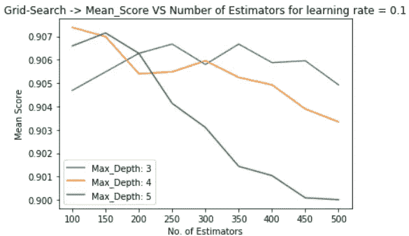
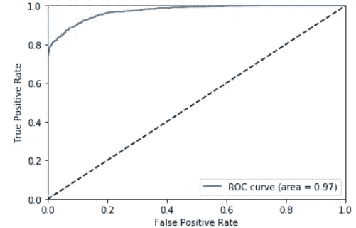
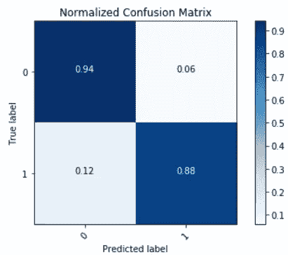
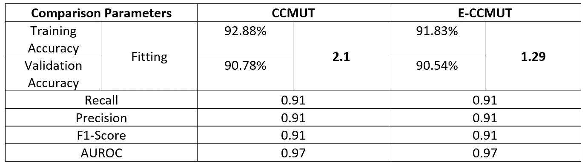

# 基于扩展聚类质心的多数欠采样技术(E-CCMUT)对 CCMUT 的实验改进

> 原文：<https://towardsdatascience.com/experimental-improvement-by-extended-cluster-centroid-based-majority-under-sampling-technique-63bcb4e53c25?source=collection_archive---------18----------------------->


在我之前的文章《 [*基于扩展聚类质心的多数欠采样技术(E-CCMUT)*](/extended-cluster-centroid-based-majority-under-sampling-technique-e-ccmut-bd3f13e5d0fe) 》中，我提出了一种新的欠采样算法——基于扩展聚类质心的多数欠采样技术(E-CCMUT)。在本文中，我将演示一个实验，在这个实验中，我将证明 E-CCMUT 比 CCMUT 具有更好的统计结果，并且与 E-CCMUT 的直觉相符。

**实验:**

***从人口普查数据中预测一个人的收入水平是否大于 5 万美元*** 。这与我以前的文章“ [*欠采样:不平衡数据的性能助推器*](/under-sampling-a-performance-booster-on-imbalanced-data-a79ff1559fab) ”中使用的实验相同，其中 CCMUT 被用作欠采样算法，以便通过实验证明欠采样可以提高模型性能。这里，将使用 E-CCMUT 而不是 CCMUT，并将使用在“ [*欠采样:不平衡数据的性能助推器*](/under-sampling-a-performance-booster-on-imbalanced-data-a79ff1559fab) ”中导出的结果进行直接性能比较。

**数据集:**

[来自 UCI(加州大学欧文分校)的成人数据集](https://archive.ics.uci.edu/ml/datasets/Adult)

**数据预处理:**

标签编码、特征选择和一键编码按顺序完成，如“ [*欠采样:不平衡数据的性能助推器*](/under-sampling-a-performance-booster-on-imbalanced-data-a79ff1559fab) ”

**数据不平衡消除:**

这是使用 E-CCMUT 完成的，其中多数类(标签 0)是 68%的欠采样。E-CCMUT 的 Python 实现如下所示:

```
import numpy as np
from math import sqrtdef **ECCMUT**(X,f):
    cluster_centroid = np.sum(X,axis=0)/X.shape[0]
    euclidean = [None]*X.shape[0]
    for i in range(0,X.shape[0]):
        euclidean[i] = sqrt(sum((cluster_centroid-X[i])**2))
    # finding the most important instance with label 1
    imp_instance = X[euclidean.index(min(euclidean))]
    # removing the instances (under-sampling...)
    for i in range(0,X.shape[0]):
        euclidean[i] = sqrt(sum((imp_instance-X[i])**2))
    indices=list(reversed(sorted(range(len(euclidean)), key=lambda
                j: euclidean[j])))
    X_f = np.delete(X, indices[:int(f/100*X.shape[0])], axis=0)
    return X_f
```

这里，X 是多数样本矩阵，f 是欠采样的百分比，X_f 是 E-CCMUT 对 X 的欠采样形式，它由 ECCMUT()返回

**洗牌和拆分:**

产生的数据集以一致的方式进行混洗，并且 80–20 分割(80%训练集和 20%验证集)。

**学习算法:**

梯度推进分类器用作训练集上的学习算法，并使用网格搜索进行调整。

网格搜索后得到 100 个估计量和最大深度为 4 的最优超参数。基于平均分数的模型的网格搜索调整的总结如图 1 所示。



**Fig 1\. Grid-Search Summary on Mean-Score**

**结果:**

使用度量、训练准确度、验证准确度、召回率、精确度、F1 分数、受试者操作者特征曲线下面积(图 2 所示的 AUROC)和混淆矩阵(图 3 所示)来分析模型性能。



**Fig 2\. ROC Curve showing the Area Under the Curve**



**Fig 3\. Normalized Confusion Matrix**

表 1 中列出了训练准确度、验证准确度、召回率、精确度和 F1 分数。


**Table 1**

**该模型与使用相同方法但使用 CCMUT 开发的模型的比较**:

[](/under-sampling-a-performance-booster-on-imbalanced-data-a79ff1559fab) [## 欠采样:不平衡数据的性能助推器

### 在某些情况下，用于开发机器学习/深度学习模型的数据集通常是…

towardsdatascience.com](/under-sampling-a-performance-booster-on-imbalanced-data-a79ff1559fab) 

根据上述文章，CCMUT 所取得的结果被考虑在内。模型性能比较基于以下指标:

1.  拟合度量:|训练准确性-验证准确性|
2.  验证准确性
3.  精确
4.  回忆
5.  f1-分数
6.  奥罗克

对照表如表 2 所示:



**Table 2**

1.  在这里，E-CCMUT 在召回率、精确度、F1-Score 和 AUROC 方面的性能没有比 CCMUT 有所提高或下降。
2.  在**拟合**方面，E-CCMUT 比 CCMUT 有了显著的提高，拟合度从 2.1 下降到 1.29。拟合度量越多，验证和训练精度的可比性就越小，因此要么过拟合，要么欠拟合，拟合度量越小，模型就越接近"**完美拟合**"
3.  与 CCMUT 相比，E-CCMUT 的验证准确性有非常轻微的下降(0.24%)，这可以忽略不计。

此外，还进行了许多其他实验，并观察到 E-CCMUT 产生了比 CCMUT 更适合的**模型，而验证准确性没有显著下降。**

因此，E-CCMUT 是对 CCMUT 模型的**拟合**性能指标的改进，并且证实了在构建算法时所采用的直觉。