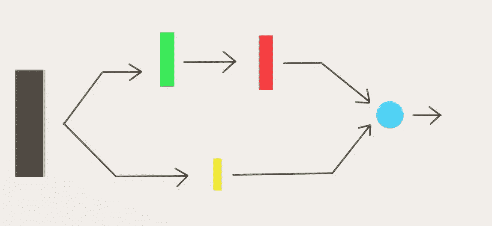
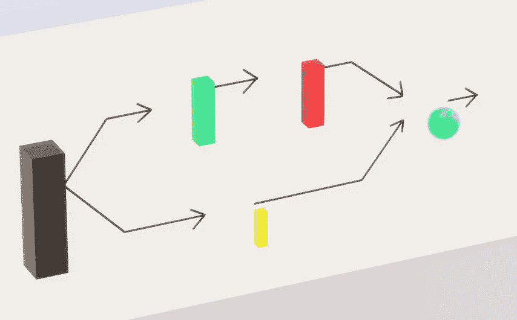
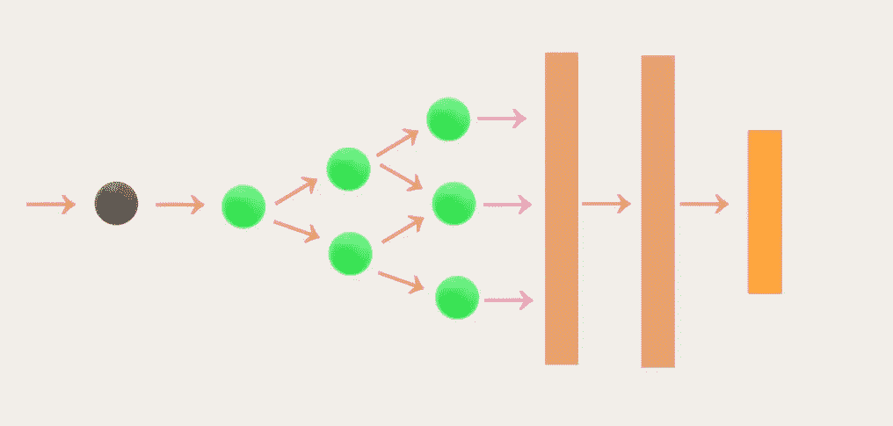
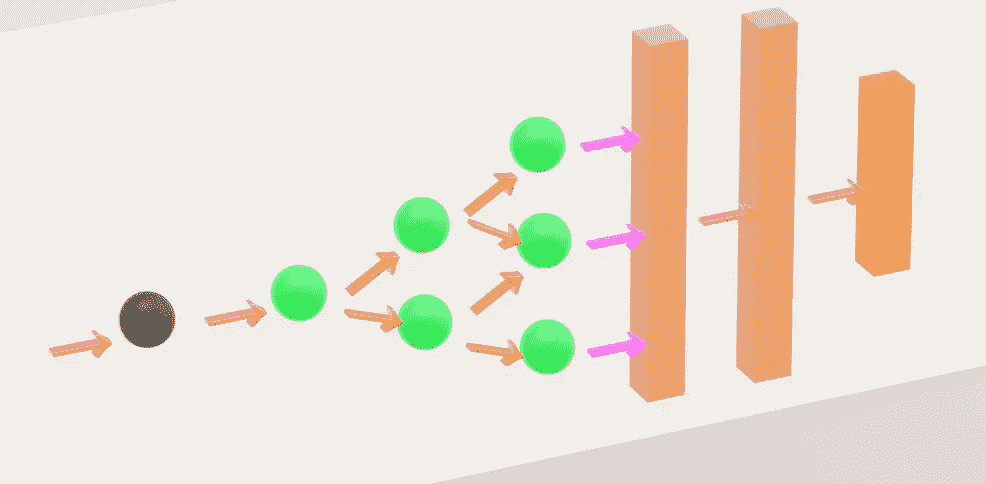
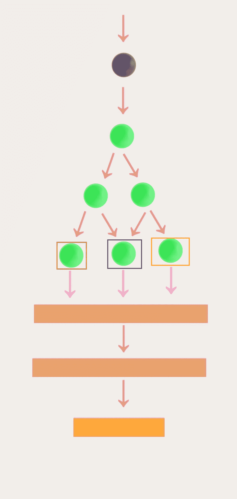
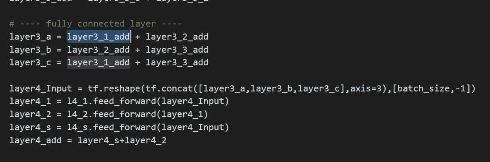
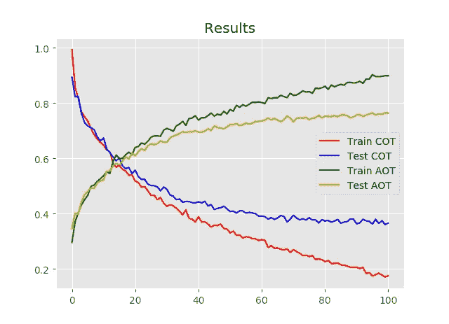
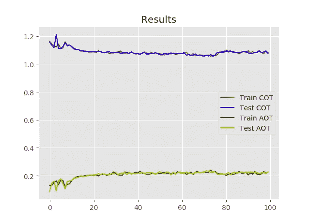
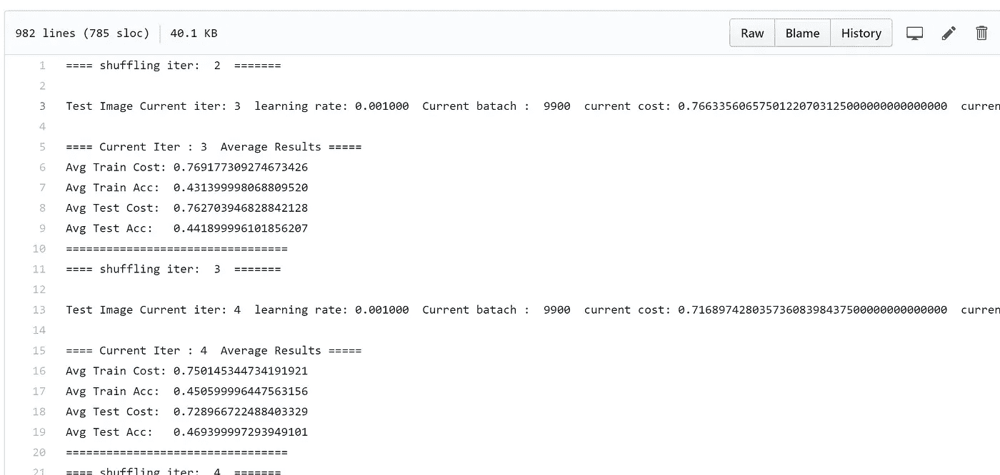
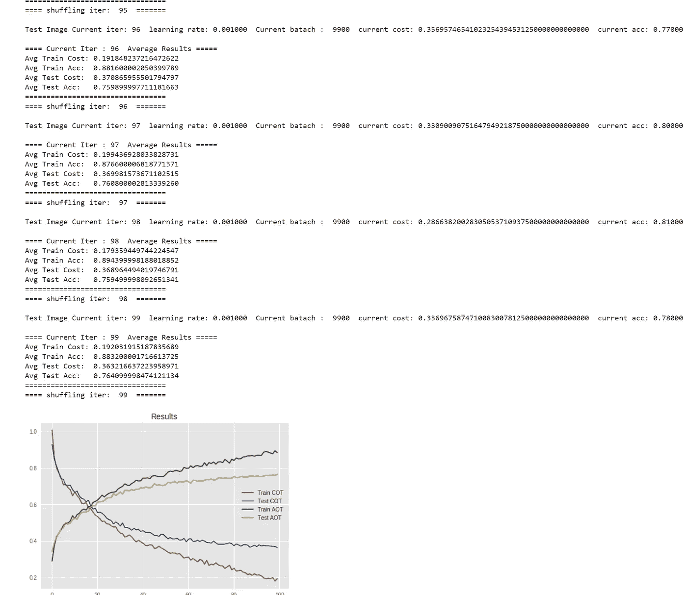

# [实验模型]实现用于 CIFAR 10 分类的树形深度神经网络[带有 TF 的手动后撑]

> 原文：<https://towardsdatascience.com/experimental-model-implementing-tree-style-deep-neural-network-for-cifar-10-classification-1896cff85cce?source=collection_archive---------8----------------------->

Gif from [here](https://giphy.com/gifs/party-fun-christmas-3o6ZtjqdcQfuno2WPK/download)

所以今天，我想做一个实验模型，昨天晚上我想到了这个网络架构。一种类似树的形状的架构，但是如果你知道任何支持这种创新或网络架构的知名学术论文，请在下面评论，以便我可以提供适当的参考。

> **更新** [Peter Baylies](https://medium.com/@pbaylies?source=post_header_lockup) 向我提供了一篇论文，该论文的网络架构与本文中的相似，[请点击](https://arxiv.org/pdf/1802.05800.pdf)此处查看该论文。

***请注意，这是一个实验模型，因此性能不是我的目标。***

再一次，像往常一样让我们比较。手动反向传播方法与传统自动微分模型的比较。如果你不知道自动微分，请点击[这里](https://en.wikipedia.org/wiki/Automatic_differentiation)。

**网络架构(基本构建模块/完整架构)**

**黑色矩形** →输入图像
→绿色/红色矩形 →卷积层(内核大小 3)→批量归一化
→黄色矩形 →瓶颈卷积层(内核大小 1)→批量归一化
**蓝色圆圈** →加法运算(残差连接)

所以上面的剩余块是我们完整网络的基本块。现在，如果你看到完整的架构，你就会明白为什么我称这个网络为树状网络。(最主要是因为网络的形状像一棵树。)

**圆圈** →我们上面覆盖的每个卷积残差块
**浅棕色矩形** →全连通网络
**橙色矩形** →软 Max 层

所以如果我们把我们的模型旋转 90 度，它看起来就像一棵树！(嗯有点……)

另外，请注意紫色箭头，我们也将做一些不同的事情。

**Layer3_a** →仅将红框圈和蓝框圈的结果相加。
**Layer3_b** →仅将蓝色方框和黄色方框的结果相加。
**Layer3_c** →只将红框圈和黄框圈的结果相加。

紫色箭头不同于粉红色箭头，因为我们没有把所有的变量加起来。

**结果(自动微分)**

在 100 epoch 上，我们可以看到模型明显过拟合，这可能是由于多种原因造成的。但众所周知，在深度学习模型中，Adam optimzers 并没有那么好地概括。如果您不知道 Adam optimizer，请单击此处的。

**结果(破碎的散瞳反向传播)**

对于这种情况，手动反向传播是可怕的。这个模型甚至不能达到 40%的准确率。

请注意，我们在前馈操作期间执行了批量标准化，但是，我没有在整个过程中反向传播，因此出现了中断的扩张反向传播。

**透明度**

为了让这个实验更加透明，我把所有的命令日志从我的窗口提示符上传到我的 Github。查看[自动微分产生的输出请点击她的](https://github.com/JaeDukSeo/Only_Numpy_Basic/blob/master/treenet/auto.txt) e，对于[手动反向传播请点击此处](https://github.com/JaeDukSeo/Only_Numpy_Basic/blob/master/treenet/man1.txt)。

**交互代码**

*对于 Google Colab，您需要一个 Google 帐户来查看代码，而且您不能在 Google Colab 中运行只读脚本，因此请在您的操场上创建一个副本。最后，我永远不会请求允许访问你在 Google Drive 上的文件，仅供参考。编码快乐！*

要访问自动[区分代码，请点击此处。](https://colab.research.google.com/drive/1vIhA9ziT3-1bSLxC1xO-49VdgJLlyyDO)
要访问手动 ba [ck 繁殖模型，请点击此处。](https://colab.research.google.com/drive/1VrhHXgFqktTdGLRqye_p22HWG8Ts7AWW)

**最后的话**

我真的很喜欢做实验模型，它们可能不能保证性能，但它们激发了我的创造力。

如果发现任何错误，请发电子邮件到 jae.duk.seo@gmail.com 给我，如果你希望看到我所有写作的列表，请[在这里查看我的网站](https://jaedukseo.me/)。

同时，在我的 twitter 上关注我[这里](https://twitter.com/JaeDukSeo)，访问[我的网站](https://jaedukseo.me/)，或者我的 [Youtube 频道](https://www.youtube.com/c/JaeDukSeo)了解更多内容。如果你感兴趣的话，我还做了解耦神经网络[的比较。](https://becominghuman.ai/only-numpy-implementing-and-comparing-combination-of-google-brains-decoupled-neural-interfaces-6712e758c1af)

**参考**

1.  文件？，W. (2018)。解压一个. tar.gz 文件需要什么命令？。Askubuntu.com。检索于 2018 年 3 月 30 日，来自[https://askubuntu . com/questions/25347/what-command-do-I-need-to-unzip-extract-a-tar-gz-file](https://askubuntu.com/questions/25347/what-command-do-i-need-to-unzip-extract-a-tar-gz-file)
2.  CIFAR-10 和 CIFAR-100 数据集。(2018).Cs.toronto.edu。检索于 2018 年 3 月 30 日，来自[https://www.cs.toronto.edu/~kriz/cifar.html](https://www.cs.toronto.edu/~kriz/cifar.html)
3.  j . brown lee(2017 年)。深度学习的 Adam 优化算法的温和介绍-机器学习掌握。机器学习精通。检索于 2018 年 4 月 1 日，来自[https://machine learning mastery . com/Adam-optimization-algorithm-for-deep-learning/](https://machinelearningmastery.com/adam-optimization-algorithm-for-deep-learning/)
4.  JaeDukSeo/Only_Numpy_Basic。(2018).GitHub。2018 年 4 月 1 日检索，来自[https://github . com/JaeDukSeo/Only _ Numpy _ Basic/blob/master/treenet/man 1 . txt](https://github.com/JaeDukSeo/Only_Numpy_Basic/blob/master/treenet/man1.txt)
5.  自动微分。(2018).En.wikipedia.org。于 2018 年 4 月 1 日检索，来自[https://en.wikipedia.org/wiki/Automatic_differentiation](https://en.wikipedia.org/wiki/Automatic_differentiation)