# 一种新卷积的实验

> 原文：<https://towardsdatascience.com/experiments-with-a-new-kind-of-convolution-dfe603262e4c?source=collection_archive---------1----------------------->

警告:这篇文章假设读者对 CNN 有一定的了解

卷积有很多我不喜欢的地方。它们中最大的，特别是在后面的层中的大多数权重非常接近于零。这说明这些权重中的大多数没有学到任何东西，也没有帮助网络处理任何新信息。

所以我想修改卷积运算来解决这个问题。这篇博文强调了我在这个方向上做的实验和结果。

## 实验#1

本质上，每个 2D 卷积运算都是一个矩阵乘法运算。其中矩阵的维数为(内核大小 x 内核大小 x 输入通道，输出通道)，假设卷积维数为(内核大小，内核大小，输入通道，输出通道)。为了简单起见，我在文章中称这个矩阵为维度为(m，n)的卷积矩阵。

如果我们能够保持卷积矩阵的列是正交的(以可微分的方式)，我们可以确保输出特征图中的每个通道捕获任何其他特征图中不存在的信息。更重要的是，这可以帮助我们创建权重更容易解释的神经网络。

是的，使用线性代数中的一些技巧(一个是 householder 变换，另一个是 givens 旋转)，有一些可微的方法来确定这一点。我使用户主转换，因为它在 GPU 上要快得多。

代码在[这个文件](https://github.com/singlasahil14/orthogonal-convolution/blob/master/vecgen_tf.py)里。

这个想法是这样的:

不是在卷积滤波器中保持所有 mxn 个可训练变量，在偏差中保持所有 n 个可训练变量，而是以可微分的方式从另一组可训练变量生成滤波器和偏差。

更具体地，对于维数为(m，n)的卷积矩阵，创建 n 个维数为 m 的向量。第一个向量(比如 v1)将有 m-n+1 个可训练变量(开头用 n-1 个零填充)，第二个(比如 v2) m-n+2 个(用 n-2 个零填充)，第三个(比如 v3)，m-n+3 个(用 n-3 个零填充)，等等。接下来归一化所有这些向量。使用这些向量创建 n 个 householder 矩阵，按照 v1*v2*v3…*vn 的顺序乘以向量。合成矩阵的维数为 m×m，并且是正交的。取这个矩阵的前 n 列。结果矩阵的大小为(m，n)。并将其用作卷积矩阵。

看起来这个操作非常耗时，但实际上对于一个 3×3×64×128 的卷积，意味着 576×576 大小的矩阵的 128 次矩阵乘法。考虑到这种卷积是在 256x256 大小的图像上执行的(这意味着(256x256)x(3x3x64x128) flops)，这并不算什么。

如果您必须创建一个偏置和过滤器，用 m + 1 替换 m 进行上述过程，从大小为(m+1，n)的结果矩阵中提取最上面的行并将其用作偏置，使用剩余的(m，n)矩阵作为过滤器。

如果您使用批量规范化，这种想法将不起作用，因为列的正交性假设不成立。

对于这些实验，我使用了具有类似 vgg 架构的 cifar-10。代码是在[相同的回购](https://github.com/singlasahil14/orthogonal-convolution/blob/master/cifar_deep.py)。

结果是**非常非常**令人失望。

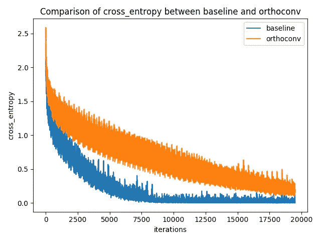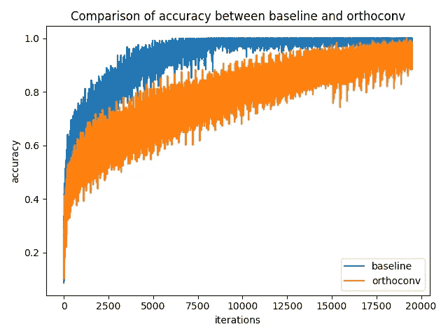

plots of cross_entropy and accuracy on training data

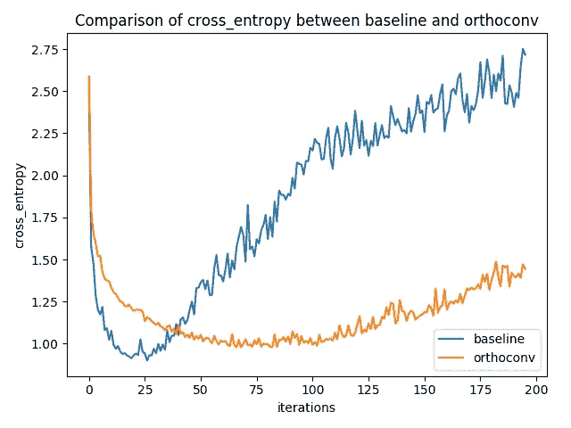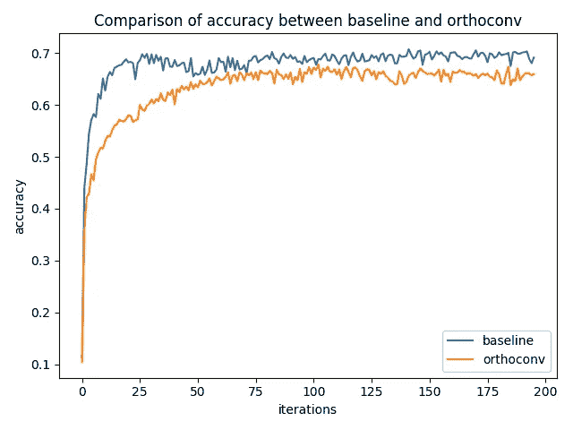

plots of cross_entropy and accuracy on validation data

可以看出，基线和正交卷积之间的所有曲线的结果都很差。更重要的是，正交卷积的训练时间明显更长。这是时间单位的曲线图:

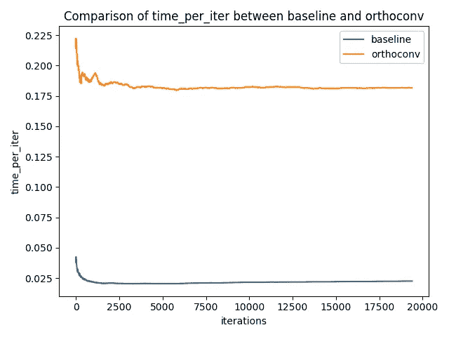

plot of training time per iter for baseline/orthoconv

从图中可以看出，时间平均高出 7 倍。有很多方法可以加速这段代码，但是由于结果不佳，我没有朝那个方向前进。

我的直觉是，它不起作用的原因是，由于所有列向量必须正交的约束，模型的优化前景受到严重限制。为了测试我的直觉，我做了下一个实验。

## 实验#2

在下一个实验中，我没有使用 householder 乘法产生的卷积权重和偏差，而是添加了另一个损失项，称为“正交性损失”。正交性损失计算如下:

设卷积矩阵的维数为(m，n)，偏差向量的维数为(n)，连接这两个向量形成一个维数为(m+1，n)的矩阵。称这个矩阵为 m。计算这个矩阵的列范数，称它为 N(它是一个维数为(1，N)的矩阵)。

计算转置(M)*M .计算转置(N)*N .并将两个矩阵相除。在结果矩阵中，a(i，j)包含矩阵 m 中索引 I 和 j 处的列向量之间角度的余弦值。通过平方此矩阵中的所有元素来创建新矩阵。求矩阵中所有元素的和(除了轨迹)。将所有卷积层的这个值相加，我们将结果值称为正交损失或正交损失。我将其乘以一个称为正交权重的超参数，并将其添加到总损耗中。

我使用不同的正交权重值做了实验:我尝试了 0.1、1、10、100，inf 对应于前面实验中描述的卷积。

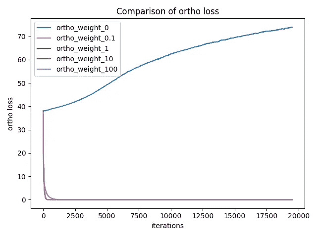

orthogonality loss for all different experiments

初始正交性损失(没有乘以权重)约为 40。这远远大于交叉熵本身。然而，网络学会了在几次迭代内将它推到零。

从上图可以看出，网络很快学会了保持卷积矩阵中的所有列向量正交。当正交权重设置为零时，正交性损失不断增加，而对于其他情况(0.1、1、10、100)，它稳定在接近零的值。**这意味着如果我们增加加权正交性损失**，卷积矩阵学习的权重确实是正交的。

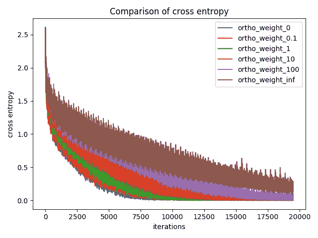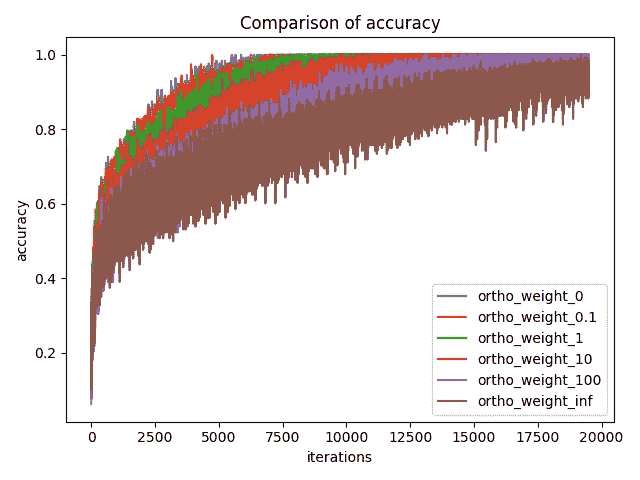

cross entropy and accuracy on training data

从上图可以看出，随着正交权重的增加，网络变得难以训练。

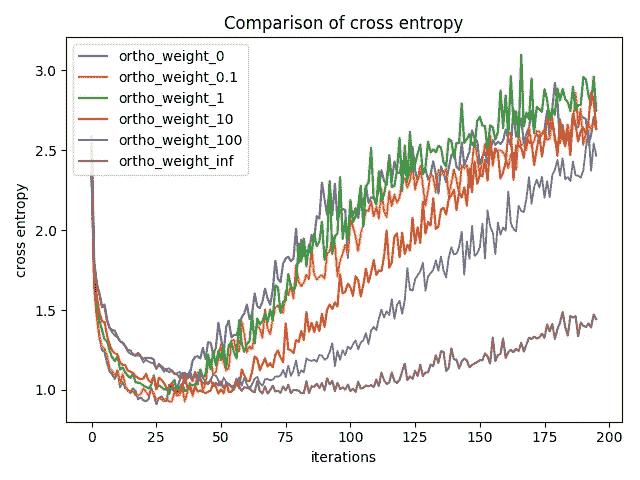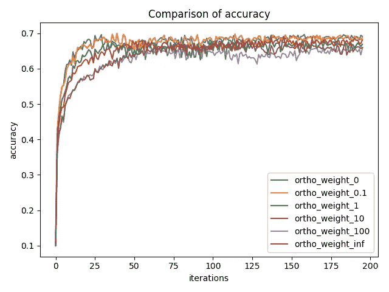

cross entropy and accuracy on validation data

但是该网络实现的验证准确度/交叉熵非常接近正交权重为 0 的验证准确度/交叉熵。又一次失望，因为我希望它会给出更好的结果。但至少比以前的结果要好。

接下来，为了更仔细地检查，我决定只绘制正交权重 0 和正交权重 0.1。

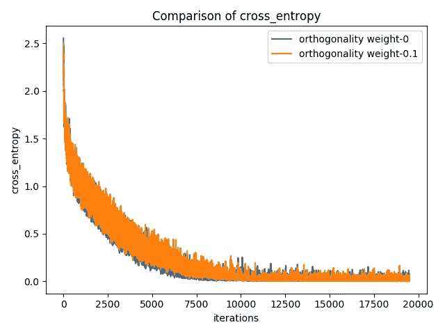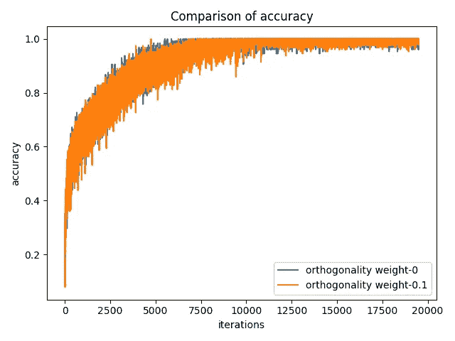

cross entropy and accuracy on training data

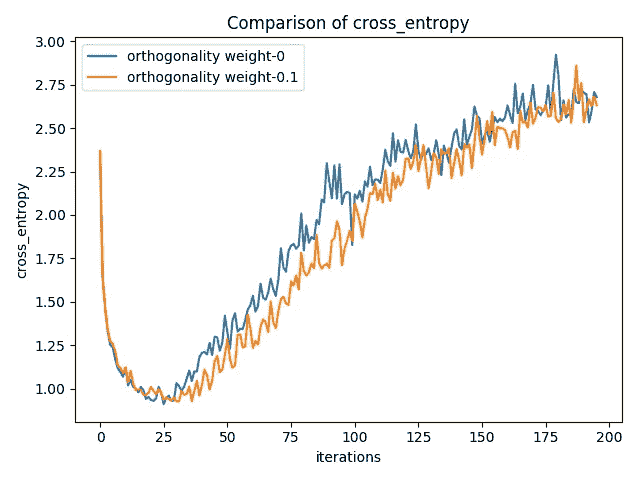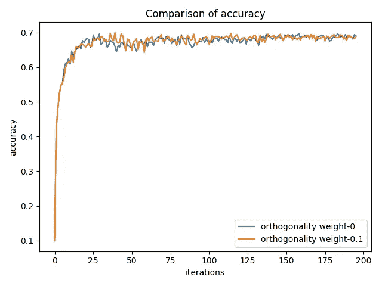

cross entropy and accuracy on validation data

可以看出，两个网络收敛到相同的验证交叉熵和准确度。正交权重为 0 的网络训练交叉熵较高。这种方式表明，增加正交权重会使网络更好地泛化(更高的训练损失，但相同的验证损失)。

接下来，为了测试这是否适用于其他数据集，我决定用 CIFAR-100 进行同样的实验。

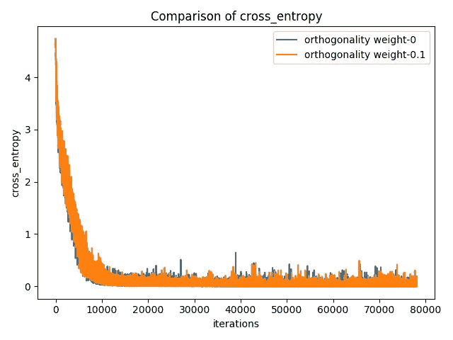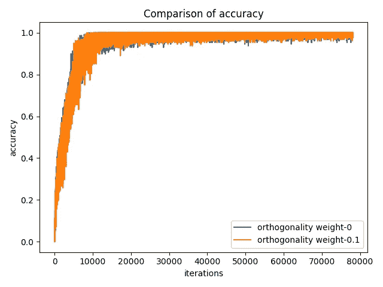

cross entropy, accuracy and ortho_loss on training data

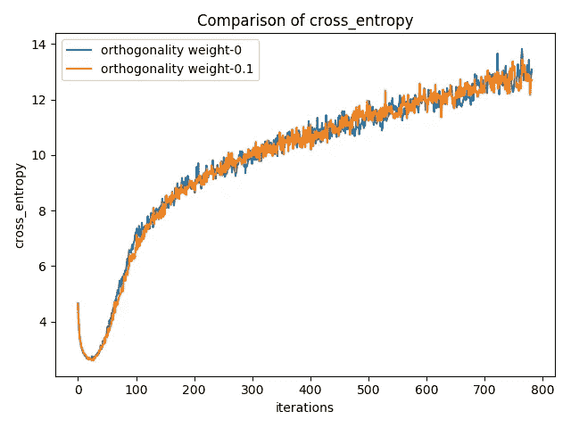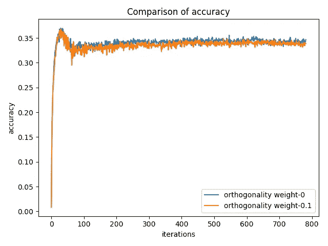

cross entropy and accuracy on validation data

这些结果确实推广到 CIFAR-100。更重要的是，**我们可以看到，正交性权重为 0.1 的网络表现出与正交性权重为 0 的网络相同的验证精度。如 ortho_loss 比较图所示，正交权重为 0.1 的网络学习卷积矩阵中的正交列。**

## 实验#3

接下来，被这些结果激起了兴趣，我决定尝试将**的相同想法用于递归神经网络**。在这个 repo 中使用[代码(除非特别说明，否则是默认架构)，我决定通过给 LSTM 增加正交性损失来进行实验。注意，正交性损失= sum_square(I-transpose(M)*M)其中 M 是隐藏到隐藏状态矩阵。它不同于正交性损失，在正交性损失中，我们不关心所有列是否有范数 1。](https://github.com/singlasahil14/char-rnn)

以下是结果(我对正交性损失尝试了这些不同的权重:0.001、0.0001、0.00001、0.000001、0.000001、0):

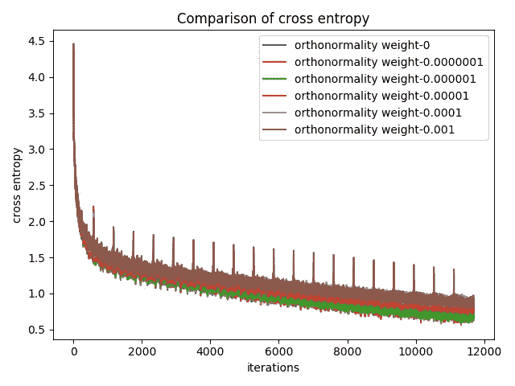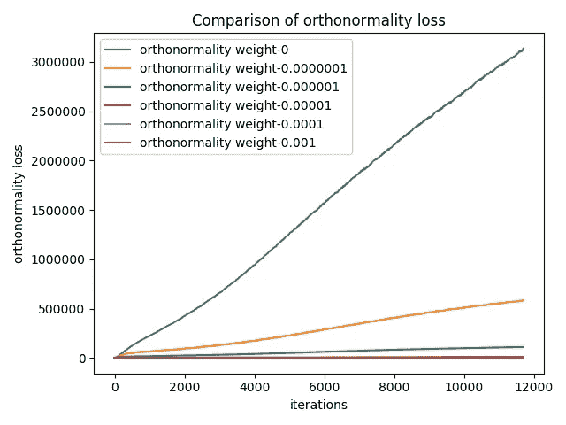

cross entropy and orthonormality loss as network gets trained for 20 epochs

同样，当我们减小正交权重时，交叉熵减小得更快。接下来，为了更好地比较两个最佳模型的正交权重，我决定绘制权重为 0 和 0.0000001 的交叉熵和正交损失值。

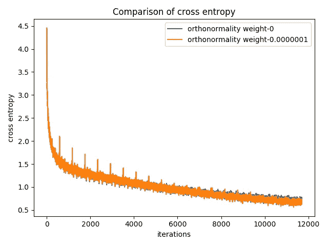

cross entropy and orthonormality loss as network gets trained for 20 epochs for only two weights (0, 0.0000001)

同样没有太大的差别，但它设法匹配基线结果。

## 结论

我从这个小项目中学到的最重要的事情是神经网络非常复杂。即使看起来不错的想法也可能失败，因为大多数时候，当人们想到一个想法时，他们只是根据网络的最终训练状态来考虑它(就像我的情况一样，我希望矩阵的列是正交的)。但是，如果您考虑到网络必须遍历一条路径以进行优化的事实，大多数好的想法似乎马上就变得索然无味了(就像我的情况一样，很明显，我在实验#1 中严格限制了模型可以采用的路径)。

此外，我尝试了许多非标准(我自己的发明)的调整，使网络击败基线。没有一个管用。实际上，我很高兴我成功地重现了基线结果，尽管我添加了一个比交叉熵本身更大的损失项。

我也对图像分割做了同样的实验。得出了相似的结果。为了简洁起见，这里没有提到它们。

我也相信这项研究有助于更好地可视化卷积层的权重。我计划下一步探索这个问题。

本博客中给出的所有实验都可以使用这些回复进行复制:

 [## 信号/正交卷积

### 正交卷积— Github repo 用于我的正交卷积思想的实验

github.com](https://github.com/singlasahil14/orthogonal-convolution)  [## 新加坡 14/char-rnn

### 通过在 GitHub 上创建一个帐户来为 char-rnn 开发做贡献。

github.com](https://github.com/singlasahil14/char-rnn) 

> 如果您喜欢这篇文章，请点击下面的小拍手图标帮助他人找到它。非常感谢！