# Tensorflow 中合成模式生成网络/变分/普通自动编码器的实验

> 原文：<https://towardsdatascience.com/experiments-with-compositional-pattern-producing-networks-variational-vanilla-auto-encoders-in-ac2b04c781cd?source=collection_archive---------4----------------------->

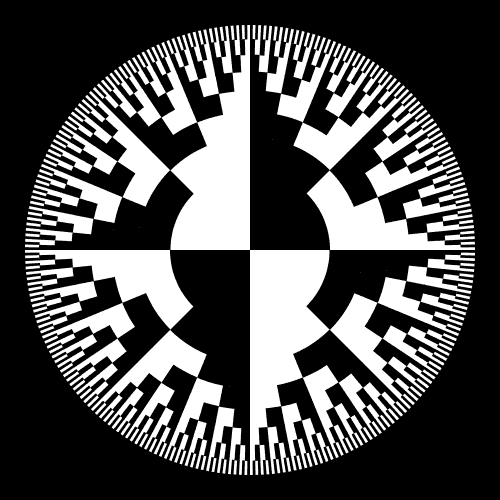

GIF from this [website](https://giphy.com/gifs/design-processing-brOrkeZsS0o6c)

我真的很想了解更多关于自动编码器(普通的和变化的)和组合模式生成网络的知识，这就是我写这篇文章的原因。所以我决定做一些实验，比如…..

*情况 a)* [*合成模式产生网络*](https://en.wikipedia.org/wiki/Compositional_pattern-producing_network) *情况 b)使用自动编码器聚类数据
情况 c)使用变分自动编码器聚类数据
情况 d)使用自动编码器去表情图像*

> **请注意，这篇文章是为我自己做的各种实验的存档结果。所以这篇文章没有任何具体的目标。另外，请注意，我不会在这篇文章中讨论这些架构背后的任何理论。**

**自动编码器简介**

Video from [Arxiv Insights](https://www.youtube.com/channel/UCNIkB2IeJ-6AmZv7bQ1oBYg)

对于任何刚刚开始学习这个主题的人，我在上面链接了一个令人惊叹的 youtube 视频。它很好地描述了什么是自动编码器，以及它可以用在什么地方。

此外，如果您想要自动编码器的其他内容，请[单击此处。](/a-wizards-guide-to-adversarial-autoencoders-part-1-autoencoder-d9a5f8795af4)

**案例一)** [**组分产网**](https://en.wikipedia.org/wiki/Compositional_pattern-producing_network)

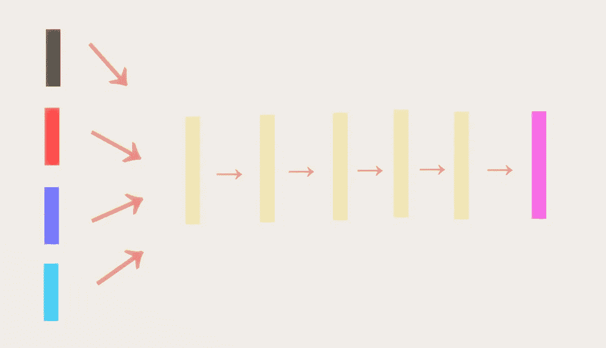

**黑框** →比例因子输入(我设置为 1.0)
**红框**→X 坐标输入
**蓝框**→Y 坐标输入
**天蓝框** →各坐标半径差输入

首先，让我们使用神经网络创建一些艺术品。O [toro](http://blog.otoro.net/) 在这里[发表了一篇关于 CPPN 是什么的惊人博文](http://blog.otoro.net/2016/03/25/generating-abstract-patterns-with-tensorflow/)，如果你感兴趣，请去阅读。(即使你不是，我也强烈推荐阅读这本书，它真的是一个令人惊叹的解释。).

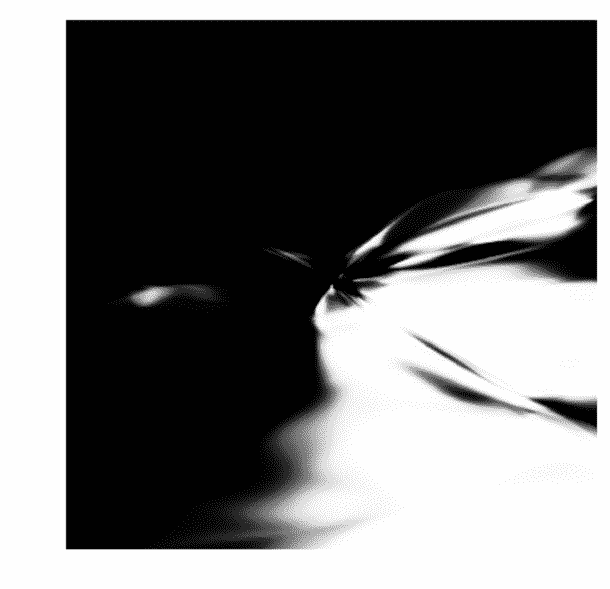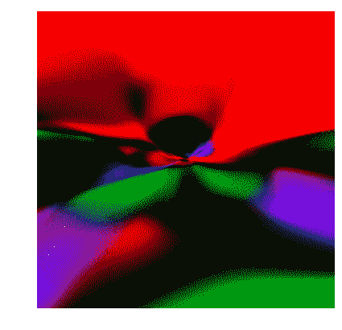

Image created by Neural Network

如上所述，当我们将最终输出向量设置为 3 时，我们甚至可以创建彩色图像的颜色序列。(或者甚至是 RGBA，如果你愿意的话。).最后，请注意 CPPN 不一定要有类似于自动编码器的网络架构。

**微型部分——通过对数损失函数进行反向传播**

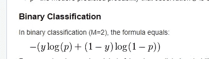

Image from this [website](http://wiki.fast.ai/index.php/Log_Loss)

如果我们正在处理灰度图像，我们可以很容易地将该问题视为分类任务，因此我们可以使用 log Loss 函数来训练我们的网络。然而，由于我们正在执行手动反向传播，我们需要知道幕后的数学。

Image from this [website](https://www.ics.uci.edu/~pjsadows/notes.pdf)

现在，我将向你展示这个等式是如何折叠的，就像上面看到的那样，但是如果你对数学的细节感兴趣的话。请[点击这里](http://ttic.uchicago.edu/~shubhendu/Pages/Files/Lecture3_flat.pdf)，这里[点击](http://arunmallya.github.io/writeups/nn/backprop.html)或者这里[点击](https://www.ics.uci.edu/~pjsadows/notes.pdf)。另外，如果你对最大对数似然和交叉熵之间的差异感兴趣[，点击这里](https://www.quora.com/What-are-the-differences-between-maximum-likelihood-and-cross-entropy-as-a-loss-function)。

**情况 b)使用自动编码器对数据进行聚类**

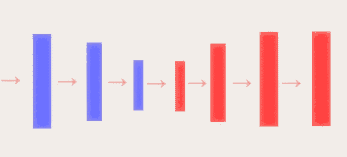

**蓝色矩形** →我们网络的编码器部分
**红色矩形** →我们网络的解码器部分

让我们首先做最简单的任务，我们将聚类 MNIST 数据集到一个三维潜在空间。看看我们能达到什么样的效果。首先让我们使用[最大似然估计](https://en.wikipedia.org/wiki/Maximum_likelihood_estimation)作为我们的成本函数。

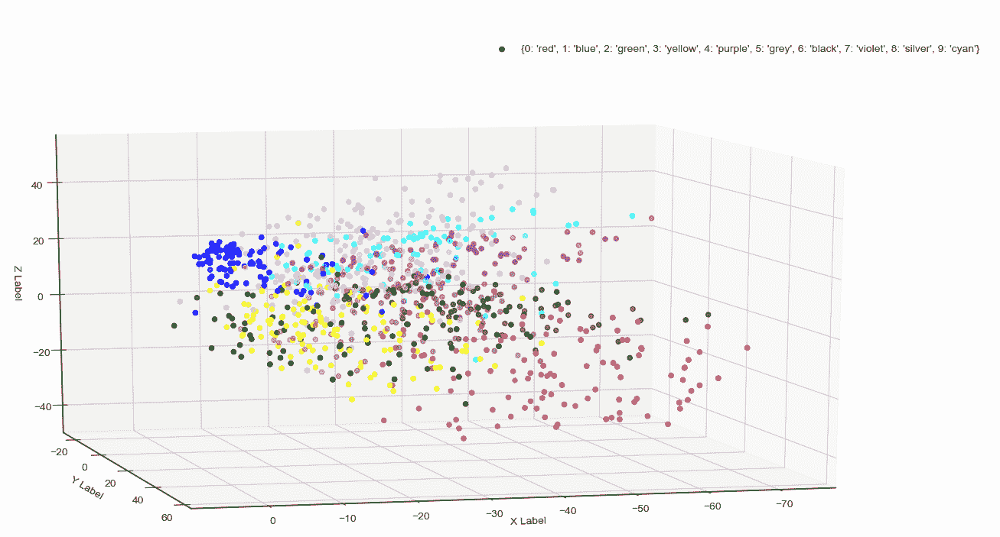

**左图 Gif** →为 1000 个数据点创造潜在空间
右图 Gif →随时间重建图像

如上所述，当我们观察 1000 个数据点的潜在空间时，我们可以观察到具有相似属性(如曲线或边缘)的每个数字都聚集在一起。然而，这里需要注意的是，我们可以观察到范围相当大，仅 Y 轴的范围就从 0 到-70，这意味着数据更加分散。(如果我们想要生成新数据，这可能是一个问题。)

接下来让我们使用作为[均方误差](https://en.wikipedia.org/wiki/Mean_squared_error)成本函数。

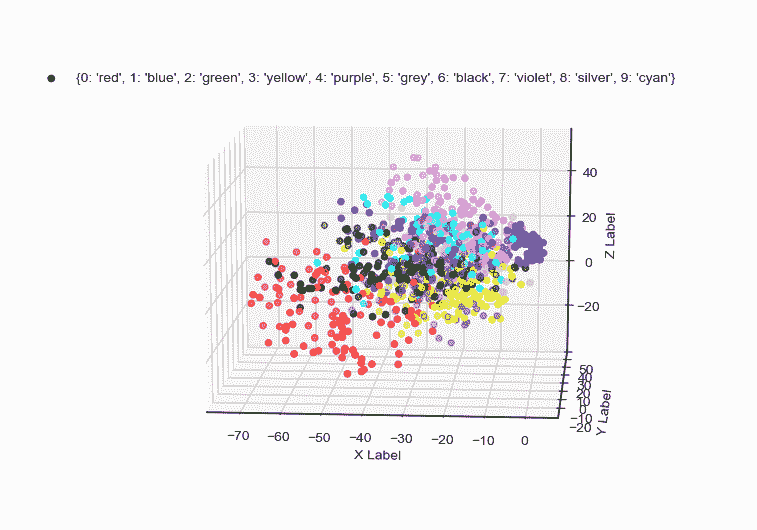

**左 Gif** →为 1000 个数据点创建潜在空间
**右 Gif** →随时间重建图像

即使我们使用均方误差作为我们的损失函数，网络在聚类数据点方面做得还不错，但是，再次注意每个轴的范围相当大。

**情况 c)使用变分自动编码器聚类数据**

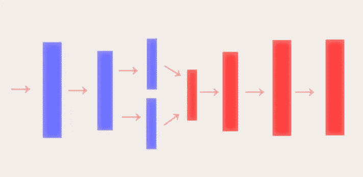

**蓝色矩形** →我们网络的编码器部分
**红色矩形** →我们网络的解码器部分

现在，让我们使用变型自动编码器对我们的数据进行聚类，关于什么是变型自动编码器的详细解释，请点击[此处](https://jaan.io/what-is-variational-autoencoder-vae-tutorial/)、[此处](https://jmetzen.github.io/2015-11-27/vae.html)或[此处](http://kvfrans.com/variational-autoencoders-explained/)。首先，让我们再次使用[最大似然估计](https://en.wikipedia.org/wiki/Maximum_likelihood_estimation)作为我们的损失函数。

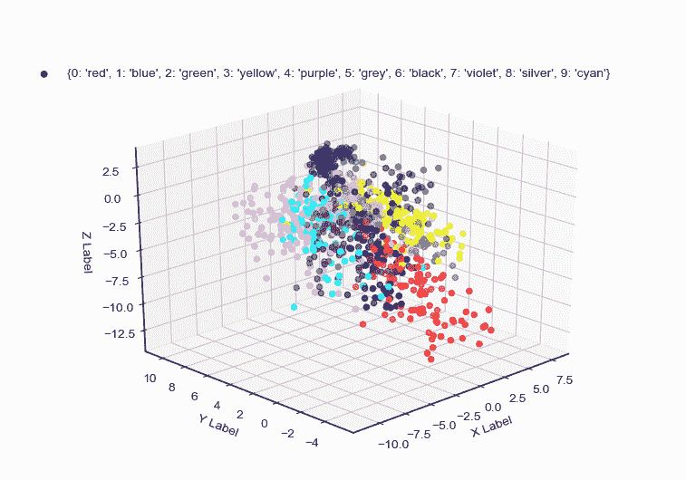

**左侧 Gif** →为 1000 个数据点创建潜在空间
**右侧 Gif** →随时间重建图像

如上所述，网络在聚集每个数据点方面做得很好。然而，一个不同于普通自动编码器的是轴的范围。这是变型自动编码器与普通自动编码器相比的一个特性。再次理论解释请阅读链接。接下来，让我们看看如果使用均方误差函数会发生什么。

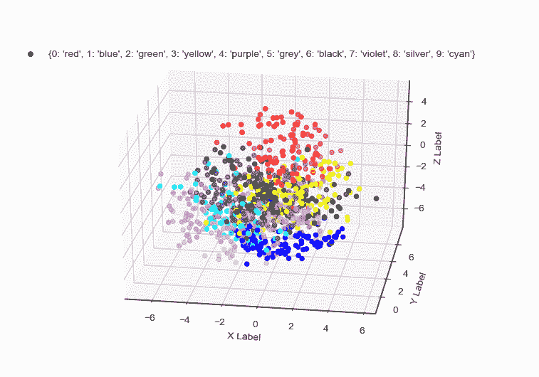

**蓝色矩形** →我们网络的编码器部分
**红色矩形** →我们网络的解码器部分

即使使用 MSE，我们也可以观察到集群看起来很棒，轴的范围不像普通的自动编码器那样大。最后，我想看看我们是否使用了 Kullback-Leibler 散度损失函数。

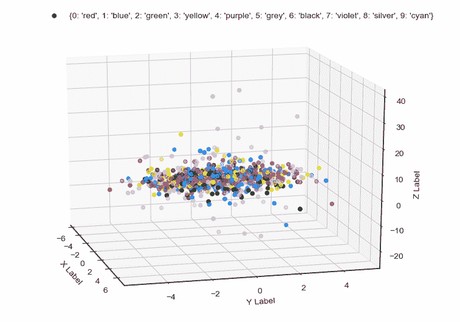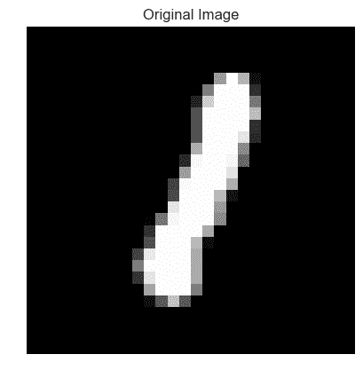

**左侧 Gif** →为 1000 个数据点创建潜在空间
**右侧 Gif** →随时间重建图像

因为我们不再有任何重建损失，所以网络没有任何动机来创建看起来像原始图像的图像。然而，观察一些点如何映射到更高的 z 轴是非常有趣的。

**案例 d)使用自动编码器对图像进行去表情处理**

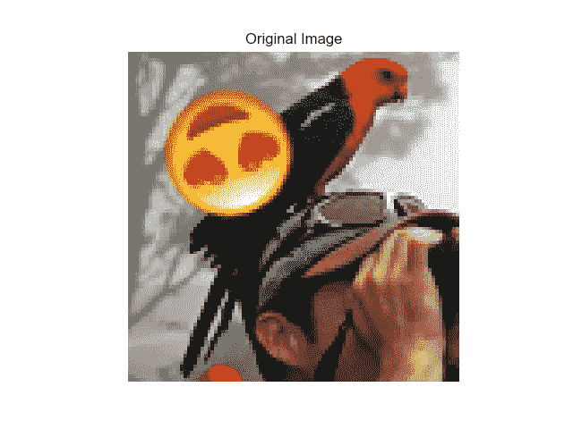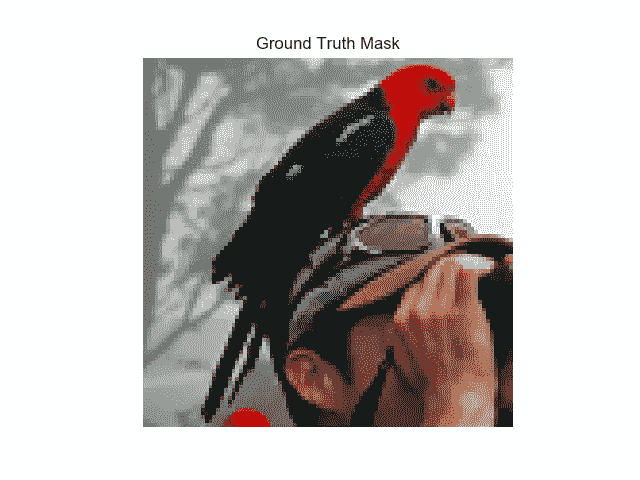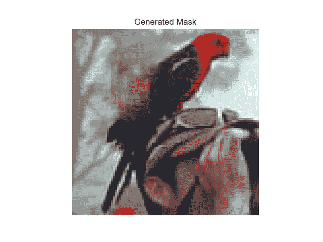

**左侧图像** →添加表情符号的图像
**中间图像** →无表情符号的图像
**右侧图像** →自动编码器去除表情符号的图像

这是一项非常简单的任务，因为去噪自动编码器是这类网络的标准用例。

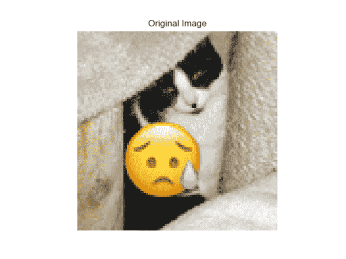

**图像顺序** →表情图像、原始图像、去表情图像

当我们看到自动编码器的进展时，我们可以观察到，随着网络的训练，它在消除图像中出现的表情符号方面做得更好。然而，我们可以清楚地看到一个问题，网络不知道如何填充表情符号占据的空间。现在我们可以让它保持原样，但将来我会计划解决这个问题。

**交互代码**

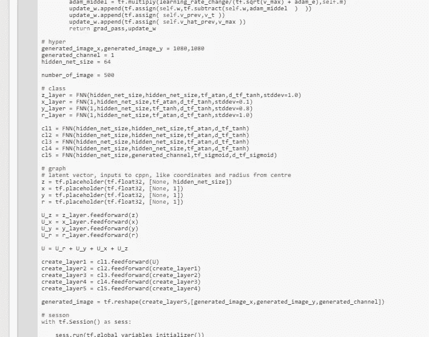

*对于谷歌实验室，你需要一个谷歌帐户来查看代码，你也不能在谷歌实验室运行只读脚本，所以在你的操场上做一个副本。最后，我永远不会请求允许访问你在 Google Drive 上的文件，仅供参考。编码快乐！同样为了透明，我在 github 上上传了所有的训练日志。*

要访问案例 [a 的代码，请点击此处](https://colab.research.google.com/drive/1bYUSi2sGqfDsb0sxhoBvrvAWKnyNf0Aw)。
要访问案例 [b 的代码，请点击此处](https://colab.research.google.com/drive/1-L2pUcy2U79iNPckZgYeBipK0w0fmLEC)，要查看[日志，请点击此处。](https://github.com/JaeDukSeo/Daily-Neural-Network-Practice-2/blob/master/NeuralNetwork/var_auto/caseb_auto_log_loss/caseb.txt)
要访问案例 [c 的代码，请点击此处，](https://colab.research.google.com/drive/13BiyqG0FfFm-BDsUnQoCjqTYFphe4Gep)[日志的](https://github.com/JaeDukSeo/Daily-Neural-Network-Practice-2/blob/master/NeuralNetwork/var_auto/casec_var_log/casec.txt)请点击此处。
要访问案例 [d 的代码，请点击此处](https://colab.research.google.com/drive/1HwSiJ55uej-xJH79VCi_RMEHHhxtmqNQ)。

**最后的话**

很抱歉没有解释每个网络背后的理论，但这篇文章的目的实际上是为了实现我的一些实验。

如果发现任何错误，请发电子邮件到 jae.duk.seo@gmail.com 给我，如果你希望看到我所有写作的列表，请[在这里查看我的网站](https://jaedukseo.me/)。

同时，在我的 twitter 上关注我[这里](https://twitter.com/JaeDukSeo)，访问[我的网站](https://jaedukseo.me/)，或者我的 [Youtube 频道](https://www.youtube.com/c/JaeDukSeo)了解更多内容。我还实现了[广残网，请点击这里查看博文](https://medium.com/@SeoJaeDuk/wide-residual-networks-with-interactive-code-5e190f8f25ec) t。

**参考**

1.  导数表。(2018).Math2.org。检索于 2018 年 6 月 23 日，来自[http://math2.org/math/derivatives/tableof.htm](http://math2.org/math/derivatives/tableof.htm)
2.  tf.atan | TensorFlow。(2018).张量流。检索于 2018 年 6 月 23 日，来自[https://www.tensorflow.org/api_docs/python/tf/atan](https://www.tensorflow.org/api_docs/python/tf/atan)
3.  导数:普通神经网络激活函数的导数。(2014).聪明的机器。检索于 2018 年 6 月 23 日，来自[https://theclevermachine . WordPress . com/2014/09/08/derivation-derivatives-for-common-neural-network-activation-functions/](https://theclevermachine.wordpress.com/2014/09/08/derivation-derivatives-for-common-neural-network-activation-functions/)
4.  导数表。(2018).Math.com。检索于 2018 年 6 月 23 日，来自[http://www.math.com/tables/derivatives/tableof.htm](http://www.math.com/tables/derivatives/tableof.htm)
5.  可变自动编码器。(2018).YouTube。检索于 2018 年 6 月 23 日，来自[https://www.youtube.com/watch?v=9zKuYvjFFS8](https://www.youtube.com/watch?v=9zKuYvjFFS8)
6.  matplotlib，R. (2018 年)。在 matplotlib 中删除保存的图像周围的空白。堆栈溢出。检索于 2018 年 6 月 23 日，来自[https://stack overflow . com/questions/11837979/remove-white-space-around-a-saved-image-in-matplotlib](https://stackoverflow.com/questions/11837979/removing-white-space-around-a-saved-image-in-matplotlib)
7.  [复本]，H. (2018)。如何在 Matplotlib (python)中隐藏轴和网格线？堆栈溢出。检索于 2018 年 6 月 23 日，来自[https://stack overflow . com/questions/45148704/how-to-hide-axes-and-gridlines-in-matplotlib-python](https://stackoverflow.com/questions/45148704/how-to-hide-axes-and-gridlines-in-matplotlib-python)
8.  合成模式生成网络。(2018).En.wikipedia.org。检索于 2018 年 6 月 23 日，来自[https://en . Wikipedia . org/wiki/composition _ pattern-producing _ network](https://en.wikipedia.org/wiki/Compositional_pattern-producing_network)
9.  大トロ. (2018). Blog.otoro.net. Retrieved 23 June 2018, from [http://blog.otoro.net/](http://blog.otoro.net/)
10.  RGBA 颜色空间。(2018).En.wikipedia.org。检索于 2018 年 6 月 23 日，来自 https://en.wikipedia.org/wiki/RGBA_color_space
11.  最大似然估计。(2018).En.wikipedia.org。检索于 2018 年 6 月 23 日，来自 https://en.wikipedia.org/wiki/Maximum_likelihood_estimation
12.  均方差。(2018).En.wikipedia.org。检索于 2018 年 6 月 23 日，来自[https://en.wikipedia.org/wiki/Mean_squared_error](https://en.wikipedia.org/wiki/Mean_squared_error)
13.  Mallya，A. (2018)。反向投影。arun mallya . github . io . 2018 年 6 月 23 日检索，来自[http://arunmallya.github.io/writeups/nn/backprop.html](http://arunmallya.github.io/writeups/nn/backprop.html)
14.  (2018).Ttic.uchicago.edu。检索于 2018 年 6 月 23 日，来自[http://ttic . uchicago . edu/~ shubhendu/Pages/Files/lecture 3 _ flat . pdf](http://ttic.uchicago.edu/~shubhendu/Pages/Files/Lecture3_flat.pdf)
15.  (2018).Ics.uci.edu。检索于 2018 年 6 月 23 日，来自[https://www.ics.uci.edu/~pjsadows/notes.pdf](https://www.ics.uci.edu/~pjsadows/notes.pdf)
16.  (2018).[在线]可从以下网址获取:[https://www . quora . com/What-is-the-differences-between-maximum-likelihood-and-cross-entropy-as-a-loss-function](https://www.quora.com/What-are-the-differences-between-maximum-likelihood-and-cross-entropy-as-a-loss-function)【2018 年 6 月 23 日获取】。
17.  带图例的散点图— Matplotlib 2.2.2 文档。(2018).Matplotlib.org。检索于 2018 年 6 月 23 日，来自[https://matplotlib . org/gallery/lines _ bars _ and _ markers/scatter _ with _ legend . html](https://matplotlib.org/gallery/lines_bars_and_markers/scatter_with_legend.html)
18.  颜色示例代码:colormaps _ reference . py—Matplotlib 2 . 0 . 2 文档。(2018).Matplotlib.org。检索于 2018 年 6 月 23 日，来自[https://matplotlib . org/examples/color/colormaps _ reference . html](https://matplotlib.org/examples/color/colormaps_reference.html)
19.  对抗性自动编码器的向导指南:第 1 部分，自动编码器？。(2017).走向数据科学。检索于 2018 年 6 月 23 日，来自[https://towards data science . com/a-wizards-guide-to-adversarial-auto encoders-part-1-auto encoder-d9a5f 8795 af 4](/a-wizards-guide-to-adversarial-autoencoders-part-1-autoencoder-d9a5f8795af4)
20.  教程-什么是可变自动编码器？—贾恩·阿尔托萨尔。(2018).贾恩·阿尔托萨尔。检索于 2018 年 6 月 23 日，来自[https://jaan . io/what-is-variable-auto encoder-vae-tutorial/](https://jaan.io/what-is-variational-autoencoder-vae-tutorial/)